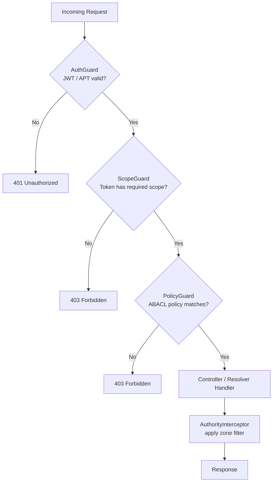

# Authentication

Wenex Platform uses two token types for API access:

| Type | Lifetime | Use case |
|---|---|---|
| **JWT** (session token) | Short (configurable) | User sessions, interactive clients |
| **APT** (Auth Personal Token) | Long (configurable, revocable) | Server-to-server, automation, AI agents |

All protected endpoints require an `Authorization: Bearer <token>` header. Endpoints decorated with `@IsPublic()` are the only exceptions (e.g., `POST /auth/token`).

---

## Auth Endpoints

### POST /auth/token — Obtain a JWT

Exchange credentials for a JWT session token. This is the only public endpoint in the auth service.

**Request:**

```bash
curl -X POST http://localhost:3010/auth/token \
  -H "Content-Type: application/json" \
  -d '{
    "username": "admin@example.com",
    "password": "secret",
    "grant_type": "password"
  }'
```

**Response:**

```json
{
  "data": {
    "access_token": "eyJhbGciOiJSUzI1NiIsInR5cCI6IkpXVCJ9...",
    "token_type": "Bearer",
    "expires_in": 3600
  }
}
```

---

### GET /auth/verify — Inspect the Current Token

Returns the decoded claims of the Bearer token in the request.

**Request:**

```bash
curl http://localhost:3010/auth/verify \
  -H "Authorization: Bearer $TOKEN"
```

**Response:**

```json
{
  "data": {
    "sub": "64a1b2c3d4e5f6a7b8c9d0e1",
    "client_id": "64a1b2c3d4e5f6a7b8c9d0e2",
    "coworkers": ["64a1b2c3d4e5f6a7b8c9d0e2", "71ab2b789f1ea71bf30d4e13"],
    "scope": "read:identity:users write:identity:users",
    "zone": "own",
    "exp": 1716825600
  }
}
```

| Claim | Meaning |
| --- | --- |
| `sub` | Authenticated user ID |
| `client_id` | The OAuth client (application) making the request |
| `coworkers` | All client IDs in this client's coworker space (including itself) — sourced from `domain/clients.coworkers` at token issuance time |
| `scope` | Space-separated list of granted scopes |
| `zone` | Default ownership zone for queries |
| `exp` | Unix timestamp of token expiry |

---

### GET /auth/logout — Invalidate the Current Session

Revokes the session associated with the current token.

```bash
curl http://localhost:3010/auth/logout \
  -H "Authorization: Bearer $TOKEN"
```

**Response:**

```json
{ "result": true }
```

---

### POST /auth/check — Verify Token Validity

Programmatically check whether a token is still valid.

```bash
curl -X POST http://localhost:3010/auth/check \
  -H "Authorization: Bearer $TOKEN" \
  -H "Content-Type: application/json" \
  -d '{ "token": "eyJhbGciOiJSUzI1NiIsInR5cCI6IkpXVCJ9..." }'
```

**Response:**

```json
{ "result": true }
```

---

### POST /auth/can — Check a Permission (ABAC)

Ask whether the authenticated user has permission to perform an action on a resource.

```bash
curl -X POST http://localhost:3010/auth/can \
  -H "Authorization: Bearer $TOKEN" \
  -H "Content-Type: application/json" \
  -d '{
    "action": "read",
    "resource": "identity:users"
  }'
```

**Response:**

```json
{
  "data": {
    "can": true,
    "reason": "policy matched"
  }
}
```

---

## APTs (Auth Personal Tokens)

APTs are long-lived tokens scoped to specific permissions. They are managed through the `/auth/apts` collection using the standard CRUD API.

### Create an APT

```bash
curl -X POST http://localhost:3010/auth/apts \
  -H "Authorization: Bearer $TOKEN" \
  -H "Content-Type: application/json" \
  -d '{
    "name": "ci-bot",
    "scope": "read:identity:users",
    "description": "Read-only token for CI pipeline"
  }'
```

**Response:**

```json
{
  "data": {
    "id": "64a1b2c3d4e5f6a7b8c9d0e3",
    "name": "ci-bot",
    "token": "apt_...",
    "scope": "read:identity:users",
    "created_at": "2026-05-15T00:00:00.000Z"
  }
}
```

> **Important:** The `token` field is only returned at creation. Store it securely — it cannot be retrieved again.

### List APTs

```bash
curl "http://localhost:3010/auth/apts?query={}" \
  -H "Authorization: Bearer $TOKEN"
```

### Delete an APT (revoke)

```bash
curl -X DELETE http://localhost:3010/auth/apts/64a1b2c3d4e5f6a7b8c9d0e3 \
  -H "Authorization: Bearer $TOKEN"
```

---

## Scopes

Scopes control which collections a token can access. They follow the pattern:

```
{action}:{service}:{collection}
```

| Prefix | Actions granted |
|---|---|
| `read:` | GET endpoints (count, find, findOne, findById, cursor) |
| `write:` | POST + PATCH + DELETE (soft) + PUT restore |
| `manage:` | All of the above + bulk update + hard delete (destroy) |

Examples:

```
read:identity:users
write:financial:accounts
manage:auth:apts
```

The required scope for each endpoint is declared by `@SetScope()` and enforced by `ScopeGuard`. If your token lacks the required scope, the request returns `403 Forbidden`.

---

## Zone Filtering

The `zone` query parameter (or header) controls ownership filtering applied automatically by `AuthorityInterceptor`:

| Zone | Behavior |
|---|---|
| `own` | Only documents where `owner` equals the authenticated user |
| `share` | Documents shared with the user via `shares[]` |
| `group` | Documents accessible via `groups[]` membership |
| `client` | Documents belonging to the OAuth `client_id` |

Zones can be combined with a comma: `?zone=own,share`

```bash
# Return only documents I own
curl "http://localhost:3010/identity/users?query={}&zone=own" \
  -H "Authorization: Bearer $TOKEN"

# Return documents I own or that are shared with me
curl "http://localhost:3010/identity/users?query={}&zone=own,share" \
  -H "Authorization: Bearer $TOKEN"
```

---

## Request Headers Reference

| Header | Required | Example | Description |
|---|---|---|---|
| `Authorization` | Yes* | `Bearer eyJ…` | JWT or APT. *Omit only on `@IsPublic()` routes |
| `Content-Type` | For POST/PATCH | `application/json` | Body encoding |
| `x-domain` | No | `my-tenant.com` | Override the tenant domain |
| `x-client-id` | No | `64a1b…` | Override the OAuth client context |
| `x-request-id` | No | `uuid-v4` | Trace ID; auto-generated if absent |

---

## Error Responses

| Status | Meaning |
|---|---|
| `401 Unauthorized` | Missing or invalid token |
| `403 Forbidden` | Token valid but missing required scope or policy |
| `429 Too Many Requests` | Rate limit exceeded for this collection |

```json
{
  "statusCode": 401,
  "message": "Unauthorized",
  "error": "Unauthorized"
}
```

---

## Authorization Flow


