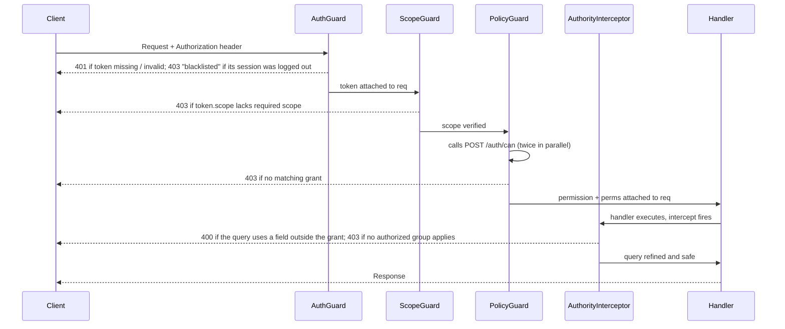
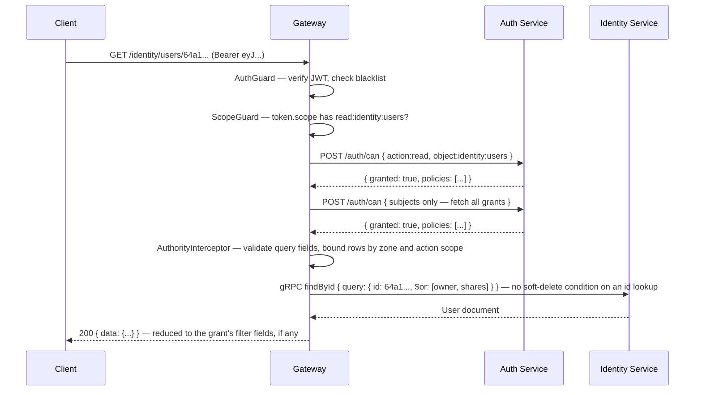

# Authorization

Every authenticated request passes through three guards and one interceptor before reaching a controller handler. This page explains each layer, the ABAC data model behind them, how to manage grants, and common authorization patterns.

See also → [Authentication](/api/authentication) for token types, the `POST /auth/token` endpoint, and the `strict` / `x-api-key` mechanism.

## Request authorization pipeline



## Layer 1 — AuthGuard (token validation)

`AuthGuard` runs first on every non-public endpoint. It:

1. Extracts the bearer token from `Authorization` header, `?token=` query param, or the `authorization` cookie.
2. If the token starts with `apt` (case-insensitive; issued APTs read `apt-<suffix>`), resolves it from Redis and decrypts the stored `Apt` record.
3. Otherwise verifies the JWT signature with `JwtService.verify<JwtToken>()`.
4. Calls `BlacklistService.verifyToken()` — rejects the request if the session has been logged out.
5. Passes the decoded `JwtToken` to `AuthShield.check()` — enforces the `strict` / `x-api-key` contract (see [Authentication → The strict flag](/api/authentication#the-strict-flag-and-x-api-key)).
6. Attaches the decoded token to `req.token` for downstream layers.

A route decorated with `@IsPublic()` skips all of the above.

## Layer 2 — ScopeGuard (first-scope check)

Every controller handler is decorated with `@SetScope(Scope.ReadIdentityUsers)`. `ScopeGuard` reads this metadata and calls `ScopeShield.check()` against `token.scope`.

### Scope format

```
{action}:{service}:{collection}
```

Examples: `read:identity:users`, `write:financial:accounts`, `manage:auth:grants`, `whole`

### Action hierarchy

`ScopeShield` resolves implicit permissions upward before rejecting:

| Token has | Satisfies |
|---|---|
| `manage:X` | `manage:X`, `write:X`, `read:X` |
| `write:X` | `write:X`, `read:X` |
| `read:X` | `read:X` only |
| `whole` | Every scope |

### Prefix matching

Scopes are matched by prefix. A token with `read:identity` satisfies `read:identity:users` and `read:identity:profiles` without listing each individually.

If `ScopeGuard` fails, the request is rejected with `403 Forbidden` before any ABAC check runs. This is intentional — scope is a cheap pre-filter that avoids a Redis/gRPC round-trip to the auth service.

## Layer 3 — PolicyGuard (ABAC check)

After scope passes, `PolicyGuard` delegates to `PolicyShield.check()`, which calls `POST /auth/can` to evaluate attribute-based access control grants.

### What PolicyShield does

It makes **two parallel calls** to `auth/can`:

1. **Specific check** — `{ action, object: "service:collection", subjects, strict: "obj" }` — looks for a grant that exactly matches the resource.
2. **General check** — `{ subjects }` only — fetches all grants for this subject regardless of action/object. The result is stored as `perms` and used later by `AuthorityInterceptor` for population checks.

If the specific check fails, `PolicyShield` retries with a wildcard object — `"service:*"` — before returning `403`.

The resolved `permission` and `perms` objects are attached to `req.permission` and `req.perms`.

### POST /auth/can — Evaluate a permission

Use this endpoint to perform pre-flight ABAC checks from your own code.

```bash
curl -X POST http://localhost:3010/auth/can \
  -H "Authorization: Bearer $TOKEN" \
  -H "Content-Type: application/json" \
  -d '{
    "action": "read",
    "object": "identity:users"
  }'
```

**Request body** (`AuthorizationRequest`):

| Field | Type | Description |
|---|---|---|
| `action` | `Action` | The action to test: one of the `Action` enum — `create`, `read`, `update`, `delete`, `restore`, `destroy`, a special action, or `any` (`read`/`write`/`manage` are OAuth **scope** verbs, not grant actions) |
| `object` | `Resource` | The resource: `service:collection` |
| `subjects` | `string[]` | Override subjects (defaults to `token.subject`) |
| `strict` | `string` | `"obj"` — exact object match only, no wildcard fallback |
| `tz` | `string` | Timezone for time-based grant evaluation |
| `ip` | `string` | IP for location-based grant evaluation |

**Optional request headers:**

| Header | Effect |
|---|---|
| `x-can-with-policies` | Include the matching policy list in the response |
| `x-can-with-id-policies` | Also match grants whose subject is the token's `uid`, `aid` or `cid` at its domain (the gateway's `PolicyGuard` always sends it) |

**Response:**

```json
{
  "data": {
    "granted": true,
    "policies": [
      {
        "subject": "admin@example.com",
        "action": "read",
        "object": "identity:users",
        "field": ["username", "email"],
        "filter": ["id", "username", "email"],
        "location": ["0.0.0.0/0"]
      }
    ]
  }
}
```

## Grants — the ABAC data model

A **Grant** is a MongoDB document in the `auth/grants` collection. It defines what a subject may do on a resource within a domain, with optional constraints.

### Grant structure

```typescript
interface Grant {
  subject: string;       // <local>@<domain>[:scope] — the local part is a role word, uid, aid or cid
  action: Action;        // create | read | update | delete | restore | destroy | a special action | any
  object: Resource;      // service:resource or service:* (wildcard)

  // Constraints (optional)
  field?: string[];      // Input fields — what a write body may set and a query may use (abacl notation)
  filter?: string[];     // Output fields — what a response may show (abacl notation); not a row query
  location?: string[];   // IP / CIDR allowlist — grant is only active from these addresses
  time?: GrantTime[];    // Temporal restriction — array of { cron_exp, duration } windows
}
```

### Grant fields reference

| Field | Type | Required | Description |
|---|---|:---:|---|
| `subject` | `string` | ✅ | ABAC subject: `{local}@{domain}[:scope]` — `@IsSubject` requires the part before `:` to be an email |
| `action` | `Action` | ✅ | `create`, `read`, `update`, `delete`, `restore`, `destroy`, a special action, or `any` |
| `object` | `Resource` | ✅ | `service:collection` or `service:*` (wildcard) |
| `field` | `string[]` | | Input-field list in abacl notation (`["*", "!owner"]`) — body fields outside it are dropped; query fields must be allowed by `field` or `filter` |
| `filter` | `string[]` | | Output-field list in abacl notation — every response is reduced to these fields. It selects no rows: see [Row restrictions](#row-restrictions-scoped-actions-and-zones) |
| `location` | `string[]` | | IP / CIDR allowlist — grant is only active from these addresses |
| `time` | `GrantTime[]` | | Temporal restriction — array of `{ cron_exp, duration }` windows |

### Subject format

```
{local}@{domain}[:{scope}]
```

- A grant subject is validated by `@IsSubject`: the part before an optional `:` **must be an email**
  (`local@domain`), so a bare word (`admin`, `engineering`) or an `@role` spelling is rejected with
  `subject must be a valid subject`.
- `identity/users` stores subjects in the same email form (`admin@example.com` — `@IsSubject` on
  the user DTO), and a write by a non-administrator keeps only subjects at the caller's own domain.
  The token's `subject` is those values joined by spaces. `AuthorizationModel.fixSubjects` strips
  `@{domain}` from each, expands role words (next point), re-appends `@{domain}` and drops subjects
  of any other domain — so a user with subject `admin@example.com` matches the grant `admin@example.com`.
- **Roles are expanded, not registered.** If the client has a `context/configs` row with key `RBAC`,
  its entry for the token's domain maps each role word to permission names and each permission to
  leaf subjects; the token's words are replaced by those leaves before `@{domain}` is appended.
  Without such a config, the words are the subjects. There is no `/auth/roles` endpoint.
- With `x-can-with-id-policies` the subjects also include `uid@domain`, `aid@domain` and
  `cid@domain`, which is how a grant can name one user, app or client. The gateway's `PolicyGuard`
  always sends that header, so such grants apply to every guarded request; a direct `POST /auth/can`
  includes them only when it sends the header itself.

| Subject | Grants Access To | Example |
|---|---|---|
| `role@domain` | Every token carrying that role word at that domain | `admin@example.com` |
| `uid@domain` | One user | `<uid>@example.com` |
| `aid@domain` | One app | `<aid>@example.com` |
| `cid@domain` | One OAuth client | `<cid>@example.com` |
| `local@domain:scope` | The same, restricted to one scope suffix | `admin@example.com:reports` |

### Special actions

Beyond the six CRUD actions (`create`, `read`, `update`, `delete`, `restore`, `destroy`), the platform defines fine-grained special actions:

| Action | Example resource |
|---|---|
| `search` | `career:products`, `conjoint:messages`, `content:posts` |
| `upload` / `download` / `share` | `special:files` |
| `send` | `touch:smss`, `touch:emails`, `touch:pushes` |
| `payment` | `financial:invoices` |
| `init` / `verify` | `financial:transactions` |
| `collect` | `special:stats` |
| `start` / `abort` / `commit` | `essential:sagas` |
| `generate` | `conjoint:accounts` |
| `resolve` | `logistic:travels`, `logistic:locations` |

### Create a grant

```bash
curl -X POST http://localhost:3010/auth/grants \
  -H "Authorization: Bearer $TOKEN" \
  -H "Content-Type: application/json" \
  -d '{
    "subject": "alice@example.com",
    "action": "read",
    "object": "identity:users",
    "filter": ["id", "username", "email"]
  }'
```

Alice may read users, and every user she reads comes back reduced to `id`, `username` and `email`.

### Test a grant before creating

```bash
curl -X POST http://localhost:3010/auth/can \
  -H "Authorization: Bearer $TOKEN" \
  -H "x-can-with-policies: true" \
  -H "Content-Type: application/json" \
  -d '{
    "action": "read",
    "object": "identity:users",
    "subjects": ["alice@example.com"]
  }'
```

## Field lists: `field` and `filter`

Both constraints are lists in abacl field notation — plain names, nested paths (`props.color`), `*`
wildcards and `!` exclusions (`["*", "!owner"]`). They shape **fields**; neither one selects rows.

- **`field` — what a request may send.** On create/update routes `FieldInterceptor` reduces the
  body (each item of a bulk body) to the listed fields. A field outside the list is **silently
  dropped**, not rejected. On reads `AuthorityInterceptor` checks every field the `query` — and
  each `populate[].match` — uses: a field allowed by neither `field` nor `filter` fails the whole
  request with `400 Bad Request` (`you don't have access to this fields`).
- **`filter` — what a response may show.** `FilterInterceptor` reduces every response — `data`,
  each entry of `items`, and each item a `/cursor` stream sends — to the listed fields.

```typescript
{
  subject: "editor@example.com",
  action: "update",
  object: "content:articles",
  field: ["title", "body", "tags", "status"]
}
```

| Request body | Result |
|---|---|
| `{ "title": "New Title", "body": "..." }` | ✅ stored as sent |
| `{ "title": "New Title", "author": "other@example.com" }` | ✅ `title` stored — `author` silently dropped |
| `{ "published_at": "2026-06-01" }` | ⚠️ `published_at` dropped — the update carries no field |

If no matching grant sets a list, every field passes. When several matching grants set one, the
lists merge: a field any grant includes is included, and a field is excluded only when every grant
that sets a list excludes it.

## Row restrictions: scoped actions and zones

No grant field is a row query. Which documents a request reaches is set by `AuthorityInterceptor`
from two inputs: the **scope suffix of the matching grant's action**, which is the ceiling, and the
**zone** the request asks for (`x-zone` header or `?zone=`, default `own,share`), which picks within
it. The zones' own filters are defined in [Access Control → Zone Filtering](../getting-started/overview/key-concepts/access-control.md#zone-filtering).

| Matching grant action | Rows it can reach |
|---|---|
| `read:own` | `owner` is the caller (`uid ?? aid ?? cid`) |
| `read:share` | the caller is in `shares[]` |
| `read` (no suffix) | counted as `own` + `share` — owned or shared rows |
| `read:group` | with zone `group`, every row in one of the caller's authorized `groups[]`; with `own`/`share`, the owned or shared rows in those groups |
| `read:client` | with zone `client`, every row whose `clients[]` holds the caller's client or a coworker; otherwise what the other requested zones select |
| `any` on `all` | whatever the requested zones select |

The same suffixes apply to every action (`update:own`, `delete:group`, …). Two further bounds hold:
a grant scoped below `client` (and not `any`) needs at least one authorized group in the query — for
a user token the caller's `aid` and domain by default, kept only where the user is a member — or the
request fails `403` (`at least one authorized group is required`); and every action other than
`read` is also limited to rows whose `clients[]` holds the caller's client or a coworker. So "users may edit only their own records" is the grant action
`update:own` — there is no `filter: { owner: … }` form.

## Location-based access — IP restrictions

When a grant specifies `location`, requests from outside those IP addresses are rejected with `403 Forbidden`.

```typescript
{
  subject: "admin@example.com",
  action: "any",
  object: "auth:clients",
  location: ["192.168.1.0/24", "10.0.0.0/8"]
}
```

If `location` is empty or omitted, all IPs are allowed.

## Time-based access — temporal restrictions

When a grant specifies `time`, access is only allowed during the specified windows. `cron_exp` defines when the window opens; `duration` is how many seconds it stays open. Multiple time entries are combined with **OR**.

```typescript
{
  subject: "contractor@example.com",
  action: "read",
  object: "identity:users",
  time: [{ "cron_exp": "0 9 * * 1-5", "duration": 32400 }]
  // business hours Mon–Fri, 9am for 9 hours
}
```

### How matching grants combine

A grant matches when its subject is one of the caller's subjects and its action and object cover the
request; the request is **granted** when at least one grant matches and the combined location and
time checks below pass (the gateway always sends the caller's IP and timezone to `/auth/can`). A
failed check denies the request with `403` from `PolicyGuard`.

| Constraint | How the matching grants combine |
|---|---|
| `location` | The caller's IP must match one entry of the **union** of every matching grant's `location` list — an exact address or a CIDR range. A grant without `location` does not widen another grant's list; only when no matching grant lists one are all IPs allowed. |
| `time` | Open when **any** window of any matching grant is open; no windows at all means always open. |
| `field` / `filter` | Merged as in [Field lists](#field-lists-field-and-filter). |
| action scope | The suffixes of all matching grants together set the row ceiling — see [Row restrictions](#row-restrictions-scoped-actions-and-zones). |

## Layer 4 — AuthorityInterceptor (query-time enforcement)

`AuthorityInterceptor` runs **after** the controller handler executes but **before** the Mongo query reaches the database. It enforces the `Permission` object resolved by `PolicyGuard` at the query level.

It requires two decorators on the controller:

| Decorator | Applied to | Purpose |
|---|---|---|
| `@SetPolicy(action, resource)` | Handler | Declares the action + resource for ABAC lookup |
| `@CollectionPath(path)` | Controller | Identifies the Mongoose collection schema |

### Interceptor execution flow

```
Request arrives
  ↓
AuthGuard validates token ✅
  ↓
ScopeGuard validates scope ✅
  ↓
PolicyGuard validates grant exists ✅
  ↓
AuthorityInterceptor executes
  ├─ Soft-delete injection
  ├─ Query-field checking (field ∪ filter)
  ├─ Group membership validation
  ├─ Zone + action-scope row bounds
  ├─ Population checks
  └─ Query refinement
  ↓
Service handler executes modified query
  ↓
Response returned
```

### 1. Soft-delete injection

The interceptor adds a not-deleted condition (`deleted_at` unset, or `restored_at` later than it) to the query — **unless** the `x-exclude-soft-delete-query` header is truthy **or** the request targets one document by `:id` or `?ref=`. Those id/ref lookups skip the condition, so they reach soft-deleted documents too. A `deleted` query field flips the condition: `deleted=true` returns only soft-deleted documents.

### 2. Field and filter enforcement

For every field the Mongo query — and each `populate[].match` — uses, the interceptor checks the grant's `field` and `filter` lists. A field neither list allows fails the request with `400 Bad Request`. (Neither list adds anything to the query — see [Field lists](#field-lists-field-and-filter).)

### 3. Zone exploit checking

The zone (`own`, `share`, `group`, `client`) is set by the `x-zone` header or query param (default `own,share`), bounded by the matching grant action's scope suffix — see [Row restrictions](#row-restrictions-scoped-actions-and-zones). The filter each zone applies and the combination rules (`own`/`share` OR-ed, `group`/`client` AND-ed) are defined once, in [Access Control → Zone Filtering](../getting-started/overview/key-concepts/access-control.md#zone-filtering); `own` matches `owner` against `uid ?? aid ?? cid`, `client` matches `cid` against `clients[]` (there is no `client_id` field on documents).

### 4. Group query validation

If a query includes a `groups` array, the interceptor verifies each group ID against the authenticated user's Redis group membership set. Groups the user does not belong to are silently removed.

### 5. Population checks

For Mongoose `populate` paths, the interceptor uses `perms` to verify the user has a grant covering the populated collection. Population paths without a matching grant are silently dropped.

### 6. Query refinement

After all security checks pass, `refineQuery()` injects the `id` path parameter and/or `ref` query parameter into the Mongo filter as the final step before execution.

## ABAC ownership model

Read visibility is computed from four ownership fields on every document — `owner`,
`shares`, `groups`, and `clients` — selected by the request's zone. The four fields,
each zone's match condition, and how zones combine are defined once, canonically, in
**[Access Control](/getting-started/overview/key-concepts/access-control)**. The grants
described above bound that visibility by their action scope, and add field lists, time
and location constraints.

## Authorization patterns

### Pattern 1: Role-based access (RBAC)

Assign roles to users and create grants per role. A role is a word in the user's `subjects[]` (`editor`), and the grant that matches it is `editor@{domain}` — see *Subject format*.

**1. Roles are subjects, not records** — there is no role registry and no `/auth/roles` endpoint. A user carries `subjects: ["editor@example.com"]`, the token's subject carries the same value, and that is the grant `subject` to write. An optional `RBAC` config on the client expands a role word into permission subjects before matching.

**2. Create grants for each role:**

```bash
# Admin: full access
curl -X POST http://localhost:3010/auth/grants \
  -H "Authorization: Bearer $ADMIN_TOKEN" \
  -H "Content-Type: application/json" \
  -d '{
    "subject": "admin@example.com",
    "action": "any",
    "object": "content:articles"
  }'

# Editor: edit own content only (the :own suffix bounds the rows)
curl -X POST http://localhost:3010/auth/grants \
  -H "Authorization: Bearer $ADMIN_TOKEN" \
  -H "Content-Type: application/json" \
  -d '{
    "subject": "editor@example.com",
    "action": "update:own",
    "object": "content:articles"
  }'

# Viewer: read, seeing only the public fields of each article
curl -X POST http://localhost:3010/auth/grants \
  -H "Authorization: Bearer $ADMIN_TOKEN" \
  -H "Content-Type: application/json" \
  -d '{
    "subject": "viewer@example.com",
    "action": "read",
    "object": "content:articles",
    "filter": ["id", "title", "body", "published_at"]
  }'
```

**3. Assign a role to a user** (roles live in the user's `subjects[]` field):

```bash
curl -X PATCH http://localhost:3010/identity/users/user-123 \
  -H "Authorization: Bearer $ADMIN_TOKEN" \
  -H "Content-Type: application/json" \
  -d '{ "subjects": ["editor@example.com"] }'
```

**Client-side check:**

```typescript
const canDelete = await fetch('/auth/can', {
  method: 'POST',
  headers: { 'Authorization': `Bearer ${token}` },
  body: JSON.stringify({ action: 'any', object: 'content:articles' })
}).then(r => r.json()).then(r => r.data.granted);

if (canDelete) showDeleteButton();
```

### Pattern 2: Ownership-based access

Users can only access or modify their own records.

```bash
# Users can read their own records
curl -X POST http://localhost:3010/auth/grants \
  -H "Authorization: Bearer $ADMIN_TOKEN" \
  -H "Content-Type: application/json" \
  -d '{
    "subject": "user@example.com",
    "action": "read:own",
    "object": "identity:users"
  }'

# Users can update their own records — with field restrictions
curl -X POST http://localhost:3010/auth/grants \
  -H "Authorization: Bearer $ADMIN_TOKEN" \
  -H "Content-Type: application/json" \
  -d '{
    "subject": "user@example.com",
    "action": "update:own",
    "object": "identity:users",
    "field": ["name", "email", "phone"]
  }'
```

```typescript
// User 123 can update their own profile
await fetch('/identity/users/user-123', {
  method: 'PATCH',
  headers: { 'Authorization': `Bearer ${userToken}` },
  body: JSON.stringify({ name: 'New Name' })
});  // ✅ OK, user is owner

// User 123 cannot update user 456's profile
await fetch('/identity/users/user-456', {
  method: 'PATCH',
  headers: { 'Authorization': `Bearer ${userToken}` },
  body: JSON.stringify({ name: 'Hacked' })
});  // ❌ no document matches — the :own bound adds owner == caller to the query
```

### Pattern 3: Team / group-based access

Teams get access to shared resources via the `groups` field on records.

**1. Create grants based on group membership:**

```bash
# Engineering team can read all eng docs
curl -X POST http://localhost:3010/auth/grants \
  -H "Authorization: Bearer $ADMIN_TOKEN" \
  -H "Content-Type: application/json" \
  -d '{
    "subject": "engineering@example.com",
    "action": "read:group",
    "object": "content:documentation"
  }'
# ...then read with x-zone: group to reach every document in the caller's authorized groups
```

**2. Tag documents with their group:**

```bash
curl -X POST http://localhost:3010/content/documentation \
  -H "Authorization: Bearer $ADMIN_TOKEN" \
  -H "Content-Type: application/json" \
  -d '{
    "title": "API Reference",
    "body": "...",
    "groups": ["engineering@example.com"]
  }'
```

**3. Token automatically carries group info:**

```typescript
// Token claims include domain and aid:
{ "domain": "example.com", "aid": "engineering-app" }

// AuthorityInterceptor checks these against record's groups[] field
```

### Pattern 4: Client isolation (multi-tenancy)

Different OAuth clients can only access their own data. A grant naming one client uses its
`cid@domain` subject, which the gateway's `PolicyGuard` always matches (see *Subject format*; the
example clients below stand for the two clients' cids).

```bash
# Web app can only access its own notes
curl -X POST http://localhost:3010/auth/grants \
  -H "Authorization: Bearer $ADMIN_TOKEN" \
  -H "Content-Type: application/json" \
  -d '{
    "subject": "web-app@example.com",
    "action": "read:client",
    "object": "content:notes"
  }'

# Mobile app has its own separate grant
curl -X POST http://localhost:3010/auth/grants \
  -H "Authorization: Bearer $ADMIN_TOKEN" \
  -H "Content-Type: application/json" \
  -d '{
    "subject": "mobile-app@example.com",
    "action": "read:client",
    "object": "content:notes"
  }'
```

Records created by the web app automatically include `"clients": ["web-app-id"]` (plus its coworkers). Read with `x-zone: client`, mobile app requests only see notes with `mobile-app-id` (or one of its coworkers) in their `clients[]` array.

### Pattern 5: Time-based access

Grant access for limited time periods — contractors, seasonal staff, maintenance windows.

**Contractor access (recurring business-hours window):**

```bash
curl -X POST http://localhost:3010/auth/grants \
  -H "Authorization: Bearer $ADMIN_TOKEN" \
  -H "Content-Type: application/json" \
  -d '{
    "subject": "contractor-john@example.com",
    "action": "read",
    "object": "identity:users",
    "time": [
      { "cron_exp": "0 9 * * 1-5", "duration": 32400 }
    ]
  }'
```

`cron_exp` opens the window (Mon–Fri at 09:00) and `duration` keeps it open for 9 hours (32400s). Inside the window: allowed ✅ — outside it: `403 Forbidden` ❌

**Multiple windows (OR logic):**

```bash
curl -X POST http://localhost:3010/auth/grants \
  -H "Authorization: Bearer $ADMIN_TOKEN" \
  -H "Content-Type: application/json" \
  -d '{
    "subject": "holiday-staff@example.com",
    "action": "update",
    "object": "financial:invoices",
    "time": [
      { "cron_exp": "0 8 * * 6,0", "duration": 36000 },
      { "cron_exp": "0 18 * * 1-5", "duration": 14400 }
    ]
  }'
```

Each entry is an independent recurring window; the grant is active if **any** window is currently open (weekends from 08:00 for 10h, or weekday evenings from 18:00 for 4h).

**Maintenance window (Friday night only):**

```bash
curl -X POST http://localhost:3010/auth/grants \
  -H "Authorization: Bearer $ADMIN_TOKEN" \
  -H "Content-Type: application/json" \
  -d '{
    "subject": "maintenance@example.com",
    "action": "any",
    "object": "auth:clients",
    "time": [
      { "cron_exp": "0 22 * * 5", "duration": 28800 }
    ]
  }'
```

Opens every Friday at 22:00 for 8 hours (28800s). Access is automatically denied outside the window — no manual revocation needed.

### Pattern 6: Location-based access (IP restrictions)

Restrict access to specific networks — office, VPN, data center.

**Office network only:**

```bash
curl -X POST http://localhost:3010/auth/grants \
  -H "Authorization: Bearer $ADMIN_TOKEN" \
  -H "Content-Type: application/json" \
  -d '{
    "subject": "admin@example.com",
    "action": "any",
    "object": "auth:clients",
    "location": ["203.0.113.0/24"]
  }'
```

Request from `203.0.113.50` → ✅ Allowed. Request from home ISP IP → ❌ 403 Forbidden.

**Multi-location with VPN and home IP:**

```bash
curl -X POST http://localhost:3010/auth/grants \
  -H "Authorization: Bearer $ADMIN_TOKEN" \
  -H "Content-Type: application/json" \
  -d '{
    "subject": "employee@example.com",
    "action": "read",
    "object": "identity:users",
    "location": [
      "203.0.113.0/24",
      "10.0.0.0/8",
      "203.0.113.200"
    ]
  }'
```

**Combining location grants with strict token IP whitelisting:**

```typescript
// API key whitelisting (transport-layer) + grant location (ABAC) = layered security
const apiToken = {
  cid: jwt.cid,
  client_id: jwt.client_id,
  whitelist: ['192.168.1.20', '10.0.0.5'], // exact addresses only — unlike grant `location`, no CIDR matching
  expiration_date: new Date('2027-06-01')
};
```

### Pattern 7: Field-level access control

Different users can see or modify different fields on the same record.

```bash
# Admin: unrestricted access to all fields
curl -X POST http://localhost:3010/auth/grants \
  -H "Authorization: Bearer $ADMIN_TOKEN" \
  -H "Content-Type: application/json" \
  -d '{
    "subject": "admin@example.com",
    "action": "update",
    "object": "identity:users"
  }'

# Regular user: restricted to safe profile fields only
curl -X POST http://localhost:3010/auth/grants \
  -H "Authorization: Bearer $ADMIN_TOKEN" \
  -H "Content-Type: application/json" \
  -d '{
    "subject": "user@example.com",
    "action": "update:own",
    "object": "identity:users",
    "field": ["name", "email", "phone", "avatar"]
  }'
```

```typescript
// Allowed — fields are in the grant
await fetch('/identity/users/user-123', {
  method: 'PATCH',
  headers: { 'Authorization': `Bearer ${userToken}` },
  body: JSON.stringify({ name: 'New Name', email: 'new@example.com' })
});  // ✅ OK

// password is not in the field list — it is silently dropped, name is stored
await fetch('/identity/users/user-123', {
  method: 'PATCH',
  headers: { 'Authorization': `Bearer ${userToken}` },
  body: JSON.stringify({ name: 'New Name', password: 'new-password' })
});  // ✅ OK — only { name } reaches the service
```

### Pattern 8: Shared / collaborative access

Users explicitly share records with other users via the `shares` field.

```bash
# Users can access their own notes and notes shared with them —
# an action without a scope suffix counts as own + share
curl -X POST http://localhost:3010/auth/grants \
  -H "Authorization: Bearer $ADMIN_TOKEN" \
  -H "Content-Type: application/json" \
  -d '{
    "subject": "user@example.com",
    "action": "read",
    "object": "content:notes"
  }'
```

**Sharing a record:**

```bash
curl -X PATCH http://localhost:3010/content/notes/note-123 \
  -H "Authorization: Bearer $OWNER_TOKEN" \
  -H "Content-Type: application/json" \
  -d '{ "shares": ["user-456", "user-789"] }'
```

**Fetching all accessible notes:**

```typescript
// zone=own,share returns records owned by OR shared with the user
const notes = await fetch('/content/notes?zone=own,share', {
  headers: { 'Authorization': `Bearer ${token}` }
}).then(r => r.json());
```

### Pattern 9: Special actions

Grants can name the special actions beyond CRUD (`create` … `destroy`) — see *Special actions*.

```bash
# Only editors can publish articles
curl -X POST http://localhost:3010/auth/grants \
  -H "Authorization: Bearer $ADMIN_TOKEN" \
  -H "Content-Type: application/json" \
  -d '{
    "subject": "editor@example.com",
    "action": "publish",
    "object": "content:articles"
  }'

# Only managers can share files
curl -X POST http://localhost:3010/auth/grants \
  -H "Authorization: Bearer $ADMIN_TOKEN" \
  -H "Content-Type: application/json" \
  -d '{
    "subject": "manager@example.com",
    "action": "share",
    "object": "special:files"
  }'
```

```typescript
const canPublish = await fetch('/auth/can', {
  method: 'POST',
  headers: { 'Authorization': `Bearer ${token}` },
  body: JSON.stringify({ action: 'publish', object: 'content:articles' })
}).then(r => r.json()).then(r => r.data.granted);
```

The grant DTO accepts any string as `action`, but the gateway only ever checks `Action` values (each route's `@SetPolicy`), so a grant naming any other word matches nothing except a direct `/auth/can` call.

### Pattern 10: Complex multi-condition access

Combine an action scope, field lists, location, and time constraints in a single grant.

```bash
curl -X POST http://localhost:3010/auth/grants \
  -H "Authorization: Bearer $ADMIN_TOKEN" \
  -H "Content-Type: application/json" \
  -d '{
    "subject": "manager@example.com",
    "action": "update:group",
    "object": "financial:invoices",
    "field": ["status", "notes"],
    "location": ["203.0.113.0/24", "10.0.0.0/8"],
    "time": [
      { "cron_exp": "0 9 * * 1-5", "duration": 32400 }
    ]
  }'
```

This grant lets managers update only `status` and `notes` on invoices in their authorized groups, from office or VPN, during weekday business hours (Mon–Fri 09:00 for 9h).

## Full example: read a user record



## Debugging authorization issues

### Check token subjects

```bash
curl http://localhost:3010/auth/verify -H "Authorization: Bearer $TOKEN" | jq .data.subject
# These subjects are matched against grant subjects
```

### List applicable grants

```bash
curl "http://localhost:3010/auth/grants" --get --data-urlencode 'query={"subject":"user@example.com"}' \
  -H "Authorization: Bearer $ADMIN_TOKEN"
```

### Test permission directly

```bash
curl -X POST http://localhost:3010/auth/can \
  -H "Authorization: Bearer $TOKEN" \
  -H "x-can-with-policies: true" \
  -H "Content-Type: application/json" \
  -d '{ "action": "read", "object": "content:notes" }' | jq .data.granted
```

### Check record ownership fields

```bash
curl "http://localhost:3010/content/notes/note-123" \
  -H "Authorization: Bearer $ADMIN_TOKEN" | jq '.data | {owner, shares, groups, clients}'
```

### Check grant field restrictions

```bash
curl "http://localhost:3010/auth/grants" --get --data-urlencode 'query={"subject":"user@example.com"}' \
  -H "Authorization: Bearer $ADMIN_TOKEN" | jq '.items[] | {action, object, field, filter}'
```

`field` bounds what a request may send or query, `filter` bounds what a response shows, and the action's scope suffix bounds which rows are reachable — the grant itself tells you what's allowed.

### Enable debug logging

Set environment variable `DEBUG=wnx:policy-guard*,wnx:authority-interceptor*` to see authorization decision logs — `logger(name)` builds each namespace as `wnx:<kebab-case class name>` (`PolicyGuard` → `wnx:policy-guard`); `DEBUG=wnx:*` shows everything.

## Error reference

| Status | Guard / Interceptor | Cause |
|---|---|---|
| `401 Unauthorized` | `AuthGuard` | Missing or expired token |
| `403 Forbidden` (`blacklisted`) | `BlacklistService.verifyToken` | A token whose session was deleted (logout) |
| `403 Forbidden` | `AuthGuard` | `strict` token without valid `x-api-key` |
| `403 Forbidden` | `ScopeGuard` | Token scope does not cover the required scope |
| `403 Forbidden` | `PolicyGuard` | No matching grant for this action + resource |
| `400 Bad Request` | `AuthorityInterceptor` | Query uses a field outside the grant's `field`/`filter` lists |
| `403 Forbidden` | `AuthorityInterceptor` | A grant scoped below `client` found no authorized group for the query |
| `502 Bad Gateway` | `AuthorityInterceptor` | `AuthGuard` or `PolicyGuard` was not applied (internal misconfiguration) |

## Best practices

1. **Use role subjects (`role@domain`) over individual identities** — easier to manage at scale
2. **Combine multiple grants** — use OR logic with multiple time windows
3. **Limit field access** — `filter` for the fields tokens can see, `field` for the ones they can modify
4. **Bound rows with scoped actions** — `:own`, `:share`, `:group`, `:client` instead of broad actions
5. **IP whitelist for sensitive operations** — especially for admin/manage actions
6. **Time-bound contractor access** — access expires automatically when the window closes
7. **Test with `/auth/can` before building UI** — verify permissions first, then build around them
8. **Soft-delete via `delete*` methods** — use `destroy*` only for compliance cleanup
9. **Audit access logs** — monitor who accesses what
10. **Review grants regularly** — remove stale permissions
11. **Stick to `Action` values** — a grant action the gateway never checks grants nothing

## See Also

- [Authentication](/api/authentication) — Token types, issuing tokens, APTs, and the strict/x-api-key mechanism
- [Access Control](/getting-started/overview/key-concepts/access-control) — Core ABAC model, ownership fields and zone filtering
