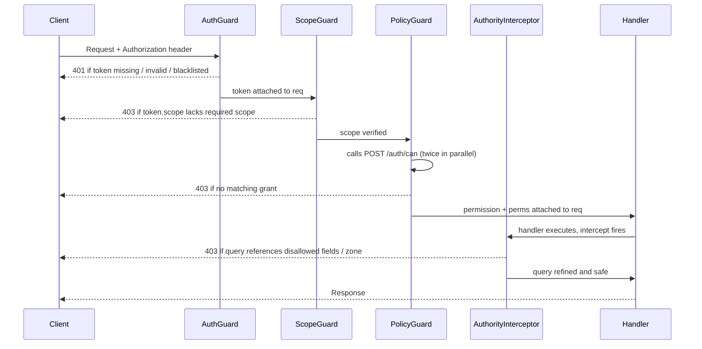
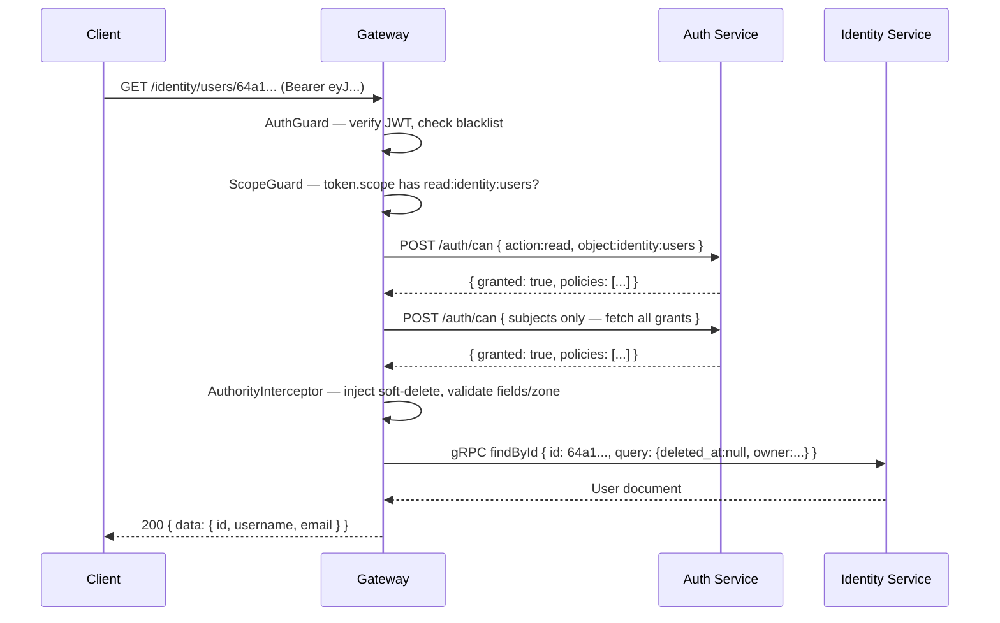

# Authorization

Every authenticated request passes through three guards and one interceptor before reaching a controller handler. This page explains each layer, the ABAC data model behind them, how to manage grants, and common authorization patterns.

See also → [Authentication](/api/authentication) for token types, the `POST /auth/token` endpoint, and the `strict` / `x-api-key` mechanism.

---

## Request authorization pipeline



---

## Layer 1 — AuthGuard (token validation)

`AuthGuard` runs first on every non-public endpoint. It:

1. Extracts the bearer token from `Authorization` header, `?token=` query param, or the `authorization` cookie.
2. If the token starts with `APT-`, resolves it from Redis and decrypts the stored `Apt` record.
3. Otherwise verifies the JWT signature with `JwtService.verify<JwtToken>()`.
4. Calls `BlacklistService.verifyToken()` — rejects the request if the session has been logged out.
5. Passes the decoded `JwtToken` to `AuthShield.check()` — enforces the `strict` / `x-api-key` contract (see [Authentication → The strict flag](/api/authentication#the-strict-flag-and-x-api-key)).
6. Attaches the decoded token to `req.token` for downstream layers.

A route decorated with `@IsPublic()` skips all of the above.

---

## Layer 2 — ScopeGuard (first-scope check)

Every controller handler is decorated with `@SetScope(Scope.ReadIdentityUsers)`. `ScopeGuard` reads this metadata and calls `ScopeShield.check()` against `token.scope`.

### Scope format

```
{action}:{service}:{collection}
```

Examples: `read:identity:users`, `write:financial:accounts`, `manage:auth:grants`, `whole`

### Action hierarchy

`ScopeShield` resolves implicit permissions upward before rejecting:

| Token has | Satisfies |
|---|---|
| `manage:X` | `manage:X`, `write:X`, `read:X` |
| `write:X` | `write:X`, `read:X` |
| `read:X` | `read:X` only |
| `whole` | Every scope |

### Prefix matching

Scopes are matched by prefix. A token with `read:identity` satisfies `read:identity:users` and `read:identity:profiles` without listing each individually.

If `ScopeGuard` fails, the request is rejected with `403 Forbidden` before any ABAC check runs. This is intentional — scope is a cheap pre-filter that avoids a Redis/gRPC round-trip to the auth service.

---

## Layer 3 — PolicyGuard (ABAC check)

After scope passes, `PolicyGuard` delegates to `PolicyShield.check()`, which calls `POST /auth/can` to evaluate attribute-based access control grants.

### What PolicyShield does

It makes **two parallel calls** to `auth/can`:

1. **Specific check** — `{ action, object: "service:collection", subjects, strict: "obj" }` — looks for a grant that exactly matches the resource.
2. **General check** — `{ subjects }` only — fetches all grants for this subject regardless of action/object. The result is stored as `perms` and used later by `AuthorityInterceptor` for population checks.

If the specific check fails, `PolicyShield` retries with a wildcard object — `"service:*"` — before returning `403`.

The resolved `permission` and `perms` objects are attached to `req.permission` and `req.perms`.

### POST /auth/can — Evaluate a permission

Use this endpoint to perform pre-flight ABAC checks from your own code.

```bash
curl -X POST http://localhost:3010/auth/can \
  -H "Authorization: Bearer $TOKEN" \
  -H "Content-Type: application/json" \
  -d '{
    "action": "read",
    "object": "identity:users"
  }'
```

**Request body** (`AuthorizationRequest`):

| Field | Type | Description |
|---|---|---|
| `action` | `Action` | The action to test: `read`, `write`, `manage`, etc. |
| `object` | `Resource` | The resource: `service:collection` |
| `subjects` | `string[]` | Override subjects (defaults to `token.subject`) |
| `strict` | `string` | `"obj"` — exact object match only, no wildcard fallback |
| `tz` | `string` | Timezone for time-based grant evaluation |
| `ip` | `string` | IP for location-based grant evaluation |

**Optional request headers:**

| Header | Effect |
|---|---|
| `x-can-with-policies` | Include the matching policy list in the response |
| `x-can-with-id-policies` | Include ID-level policies in the response |

**Response:**

```json
{
  "data": {
    "granted": true,
    "policies": [
      {
        "subject": "admin@example.com",
        "action": "read",
        "object": "identity:users",
        "field": ["id", "username", "email"],
        "filter": ["owner"],
        "location": ["0.0.0.0/0"]
      }
    ]
  }
}
```

---

## Grants — the ABAC data model

A **Grant** is a MongoDB document in the `auth/grants` collection. It defines what a subject may do on a resource within a domain, with optional constraints.

### Grant structure

```typescript
interface Grant {
  subject: string;       // Role or identity (@admin, user@domain, aid@domain, etc.)
  action: Action;        // read, write, manage, or custom actions
  object: Resource;      // service:resource or service:* (wildcard)

  // Constraints (optional)
  field?: string[];      // Only these fields are accessible
  filter?: string[];     // Row-level filter constraints (MongoDB query language)
  location?: string[];   // IP / CIDR allowlist — grant is only active from these addresses
  time?: GrantTime[];    // Temporal restriction — array of { cron_exp, duration } windows
}
```

### Grant fields reference

| Field | Type | Required | Description |
|---|---|:---:|---|
| `subject` | `string` | ✅ | ABAC subject: `{username}@{domain}` |
| `action` | `Action` | ✅ | `read`, `write`, `manage`, or a special action |
| `object` | `Resource` | ✅ | `service:collection` or `service:*` (wildcard) |
| `field` | `string[]` | | Field-level allowlist — only these fields may be queried or returned |
| `filter` | `string[]` | | Row-level filter notation — restricts which documents match |
| `location` | `string[]` | | IP / CIDR allowlist — grant is only active from these addresses |
| `time` | `GrantTime[]` | | Temporal restriction — array of `{ cron_exp, duration }` windows |

### Subject format

```
{username}@{domain}
```

- The `@{domain}` suffix is **required** in grants.
- `identity/users` stores subjects **without** the domain suffix — the suffix is appended at grant creation time.
- The domain must be registered in the client's allowed domain list.

| Subject | Grants Access To | Example |
|---|---|---|
| `@role-name` | All users with this role | `@admin` → everyone with admin role |
| `uid@domain` | Specific user at domain | `john@example.com` → user john |
| `aid@domain` | Specific app at domain | `web-app@example.com` → web-app |
| `cid@domain` | Specific OAuth client | `mobile-client@example.com` |
| `group-name` | Anyone in group (from RBAC) | `engineering` → everyone in engineering group |

### Special actions

Beyond `read`, `write`, and `manage`, the platform defines fine-grained special actions:

| Action | Example resource |
|---|---|
| `search` | `career:products`, `conjoint:messages`, `content:posts` |
| `upload` / `download` / `share` | `special:files` |
| `send` | `touch:smss`, `touch:emails`, `touch:pushes` |
| `payment` | `financial:invoices` |
| `init` / `verify` | `financial:transactions` |
| `collect` | `special:stats` |
| `start` / `abort` / `commit` | `essential:sagas` |
| `generate` | `conjoint:accounts` |
| `resolve` | `logistic:travels`, `logistic:locations` |

### Create a grant

```bash
curl -X POST http://localhost:3010/auth/grants \
  -H "Authorization: Bearer $TOKEN" \
  -H "Content-Type: application/json" \
  -d '{
    "subject": "alice@example.com",
    "action": "read",
    "object": "identity:users",
    "field": ["id", "username", "email"],
    "filter": ["owner"]
  }'
```

### Test a grant before creating

```bash
curl -X POST http://localhost:3010/auth/can \
  -H "Authorization: Bearer $TOKEN" \
  -H "x-can-with-policies: true" \
  -H "Content-Type: application/json" \
  -d '{
    "action": "read",
    "object": "identity:users",
    "subjects": ["alice@example.com"]
  }'
```

---

## Field restrictions — field-level access control

When a grant specifies `field`, the token can **only** access those fields on read, and can **only modify** those fields on write.

```typescript
{
  subject: "@editor",
  action: "write",
  object: "content:articles",
  field: ["title", "body", "tags", "status"]
}
```

| Request | Result |
|---|---|
| `{ "title": "New Title", "body": "..." }` | ✅ allowed |
| `{ "author": "other@example.com" }` | ❌ `author` not in field list |
| `{ "published_at": "2026-06-01" }` | ❌ `published_at` not in field list |

If no `field` is specified in any applicable grant, **all fields are accessible**.

---

## Filter restrictions — record-level access control

When a grant specifies `filter`, the token can **only** access records matching that filter.

```typescript
{
  subject: "user@example.com",
  action: "read",
  object: "content:notes",
  filter: ["{ owner: 'user@example.com' }"]
}
```

Multiple filters in a grant are combined with **OR**:

```typescript
{
  subject: "@user",
  action: "read",
  object: "content:notes",
  filter: ["{ owner: token.uid }", "{ shares: token.uid }"]
}
// Can read: (owner == uid) OR (uid in shares) ✅
```

### Filter syntax

Filters use **MongoDB query language** with token variable substitution:

```typescript
{ "status": "published" }                               // simple match
{ "created_at": { "$gte": "2026-01-01" } }              // comparison
{ "tags": { "$in": ["urgent", "todo"] } }               // array
{ "$or": [{ "owner": "uid" }, { "shares": "uid" }] }    // logical
{ "owner": "token.uid" }                                // token variable
{ "department": "token.department" }                    // token attribute
```

---

## Location-based access — IP restrictions

When a grant specifies `location`, requests from outside those IP addresses are rejected with `403 Forbidden`.

```typescript
{
  subject: "@admin",
  action: "manage",
  object: "auth:clients",
  location: ["192.168.1.0/24", "10.0.0.0/8"]
}
```

If `location` is empty or omitted, all IPs are allowed.

---

## Time-based access — temporal restrictions

When a grant specifies `time`, access is only allowed during the specified windows. `cron_exp` defines when the window opens; `duration` is how many seconds it stays open. Multiple time entries are combined with **OR**.

```typescript
{
  subject: "@contractor",
  action: "read",
  object: "identity:users",
  time: [{ "cron_exp": "0 9 * * 1-5", "duration": 32400 }]
  // business hours Mon–Fri, 9am for 9 hours
}
```

---

## Layer 4 — AuthorityInterceptor (query-time enforcement)

`AuthorityInterceptor` runs **after** the controller handler executes but **before** the Mongo query reaches the database. It enforces the `Permission` object resolved by `PolicyGuard` at the query level.

It requires two decorators on the controller:

| Decorator | Applied to | Purpose |
|---|---|---|
| `@SetPolicy(action, resource)` | Handler | Declares the action + resource for ABAC lookup |
| `@CollectionPath(path)` | Controller | Identifies the Mongoose collection schema |

### Interceptor execution flow

```
Request arrives
  ↓
AuthGuard validates token ✅
  ↓
ScopeGuard validates scope ✅
  ↓
PolicyGuard validates grant exists ✅
  ↓
AuthorityInterceptor executes
  ├─ Soft-delete injection
  ├─ Field permission checking
  ├─ Filter injection
  ├─ Group membership validation
  ├─ Zone exploit checking
  ├─ Population checks
  └─ Query refinement
  ↓
Service handler executes modified query
  ↓
Response returned
```

### 1. Soft-delete injection

Unless the `x-exclude-soft-delete-query` header is present, the interceptor appends `{ deleted_at: null }` to every query automatically.

### 2. Field and filter enforcement

For every field in the Mongo query, the interceptor validates it against the grant's `field` and `filter` allowlists. If the query references a field not covered by the grant, the request is rejected with `403 Forbidden`.

### 3. Zone exploit checking

The zone (`own`, `share`, `group`, `client`) is set by the `x-zone` header or query param (default `own`).

| Zone | Automatic filter |
|---|---|
| `own` | `owner === token.uid` |
| `share` | `shares[]` contains `token.uid` |
| `group` | `groups[]` intersects user's group memberships |
| `client` | `client_id === token.client_id` |

Zones can be combined: `?zone=own,share`

### 4. Group query validation

If a query includes a `groups` array, the interceptor verifies each group ID against the authenticated user's Redis group membership set. Groups the user does not belong to are silently removed.

### 5. Population checks

For Mongoose `populate` paths, the interceptor uses `perms` to verify the user has a grant covering the populated collection. Population paths without a matching grant are silently dropped.

### 6. Query refinement

After all security checks pass, `refineQuery()` injects the `id` path parameter and/or `ref` query parameter into the Mongo filter as the final step before execution.

---

## ABAC ownership model

Every document carries four ownership fields:

| Field | Type | Meaning |
|---|---|---|
| `owner` | ObjectId | Creator of the record (user/app/client) |
| `shares` | ObjectId[] | Specific users granted explicit access |
| `groups` | FQDN/AppId[] | Users/apps matching these identities get access |
| `clients` | ObjectId[] | OAuth clients (and coworkers) with access |

Zone conditions:

| Zone | Condition |
|---|---|
| `own` | `owner == token.uid ?? token.aid ?? token.cid` |
| `share` | `token.uid in shares[]` |
| `group` | `token.aid or token.domain in groups[]` |
| `client` | `token.cid in clients[]` |

---

## Authorization patterns

### Pattern 1: Role-based access (RBAC)

Assign roles to users and create grants per role. Using `@role` subjects makes permissions easy to manage at scale.

**1. Create roles:**

```bash
curl -X POST http://localhost:3010/auth/roles \
  -H "Authorization: Bearer $ADMIN_TOKEN" \
  -H "Content-Type: application/json" \
  -d '{ "name": "editor" }'
```

**2. Create grants for each role:**

```bash
# Admin: full access
curl -X POST http://localhost:3010/auth/grants \
  -H "Authorization: Bearer $ADMIN_TOKEN" \
  -H "Content-Type: application/json" \
  -d '{
    "subject": "@admin",
    "action": "manage",
    "object": "content:articles"
  }'

# Editor: create and edit own content only
curl -X POST http://localhost:3010/auth/grants \
  -H "Authorization: Bearer $ADMIN_TOKEN" \
  -H "Content-Type: application/json" \
  -d '{
    "subject": "@editor",
    "action": "write",
    "object": "content:articles",
    "filter": ["{ owner: token.uid }"]
  }'

# Viewer: read published content only
curl -X POST http://localhost:3010/auth/grants \
  -H "Authorization: Bearer $ADMIN_TOKEN" \
  -H "Content-Type: application/json" \
  -d '{
    "subject": "@viewer",
    "action": "read",
    "object": "content:articles",
    "filter": ["{ published: true }"]
  }'
```

**3. Assign a role to a user:**

```bash
curl -X PATCH http://localhost:3010/identity/users/user-123 \
  -H "Authorization: Bearer $ADMIN_TOKEN" \
  -H "Content-Type: application/json" \
  -d '{ "roles": ["@editor"] }'
```

**Client-side check:**

```typescript
const canDelete = await fetch('/auth/can', {
  method: 'POST',
  headers: { 'Authorization': `Bearer ${token}` },
  body: JSON.stringify({ action: 'manage', object: 'content:articles' })
}).then(r => r.json()).then(r => r.data.granted);

if (canDelete) showDeleteButton();
```

---

### Pattern 2: Ownership-based access

Users can only access or modify their own records.

```bash
# Users can read their own records
curl -X POST http://localhost:3010/auth/grants \
  -H "Authorization: Bearer $ADMIN_TOKEN" \
  -H "Content-Type: application/json" \
  -d '{
    "subject": "@user",
    "action": "read",
    "object": "identity:users",
    "filter": ["{ owner: token.uid }"]
  }'

# Users can update their own records — with field restrictions
curl -X POST http://localhost:3010/auth/grants \
  -H "Authorization: Bearer $ADMIN_TOKEN" \
  -H "Content-Type: application/json" \
  -d '{
    "subject": "@user",
    "action": "write",
    "object": "identity:users",
    "filter": ["{ owner: token.uid }"],
    "field": ["name", "email", "phone"]
  }'
```

```typescript
// User 123 can update their own profile
await fetch('/identity/users/user-123', {
  method: 'PATCH',
  headers: { 'Authorization': `Bearer ${userToken}` },
  body: JSON.stringify({ name: 'New Name' })
});  // ✅ OK, user is owner

// User 123 cannot update user 456's profile
await fetch('/identity/users/user-456', {
  method: 'PATCH',
  headers: { 'Authorization': `Bearer ${userToken}` },
  body: JSON.stringify({ name: 'Hacked' })
});  // ❌ 403 Forbidden — not the owner
```

---

### Pattern 3: Team / group-based access

Teams get access to shared resources via the `groups` field on records.

**1. Create grants based on group membership:**

```bash
# Engineering team can read all eng docs
curl -X POST http://localhost:3010/auth/grants \
  -H "Authorization: Bearer $ADMIN_TOKEN" \
  -H "Content-Type: application/json" \
  -d '{
    "subject": "engineering",
    "action": "read",
    "object": "content:documentation",
    "filter": ["{ groups: token.domain }"]
  }'
```

**2. Tag documents with their group:**

```bash
curl -X POST http://localhost:3010/content/documentation \
  -H "Authorization: Bearer $ADMIN_TOKEN" \
  -H "Content-Type: application/json" \
  -d '{
    "title": "API Reference",
    "body": "...",
    "groups": ["engineering@example.com"]
  }'
```

**3. Token automatically carries group info:**

```typescript
// Token claims include domain and aid:
{ "domain": "example.com", "aid": "engineering-app" }

// AuthorityInterceptor checks these against record's groups[] field
```

---

### Pattern 4: Client isolation (multi-tenancy)

Different OAuth clients can only access their own data.

```bash
# Web app can only access its own notes
curl -X POST http://localhost:3010/auth/grants \
  -H "Authorization: Bearer $ADMIN_TOKEN" \
  -H "Content-Type: application/json" \
  -d '{
    "subject": "client:web-app",
    "action": "read",
    "object": "content:notes",
    "filter": ["{ clients: token.cid }"]
  }'

# Mobile app has its own separate grant
curl -X POST http://localhost:3010/auth/grants \
  -H "Authorization: Bearer $ADMIN_TOKEN" \
  -H "Content-Type: application/json" \
  -d '{
    "subject": "client:mobile-app",
    "action": "read",
    "object": "content:notes",
    "filter": ["{ clients: token.cid }"]
  }'
```

Records created by the web app automatically include `"clients": ["web-app-id"]`. Mobile app requests only see notes with `mobile-app-id` in their `clients[]` array.

---

### Pattern 5: Time-based access

Grant access for limited time periods — contractors, seasonal staff, maintenance windows.

**Contractor access (fixed duration):**

```bash
curl -X POST http://localhost:3010/auth/grants \
  -H "Authorization: Bearer $ADMIN_TOKEN" \
  -H "Content-Type: application/json" \
  -d '{
    "subject": "@contractor-john",
    "action": "read",
    "object": "identity:users",
    "time": [
      { "start": "2026-06-01T00:00:00Z", "end": "2026-08-31T23:59:59Z" }
    ]
  }'
```

June–August 2026: Access allowed ✅ — Any other time: `403 Forbidden` ❌

**Seasonal access with multiple windows (OR logic):**

```bash
curl -X POST http://localhost:3010/auth/grants \
  -H "Authorization: Bearer $ADMIN_TOKEN" \
  -H "Content-Type: application/json" \
  -d '{
    "subject": "@holiday-staff",
    "action": "write",
    "object": "financial:invoices",
    "time": [
      { "start": "2026-11-15T00:00:00Z", "end": "2026-12-31T23:59:59Z" },
      { "start": "2027-01-01T00:00:00Z", "end": "2027-01-31T23:59:59Z" }
    ]
  }'
```

**Maintenance window (Friday night only):**

```bash
curl -X POST http://localhost:3010/auth/grants \
  -H "Authorization: Bearer $ADMIN_TOKEN" \
  -H "Content-Type: application/json" \
  -d '{
    "subject": "@maintenance",
    "action": "manage",
    "object": "auth:clients",
    "time": [
      { "start": "2026-05-31T22:00:00Z", "end": "2026-06-01T06:00:00Z" }
    ]
  }'
```

Access is automatically denied outside the windows — no manual revocation needed.

---

### Pattern 6: Location-based access (IP restrictions)

Restrict access to specific networks — office, VPN, data center.

**Office network only:**

```bash
curl -X POST http://localhost:3010/auth/grants \
  -H "Authorization: Bearer $ADMIN_TOKEN" \
  -H "Content-Type: application/json" \
  -d '{
    "subject": "@admin",
    "action": "manage",
    "object": "auth:clients",
    "location": ["203.0.113.0/24"]
  }'
```

Request from `203.0.113.50` → ✅ Allowed. Request from home ISP IP → ❌ 403 Forbidden.

**Multi-location with VPN and home IP:**

```bash
curl -X POST http://localhost:3010/auth/grants \
  -H "Authorization: Bearer $ADMIN_TOKEN" \
  -H "Content-Type: application/json" \
  -d '{
    "subject": "@employee",
    "action": "read",
    "object": "identity:users",
    "location": [
      "203.0.113.0/24",
      "10.0.0.0/8",
      "203.0.113.200"
    ]
  }'
```

**Combining location grants with strict token IP whitelisting:**

```typescript
// API key whitelisting (transport-layer) + grant location (ABAC) = layered security
const apiToken = {
  cid: jwt.cid,
  client_id: jwt.client_id,
  whitelist: ['192.168.1.0/24'],
  expiration_date: new Date('2027-06-01')
};
```

---

### Pattern 7: Field-level access control

Different users can see or modify different fields on the same record.

```bash
# Admin: unrestricted access to all fields
curl -X POST http://localhost:3010/auth/grants \
  -H "Authorization: Bearer $ADMIN_TOKEN" \
  -H "Content-Type: application/json" \
  -d '{
    "subject": "@admin",
    "action": "write",
    "object": "identity:users"
  }'

# Regular user: restricted to safe profile fields only
curl -X POST http://localhost:3010/auth/grants \
  -H "Authorization: Bearer $ADMIN_TOKEN" \
  -H "Content-Type: application/json" \
  -d '{
    "subject": "@user",
    "action": "write",
    "object": "identity:users",
    "filter": ["{ owner: token.uid }"],
    "field": ["name", "email", "phone", "avatar"]
  }'
```

```typescript
// Allowed — fields are in the grant
await fetch('/identity/users/user-123', {
  method: 'PATCH',
  headers: { 'Authorization': `Bearer ${userToken}` },
  body: JSON.stringify({ name: 'New Name', email: 'new@example.com' })
});  // ✅ OK

// Denied — password not in field list
await fetch('/identity/users/user-123', {
  method: 'PATCH',
  headers: { 'Authorization': `Bearer ${userToken}` },
  body: JSON.stringify({ name: 'New Name', password: 'new-password' })
});  // ❌ 403 Forbidden
```

---

### Pattern 8: Shared / collaborative access

Users explicitly share records with other users via the `shares` field.

```bash
# Users can access their own notes and notes shared with them
curl -X POST http://localhost:3010/auth/grants \
  -H "Authorization: Bearer $ADMIN_TOKEN" \
  -H "Content-Type: application/json" \
  -d '{
    "subject": "@user",
    "action": "read",
    "object": "content:notes",
    "filter": [
      "{ owner: token.uid }",
      "{ shares: token.uid }"
    ]
  }'
```

**Sharing a record:**

```bash
curl -X PATCH http://localhost:3010/content/notes/note-123 \
  -H "Authorization: Bearer $OWNER_TOKEN" \
  -H "Content-Type: application/json" \
  -d '{ "shares": ["user-456", "user-789"] }'
```

**Fetching all accessible notes:**

```typescript
// zone=own,share returns records owned by OR shared with the user
const notes = await fetch('/content/notes?zone=own,share', {
  headers: { 'Authorization': `Bearer ${token}` }
}).then(r => r.json());
```

---

### Pattern 9: Custom actions

Applications can define permissions beyond the standard `read` / `write` / `manage`.

```bash
# Only editors can publish articles
curl -X POST http://localhost:3010/auth/grants \
  -H "Authorization: Bearer $ADMIN_TOKEN" \
  -H "Content-Type: application/json" \
  -d '{
    "subject": "@editor",
    "action": "publish",
    "object": "content:articles"
  }'

# Only managers can archive articles
curl -X POST http://localhost:3010/auth/grants \
  -H "Authorization: Bearer $ADMIN_TOKEN" \
  -H "Content-Type: application/json" \
  -d '{
    "subject": "@manager",
    "action": "archive",
    "object": "content:articles"
  }'
```

```typescript
const canPublish = await fetch('/auth/can', {
  method: 'POST',
  headers: { 'Authorization': `Bearer ${token}` },
  body: JSON.stringify({ action: 'publish', object: 'content:articles' })
}).then(r => r.json()).then(r => r.data.granted);
```

Document custom actions clearly so the team understands what each one means.

---

### Pattern 10: Complex multi-condition access

Combine subject, filter, field, location, and time constraints in a single grant.

```bash
curl -X POST http://localhost:3010/auth/grants \
  -H "Authorization: Bearer $ADMIN_TOKEN" \
  -H "Content-Type: application/json" \
  -d '{
    "subject": "@manager",
    "action": "write",
    "object": "financial:invoices",
    "filter": [
      "{ department: token.department }",
      "{ status: \"pending\" }"
    ],
    "field": ["status", "notes"],
    "location": ["203.0.113.0/24", "10.0.0.0/8"],
    "time": [
      { "start": "2026-01-01T00:00:00Z", "end": "2026-12-31T23:59:59Z" }
    ]
  }'
```

This grant allows only managers to update `status` and `notes` on pending invoices in their department, from office or VPN, during 2026.

---

## Full example: read a user record



---

## Debugging authorization issues

### Check token subjects

```bash
curl http://localhost:3010/auth/verify -H "Authorization: Bearer $TOKEN" | jq .data.subject
# These subjects are matched against grant subjects
```

### List applicable grants

```bash
curl "http://localhost:3010/auth/grants?subject=@user" \
  -H "Authorization: Bearer $ADMIN_TOKEN"
```

### Test permission directly

```bash
curl -X POST http://localhost:3010/auth/can \
  -H "Authorization: Bearer $TOKEN" \
  -H "x-can-with-policies: true" \
  -H "Content-Type: application/json" \
  -d '{ "action": "read", "object": "content:notes" }' | jq .data.granted
```

### Check record ownership fields

```bash
curl "http://localhost:3010/content/notes/note-123" \
  -H "Authorization: Bearer $ADMIN_TOKEN" | jq '.data | {owner, shares, groups, clients}'
```

### Check grant field restrictions

```bash
curl "http://localhost:3010/auth/grants?subject=@user" \
  -H "Authorization: Bearer $ADMIN_TOKEN" | jq '.[] | {object, field}'
```

If `field` is set, only those fields are accessible — the grant itself tells you what's allowed.

### Enable debug logging

Set environment variable `DEBUG=wnx:auth:*` to see authorization decision logs.

---

## Error reference

| Status | Guard / Interceptor | Cause |
|---|---|---|
| `401 Unauthorized` | `AuthGuard` | Missing, expired, or blacklisted token |
| `403 Forbidden` | `AuthGuard` | `strict` token without valid `x-api-key` |
| `403 Forbidden` | `ScopeGuard` | Token scope does not cover the required scope |
| `403 Forbidden` | `PolicyGuard` | No matching grant for this action + resource |
| `403 Forbidden` | `AuthorityInterceptor` | Query references disallowed fields |
| `502 Bad Gateway` | `AuthorityInterceptor` | `AuthGuard` or `PolicyGuard` was not applied (internal misconfiguration) |

---

## Best practices

1. **Use roles (`@role`) over individual identities** — easier to manage at scale
2. **Combine multiple grants** — use OR logic with multiple filter/time windows
3. **Limit field access** — specify exactly which fields tokens can see/modify
4. **IP whitelist for sensitive operations** — especially for admin/manage actions
5. **Time-bound contractor access** — access expires automatically when the window closes
6. **Test with `/auth/can` before building UI** — verify permissions first, then build around them
7. **Soft-delete via `delete*` methods** — use `destroy*` only for compliance cleanup
8. **Audit access logs** — monitor who accesses what
9. **Review grants regularly** — remove stale permissions
10. **Document custom actions** — help the team understand your permission model

---

## See Also

- [Authentication](/api/authentication) — Token types, issuing tokens, APTs, and the strict/x-api-key mechanism
- [Access Control](/getting-started/overview/key-concepts/access-control) — Core ABAC model and zone filtering
