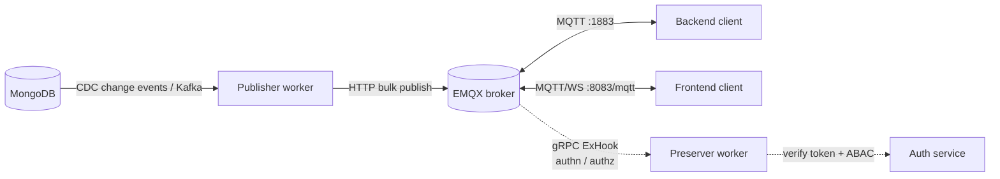

# Realtime Data (MQTT)

The platform publishes data changes in **near real time** over MQTT. Whenever a document changes in MongoDB, the [Publisher](../getting-started/workers/publisher) worker resolves the set of MQTT topics that should be notified and publishes a small change-notification message to each one through EMQX. Clients subscribe to the topics they are authorized for and react to changes as they happen — no polling required.

Unlike [Streaming (SSE)](./streaming), which streams a one-shot query result over HTTP, realtime data is a **persistent, bidirectional** channel: a client stays connected and receives every relevant change for the lifetime of its session.

**Transports:** plain MQTT (TCP) and MQTT over WebSocket — both terminate at the same EMQX broker and enforce the same authorization rules.

## Architecture



1. A document changes in MongoDB. The change is captured (CDC) and delivered to the **Publisher** worker as a `MongoSourcePayload`.
2. The Publisher derives the target topics from the document's access metadata (`owner`, `shares`, `clients`, `groups`, `identity`) and **bulk-publishes** one message per topic to EMQX over its HTTP API (QoS 2, not retained).
3. EMQX fans the message out to every connected client subscribed to a matching topic.
4. On **every** connect, subscribe, publish, and message event, EMQX calls the **Preserver** worker over a gRPC ExHook. The Preserver verifies the client's token and evaluates ABAC policies via the **Auth** service before allowing the operation.

### Transports

EMQX exposes the same topic space over two listeners. Pick whichever fits the runtime:

| Transport | Default endpoint | Use from |
|---|---|---|
| MQTT over TCP | `mqtt://<host>:1883` | Node.js backends, server-to-server clients |
| MQTT over WebSocket | `ws://<host>:8083/mqtt` (`wss://` when TLS-terminated) | Browsers / frontend apps |

Both use the same `mqtt` npm package; only the connection URL scheme differs. The reference frontend reads its WebSocket URL from `NUXT_PUBLIC_MQTT_WS_URL` (`ws://localhost:8083/mqtt`).

## Topics and Schemas

### Data topics

For every change, the Publisher builds a list of topic prefixes from the document's access-control fields, then suffixes each one with `/{database}/{id}/{collection}`. The prefixes are derived as follows (see `apps/workers/publisher/src/app.service.ts`):

| Topic pattern | Audience |
|---|---|
| `{owner}/{db}/{id}/{collection}` | The document owner |
| `{share}/{db}/{id}/{collection}` | Each principal in `shares[]` |
| `{client}/{db}/{id}/{collection}` | Each app/client in `clients[]` |
| `{client}/{owner}/{db}/{id}/{collection}` | A client, scoped to the owner |
| `{client}/{share}/{db}/{id}/{collection}` | A client, scoped to a shared principal |
| `{client}/{group}/{db}/{id}/{collection}` | A client, scoped to a group |
| `{client}/{owner}/{identity}/{db}/{id}/{collection}` | Identity-scoped (only when the document has an `identity`) |
| `{client}/{share}/{identity}/{db}/{id}/{collection}` | Identity-scoped, per share |
| `{client}/{group}/{identity}/{db}/{id}/{collection}` | Identity-scoped, per group |

Where:

- `{db}` is the database name with the `MONGO_PREFIX` stripped (e.g. `default-financial` → `financial`).
- `{id}` is the document's `_id`.
- `{collection}` is the MongoDB collection (e.g. `accounts`).
- `{owner}`, `{share}`, `{client}`, `{group}`, `{identity}` are Mongo ObjectIds.

Empty segments are filtered out, and duplicate topics are de-duplicated before publishing. Subscribers typically use MQTT wildcards to listen to a slice of this space — for example `+/financial/+/accounts` (any owner, any id, `accounts` collection) or `{owner}/financial/#` (everything owned by a principal).

### Message schema

Every data message is a JSON object with exactly three fields, published with **QoS 2**, `retain: false`, and a plain-text payload:

```json
{
  "id": "64a1b2c3d4e5f6a7b8c9d0e1",
  "op": "u",
  "src": "financial/accounts"
}
```

| Field | Description |
|---|---|
| `id` | The id of the document that changed. |
| `op` | The change operation: `c` (create), `u` (update), or `d` (delete). A `d` is only published when the change event includes the document's before-image. |
| `src` | The source collection as `{database}/{collection}` (the value of `COLLECTION(collection, database)`). |

The payload is intentionally minimal — it is a **notification, not a snapshot**. When a subscriber needs the full document, it fetches it from the REST or GraphQL API using `id` and `src`. This keeps messages tiny and avoids leaking fields a subscriber may not be authorized to read.

### Control-plane topics

Each session also has a private set of control topics under `{identity}/{session}/...`, where `{identity}` is the connecting principal's id (`uid`, `aid`, or `cid`) and `{session}` is the session id. The Preserver auto-authorizes any topic matching `^{identity}/{session}/\w+$` for its own client:

| Topic | Direction | Purpose |
|---|---|---|
| `{identity}/{session}/token` | client → broker | Publish a refreshed access token to extend the session (see [Token refresh](#token-refresh)). |
| `{identity}/{session}/status` | broker → subscribers | Retained presence flag — set to `online` on connect, deleted on disconnect. |
| `{identity}/{session}/catch` | broker → client | Error channel — the Preserver publishes serialized exceptions here when an authorize/publish check fails. |

## Client Usage

The canonical client uses the [`mqtt`](https://www.npmjs.com/package/mqtt) npm package. The reference implementation is the `useSocket` composable in `examples/phc-frontend/app/composables/useSocket.ts`; the same code runs in any Node.js backend (point it at `mqtt://host:1883` instead of the WebSocket URL).

### Connecting

Connect with three credentials derived from the platform access token:

- **`clientId`** — `{session}:{random}`. The part before `:` **must** be the token's `session` id; the suffix keeps the client id unique.
- **`username`** — the principal id: `uid || aid || cid` from the token.
- **`password`** — the access token itself (a JWT, or an `APT` key — see [Authentication](./authentication)).

```typescript
import mqtt, { type IClientOptions } from 'mqtt';

const brokerUrl = 'ws://localhost:8083/mqtt'; // or 'mqtt://localhost:1883' from a backend

const options: IClientOptions = {
  clean: true,
  clientId: `${session}:${nanoId(8)}`,
  username: uid || aid || cid,
  password: access_token,
};

const client = mqtt.connect(brokerUrl, options);

client.on('connect', () => {
  // Send periodic pings to keep the connection alive
  setInterval(() => client.sendPing(), 30_000);
});
```

### Subscribing

Pass the access token on every subscribe via MQTT v5 **user properties**. The Preserver reads it to authorize the subscription:

```typescript
const opts = {
  qos: 2,
  properties: { userProperties: { authorization: access_token } },
};

client.subscribe('64a1.../financial/#', opts);

client.on('message', (topic, payload) => {
  const change = JSON.parse(payload.toString()); // { id, op, src }
  // e.g. re-fetch the document from the API
  console.log(`[${change.op}] ${change.src}/${change.id}`);
});
```

### Publishing

Publishing follows the same pattern — attach the token in user properties so the publish can be authorized:

```typescript
client.publish('64a1.../financial/.../accounts', message, {
  qos: 2,
  properties: { userProperties: { authorization: access_token } },
});
```

### Token refresh

Access tokens expire. Rather than reconnecting, publish the **new** token to the session's `token` control topic. The Preserver re-caches it and the session continues uninterrupted:

```typescript
const tokenTopic = `${uid || aid || cid}/${session}/token`;
client.publish(tokenTopic, newAccessToken, { qos: 2 });
```

### Handling errors

Subscribe to the `catch` topic to receive authorization/publish errors that have no synchronous response (MQTT publishes are fire-and-forget):

```typescript
const catchTopic = `${uid || aid || cid}/${session}/catch`;
client.subscribe(catchTopic, { qos: 2 });
client.on('message', (topic, payload) => {
  if (topic === catchTopic) {
    console.error('SocketError:', JSON.parse(payload.toString()));
  }
});
```

## Authentication & Authorization

All access control is enforced by the **[Preserver](../getting-started/workers/preserver)** worker, which EMQX invokes over a gRPC ExHook on every lifecycle event. The Preserver registers hooks for `client.authenticate`, `client.authorize`, `client.connected`, `client.disconnected`, and `message.publish` (all topics, `#`). It delegates token verification and policy evaluation to the [Auth service](../getting-started/services/auth) (`apps/services/auth/src/modules/auths/`).

### Authentication (`client.authenticate`)

When a client connects, the Preserver validates the credentials before EMQX accepts the connection:

1. **Shape checks** — `clientid` must carry a session segment, `password` must be present, and `username` must be a valid Mongo id. Failure → connection rejected (`401`-equivalent `STOP_AND_RETURN`).
2. **Token verification** — if the password starts with `apt`, the `APT` key is resolved from Redis and decrypted; otherwise the JWT is verified with `jwtService.verify`. (This is the same logic as the Auth service's `verify()` method.)
3. **Claim checks** — the token's `session` must equal the `clientid` session, `type` must be `access`, and the token's principal (`uid || aid || cid`) must equal the `username`.
4. **Caching** — on success, the verified token is encrypted and cached in Redis under `preserver:emqx:auth:{identity}/{session}/token` with a TTL equal to the token's remaining lifetime. Authorization checks reuse this cache instead of re-verifying on every operation.

### Authorization (`client.authorize`)

Called before every subscribe and publish. The Preserver decides as follows:

1. **Own control plane** — topics matching `^{identity}/{session}/\w+$` are always allowed (this covers `token`, `status`, `catch`, etc.).
2. **Load cached token** — the cached token from authentication is loaded from Redis; if it is missing/expired, the operation is denied.
3. **Scope check** — the operation maps to an [`Action`](./authorization): `PUBLISH` → `Action.Publish`, otherwise `Action.Subscribe`. The token's `scope` list must include the matching scope (`publish` / `subscribe`) or the catch-all `whole` scope. Tokens issued without a `publish`/`subscribe`/`whole` scope cannot use realtime at all.
4. **Policy (ABAC) check** — the Preserver calls `auths.can({ action, object: <topic>, strict: 'act|obj' })` against the Auth service's [ABAC engine](./authorization). The topic is the authorization *object*. Several object variants are checked in parallel and access is granted if **any** of them is permitted:
   - the literal topic;
   - an id-normalized form where the principal/session segments are replaced with placeholders;
   - for full data topics (more than 4 segments) whose path includes the caller's own identity or one of its groups: a `Action.Read` check on the underlying `{database}:{collection}` (so a subscriber must be allowed to *read* the collection it is listening to), plus wildcard (`+`) and Mongo-id placeholder variants.
5. **Result** — if granted, the operation proceeds; otherwise it is denied and a serialized error is published to the client's `catch` topic.

### Token refresh via `message.publish`

The Preserver also hooks `message.publish`. When a message is published to a topic matching `^\w{24}/\w{24}/token$` (`{identity}/{session}/token`), it treats the payload as a fresh access token: it verifies the token, confirms the topic matches the token's own `{identity}/{session}`, and re-caches it in Redis with the new TTL. This is what lets a long-lived session swap in a renewed token without reconnecting. Verification failures are reported on the session's `catch` topic.

### Presence (`client.connected` / `client.disconnected`)

On connect, the Preserver publishes a **retained** `online` message to `{identity}/{session}/status` so other subscribers can observe presence. On disconnect, it deletes that retained message and clears the session's cached token from Redis.

## Comparison: Realtime (MQTT) vs Streaming (SSE)

| Feature | Realtime (MQTT) | [Streaming (SSE)](./streaming) |
|---|---|---|
| Protocol | MQTT (TCP `:1883`) / MQTT over WebSocket (`:8083/mqtt`) | HTTP/1.1 Server-Sent Events |
| Direction | Bidirectional (subscribe + publish) | Server → client only |
| Lifetime | Persistent session, every relevant change | One-shot: streams a single query result, then closes |
| Payload | Change notification (`id`, `op`, `src`) | Full documents |
| Authorization | Per-topic ABAC via Preserver ExHook | `AuthorityInterceptor` per streamed item |
| Best for | Live dashboards, presence, push updates | Progressive loading, bulk export, ETL |
