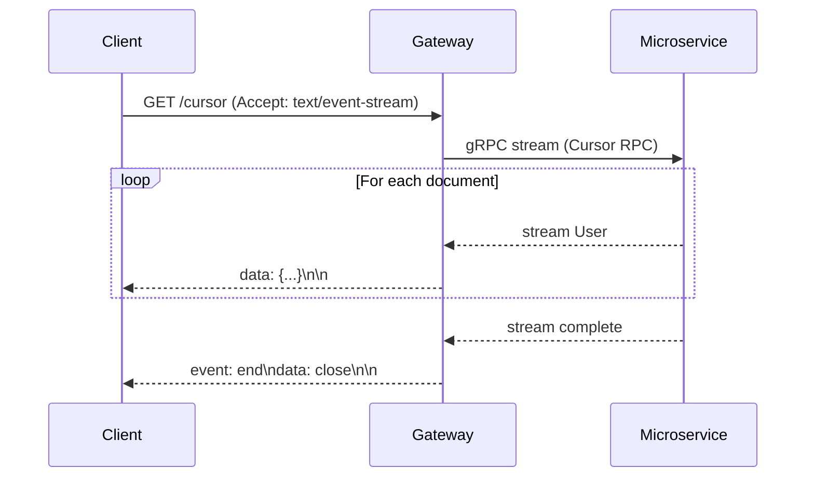

# Streaming — Server-Sent Events (SSE)

Every collection exposes a `/cursor` endpoint that streams documents as Server-Sent Events (SSE). This is useful for real-time data feeds, progressive loading of large result sets, and live dashboards.

**Endpoint:** `GET /{service}/{collection}/cursor`

## How It Works



The gateway:
1. Calls the gRPC `Cursor` RPC on the microservice, which returns a gRPC server-streaming response.
2. Applies `AuthorityInterceptor` (ownership/zone filter) to each streamed item.
3. Writes each filtered item to the HTTP response as an SSE `data:` frame.
4. Signals completion with an `event: end` frame and closes the connection.

## Response Headers

The gateway sets these headers automatically:

```
Transfer-Encoding: chunked
Content-Type: text/event-stream
Cache-Control: private, no-cache, no-store
```

## SSE Frame Format

Each document arrives as:

```
id: 64a1b2c3d4e5f6a7b8c9d0e1
data: {"id":"64a1b2c3d4e5f6a7b8c9d0e1","username":"alice",...}

```

On stream completion:

```
event: end
data: close

```

On error:

```
event: error
data: {"statusCode":500,"message":"Internal server error"}

```

## curl Example

```bash
curl -N "$BASE/identity/users/cursor" \
  --get \
  --data-urlencode 'query={}' \
  --data-urlencode 'pagination={"limit":100,"sort":{"created_at":-1}}' \
  -H "Authorization: Bearer $TOKEN" \
  -H "Accept: text/event-stream"
```

The `-N` flag disables curl's output buffering, which is required to see SSE events in real time.

## Filter for Cursor

The cursor endpoint accepts `FilterOneDto` as query parameters, which has:

- `query` — MongoDB query expression (required)
- `populate` — populate related documents
- `projection` — field inclusion / exclusion

There is no top-level `pagination.limit` enforced by the cursor endpoint — the stream runs until the service exhausts its result set. Use `query` to scope the dataset appropriately.

```bash
# Stream only active users, showing username and email
curl -N "$BASE/identity/users/cursor" \
  --get \
  --data-urlencode 'query={"status":"active"}' \
  --data-urlencode 'projection={"username":1,"email":1}' \
  -H "Authorization: Bearer $TOKEN" \
  -H "Accept: text/event-stream"
```

## JavaScript / Browser Example

```javascript
const token = 'eyJhbGciOiJIUzI1NiIsInR5cCI6IkpXVCJ9...';
const filter = encodeURIComponent(JSON.stringify({}));

const url = `http://localhost:3010/identity/users/cursor?query=${filter}`;

const evtSource = new EventSource(url);

// EventSource does not support custom headers in browsers.
// Use fetchEventSource for authenticated streams (see below).
```

> **Browser limitation:** The native `EventSource` API does not support custom headers such as `Authorization`. Use the `@microsoft/fetch-event-source` library instead.

```javascript
import { fetchEventSource } from '@microsoft/fetch-event-source';

await fetchEventSource('http://localhost:3010/identity/users/cursor?query=%7B%7D', {
  headers: {
    Authorization: `Bearer ${token}`,
    Accept: 'text/event-stream',
  },
  onmessage(event) {
    if (event.event === 'end') {
      console.log('Stream complete');
      return;
    }
    if (event.event === 'error') {
      console.error('Stream error:', event.data);
      return;
    }
    const user = JSON.parse(event.data);
    console.log('Received user:', user.id, user.username);
  },
  onerror(err) {
    console.error('Connection error:', err);
  },
});
```

## SDK Example

The `@wenex/sdk` `RestfulService.cursor()` method wraps `fetchEventSource`:

```typescript
import axios from 'axios';
import { Platform } from '@wenex/sdk';

const platform = Platform.build(
  axios.create({
    baseURL: 'http://localhost:3010',
    headers: { Authorization: `Bearer ${token}` },
  }),
);

await platform.identity.users.cursor(
  { query: {} },
  {
    onmessage(event) {
      if (event.event === 'end') return;
      const user = JSON.parse(event.data);
      console.log(user.id, user.username);
    },
  },
);
```

## Zone Filtering with SSE

The cursor endpoint respects the same `zone` query parameter as the regular `find` endpoint:

```bash
curl -N "$BASE/identity/users/cursor?query={}&zone=own,share" \
  -H "Authorization: Bearer $TOKEN" \
  -H "Accept: text/event-stream"
```

Only documents in the specified zones are emitted. Documents filtered out by `AuthorityInterceptor` are silently dropped from the stream.

## Error Handling

| Scenario | What happens |
|---|---|
| Auth failure | `401` HTTP response before SSE stream starts |
| Scope/policy failure | `403` HTTP response before SSE stream starts |
| Mid-stream gRPC error | `event: error` frame emitted; connection closes |
| Client disconnects | Server terminates gRPC stream |

Because SSE is one-directional, errors after the stream has started are communicated as `event: error` frames rather than HTTP status codes.

## Comparison: Cursor vs Find

| Feature | `GET /` (find) | `GET /cursor` (SSE) |
|---|---|---|
| Protocol | HTTP/1.1 JSON | HTTP/1.1 SSE (chunked) |
| Response | All documents in one JSON body | One SSE frame per document |
| Memory pressure | High for large sets | Constant (streaming) |
| Suitable for | Paginated UIs, small sets | Dashboards, ETL, bulk processing |
| Reconnect | Full re-request | EventSource auto-reconnects |
| `pagination.limit` | Supported | Not enforced (server-driven) |
