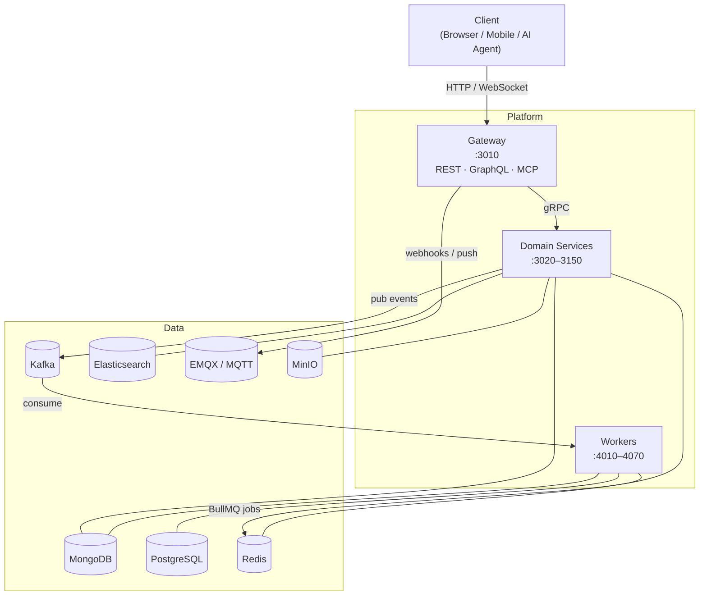
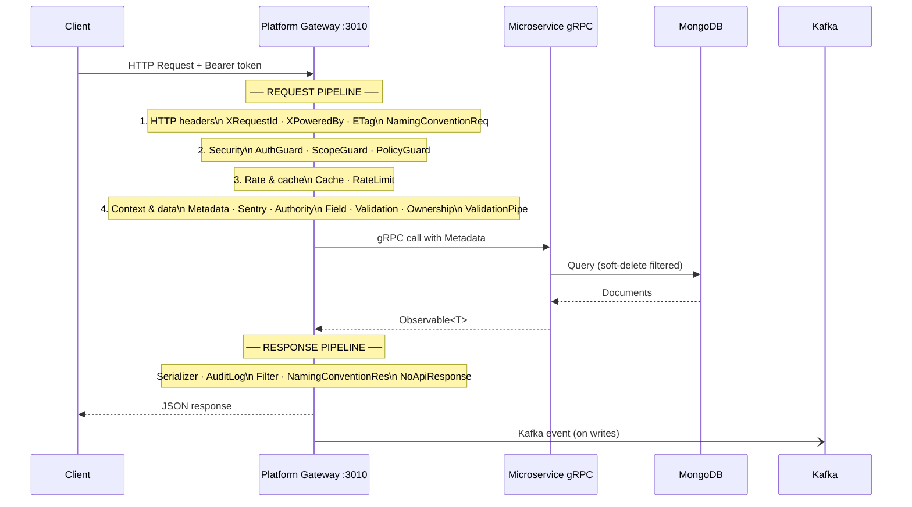
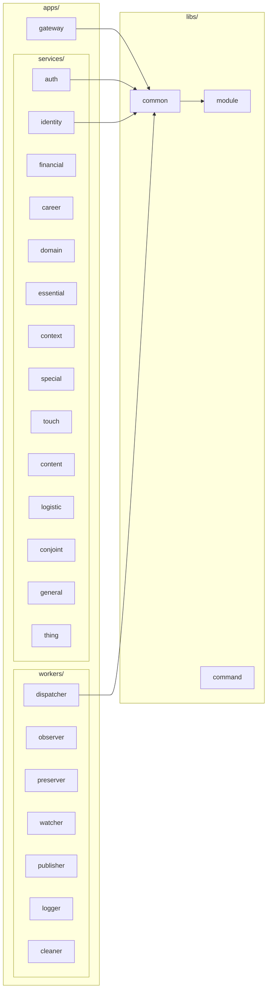
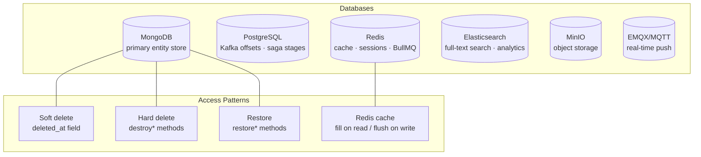
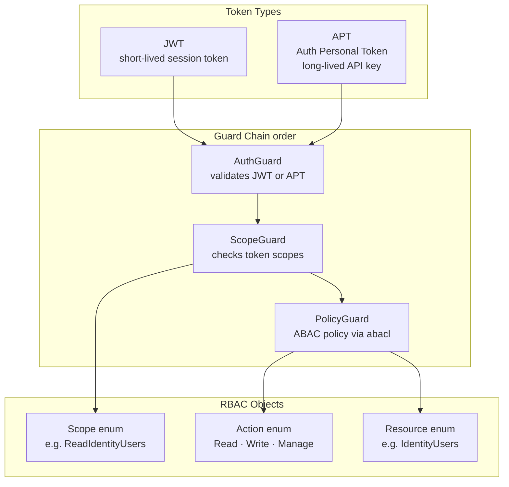
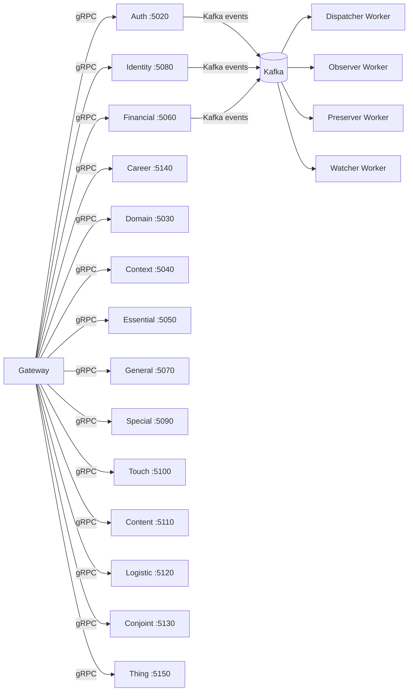

# Architecture

Wenex Platform is a distributed monorepo: one API gateway routes all external traffic to 15 domain microservices via gRPC. Workers consume events from Kafka and coordinate via BullMQ. All components share a common library (`libs/common`) for DTOs, guards, interceptors, and schemas.

---

## System Context



---

## Request Flow

A standard REST request traverses a fixed 16-stage pipeline inside the Platform Gateway before reaching any microservice, then passes through a 5-stage response pipeline on the way back.



### Platform Gateway Pipeline Stages

#### Request side (in order)

| Group | Stages | Purpose |
| --- | --- | --- |
| **HTTP headers** | XRequestId, XPoweredBy, ETag, NamingConventionReq | Add trace ID, response headers, HTTP caching, convert snake_case → camelCase on input |
| **Security** | AuthGuard, ScopeGuard, PolicyGuard | Validate JWT/APT, check required scopes, evaluate ABAC policy |
| **Rate & cache** | Cache, RateLimit | Return cached response if fresh; enforce per-collection request limits |
| **Context & data** | Metadata, Sentry, Authority, Field, Validation, Ownership, ValidationPipe | Extract auth context, instrument errors, apply zone/ownership filter, strip disallowed fields, validate DTO shape, enforce ownership rules |

#### Response side (in order)

| Stage | Purpose |
| --- | --- |
| Serializer | Transform entity → response shape, hide secret fields, apply projection |
| AuditLog | Record write operations for the audit trail |
| Filter | Apply post-query field filtering |
| NamingConventionRes | Convert camelCase → snake_case on output |
| NoApiResponse | Suppress NestJS default wrapper when not needed |

### Client Gateway Pipeline Stages

Client applications that mirror the Platform pattern use a simpler pipeline:

| Stage | Purpose |
| --- | --- |
| AuthGuard | Validate the token |
| PolicyGuard | ABAC policy evaluation |
| Metadata Interceptor | Extract auth context |
| Sentry Interceptor | Error tracking |
| Validation Pipe | DTO validation |
| **→ Services** | Business logic |
| Serializer | Output transformation |

---

## Monorepo Structure



---

## Gateway Internals

The gateway is the sole entry point for external traffic. It hosts three protocol surfaces simultaneously:

```mermaid
graph TB
    subgraph gw["Gateway :3010"]
        REST["REST<br/>/api  /auth  /identity  …"]
        GQL["GraphQL<br/>/graphql"]
        MCP["MCP Tools<br/>/mcp"]

        subgraph Middleware Pipeline
            XID[XRequestIdInterceptor]
            ETag[ETagInterceptor]
            NC[NamingConventionInterceptor]
            HELM[Helmet Security Headers]
        end

        subgraph Guards
            AG[AuthGuard]
            SG[ScopeGuard]
            PG[PolicyGuard]
        end
    end

    REST --> Middleware Pipeline --> Guards
    GQL --> Middleware Pipeline --> Guards
    MCP --> Guards
```

---

## Service Architecture

Every domain service follows an identical internal structure:

```mermaid
graph LR
    subgraph svc["Service — e.g. identity :3080/:5080"]
        MAIN[main.ts<br/>REST + gRPC bootstrap]
        MOD[app.module.ts<br/>DB config + imports]
        subgraph Feature Module users
            CTRL[controller.ts<br/>REST endpoints]
            REPO[repository.ts<br/>Typegoose queries]
            SCH[schema.ts<br/>Mongoose schema]
            DTO[dto/<br/>Create · Update DTOs]
            SER[serializer.ts<br/>Output transform]
        end
    end

    MAIN --> MOD --> Feature Module users
    CTRL --> REPO --> SCH
```

---

## Worker Architecture

Workers are event-driven: they consume Kafka topics and dispatch BullMQ jobs.

```mermaid
graph LR
    subgraph wrk["Worker — e.g. dispatcher :4010"]
        KAFKA[Kafka Consumer<br/>event topics]
        PROC[app.processor.ts<br/>BullMQ @Process]
        TASK[app.task.ts<br/>@Cron scheduled]
        SVC[app.service.ts<br/>business logic]
        PGSQL[(PostgreSQL<br/>saga tracking)]
        REDIS[(Redis<br/>BullMQ queue)]
    end

    KAFKA --> PROC
    PROC --> SVC
    TASK --> SVC
    SVC --> PGSQL
    PROC --> REDIS
```

---

## Data Layer



### Soft Delete vs Hard Delete

All entities in MongoDB use soft-delete by default. The `deleted_at` timestamp is set instead of removing the document. Three lifecycle operations exist:

| Operation | HTTP | Effect |
|---|---|---|
| `deleteOne` / `deleteById` | `DELETE /:id` | Sets `deleted_at` — document hidden from queries |
| `restoreOne` / `restoreById` | `PUT /:id/restore` | Clears `deleted_at` — document visible again |
| `destroyOne` / `destroyById` | `DELETE /:id/destroy` | Permanently removes document from MongoDB |

Hard delete (`destroy`) requires `Manage` scope, not just `Write`.

---

## Authentication & Authorization Architecture



---

## Metadata — The Auth Context Object

Every service method receives a `Metadata` object extracted from the request headers and JWT payload. It propagates through every gRPC call:

| Field | Source | Purpose |
|---|---|---|
| `token` | JWT payload | Decoded token claims |
| `domain` | `x-domain` header or token | Tenant / domain scoping |
| `client` | `x-client-id` header or token | OAuth client context |
| `user` | token `sub` | Authenticated user ID |

---

## Communication Topology



---

## Key Design Principles

1. **Observable-first**: All service methods return `Observable<T>` (RxJS), never Promises. Controllers and resolvers subscribe; gRPC streams are bridged automatically.

2. **Metadata is pervasive**: Every operation carries auth context, enabling ownership checks, soft-delete filtering, and audit logging without manual threading.

3. **Consistent CRUD surface**: All 15 services expose the same 14 operations (`count`, `create`, `createBulk`, `find`, `cursor`, `findOne`, `findById`, `updateOne`, `updateBulk`, `updateById`, `deleteOne`, `deleteById`, `restoreOne`, `destroyOne`). There are no service-specific exceptions.

4. **Three-layer authorization**: AuthGuard (token validity) → ScopeGuard (required scopes) → PolicyGuard (ABAC rules). A request must pass all three.

5. **Cache coherence**: Read operations use `@Cache(COLL_PATH, 'fill')` to populate Redis cache. Write operations use `@Cache(COLL_PATH, 'flush')` to invalidate it.
