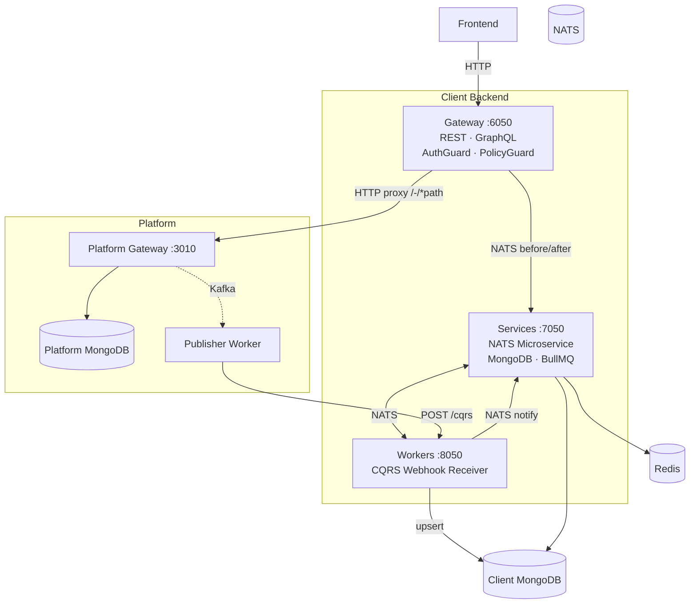
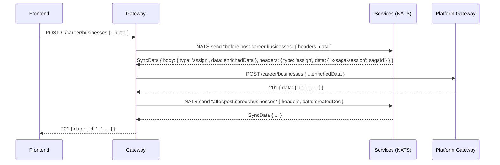
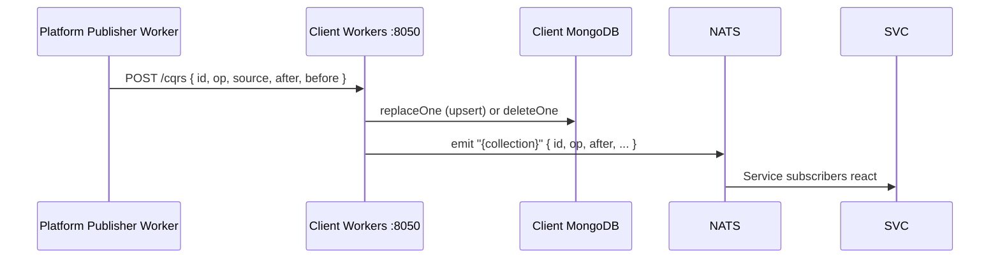

# Client Development Guide

This guide covers building a **Client** — an independent application that integrates with the Wenex Platform. It describes the canonical architecture, the official NestJS backend template, all key patterns, and best practices.

If you are new to the ecosystem model, read [Ecosystem & ABAC Model](./ecosystem.md) first.

---

## What Is a Client?

A Client is an OAuth-registered application that:

1. Writes and reads data through the Platform Gateway (`PLATFORM_URL`)
2. Receives Platform change events via HTTP POST webhooks (CQRS push)
3. Maintains a local MongoDB copy of its data for low-latency reads, custom indexing, and aggregation
4. Implements its own business logic — the Platform enforces only data shape and ABAC rules

---

## Official Backend Template

The canonical starting point is the **[backend-template](https://github.com/wenex-org/backend-template)** — a NestJS monorepo with a gateway, a services layer, and a workers layer that wires all of these concerns together out of the box.

### Clone and Install

```bash
git clone https://github.com/wenex-org/backend-template.git my-client
cd my-client
cp .env.example .env
pnpm install --frozen-lockfile
```

---

## Repository Structure

```
backend-template/
├── apps/
│   ├── gateway/          # REST + GraphQL entry point (:6050)
│   ├── services/         # Business logic + NATS microservice (:7050)
│   └── workers/          # CQRS webhook receiver (:8050)
├── libs/
│   ├── common/           # Shared DTOs, guards, interceptors, hooks
│   └── command/          # CLI seed / sync / raise scripts
├── assets/               # Static assets (logos, email images)
├── docker/               # Infrastructure docker-compose files
├── docker-compose.yml    # Application containers
├── .env.example          # Environment variable template
└── nest-cli.json         # NestJS monorepo config
```

---

## Architecture Overview



### Request Flow

A standard REST write from a user traverses this path:



### CQRS Push Flow

After every Platform write, the data flows back to the client:



---

## App: Gateway

**Port:** `6050` (configurable via `GATEWAY_API_PORT`)

The gateway is the sole public entry point. It does not contain business logic — it authenticates requests, optionally transforms them via service hooks, and forwards them to either the Platform or custom service endpoints.

### Key Files

```
apps/gateway/src/
├── main.ts               # Bootstrap: helmet, queryParser, Swagger, XRequestId
├── app.module.ts         # Imports: NATS, Redis, Altcha, Sentry, Prometheus, SdkModule, HealthModule
├── modules/
│   └── proxy/
│       ├── proxy.controller.ts   # @All('-/*path') — Platform passthrough
│       └── proxy.service.ts      # before/after NATS sync + axios forwarding
└── customs/
    └── request/
        └── submodules/
            ├── collaborations/   # NatsController for custom resource
            └── reservations/     # NatsController for custom resource
```

### Platform Proxy

Every route matching `/-/*path` is forwarded to the Platform. The `-` prefix strips to the real path before forwarding:

```
Client: POST /- /career/businesses
         ↓ strips -
Platform: POST /career/businesses
```

Before forwarding, the gateway sends a `before.{method}.{service}.{resource}` NATS message to the services app. After receiving the Platform response, it sends `after.{method}.{service}.{resource}`. Both allow the service layer to inject headers, modify the body, or short-circuit the response entirely.

### Custom Resource Controllers

For collections that exist only in the client (not in the Platform), the gateway exposes a `NatsController` subclass:

```typescript
const PATH = ['request', 'collaborations'];

@Controller(PATH.join('/'))
@UseGuards(AuthGuard, PolicyGuard)
@UseInterceptors(MetadataInterceptor, new SentryInterceptor())
export class CollaborationsController extends NatsController<Collaboration, CollaborationDto> {
  constructor(@Inject(NATS_GATEWAY) readonly client: ClientProxy) {
    super(PATH.join('.'), client, CollaborationSerializer);
  }

  @Get('count')
  @SetPolicy('read', 'request:collaborations')
  count(@Meta('headers') headers: Headers, @Filter() filter: QueryFilterDto<Collaboration>) {
    return super.count(headers, filter);
  }
  // ... standard CRUD methods
}
```

`NatsController` maps each REST endpoint to a NATS message pattern:
`GET count` → `get.request.collaborations.count`, `POST` → `post.request.collaborations`, etc.

### Guard & Interceptor Stack

| Layer | Component | Purpose |
| --- | --- | --- |
| Guard | `AuthGuard` | Validates JWT / APT with Platform |
| Guard | `PolicyGuard` | ABAC policy check via Platform `auth/can` |
| Interceptor | `MetadataInterceptor` | Extracts `headers`, `params`, `token` into `req.meta` |
| Interceptor | `SentryInterceptor` | Error tracking |
| Interceptor | `XRequestIdInterceptor` | Injects trace ID |

---

## App: Services

**Port:** `7050` REST + NATS microservice (same process)

The services app is the business logic layer. It runs as both an HTTP server and a NATS microservice listener simultaneously.

### Key Files

```
apps/services/src/
├── main.ts               # Bootstrap: REST + NATS microservice
├── app.module.ts         # Imports: NATS, Redis, Mongo, BullMQ, Altcha, SdkModule, HealthModule
├── modules/              # Platform-mirrored modules
│   ├── auth/             # Auth hooks (token injection, registration, OTP)
│   ├── identity/         # Identity profiles after-create triggers
│   ├── career/           # Business/branch/employee before-create enrichment
│   ├── logistic/         # Location resolution hooks
│   ├── general/          # Workflow management
│   └── touch/            # Email/notification dispatch
└── customs/              # App-specific resources
    └── request/
        └── submodules/
            ├── collaborations/   # NATS controller + service + repository
            └── reservations/     # NATS controller + service + repository + processor
```

### Two Types of Modules

#### Platform-Mirrored Modules (`modules/`)

These intercept requests to Platform-managed collections via NATS hooks. They do **not** own a MongoDB collection — they call the Platform SDK and add business logic around it.

```
modules/{service}/
├── {service}.module.ts
├── {service}.controller.ts      # REST (optional, for /api exposure)
├── {service}.inspector.ts       # NATS @MessagePattern for before.* hooks
└── submodules/
    └── {collection}/
        ├── {collection}.module.ts
        ├── {collection}.controller.ts   # Optional REST
        └── {collection}.service.ts      # Business logic
```

**Inspector** — the hook handler that intercepts the gateway's `before.*` NATS messages:

```typescript
@Controller()
@UseGuards(AuthGuard)
export class AuthInspector {
  @MessagePattern('before.post.auth.verify')
  verify(@Payload('data') data: ConfirmationDto, @Payload('headers') headers?: Headers): Observable<SyncData> {
    return from(this.service.confirmation(data, headers)).pipe(mapTo('end'));
  }
}
```

Returning `{ end: result }` short-circuits the Platform call and returns `result` directly to the gateway.

#### Custom Resource Modules (`customs/`)

These own a MongoDB collection and follow the standard CRUD pattern internally via NATS message patterns.

```
customs/{group}/submodules/{collection}/
├── {collection}.module.ts
├── {collection}.controller.ts   # @MessagePattern handlers
├── {collection}.service.ts      # Business logic + hooks
├── {collection}.repository.ts   # Typegoose MongoDB queries
├── {collection}.processor.ts    # BullMQ @Process (optional)
└── {collection}.constant.ts     # Queue names, job names
```

---

## App: Workers

**Port:** `8050`

Workers receive CQRS webhook payloads from the Platform's `publisher` worker, store them into the client's MongoDB, and notify subscribers via NATS.

### Key Files

```
apps/workers/src/
├── main.ts               # Bootstrap: HTTP server only (no NATS server here)
├── app.module.ts         # Imports: NATS client, Mongo, Sentry, Prometheus, HealthModule
└── modules/
    └── cqrs/
        ├── cqrs.controller.ts  # POST /cqrs
        ├── cqrs.service.ts     # MongoDB upsert + NATS notify
        └── cqrs.module.ts
```

### Webhook Endpoint

```typescript
@Post('cqrs')
async cqrs(@Body() payload: CqrsPayloadDto) {
  // Guards verify CLIENT_AUTHORIZATION_CQRS header
  return this.service.cqrs(payload);
}
```

### CqrsPayload

```typescript
interface CqrsPayload<T = Core> {
  id: string;       // document MongoId
  ts_ms: number;    // timestamp ms
  op: 'c' | 'u' | 'd' | 'r';  // create, update, delete, restore
  topic: string;    // "{db}.{collection}"
  source: {
    name: string;
    db: string;     // Platform database name (e.g., "platform-identity")
    collection: Coll;
  };
  after?: T;        // document state after operation (absent on delete)
  before?: T;       // document state before operation (absent on create)
}
```

### Storage & Notification

For every incoming event, the worker:

1. Resolves the MongoDB collection name from `source.db` + `source.collection`
2. If `after` is present → `replaceOne({ _id }, fixIn(after), { upsert: true })`
3. If `after` is absent (delete) → `deleteOne({ _id })`
4. Emits NATS message on topic `{collection}` so subscribing services can react

---

## Key Patterns

### Proxy Hook: `SyncData`

The `before.*` and `after.*` NATS messages must return a `SyncData` object that tells the gateway how to mutate the in-flight request or response:

```typescript
type SyncType = 'none' | 'assign' | 'replace';

type SyncData<T = any> = {
  end?:     T;                                           // short-circuit, return this directly
  body?:    { type: SyncType; data: T };                 // merge into req.body / res.body
  query?:   { type: SyncType; data: T };                 // merge into req.query
  headers?: { type: SyncType; data: Record<string, any> }; // merge into headers
};
```

**`assign`** deep-merges; **`replace`** overwrites; **`none`** does nothing; **`end`** bypasses the Platform call entirely.

**Example — inject token parameters before a Platform auth call:**

```typescript
async token(data: AuthenticationRequest): Promise<SyncData> {
  data.strict = true;
  data.client_id = CLIENT_ID;
  data.client_secret = CLIENT_SECRET;
  data.coworkers = COWORKERS;        // inject coworker list into token

  return { body: { type: 'assign', data } };
}
```

**Example — short-circuit with final response:**

```typescript
async confirm(data: ConfirmDto): Promise<SyncData> {
  const result = await this.service.verify(data);
  return { end: { result } };         // gateway returns { result } immediately
}
```

### NATS Message Pattern Naming

All NATS message patterns follow a consistent convention:

```
{http_method}.{service}.{resource}[.?][.{operation}]
```

| Pattern | HTTP Equivalent |
| --- | --- |
| `get.request.collaborations.count` | `GET /request/collaborations/count` |
| `post.request.collaborations` | `POST /request/collaborations` |
| `post.request.collaborations.bulk` | `POST /request/collaborations/bulk` |
| `get.request.collaborations` | `GET /request/collaborations` |
| `get.request.collaborations.?` | `GET /request/collaborations/:id` |
| `patch.request.collaborations.?` | `PATCH /request/collaborations/:id` |
| `patch.request.collaborations.bulk` | `PATCH /request/collaborations/bulk` |
| `delete.request.collaborations.?` | `DELETE /request/collaborations/:id` |
| `put.request.collaborations.?.restore` | `PUT /request/collaborations/:id/restore` |
| `delete.request.collaborations.?.destroy` | `DELETE /request/collaborations/:id/destroy` |
| `before.post.career.businesses` | Before gateway forwards POST to Platform |
| `after.post.career.businesses` | After Platform returns response |

### Lifecycle Hooks

Custom resource services implement typed lifecycle hook interfaces:

```typescript
interface OnBeforeCreate<T, Options> {
  onBeforeCreate(items: T[], options?: Options): void | Promise<void>;
}
interface OnAfterCreate<T, Options> {
  onAfterCreate(result: Serializer<T>[], options?: Options): void | Promise<void>;
}
interface OnBeforeUpdate<T, Options> {
  onBeforeUpdate(data: Optional<T>, filter: FilterOne<T>, options?: Options): Promise<Serializer<T>>;
}
interface OnAfterUpdate<T, Options> {
  onAfterUpdate(result: Serializer<T>, options?: Options): void | Promise<void>;
}
// also: OnBeforeDelete, OnAfterDelete, OnBeforeDestroy, OnAfterDestroy, OnBeforeRestore, OnAfterRestore
```

The base `Service` class from `@app/common/core/classes/mongo` calls these hooks automatically around each CRUD operation.

**Example — enqueue a BullMQ job after create:**

```typescript
async onAfterCreate(result: Serializer<Reservation>[], { headers } = {}) {
  const jobs = result.map((body) => ({
    name: RESERVATION_JOB,
    data: { body, headers },
    opts: { jobId: body.job },
  }));
  await this.queue.addBulk(jobs);
}
```

### Platform SDK Usage

All Platform API calls go through `SdkService`, which wraps `@wenex/sdk` configured with `PLATFORM_URL` and `API_KEY`:

```typescript
@Injectable()
export class ProfilesService {
  constructor(private readonly sdk: SdkService) {}

  async afterCreate(data: Serializer<Profile>, { headers }: ServiceOptions) {
    // Read from Platform
    const profile = await this.sdk.client.identity.profiles.findById(data.id!, clientConfig(headers));

    // Write to Platform
    await this.sdk.client.identity.users.updateById(user.id, { subjects }, clientConfig(headers));

    // Cross-service writes
    await this.sdk.client.financial.accounts.create({ owner, type, ownership }, clientConfig(headers));
  }
}
```

**`clientConfig(headers)`** — builds the request config forwarding authentication headers from the original request so writes are attributed to the correct user.

**`userConfig(headers)`** — similar but injects the root user context for system-level operations.

### Saga Transactions

For operations that span multiple Platform services, wrap them in a saga:

```typescript
async beforeCreate(data: BusinessDto, { headers }: ServiceOptions): Promise<SyncData> {
  // 1. Start saga
  const saga = await this.sdk.client.essential.sagas.start({ ttl: DEFAULT_SAGA_TTL }, clientConfig(headers));

  // 2. Do cross-service operations — pass saga session in header
  const location = await this.sdk.client.logistic.locations.create(
    locationData,
    userConfig({ ...headers, 'x-saga-session': saga.id }),
  );

  data.location = location.id;

  // 3. Return saga ID in response headers for the after-hook to commit
  return {
    body:    { type: 'assign', data },
    headers: { type: 'assign', data: { 'x-saga-session': saga.id } },
  };
}

async afterCreate({ headers }: ServiceOptions): Promise<void> {
  // 4. Commit saga — Platform marks all staged writes as final
  await this.sdk.client.essential.sagas.commit(get('x-saga-session', headers)!, clientConfig(headers));
}
```

If the after-hook is never called (e.g., the request fails), the Platform's `watcher` worker triggers compensation after the saga TTL expires.

### BullMQ Jobs

Custom async processing (timeouts, delayed tasks) uses BullMQ backed by Redis:

```typescript
// In service constructor
constructor(
  readonly repository: ReservationsRepository,
  @InjectQueue(RESERVATION_QUEUE) private readonly queue: Queue<QueueJob<Reservation>>,
) {}

// Schedule a job when a reservation is created
async onAfterCreate(result: Serializer<Reservation>[]) {
  const jobs = result.map((body) => ({
    name: RESERVATION_JOB,
    data: { body },
    opts: { jobId: body.job },   // deterministic job ID for deduplication
  }));
  await this.queue.addBulk(jobs);
}
```

```typescript
// In processor
@Processor(RESERVATION_QUEUE)
export class ReservationsProcessor {
  @Process(RESERVATION_JOB)
  async process(job: Job<QueueJob<Reservation>>) {
    // handle timeout / expiry logic
  }
}
```

---

## Authentication Design

The services app implements the full user-facing authentication flow by wrapping Platform auth endpoints with additional logic:

| Endpoint | Pattern | What the client adds |
| --- | --- | --- |
| `POST /auth/token` | before hook | Injects `client_id`, `client_secret`, `coworkers`, `strict` |
| `POST /auth/register` | before hook + after | Validates captcha, sends verification email |
| `POST /auth/otp` | before hook | Validates captcha, resolves user secret |
| `POST /auth/verify` | before hook | Confirms OTP, activates user |
| `POST /auth/repass` | before hook | Forgot/reset password with captcha |
| `POST /auth/oauth` | before hook | Google/social OAuth |

**Altcha CAPTCHA** — all public auth endpoints require a valid Altcha proof-of-work token in the request body as `captcha`. The `AltchaService` validates it server-side using `ALTCHA_HMAC_KEY`.

**Strict tokens** — when `STRICT_TOKEN=true`, the token endpoint enforces that the user already exists in the Platform before issuing a JWT. Disable only for development.

**Policy enforcement** — protected endpoints use `@SetPolicy(action, resource)`:

```typescript
@SetPolicy('read', 'request:collaborations')
find(...) { ... }
```

This maps to a Platform ABAC check: the authenticated user must have `read` permission on the `request:collaborations` resource as configured in the RBAC rules in `context/configs`.

---

## CQRS Webhook Security

The Platform publisher sends a plain HTTP POST to `/cqrs`. Secure it with a shared secret:

```bash
# .env
CLIENT_AUTHORIZATION_CQRS=Bearer my-secret-shared-key
```

The `AuthGuard` in the workers app checks that the incoming `Authorization` header equals `CLIENT_AUTHORIZATION_CQRS`. Register the same value as `value.authorization` in the `context/configs` CQRS entry on the Platform side (if supported by the publisher version in use).

---

## Environment Variables

| Variable | Purpose | Example |
| --- | --- | --- |
| `PLATFORM_URL` | Platform Gateway base URL | `http://localhost:3010` |
| `API_KEY` | Service-to-service API key for Platform calls | `20GBCseZe...` |
| `CLIENT_ID` | OAuth client MongoId registered in `/domain/clients` | `6804c24f...` |
| `CLIENT_SECRET` | OAuth client secret | `9a38b699...` |
| `APP_ID` | OAuth app MongoId registered in `/domain/apps` | `6804c32b...` |
| `CID` | Same as `CLIENT_ID` — used in seeding scripts | `6804c24f...` |
| `UID` | Root user MongoId — used in seeding scripts | `680621e8...` |
| `COWORKERS` | Comma-separated coworker client IDs | `id1,id2` |
| `STRICT_TOKEN` | Reject tokens for unregistered users | `true` |
| `ROOT_DOMAIN` | Tenant domain for RBAC rules | `example.com` |
| `ROOT_SUBJECT` | Root user email | `root@example.com` |
| `CLIENT_BASE_URL` | Frontend origin (for CORS, email links) | `http://localhost:3005` |
| `CLIENT_ASSETS_URL` | CDN / asset server URL | `http://localhost:8088` |
| `CLIENT_AUTHORIZATION_CQRS` | Shared secret for `/cqrs` endpoint auth | `Bearer secret` |
| `GRAPHQL_MUTATION_SUPPORT` | Allow GraphQL mutations through proxy | `false` |
| `NATS_SERVERS` | NATS connection string(s) | `nats://localhost:4222` |
| `REDIS_HOST` / `REDIS_PORT` | Redis for caching + BullMQ | `localhost:6379` |
| `MONGO_HOST` / `MONGO_DB` | MongoDB connection | `localhost:27017` / `client` |
| `ALTCHA_HMAC_KEY` | Altcha captcha HMAC secret | `176708d4...` |
| `SENTRY_DSN` | Sentry error tracking DSN | (optional) |
| `OTLP_HOST` / `OTLP_PORT` | OpenTelemetry collector | `localhost:4318` |
| `ELASTIC_APM_SERVICE_NAME` | Elastic APM service name (production only) | `my-client` |

### Port Configuration

Each app listens on a port derived from environment variables. Default ports:

| App | Default Port | Variable |
| --- | --- | --- |
| Gateway | 6050 | `GATEWAY_API_PORT` |
| Services | 7050 | `SERVICES_API_PORT` |
| Workers | 8050 | `WORKERS_API_PORT` |

---

## Seeding & Initialization (`libs/command/`)

The `libs/command/` library provides CLI scripts to initialize the client's data on the Platform. Run these once at deployment time (or after `platform:clean`).

### Structure

```
libs/command/src/platform/
├── auth/resources/
│   ├── seeds/grants.seed.ts    # OAuth permission grants
│   └── syncs/grants.sync.ts   # Update existing grants
├── context/resources/
│   ├── seeds/configs.seed.ts  # RBAC config, validation schemas, CQRS webhook
│   └── syncs/configs.sync.ts
├── identity/resources/seeds/  # Initial users
├── career/resources/
│   ├── seeds/                 # Initial business/branch/employee data
│   └── mocks/                 # Development mock data
└── ...
```

### Commands

```bash
npm run platform:seed    # Create initial Platform records (runs once)
npm run platform:sync    # Update existing Platform records
npm run platform:raise   # Raise (upsert) records with override
npm run platform:clean   # Remove all seeded records
npm run platform:mock    # Insert development mock data
```

### RBAC Configuration (`configs.seed.ts`)

The most important seed is the RBAC config in `context/configs`. It defines roles, permissions, and grants for the client's domain:

```typescript
const configs: ConfigDto[] = [
  {
    eid: CID,                   // client MongoId
    key: ConfigKey.RBAC,        // 'RBAC'
    value: [
      {
        domain: ROOT_DOMAIN,    // 'example.com'
        roles: {
          user: ['file_special_manage', 'user_identity_manage', ...],
          guest: ['view_financial_currencies', ...],
          business: ['business_career_manage', ...],
        },
        permissions: {
          file_special_manage: ['upload_special_files', 'read_own_special_files', ...],
          business_career_manage: ['create_own_career_businesses', 'update_own_career_businesses', ...],
          // ... permission → grant expansion
        },
      },
    ],
  },
];
```

Also register the CQRS webhook here (or separately):

```typescript
{
  eid: CID,
  key: ConfigKey.CQRS,
  value: { webhook: `${process.env.CLIENT_BASE_URL}/cqrs` },
}
```

---

## Docker & Deployment

### Running Infrastructure

```bash
docker-compose -f docker/docker-compose.yml up -d        # MongoDB + Redis
docker-compose -f docker/docker-compose.nat.yml up -d    # NATS
docker-compose -f docker/docker-compose.otlp.yml up -d  # OpenTelemetry (optional)
```

### Running Application

```bash
# Build image
docker build -t wenex/backend-template:latest .

# Start all three apps
docker-compose --profile client up -d

# Or individually
docker-compose --profile gateway up -d
docker-compose --profile services up -d
docker-compose --profile workers up -d
```

### Seed Platform data

```bash
docker-compose --profile platform-seed up
```

### Health Checks

Each app exposes:

| Path | Purpose |
| --- | --- |
| `/status` | Health check (MongoDB, Redis, NATS, Platform) |
| `/metrics` | Prometheus metrics |
| `/api` | Swagger UI |
| `/api-json` | OpenAPI JSON spec |
| `/bullmq` | BullMQ dashboard (services only) |
| `/graphql` | GraphQL playground (gateway, if enabled) |

---

## Best Practices

1. **Register with minimum scopes.** Set `API_KEY` scopes to exactly what the client reads and writes. Overly broad scopes expose data you don't own.

2. **Always use `clientConfig(headers)` for Platform writes.** This propagates the user's JWT so ownership (`owner`, `clients[]`) is injected correctly. Using the root API key directly will attribute documents to the service account, not the user.

3. **Short-circuit in before hooks with `{ end: result }`.** If your hook produces a final answer (e.g., confirming a captcha), return `{ end: result }` to avoid an unnecessary Platform round-trip.

4. **Use sagas for cross-service writes.** Whenever `beforeCreate` creates a record in a secondary Platform service (e.g., creating a location for a business), start a saga. This ensures partial writes are compensated automatically if the primary create fails.

5. **Seed RBAC before registering users.** The RBAC config in `context/configs` must exist before any user can log in. Run `platform:seed` as part of your deployment pipeline before starting the gateway.

6. **Inject `COWORKERS` at token time.** The services `before.post.auth.token` hook must set `data.coworkers = COWORKERS` so that issued tokens include the coworker list. Without this, zone filtering with `zone=client` will not return coworker-owned documents.

7. **Use deterministic BullMQ job IDs.** Set `opts: { jobId: doc.job }` where `doc.job` is a UUID stored on the document. This prevents duplicate jobs if the same event is processed twice (e.g., on NATS redelivery).

8. **Keep `modules/` thin.** Platform-mirrored modules should contain only the business logic that must run alongside Platform operations (hooks, enrichment, side-effects). Complex query logic belongs in `customs/` with a dedicated MongoDB collection.

9. **Do not store sensitive fields from the Platform.** The CQRS worker stores documents verbatim from Platform payloads. Ensure fields like `secret`, `password`, or `token` are excluded in serializers before leaving the Platform Gateway so they never appear in CQRS payloads.

10. **Set `CLIENT_AUTHORIZATION_CQRS` in production.** Without it, anyone can POST to `/cqrs` and inject arbitrary documents into your local MongoDB. Use a long random secret and rotate it by redeploying the workers app.
