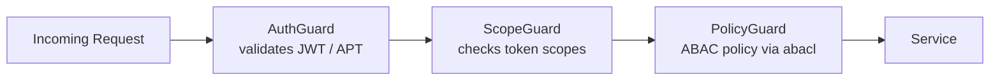

# ABAC

The Platform enforces access control through **Attribute-Based Access Control (ABAC)** — a model where read visibility is determined entirely by attributes on each document, not by roles or hardcoded rules.

---

## The Four Ownership Attributes

Every Platform document carries four fields that the ABAC model evaluates on every read:

| Field | Type | Controlled by | Meaning |
| --- | --- | --- | --- |
| `owner` | `string` (MongoId) | Platform (auto) | The user who created the document |
| `shares` | `string[]` (MongoIds) | Client | Other user IDs with explicit read access |
| `groups` | `string[]` (FQDN / email domain) | Client | All users whose email matches an entry here |
| `clients` | `string[]` (MongoIds) | Platform (auto) + Client | OAuth client applications with access |

---

## Zone Filtering

Clients activate ABAC filtering with the `?zone=` query parameter on any read request. A zone maps to a filter condition applied against the authenticated token:

| Zone | Filter applied |
| --- | --- |
| `own` | `owner` = authenticated user (`sub`) |
| `share` | authenticated user is in `shares[]` |
| `group` | user's email domain matches any entry in `groups[]` |
| `client` | token's `client_id` is in `clients[]` |

Zones are combinable with commas:

```
GET /content/notes?zone=own,share,client
```

This returns documents where the authenticated user is either the owner, explicitly shared, or the request comes from a client app listed in `clients[]`.

---

## Automatic Injection at Write Time

The Platform automatically injects ownership attributes when a document is created — the client does not need to supply them:

```
POST /content/notes
Authorization: Bearer <JWT>

{ "title": "My note" }
```

The Platform inserts:
- `owner` = `token.sub` (authenticated user)
- `clients[]` += `token.client_id` (the calling OAuth client)

A client may pass additional client IDs in `clients[]` at creation time to immediately share the document with coworkers or partner applications.

---

## Guard Chain

Every request passes through three guards in order before reaching the service layer:



| Guard | Responsibility |
| --- | --- |
| `AuthGuard` | Validates token signature and expiry |
| `ScopeGuard` | Checks required OAuth scopes declared on the endpoint |
| `PolicyGuard` | Evaluates ABAC policy — action + resource against RBAC config |

A request must pass all three guards. Failure at any stage returns `401` or `403` before any database query runs.

---

## Scopes and Actions

OAuth scopes on a token determine which operations a token is allowed to perform. Scopes are structured as:

```
{action}:{service}:{collection}
```

For example: `read:identity:users`, `write:content:notes`, `manage:auth:clients`.

The `PolicyGuard` maps these to three action levels:

| Action | Allowed operations |
| --- | --- |
| `Read` | `find`, `findOne`, `findById`, `count`, `cursor` |
| `Write` | `create`, `createBulk`, `updateOne`, `updateBulk`, `updateById`, `deleteOne`, `deleteById` |
| `Manage` | `restoreOne`, `destroyOne`, `destroyById` + all Write operations |

---

## Platform Philosophy

The Platform enforces **data shape and ABAC only** — no domain-specific business rules. Rules like "a user can only have one active wallet" or "invoices can only be paid once" belong in the Client application.

See [Core Schema](./core-schema) for the document fields that ABAC operates on, and [Coworkers Space](./coworkers) for how the `clients[]` field enables cross-application data sharing.
