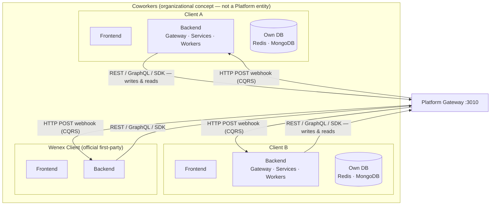
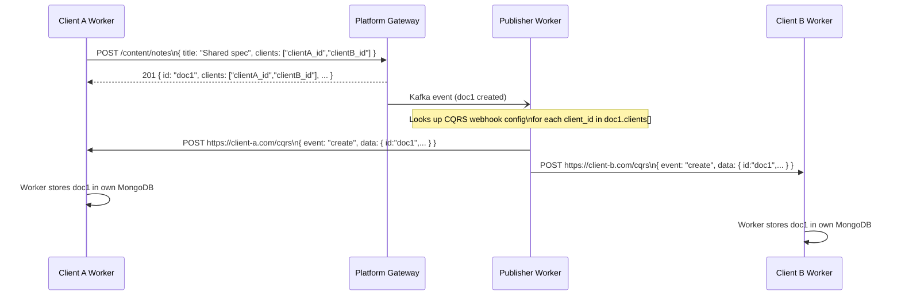
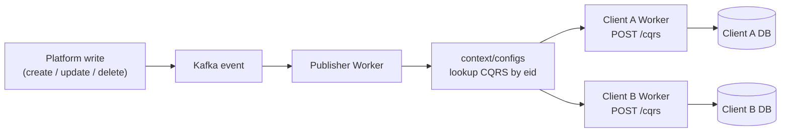
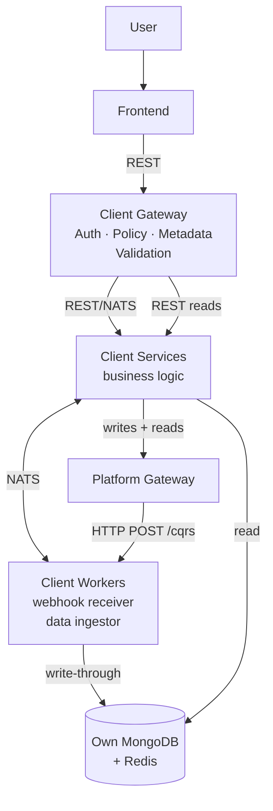
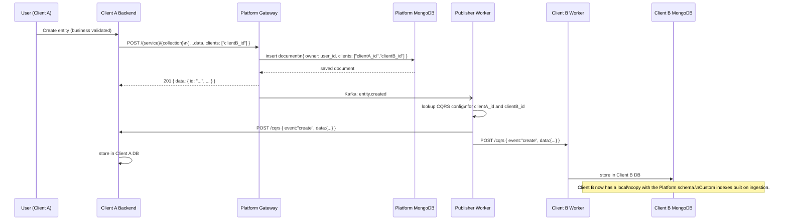

# Ecosystem & ABAC Model

This document explains the broader ecosystem the Wenex Platform operates within — how independent client applications coexist within a Coworkers space, share data through the Platform, and receive real-time change notifications via webhooks.

---

## The Big Picture



---

## Key Concepts

### Coworkers

A **Coworkers** space is an organizational concept — a company, team, or group of developers who collaborate and build multiple applications on top of the Platform. It is **not a standalone Platform entity**; it is expressed as:

1. A `coworkers` array on the **OAuth client registration** in `/domain/clients`
2. A `coworkers` claim in every **JWT token** issued to users of that client

### Client (Application)

A **Client** is an independent application registered with the Platform as an OAuth client in `/domain/clients`. Registration gives it:

- A `client_id` (MongoDB `_id` of the client document)
- A `coworkers[]` array listing the other client IDs that share its data space
- A CQRS webhook URL registered in `context/configs`

Each Client builds and owns its own full software stack (any framework). The recommended pattern, shown in the C4 diagrams, is a layered architecture:

```text
Frontend  →  Backend Gateway  →  Backend Services  →  Backend Workers
                                      ↕ NATS
                                  Own Redis · MongoDB
```

The Client's own databases are used for **caching, aggregation queries, custom indexing, and maintaining entity relations** — populated entirely by data pushed from the Platform.

### Wenex Client

The **Wenex Client** is the official first-party application built and maintained by the Wenex team. It operates as a normal Client with no special platform privileges.

---

## Identity: How a Client Is Known to the Platform

Every API call carries a JWT or APT token. The token contains three key claims for the ecosystem model:

```json
{
  "sub": "user_id",
  "client_id": "68fc7a456e8fa60ae29c3d02",
  "coworkers": ["68fc7a456e8fa60ae29c3d02", "71ab2b789f1ea71bf30d4e13"],
  "scope": "read:identity:users write:content:notes ...",
  "exp": 1748908800
}
```

| Claim | Meaning |
| --- | --- |
| `sub` | Authenticated user ID |
| `client_id` | The OAuth client (application) making the request |
| `coworkers` | All client IDs in this client's coworker space (including itself) |

The `coworkers` list in the token is sourced directly from the `coworkers` property of the client's `/domain/clients` record at token issuance time.

---

## The ABAC Model

The Platform enforces access control through **four ownership attributes** present on every document. These are the only mechanism — no role-based ACLs, no hardcoded business rules.

| Field | Type | Set by | Meaning |
| --- | --- | --- | --- |
| `owner` | `string` (MongoId) | Platform (auto) | The user who created the document |
| `shares` | `string[]` (MongoIds) | Client | Explicit user-level sharing list |
| `groups` | `string[]` (FQDN / email domain) | Client | Group-level access by email domain |
| `clients` | `string[]` (MongoIds) | Platform (auto) + Client | OAuth clients that can read this document |

### Automatic Injection at Write Time

When a document is created, the Platform automatically injects:

- The requesting user's ID into `owner`
- The requesting token's `client_id` into `clients[]`

The client may include additional client IDs in `clients[]` at creation time to grant immediate access to coworkers or other clients.

### Zone Filtering

The `zone` query parameter on read requests activates ABAC filtering:

| Zone | Filter applied |
| --- | --- |
| `own` | `owner` = authenticated user |
| `share` | authenticated user is in `shares[]` |
| `group` | user's email/domain matches any entry in `groups[]` |
| `client` | token's `client_id` is in `clients[]` |

Zones are combinable: `?zone=own,share,client`

---

## Cross-Client Data Sharing

Clients within the same Coworkers space share data **indirectly through the Platform** — never by direct communication. The mechanism is the `clients[]` field on each document.



**Rules:**

- Client A adds Client B's `client_id` to `clients[]` at creation (or via a PATCH update).
- The Platform's `publisher` worker reads `clients[]` after the write, finds the CQRS webhook config for each client in that array, and sends an HTTP POST to each.
- Both clients end up with an identical local copy of the document.
- Clients never call each other. All data exchange flows through the Platform.

---

## Webhook Delivery (CQRS Push)

### Registration

Each client registers its webhook endpoint in `context/configs` with a CQRS config entry:

```typescript
// A client registers once (e.g. at startup or via admin setup)
await platform.context.configs.create({
  key: 'CQRS',                              // ConfigKey.CQRS
  eid: '68fc7a456e8fa60ae29c3d02',          // this client's MongoDB id
  value: { webhook: 'http://localhost:8150/cqrs' },
});
```

| Field | Value |
| --- | --- |
| `key` | `"CQRS"` (fixed key, resolved from `ConfigKey.CQRS`) |
| `eid` | The client's own MongoDB `_id` (same as `client_id` in tokens) |
| `value.webhook` | The full URL of the client's CQRS endpoint |

### Delivery Flow



1. Any write operation on the Platform emits a Kafka event.
2. The `publisher` worker consumes the event and reads `clients[]` from the affected document.
3. For each `client_id` in `clients[]`, the publisher queries `context/configs` for `{ key: "CQRS", eid: client_id }`.
4. It sends an HTTP POST to `value.webhook` with the full event payload.
5. The client's own worker receives the POST and stores the data in its local MongoDB/Redis.

### Webhook Payload

The payload a client worker receives contains the event type and the full document (same shape as the Platform API response):

```json
{
  "event": "create",
  "data": {
    "id": "doc1",
    "title": "Shared spec",
    "owner": "user_id",
    "clients": ["clientA_id", "clientB_id"],
    "created_at": "2026-05-15T10:00:00.000Z",
    "..."
  }
}
```

Event types mirror the CRUD lifecycle: `create`, `update`, `delete` (soft), `restore`, `destroy` (hard).

---

## Client Internal Architecture

The Platform pushes data, but each client decides how to receive and use it. The recommended pattern from the C4 diagrams:



**Request pipeline (Client Gateway):**

| Stage | Purpose |
| --- | --- |
| Auth Guard | Validate JWT / APT token |
| Policy Guard | ABAC policy evaluation |
| Metadata Interceptor | Extract auth context |
| Sentry Interceptor | Error tracking |
| Validation Pipe | DTO validation |
| **→ Services** | Business logic |
| Serializer | Output transformation |

The client's pipeline is intentionally simpler than the Platform's — no ETag, no NamingConvention, no RateLimit, no Ownership interceptors, since those concerns are handled by the Platform for cross-client data.

**Worker responsibilities:**

| Task | Detail |
| --- | --- |
| Receive CQRS webhook | Accept HTTP POST from Platform publisher |
| Store document | Write to own MongoDB using the **same schema** as the Platform |
| Build indexes | Custom secondary indexes for the client's query patterns |
| Maintain relations | Denormalize or join related entities locally |
| Serve reads | Client services read local DB for low-latency queries |

> **Schema consistency:** Client workers store data using the same field names and structure as the Platform's MongoDB documents. This ensures that queries running against the local copy produce identical results to queries against the Platform.

---

## Platform Philosophy: Data Management, Not Business Logic

The Platform's responsibilities are strictly:

1. **Data shape** — enforce DTO validation
2. **ABAC** — enforce `owner`, `shares`, `groups`, `clients` access rules
3. **Lifecycle** — soft-delete, restore, hard-delete
4. **Events** — publish Kafka events → push webhooks to registered clients
5. **Observability** — logging, tracing, metrics

All domain-specific business rules live in Client apps:

| Rule | Responsible party |
| --- | --- |
| "A user can only have one active wallet" | Client app |
| "An invoice can only be paid once" | Client app |
| "Drivers must be verified before accepting cargo" | Client app |
| "Only premium users can create more than 5 products" | Client app |

> **Structural exceptions:** Auth enforces token signature and expiry mechanics. Financial has basic account state transitions. These are mechanical constraints, not domain rules.

---

## Full Data Lifecycle



---

## Summary Table

| Concept | Platform representation | Detail |
| --- | --- | --- |
| Coworkers space | Not a standalone entity | Expressed via `coworkers[]` in JWT + `domain/clients.coworkers` |
| Client identity | `domain/clients` record | Identified by `client_id` (`_id`) in tokens |
| Wenex Client | Normal OAuth client | Official first-party app, no special access |
| Data ownership | `owner` (auto) | Injected from `sub` claim |
| App-level scope | `clients[]` (auto) | Injected from `client_id` claim; additional IDs added explicitly |
| Cross-client share | Add partner `client_id` to `clients[]` | Explicit per-document opt-in |
| Group share | Add FQDN to `groups[]` | All users matching email domain, any client |
| Platform push | HTTP POST to `value.webhook` | Config: `key=CQRS, eid=client_id` in `context/configs` |
| Client local DB | Own MongoDB + Redis | Same schema as Platform; populated by webhook worker |
| Business logic | Client app only | Platform enforces shape + ABAC only |
