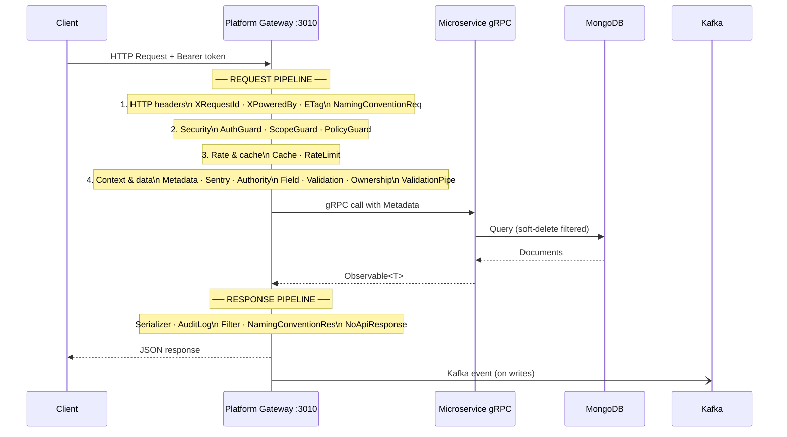
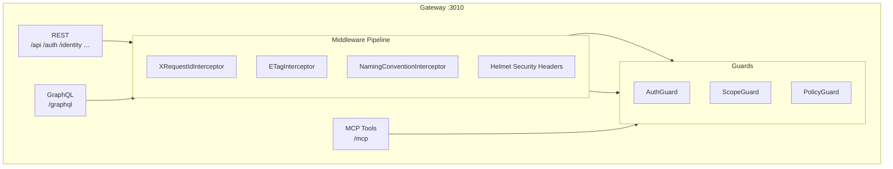

# Gateway

## Request Pipeline

A standard REST request traverses a fixed 16-stage pipeline inside the Platform Gateway before reaching any microservice, then passes through a 5-stage response pipeline on the way back.



### Request side (in order)

| Group | Stages | Purpose |
| --- | --- | --- |
| **HTTP headers** | XRequestId, XPoweredBy, ETag, NamingConventionReq | Add trace ID, response headers, HTTP caching; when `x-naming-convention` names another convention, convert the request body **to snake_case** (the platform's own) |
| **Security** | AuthGuard, ScopeGuard, PolicyGuard | Validate JWT/APT, check required scopes, evaluate ABAC policy |
| **Rate & cache** | Cache, RateLimit | Return cached response if fresh; enforce per-collection request limits |
| **Context & data** | Metadata, Sentry, Authority, Field, Validation, Ownership, ValidationPipe | Extract auth context, instrument errors, apply zone/ownership filter, strip disallowed fields, validate DTO shape, enforce ownership rules |

### Response side (in order)

| Stage | Purpose |
| --- | --- |
| Serializer | Transform entity → response shape, hide secret fields, apply projection |
| AuditLog | Record write operations for the audit trail |
| Filter | Apply post-query field filtering |
| NamingConventionRes | Convert the snake_case reply **to the convention the request asked for** (`x-naming-convention: camelCase`); unchanged otherwise |
| NoApiResponse | Suppress NestJS default wrapper when not needed |

## Gateway Internals

The gateway is the sole entry point for external traffic. It hosts three protocol surfaces simultaneously:



Once the gateway is running, it logs the following startup summary:

```text
Gateway Successfully Started On Port 3010
Swagger UI is running on: http://127.0.0.1:3010/api
Prometheus is running on: http://127.0.0.1:3010/metrics
Health check is running on: http://127.0.0.1:3010/status
OpenApi Spec is running on: http://127.0.0.1:3010/api-json
GraphQL playground is running on: http://127.0.0.1:3010/graphql
MCP streamable HTTP transport is running on: http://127.0.0.1:3010/mcp
```

## Health Check

The `/status` endpoint is the primary readiness signal. It verifies connectivity to Redis and confirms that every downstream gRPC provider is reachable:

```bash
curl http://127.0.0.1:3010/status
```

A fully healthy response:

```json
{
  "status": "ok",
  ...
}
```

Any entry with `"status": "down"` indicates that the corresponding service has not started or is unreachable from the gateway.

## Exposed Endpoints

| Endpoint | Purpose |
| --- | --- |
| `/status` | Readiness and dependency health check |
| `/api` | Swagger UI — interactive REST API explorer |
| `/api-json` | OpenAPI specification in JSON format — suitable for code generation and API client tooling |
| `/graphql` | GraphQL playground — schema introspection and query execution |
| `/mcp` | MCP streamable HTTP transport — entry point for AI agent tool calls |
| `/metrics` | Prometheus metrics — exposes request counts, latencies, and runtime statistics |
