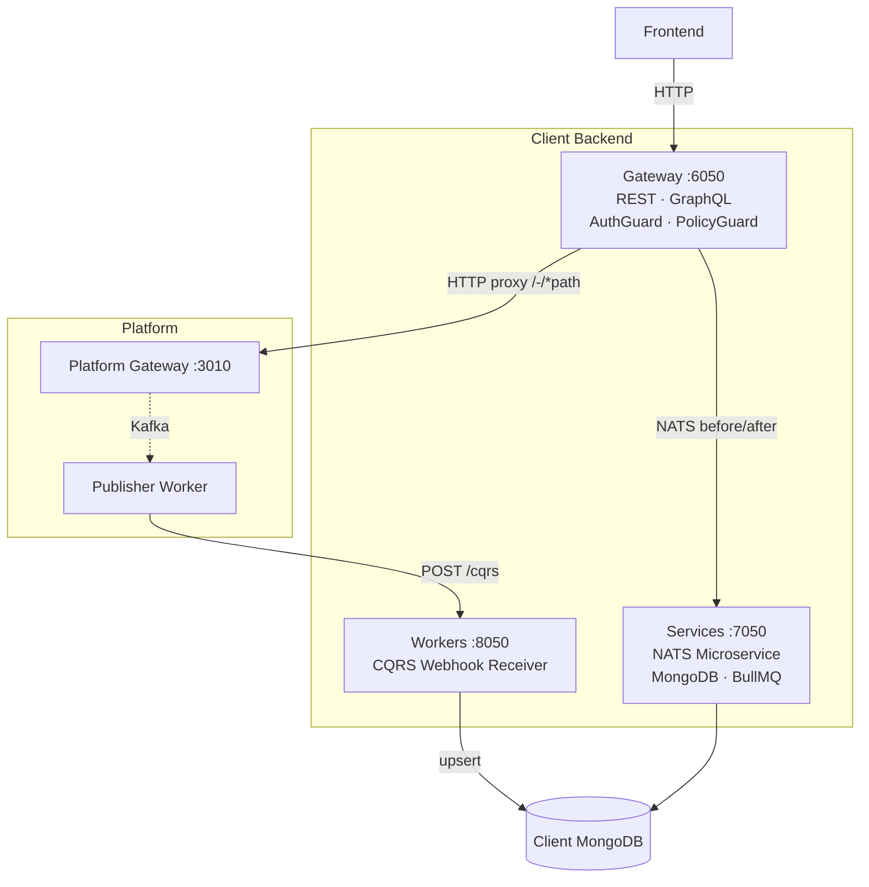

# Client

A **Client** is an OAuth-registered application that writes and reads data through the Platform Gateway, receives change events via CQRS webhooks, and maintains a local MongoDB copy of its data for low-latency reads and custom queries.

## Architecture

The official starting point is the **[backend-template](https://github.com/wenex-org/backend-template)** — a NestJS monorepo with three apps:

### Gateway (`:6050`)

The sole public entry point. It authenticates requests, sends `before.*` NATS messages to the services layer for enrichment, proxies the call to the Platform, then sends `after.*` messages for side-effects. Platform routes are served under `/-/*path`.

### Services (`:7050`)

The business logic layer — runs as both a REST server and a NATS microservice listener. Contains two types of modules:

- **Platform-mirrored modules** — intercept `before.*` / `after.*` hooks for Platform collections without owning any local MongoDB collection.
- **Custom resource modules** — own a MongoDB collection and serve CRUD through NATS message patterns for collections that exist only in the client.

### Workers (`:8050`)

Receive CQRS webhook payloads from the Platform's `publisher` worker, upsert documents into the client's MongoDB, and emit NATS notifications so subscribing services can react.

## Key Patterns

**Platform proxy hook** — every `before.*` or `after.*` NATS response returns a `SyncData` object that tells the gateway how to mutate the in-flight request or short-circuit the response entirely.

**Saga transactions** — cross-service writes are wrapped in a saga started via `essential/sagas`. If the primary operation fails, the Platform's `watcher` worker compensates staged writes automatically after the TTL expires.

**CQRS security** — the `/cqrs` endpoint is protected by a shared secret (`CLIENT_AUTHORIZATION_CQRS`). Register the same secret as `value.authorization` in the CQRS config entry on the Platform side.

For the full implementation guide — repository structure, module patterns, lifecycle hooks, SDK usage, BullMQ jobs, seeding, and deployment — see the [Client Development](../../client-development) reference page.
