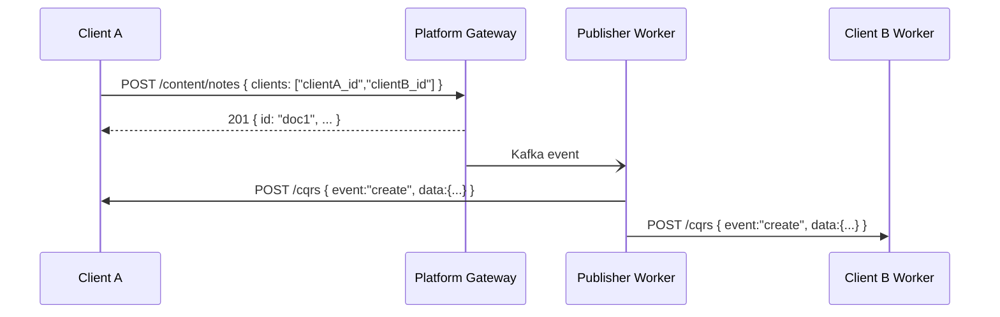

# Ecosystem

The Wenex ecosystem is the organizational model that lets multiple independent applications share a single Platform instance without direct coupling.

## Coworkers

A **Coworkers** space is a group of client applications that share a data space — a company, team, or set of products built by the same organization. It is not a standalone Platform entity; it is expressed as a `coworkers[]` array on each OAuth client registration and injected as a claim into every JWT token issued to users of that client.

## Client Identity

Every application registers with the Platform as an OAuth **Client** in `/domain/clients`. Registration produces a `client_id` that appears in all tokens and is automatically injected into the `clients[]` field of every document the application creates.

## ABAC Ownership

All Platform documents carry four ownership attributes:

| Field | Set by | Meaning |
| --- | --- | --- |
| `owner` | Platform (auto) | User who created the document |
| `shares` | Client | Explicit per-user sharing list |
| `groups` | Client | Group access by email domain |
| `clients` | Platform (auto) + Client | OAuth clients that can read the document |

Read requests use the `?zone=` parameter to activate ownership filtering (`own`, `share`, `group`, `client`). Zones are combinable.

## Data Sharing

Clients within the same Coworkers space share data through the Platform — never by calling each other. When a document is created with another client's ID in `clients[]`, the Platform's `publisher` worker pushes the event to that client's registered CQRS webhook endpoint.

For the full ABAC model, webhook delivery details, and cross-client data lifecycle, see the [Ecosystem & ABAC](../../ecosystem) reference page.
