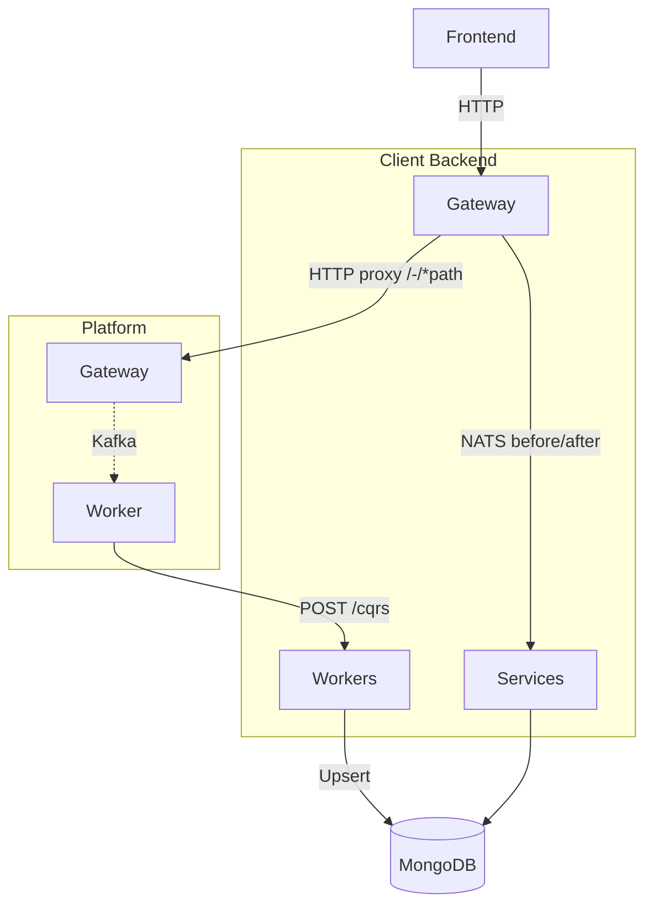

---
prev:
  text: 'Platform'
  link: '/getting-started/overview/ecosystem/platform'
next:
  text: 'Key Concepts'
  link: '/getting-started/overview/key-concepts'
---

# Client

A **Client** is an OAuth-registered application that writes and reads data through the Platform Gateway, receives change events via CQRS webhooks, and maintains a local MongoDB copy of its data for low-latency reads and aggregation queries, custom indexing or caching.

## Architecture

The official starting point is the **[backend-template](https://github.com/wenex-org/backend-template)** — a NestJS monorepo with three apps:



### Gateway

The sole public entry point. It authenticates requests, sends `before.*` NATS messages to the services layer for enrichment, proxies the call to the Platform, then sends `after.*` messages for side-effects. Platform routes are served under `/-/*path`.

### Services

The business logic layer — runs as both a REST server and a NATS microservice listener. Contains two types of modules:

- **Platform-mirrored modules** — intercept `before.*` / `after.*` hooks for Platform collections without owning any local MongoDB collection.
- **Custom resource modules** — own a MongoDB collection and serve CRUD through NATS message patterns for collections that exist only in the client.

### Workers

Receive CQRS webhook payloads from the Platform's `dispatcher` worker, upsert documents into the client's MongoDB, and emit NATS notifications so subscribing services can react.

## Key Patterns

**Platform hooks** — every `before.*` or `after.*` NATS response returns a `SyncData` object that tells the gateway how to mutate the in-flight request or short-circuit the response entirely.

**CQRS hooks** — the Platform's `dispatcher` worker delivers change events to the client's `POST /cqrs` HTTP endpoint. Each payload carries the operation (`c` create, `u` update, `d` delete, `r` restore), a `source` object describing the originating database and collection, and an `after` document (absent on delete).

The worker resolves the local MongoDB collection name from `source.collection` and `source.db`, then either replaces the document (upsert) when `after` is present or removes it when it is not. After the write it emits the full payload on a NATS topic named after the resolved collection, so any service that subscribed to that topic is notified immediately.

## Custom Resources

The Platform exposes two resources that client apps can use to store domain-specific data without owning a separate MongoDB collection:

| Resource | SDK path | Use for |
| --- | --- | --- |
| `context/settings` | `sdk.client.context.settings` | Configuration and lookup data (types, categories, options) |
| `general/artifacts` | `sdk.client.general.artifacts` | Domain events and triggers that other modules react to |

Both follow the **same** four-layer NestJS module pattern — key enum → interface/DTO → repository → controller. The only difference is the SDK reference passed to the `Repository` base class constructor.

### Step 1 — Declare a resource key enum

Each document stored in these resources carries a `key` field that namespaces it to a logical resource type. Define one enum value per resource type.

### Step 2 — Define the interface and DTO

Every document has a typed `value` object. Define the value shape, the document type, and the DTO.

### Step 3 — Wire the repository

The `Repository` base class takes three arguments: the key enum value that scopes all queries, the SDK resource reference, and the list of fields included in partial-update patches.

This is the **only line that differs** between a `context/setting` resource and a `general/artifacts` resource:

```typescript
@Injectable()
export class MyResourceRepository
  extends Repository<MyResource, MyResourceDto>
  implements IRepository<MyResource, MyResourceDto>
{
  constructor(readonly sdk: SdkService) {
    super(
      SettingKey.MY_RESOURCE, // ArtifactKey.MY_EVENT
      sdk.client.context.settings, // sdk.client.general.artifacts
      ['value'] satisfies (keyof MyResource)[],
    );
  }
}
```

### Step 4 — Expose via NATS message patterns

The controller extends `ControllerClass` and maps the full CRUD surface to NATS topics. The topic convention is `{method}.{service}.{collection}`.

The Gateway proxies `GET /context/my-resource` → NATS `get.context.my-resource`, so the frontend gets a full REST interface with no additional routing code.

### Reacting to artifact changes

When a `general/artifacts` document changes, the Platform emits a CQRS event that the worker upserts locally and re-emits on NATS. An `ArtifactsController` in the services layer listens on the generic `general.artifacts` topic and fans out to key-scoped topics (`general.artifacts.${key}`), so any module can subscribe only to the events it cares about:

```typescript
// Subscribe to a specific artifact event in another module
@MessagePattern('general.artifacts.MY_EVENT')
onMyEvent(
  @Payload('op')    op:   Operation,
  @Payload('after') data: { key: ArtifactKey; [k: string]: unknown },
): Observable<Empty> {
  return from(this.myService.handle(op, data)).pipe(mapTo('empty'));
}
```

Modules that do not subscribe to a given key are silently ignored — the dispatcher swallows "no subscribers" errors from NATS.

## BPMN Workflows

Complex multi-step business processes — ones that span multiple user interactions, timed delays, and external service calls — are modelled as BPMN 2.0 diagrams and executed by the `@vhidvz/wfjs` engine. The Platform's `general/workflows` resource stores the serialized execution context between steps, so the process can pause and resume across requests.

### Concepts

| Concept | Description |
| --- | --- |
| **Process class** | A `@Process()`-decorated `@Injectable()` that handles all BPMN activities for one diagram. |
| **Node handler** | An `@Node({ name })`-decorated method whose `name` matches the BPMN activity name exactly. |
| **`@Act()`** | Injects the `EventActivity` or `TaskActivity` for the current node. Call `activity.takeOutgoing()` to advance the flow. |
| **`@Data()`** | Injects a typed object that persists across the entire workflow run. Use it to pass state between nodes. |
| **`@Value()`** | Injects the payload supplied by the caller for this specific node execution. |
| **Paused node** | `@Node({ name, pause: true })` suspends execution. The workflow waits until an external actor calls the `take` endpoint with the matching activity name. |
| **`Context`** | The serialized snapshot of tokens, data, and status. Persisted to `sdk.client.general.workflows` after each node. |

### Project layout

```text
modules/general/submodules/workflows/
├── workflows.module.ts        # imports BullMQ queue + all process classes
├── workflows.controller.ts    # start (EventPattern) + take (MessagePattern)
├── workflows.service.ts       # start(), take(), saveWorkflowContext()
├── workflows.processor.ts     # BullMQ @Processor — runs start/take/end jobs
├── workflows.common.ts        # shared helpers (notify, getConjointChannel, …)
├── workflows.constant.ts      # queue name and job name constants
└── processes/
    ├── map.ts                  # { consulting: ConsultingProcess }
    ├── consulting.bpmn.xml    # BPMN 2.0 diagram
    ├── consulting.process.ts  # @Process handler
    └── consulting.validate.ts # DTOs validated inside nodes
```

### Starting and resuming a workflow

The service exposes two operations:

**`start()`** — schedules a BullMQ job (optionally delayed until the reservation's start time) to kick off the BPMN process.

```typescript
async start(data: Reservation, { headers }: ServiceOptions = {}): Promise<void> {
  const jobData = { body: data, headers } satisfies QueueJob<Reservation>;

  if (toDate(data.s_date) < toDate(Date.now() + ms('1 hour'))) {
    // Start immediately
    await this.queue.add(WORKFLOW_START_JOB, jobData, { jobId: data.id });
  } else {
    // Delay until 15 min before reservation
    const delay = toDate(data.s_date).getTime() - Date.now() - ms('15 Minutes');
    await this.queue.add(WORKFLOW_START_JOB, jobData, { delay, jobId: data.id });
  }
}
```

**`take()`** — resumes a paused workflow by deserializing its stored context and executing the named activity:

```typescript
async take(id: string, { activity, value }: WorkflowTake, { headers }: ServiceOptions = {}): Promise<Serializer<Workflow>> {
  const workflow = await this.workflows.findById(id, clientConfig(headers));
  assertion(workflow?.id, 'workflow not found', HttpStatus.NOT_FOUND);

  const { data, status, tokens, props } = workflow;
  const module = this.moduleRef.get(MAP[workflow.name]); // resolve process class by name

  const { context } = await WorkflowJS.build().execute({
    handler: module,
    node: { name: activity },
    value: { id, value, headers },
    context: Context.deserialize({ data: { ...data, props }, status, tokens: tokens ?? [] } as any),
  });

  if (context.isPartiallyTerminated()) context.terminate();
  return this.saveWorkflowContext(id, context, { headers });
}
```

The gateway hooks `before.post.general.workflows.?.take` so that a `POST /general/workflows/:id/take` from the frontend arrives as a NATS message and is routed here.

### Writing a process class

Decorate the class with `@Process`, providing the workflow name (matches the key in `MAP`) and the path to the BPMN file:

```typescript
@Injectable()
@Process({
  name: 'Consulting',
  path: join(__dirname, 'processes/consulting.bpmn.xml'),
})
export class ConsultingProcess {
  constructor(
    private readonly sdk: SdkService,
    private readonly common: WorkflowsCommon,
    @InjectQueue(WORKFLOW_QUEUE) private readonly queue: Queue,
  ) {}

  // ...node handlers
}
```

Register it in the map and add it to the module's `providers` array:

```typescript
// processes/map.ts
export const MAP: Record<string, any> = {
  consulting: ConsultingProcess,
};

// workflows.module.ts
@Module({
  providers: [WorkflowsService, WorkflowsCommon, WorkflowsProcessor, ...Object.values(MAP)],
})
export class WorkflowsModule {}
```

### Writing node handlers

Each handler corresponds to one named activity in the BPMN diagram. Use `@Data()` to build up shared state across nodes:

```typescript
// Start event — populate the data context from the incoming reservation
@Node({ name: 'Start' })
async start(
  @Act()   activity: EventActivity,
  @Data()  data:     DataType,
  @Value() { id, value, headers }: ValueType<Reservation>,
): Promise<ValueType<Reservation>> {
  const employee = await this.sdk.client.career.employees.findById(
    value.employee!, clientConfig(headers),
  );
  assertion(employee?.id && isAvailable(employee), 'employee is not available');

  Object.assign(data, {
    reservation:    value.id,
    employee:       value.employee,
    patient_owner:  value.owner,
    // ... more fields
  });

  activity.takeOutgoing(); // advance to next BPMN activity
  return { id, value, headers };
}

// Service task — call external services, mutate data
@Node({ name: 'Create an Invoice' })
async createAnInvoice(
  @Act()   activity: TaskActivity,
  @Data()  data:     DataType,
  @Value() { headers }: ValueType<Reservation>,
) {
  const invoice = await this.sdk.client.financial.invoices.create(
    { amount: 0, currency: IRR_CURRENCY, owner: data.employee_owner, /* … */ },
    clientConfig(headers),
  );
  data.invoice = invoice.id!;
  activity.takeOutgoing();
}

// Paused task — suspend until the user supplies input
@Node({ name: 'Survey', pause: true })
async survey(
  @Act()   activity: TaskActivity,
  @Data()  data:     DataType,
  @Value() { value }: ValueType<Survey>,
) {
  // Validate the incoming value against a DTO
  data.survey = await ValidationPipe.validate(value, Survey);
  activity.takeOutgoing();
}
```

### Scheduling automatic node transitions

For activities that should advance after a timed delay — such as automatically closing a chat channel at the end of a session — enqueue a BullMQ job from inside a node handler:

```typescript
@Node({ name: 'Initiate Chat Permission', pause: true })
async initiateChatPermission(@Act() activity: TaskActivity, @Data() data: DataType, @Value() { headers }: ValueType) {
  // ... set up channel and grants

  // Schedule automatic termination
  const delay = toDate(data.props.e_date!).getTime() - toDate(data.props.s_date).getTime() + ms('5 mins');
  const take: TakeType = { id: data.workflow, body: { activity: 'Connection Termination' }, headers };
  data.termination_job_id = crypto.randomUUID();
  await this.queue.add(WORKFLOW_TAKE_JOB, take, { delay, jobId: data.termination_job_id });

  activity.takeOutgoing();
}
```

The processor handles `WORKFLOW_TAKE_JOB` by calling `workflowsService.take()`, exactly as the HTTP endpoint does — the workflow resumes without any user interaction.

### Persisting context

After every node execution `saveWorkflowContext` serializes the `Context` and writes it back to the Platform:

```typescript
protected async saveWorkflowContext(id: string, context: Context, { headers }: ServiceOptions = {}) {
  const ctx = mask([context.serialize({ data: true, value: false })], SENSITIVE_PHRASES)[0];
  const { props, ...data } = ctx.data ?? {};
  return this.workflows.updateById(id, { ...ctx, data, props }, clientConfig(headers));
}
```

Sensitive fields are masked before persistence. `props` is stored separately so it survives across context reloads.

### `DataType` — typed workflow state

Define a `DataType` local to each process class. It accumulates all IDs and objects the process nodes need to share.
