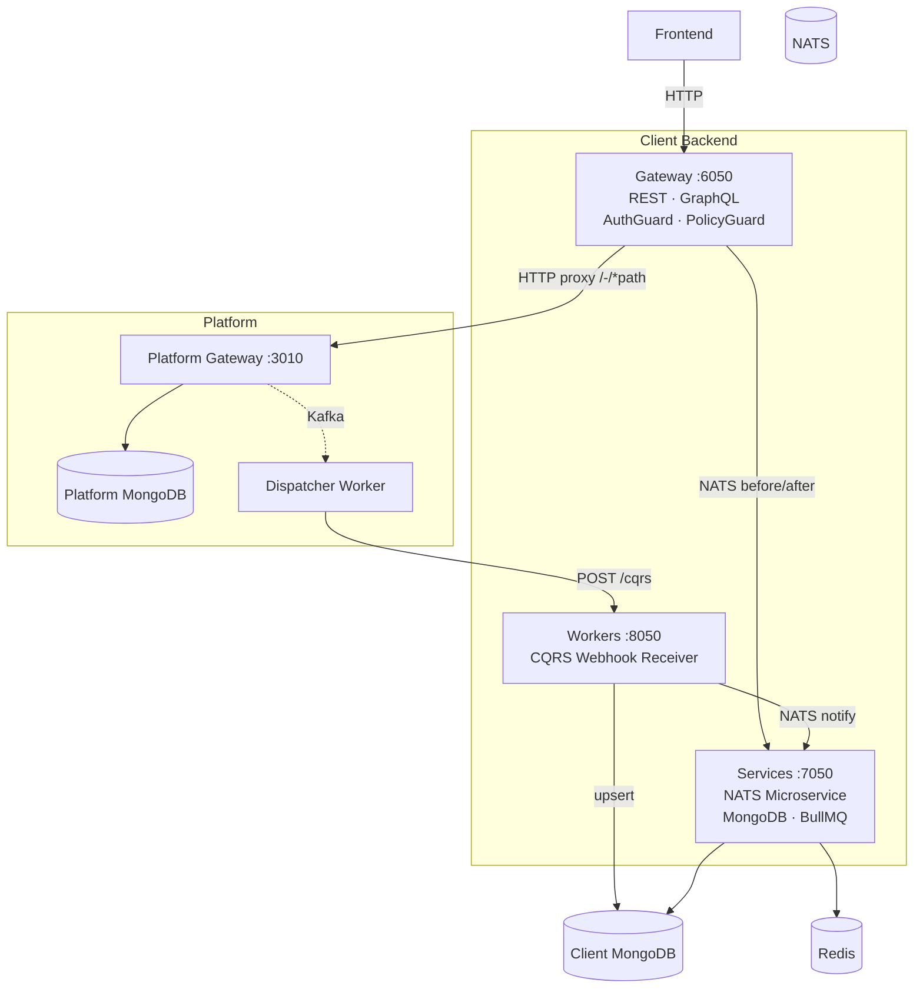
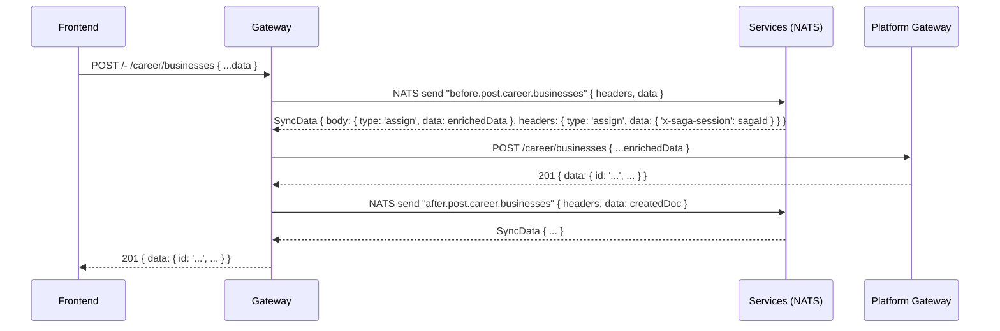
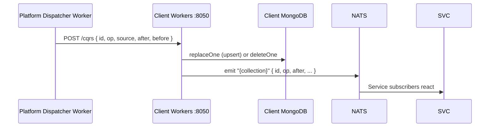

# Client

A **Client** is an OAuth-registered application that writes and reads data through the Platform Gateway, receives change events via CQRS webhooks, and maintains a local MongoDB copy of its data for low-latency reads and aggregation queries, custom indexing or caching.

## Clone & Install

The canonical starting point is the **[backend-template](https://github.com/wenex-org/backend-template)** — a NestJS monorepo with a gateway, a services layer, and a workers layer.

```bash
git clone https://github.com/wenex-org/backend-template.git my-client
cd my-client
cp .env.example .env
pnpm install --frozen-lockfile
```

## Repository Structure

```text
backend-template/
├── apps/
│   ├── gateway/          # REST + GraphQL entry point (:6050)
│   ├── services/         # Business logic + NATS microservice (:7050)
│   └── workers/          # CQRS webhook receiver (:8050)
├── libs/
│   ├── common/           # Shared DTOs, guards, interceptors, hooks
│   └── command/          # CLI seed / sync / raise scripts
├── assets/               # Static assets (logos, email images)
├── docker/               # Infrastructure docker-compose files
├── docker-compose.yml    # Application containers
├── .env.example          # Environment variable template
└── nest-cli.json         # NestJS monorepo config
```

## Architecture

The official starting point is the **[backend-template](https://github.com/wenex-org/backend-template)** — a NestJS monorepo with three apps:



### Request Flow

A standard REST write from a user traverses this path:



### CQRS Push Flow

After every Platform write, the data flows back to the client:



### Gateway

**Port:** `6050` (configurable via `GATEWAY_API_PORT`)

The sole public entry point. It authenticates requests, sends `before.*` NATS messages to the services layer for enrichment, proxies the call to the Platform, then sends `after.*` messages for side-effects. Platform routes are served under `/-/*path`.

```text
apps/gateway/src/
├── main.ts               # Bootstrap: helmet, queryParser, Swagger, XRequestId
├── app.module.ts         # Imports: NATS, Redis, Altcha, Sentry, Prometheus, SdkModule, HealthModule
├── modules/
│   └── proxy/
│       ├── proxy.controller.ts   # @All('-/*path') — Platform passthrough
│       └── proxy.service.ts      # before/after NATS sync + axios forwarding
└── customs/
    └── request/
        └── submodules/
            ├── collaborations/   # NatsController for custom resource
            └── reservations/     # NatsController for custom resource
```

Every route matching `/-/*path` is forwarded to the Platform. The `-` prefix is stripped before forwarding:

```text
Client: POST /- /career/businesses
         ↓ strips -
Platform: POST /career/businesses
```

For collections that exist only in the client (not in the Platform), the gateway exposes a `NatsController` subclass:

```typescript
const PATH = ['request', 'collaborations'];

@Controller(PATH.join('/'))
@UseGuards(AuthGuard, PolicyGuard)
@UseInterceptors(MetadataInterceptor, new SentryInterceptor())
export class CollaborationsController extends NatsController<Collaboration, CollaborationDto> {
  constructor(@Inject(NATS_GATEWAY) readonly client: ClientProxy) {
    super(PATH.join('.'), client, CollaborationSerializer);
  }

  @Get('count')
  @SetPolicy('read', 'request:collaborations')
  count(@Meta('headers') headers: Headers, @Filter() filter: QueryFilterDto<Collaboration>) {
    return super.count(headers, filter);
  }
  // ... standard CRUD methods
}
```

`NatsController` maps each REST endpoint to a NATS message pattern: `GET count` → `get.request.collaborations.count`, `POST` → `post.request.collaborations`, etc.

**Guard & Interceptor stack:**

| Layer | Component | Purpose |
| --- | --- | --- |
| Guard | `AuthGuard` | Validates JWT / APT with Platform |
| Guard | `PolicyGuard` | ABAC policy check via Platform `auth/can` |
| Interceptor | `MetadataInterceptor` | Extracts `headers`, `params`, `token` into `req.meta` |
| Interceptor | `SentryInterceptor` | Error tracking |
| Interceptor | `XRequestIdInterceptor` | Injects trace ID |

### Services

**Port:** `7050` REST + NATS microservice (same process)

The business logic layer — runs as both a REST server and a NATS microservice listener. Contains two types of modules:

```text
apps/services/src/
├── main.ts               # Bootstrap: REST + NATS microservice
├── app.module.ts         # Imports: NATS, Redis, Mongo, BullMQ, Altcha, SdkModule, HealthModule
├── modules/              # Platform-mirrored modules
│   ├── auth/             # Auth hooks (token injection, registration, OTP)
│   ├── identity/         # Identity profiles after-create triggers
│   ├── career/           # Business/branch/employee before-create enrichment
│   └── touch/            # Email/notification dispatch
└── customs/              # App-specific resources
    └── request/
        └── submodules/
            ├── collaborations/   # NATS controller + service + repository
            └── reservations/     # NATS controller + service + repository + processor
```

#### Platform-Mirrored Modules (`modules/`)

These intercept requests to Platform-managed collections via NATS hooks. They do **not** own a MongoDB collection.

```text
modules/{service}/
├── {service}.module.ts
├── {service}.inspector.ts       # NATS @MessagePattern for before.* hooks
└── submodules/
    └── {collection}/
        └── {collection}.service.ts
```

**Inspector** — the hook handler that intercepts the gateway's `before.*` NATS messages:

```typescript
@Controller()
@UseGuards(AuthGuard)
export class AuthInspector {
  @MessagePattern('before.post.auth.verify')
  verify(@Payload('data') data: ConfirmationDto, @Payload('headers') headers?: Headers): Observable<SyncData> {
    return from(this.service.confirmation(data, headers)).pipe(mapTo('end'));
  }
}
```

Returning `{ end: result }` short-circuits the Platform call and returns `result` directly to the gateway.

#### Custom Resource Modules (`customs/`)

These own a MongoDB collection and follow the standard CRUD pattern internally via NATS message patterns.

```text
customs/{group}/submodules/{collection}/
├── {collection}.module.ts
├── {collection}.controller.ts   # @MessagePattern handlers
├── {collection}.service.ts      # Business logic + hooks
├── {collection}.repository.ts   # Typegoose MongoDB queries
├── {collection}.processor.ts    # BullMQ @Process (optional)
└── {collection}.constant.ts     # Queue names, job names
```

### Workers

**Port:** `8050`

Receive CQRS webhook payloads from the Platform's `dispatcher` worker, upsert documents into the client's MongoDB, and emit NATS notifications so subscribing services can react.

```text
apps/workers/src/
├── main.ts               # Bootstrap: HTTP server only (no NATS server here)
├── app.module.ts         # Imports: NATS client, Mongo, Sentry, Prometheus, HealthModule
└── modules/
    └── cqrs/
        ├── cqrs.controller.ts  # POST /cqrs
        ├── cqrs.service.ts     # MongoDB upsert + NATS notify
        └── cqrs.module.ts
```

Each incoming payload carries:

```typescript
interface CqrsPayload<T = Core> {
  id: string;       // document MongoId
  ts_ms: number;    // timestamp ms
  op: 'c' | 'u' | 'd' | 'r';  // create, update, delete, restore
  topic: string;    // "{db}.{collection}"
  source: {
    name: string;
    db: string;     // Platform database name (e.g., "platform-identity")
    collection: Coll;
  };
  after?: T;        // document state after operation (absent on delete)
  before?: T;       // document state before operation (absent on create)
}
```

For every incoming event the worker:

1. Resolves the MongoDB collection name from `source.db` + `source.collection`
2. If `after` is present → `replaceOne({ _id }, fixIn(after), { upsert: true })`
3. If `after` is absent (delete) → `deleteOne({ _id })`
4. Emits NATS message on topic `{collection}` so subscribing services can react

## Key Patterns

### Proxy Hook: `SyncData`

The `before.*` and `after.*` NATS messages must return a `SyncData` object that tells the gateway how to mutate the in-flight request or response:

```typescript
type SyncType = 'none' | 'assign' | 'replace';

type SyncData<T = any> = {
  end?:     T;                                              // short-circuit, return this directly
  body?:    { type: SyncType; data: T };                    // merge into req.body / res.body
  query?:   { type: SyncType; data: T };                    // merge into req.query
  headers?: { type: SyncType; data: Record<string, any> };  // merge into headers
};
```

**`assign`** deep-merges; **`replace`** overwrites; **`none`** does nothing; **`end`** bypasses the Platform call entirely.

**Example — inject token parameters before a Platform auth call:**

```typescript
async token(data: AuthenticationRequest): Promise<SyncData> {
  data.strict = true;
  data.client_id = CLIENT_ID;
  data.client_secret = CLIENT_SECRET;
  data.coworkers = COWORKERS;

  return { body: { type: 'assign', data } };
}
```

**Example — short-circuit with final response:**

```typescript
async confirm(data: ConfirmDto): Promise<SyncData> {
  const result = await this.service.verify(data);
  return { end: { result } };  // gateway returns { result } immediately
}
```

### NATS Message Pattern Naming

All NATS message patterns follow a consistent convention:

```text
{http_method}.{service}.{resource}[.?][.{operation}]
```

| Pattern | HTTP Equivalent |
| --- | --- |
| `get.request.collaborations.count` | `GET /request/collaborations/count` |
| `post.request.collaborations` | `POST /request/collaborations` |
| `post.request.collaborations.bulk` | `POST /request/collaborations/bulk` |
| `get.request.collaborations` | `GET /request/collaborations` |
| `get.request.collaborations.?` | `GET /request/collaborations/:id` |
| `patch.request.collaborations.?` | `PATCH /request/collaborations/:id` |
| `patch.request.collaborations.bulk` | `PATCH /request/collaborations/bulk` |
| `delete.request.collaborations.?` | `DELETE /request/collaborations/:id` |
| `put.request.collaborations.?.restore` | `PUT /request/collaborations/:id/restore` |
| `delete.request.collaborations.?.destroy` | `DELETE /request/collaborations/:id/destroy` |
| `before.post.career.businesses` | Before gateway forwards POST to Platform |
| `after.post.career.businesses` | After Platform returns response |

### Lifecycle Hooks

Custom resource services implement typed lifecycle hook interfaces:

```typescript
interface OnBeforeCreate<T, Options> {
  onBeforeCreate(items: T[], options?: Options): void | Promise<void>;
}
interface OnAfterCreate<T, Options> {
  onAfterCreate(result: Serializer<T>[], options?: Options): void | Promise<void>;
}
interface OnBeforeUpdate<T, Options> {
  onBeforeUpdate(data: Optional<T>, filter: FilterOne<T>, options?: Options): Promise<Serializer<T>>;
}
interface OnAfterUpdate<T, Options> {
  onAfterUpdate(result: Serializer<T>, options?: Options): void | Promise<void>;
}
// also: OnBeforeDelete, OnAfterDelete, OnBeforeDestroy, OnAfterDestroy, OnBeforeRestore, OnAfterRestore
```

The base `Service` class calls these hooks automatically around each CRUD operation.

**Example — enqueue a BullMQ job after create:**

```typescript
async onAfterCreate(result: Serializer<Reservation>[], { headers } = {}) {
  const jobs = result.map((body) => ({
    name: RESERVATION_JOB,
    data: { body, headers },
    opts: { jobId: body.job },
  }));
  await this.queue.addBulk(jobs);
}
```

### Platform SDK Usage

All Platform API calls go through `SdkService`, which wraps `@wenex/sdk` configured with `PLATFORM_URL` and `API_KEY`:

```typescript
@Injectable()
export class ProfilesService {
  constructor(private readonly sdk: SdkService) {}

  async afterCreate(data: Serializer<Profile>, { headers }: ServiceOptions) {
    const profile = await this.sdk.client.identity.profiles.findById(data.id!, clientConfig(headers));
    await this.sdk.client.identity.users.updateById(user.id, { subjects }, clientConfig(headers));
    await this.sdk.client.financial.accounts.create({ owner, type, ownership }, clientConfig(headers));
  }
}
```

**`clientConfig(headers)`** — builds the request config forwarding authentication headers from the original request so writes are attributed to the correct user.

**`userConfig(headers)`** — similar but injects the root user context for system-level operations.

### Saga Transactions

For operations that span multiple Platform services, wrap them in a saga:

```typescript
async beforeCreate(data: BusinessDto, { headers }: ServiceOptions): Promise<SyncData> {
  const saga = await this.sdk.client.essential.sagas.start({ ttl: DEFAULT_SAGA_TTL }, clientConfig(headers));

  const location = await this.sdk.client.logistic.locations.create(
    locationData,
    userConfig({ ...headers, 'x-saga-session': saga.id }),
  );
  data.location = location.id;

  return {
    body:    { type: 'assign', data },
    headers: { type: 'assign', data: { 'x-saga-session': saga.id } },
  };
}

async afterCreate({ headers }: ServiceOptions): Promise<void> {
  await this.sdk.client.essential.sagas.commit(get('x-saga-session', headers)!, clientConfig(headers));
}
```

If the after-hook is never called (e.g., the request fails), the Platform's essential service triggers compensation via its own `SagasProcessor` (BullMQ) after the saga TTL expires.

### BullMQ Jobs

Custom async processing (timeouts, delayed tasks) uses BullMQ backed by Redis:

```typescript
constructor(
  readonly repository: ReservationsRepository,
  @InjectQueue(RESERVATION_QUEUE) private readonly queue: Queue<QueueJob<Reservation>>,
) {}

async onAfterCreate(result: Serializer<Reservation>[]) {
  const jobs = result.map((body) => ({
    name: RESERVATION_JOB,
    data: { body },
    opts: { jobId: body.job },  // deterministic job ID for deduplication
  }));
  await this.queue.addBulk(jobs);
}
```

```typescript
@Processor(RESERVATION_QUEUE)
export class ReservationsProcessor {
  @Process(RESERVATION_JOB)
  async process(job: Job<QueueJob<Reservation>>) {
    // handle timeout / expiry logic
  }
}
```

## Custom Resources

The Platform exposes two resources that client apps can use to store domain-specific data without owning a separate MongoDB collection:

| Resource | SDK path | Use for |
| --- | --- | --- |
| `context/settings` | `sdk.client.context.settings` | Configuration and lookup data (types, categories, options) |
| `general/artifacts` | `sdk.client.general.artifacts` | Domain events and triggers that other modules react to |

Both follow the **same** four-layer NestJS module pattern — key enum → interface/DTO → repository → controller. The only difference is the SDK reference passed to the `Repository` base class constructor.

### Step 1 — Declare a resource key enum

Each document stored in these resources carries a `key` field that namespaces it to a logical resource type. Define one enum value per resource type.

### Step 2 — Define the interface and DTO

Every document has a typed `value` object. Define the value shape, the document type, and the DTO.

### Step 3 — Wire the repository

The `Repository` base class takes three arguments: the key enum value that scopes all queries, the SDK resource reference, and the list of fields included in partial-update patches.

This is the **only line that differs** between a `context/setting` resource and a `general/artifacts` resource:

```typescript
@Injectable()
export class MyResourceRepository
  extends Repository<MyResource, MyResourceDto>
  implements IRepository<MyResource, MyResourceDto>
{
  constructor(readonly sdk: SdkService) {
    super(
      SettingKey.MY_RESOURCE, // ArtifactKey.MY_EVENT
      sdk.client.context.settings, // sdk.client.general.artifacts
      ['value'] satisfies (keyof MyResource)[],
    );
  }
}
```

### Step 4 — Expose via NATS message patterns

The controller extends `ControllerClass` and maps the full CRUD surface to NATS topics. The topic convention is `{method}.{service}.{collection}`.

The Gateway proxies `GET /context/my-resource` → NATS `get.context.my-resource`, so the frontend gets a full REST interface with no additional routing code.

### Reacting to artifact changes

When a `general/artifacts` document changes, the Platform emits a CQRS event that the worker upserts locally and re-emits on NATS. An `ArtifactsController` in the services layer listens on the generic `general.artifacts` topic and fans out to key-scoped topics (`general.artifacts.${key}`), so any module can subscribe only to the events it cares about:

```typescript
// Subscribe to a specific artifact event in another module
@MessagePattern('general.artifacts.MY_EVENT')
onMyEvent(
  @Payload('op')    op:   Operation,
  @Payload('after') data: { key: ArtifactKey; [k: string]: unknown },
): Observable<Empty> {
  return from(this.myService.handle(op, data)).pipe(mapTo('empty'));
}
```

Modules that do not subscribe to a given key are silently ignored — the dispatcher swallows "no subscribers" errors from NATS.

## BPMN Workflows

Complex multi-step business processes — ones that span multiple user interactions, timed delays, and external service calls — are modelled as BPMN 2.0 diagrams and executed by the `@vhidvz/wfjs` engine. The Platform's `general/workflows` resource stores the serialized execution context between steps, so the process can pause and resume across requests.

### Concepts

| Concept | Description |
| --- | --- |
| **Process class** | A `@Process()`-decorated `@Injectable()` that handles all BPMN activities for one diagram. |
| **Node handler** | An `@Node({ name })`-decorated method whose `name` matches the BPMN activity name exactly. |
| **`@Act()`** | Injects the `EventActivity` or `TaskActivity` for the current node. Call `activity.takeOutgoing()` to advance the flow. |
| **`@Data()`** | Injects a typed object that persists across the entire workflow run. Use it to pass state between nodes. |
| **`@Value()`** | Injects the payload supplied by the caller for this specific node execution. |
| **Paused node** | `@Node({ name, pause: true })` suspends execution. The workflow waits until an external actor calls the `take` endpoint with the matching activity name. |
| **`Context`** | The serialized snapshot of tokens, data, and status. Persisted to `sdk.client.general.workflows` after each node. |

### Project layout

```text
modules/general/submodules/workflows/
├── workflows.module.ts        # imports BullMQ queue + all process classes
├── workflows.controller.ts    # start (EventPattern) + take (MessagePattern)
├── workflows.service.ts       # start(), take(), saveWorkflowContext()
├── workflows.processor.ts     # BullMQ @Processor — runs start/take/end jobs
├── workflows.common.ts        # shared helpers (notify, getConjointChannel, …)
├── workflows.constant.ts      # queue name and job name constants
└── processes/
    ├── map.ts                  # { consulting: ConsultingProcess }
    ├── consulting.bpmn.xml    # BPMN 2.0 diagram
    ├── consulting.process.ts  # @Process handler
    └── consulting.validate.ts # DTOs validated inside nodes
```

### Starting and resuming a workflow

The service exposes two operations:

**`start()`** — schedules a BullMQ job (optionally delayed until the reservation's start time) to kick off the BPMN process.

```typescript
async start(data: Reservation, { headers }: ServiceOptions = {}): Promise<void> {
  const jobData = { body: data, headers } satisfies QueueJob<Reservation>;

  if (toDate(data.s_date) < toDate(Date.now() + ms('1 hour'))) {
    // Start immediately
    await this.queue.add(WORKFLOW_START_JOB, jobData, { jobId: data.id });
  } else {
    // Delay until 15 min before reservation
    const delay = toDate(data.s_date).getTime() - Date.now() - ms('15 Minutes');
    await this.queue.add(WORKFLOW_START_JOB, jobData, { delay, jobId: data.id });
  }
}
```

**`take()`** — resumes a paused workflow by deserializing its stored context and executing the named activity:

```typescript
async take(id: string, { activity, value }: WorkflowTake, { headers }: ServiceOptions = {}): Promise<Serializer<Workflow>> {
  const workflow = await this.workflows.findById(id, clientConfig(headers));
  assertion(workflow?.id, 'workflow not found', HttpStatus.NOT_FOUND);

  const { data, status, tokens, props } = workflow;
  const module = this.moduleRef.get(MAP[workflow.name]); // resolve process class by name

  const { context } = await WorkflowJS.build().execute({
    handler: module,
    node: { name: activity },
    value: { id, value, headers },
    context: Context.deserialize({ data: { ...data, props }, status, tokens: tokens ?? [] } as any),
  });

  if (context.isPartiallyTerminated()) context.terminate();
  return this.saveWorkflowContext(id, context, { headers });
}
```

The gateway hooks `before.post.general.workflows.?.take` so that a `POST /general/workflows/:id/take` from the frontend arrives as a NATS message and is routed here.

### Writing a process class

Decorate the class with `@Process`, providing the workflow name (matches the key in `MAP`) and the path to the BPMN file:

```typescript
@Injectable()
@Process({
  name: 'Consulting',
  path: join(__dirname, 'processes/consulting.bpmn.xml'),
})
export class ConsultingProcess {
  constructor(
    private readonly sdk: SdkService,
    private readonly common: WorkflowsCommon,
    @InjectQueue(WORKFLOW_QUEUE) private readonly queue: Queue,
  ) {}

  // ...node handlers
}
```

Register it in the map and add it to the module's `providers` array:

```typescript
// processes/map.ts
export const MAP: Record<string, any> = {
  consulting: ConsultingProcess,
};

// workflows.module.ts
@Module({
  providers: [WorkflowsService, WorkflowsCommon, WorkflowsProcessor, ...Object.values(MAP)],
})
export class WorkflowsModule {}
```

### Writing node handlers

Each handler corresponds to one named activity in the BPMN diagram. Use `@Data()` to build up shared state across nodes:

```typescript
// Start event — populate the data context from the incoming reservation
@Node({ name: 'Start' })
async start(
  @Act()   activity: EventActivity,
  @Data()  data:     DataType,
  @Value() { id, value, headers }: ValueType<Reservation>,
): Promise<ValueType<Reservation>> {
  const employee = await this.sdk.client.career.employees.findById(
    value.employee!, clientConfig(headers),
  );
  assertion(employee?.id && isAvailable(employee), 'employee is not available');

  Object.assign(data, {
    reservation:    value.id,
    employee:       value.employee,
    patient_owner:  value.owner,
    // ... more fields
  });

  activity.takeOutgoing(); // advance to next BPMN activity
  return { id, value, headers };
}

// Service task — call external services, mutate data
@Node({ name: 'Create an Invoice' })
async createAnInvoice(
  @Act()   activity: TaskActivity,
  @Data()  data:     DataType,
  @Value() { headers }: ValueType<Reservation>,
) {
  const invoice = await this.sdk.client.financial.invoices.create(
    { amount: 0, currency: IRR_CURRENCY, owner: data.employee_owner, /* … */ },
    clientConfig(headers),
  );
  data.invoice = invoice.id!;
  activity.takeOutgoing();
}

// Paused task — suspend until the user supplies input
@Node({ name: 'Survey', pause: true })
async survey(
  @Act()   activity: TaskActivity,
  @Data()  data:     DataType,
  @Value() { value }: ValueType<Survey>,
) {
  // Validate the incoming value against a DTO
  data.survey = await ValidationPipe.validate(value, Survey);
  activity.takeOutgoing();
}
```

### Scheduling automatic node transitions

For activities that should advance after a timed delay — such as automatically closing a chat channel at the end of a session — enqueue a BullMQ job from inside a node handler:

```typescript
@Node({ name: 'Initiate Chat Permission', pause: true })
async initiateChatPermission(@Act() activity: TaskActivity, @Data() data: DataType, @Value() { headers }: ValueType) {
  // ... set up channel and grants

  // Schedule automatic termination
  const delay = toDate(data.props.e_date!).getTime() - toDate(data.props.s_date).getTime() + ms('5 mins');
  const take: TakeType = { id: data.workflow, body: { activity: 'Connection Termination' }, headers };
  data.termination_job_id = crypto.randomUUID();
  await this.queue.add(WORKFLOW_TAKE_JOB, take, { delay, jobId: data.termination_job_id });

  activity.takeOutgoing();
}
```

The processor handles `WORKFLOW_TAKE_JOB` by calling `workflowsService.take()`, exactly as the HTTP endpoint does — the workflow resumes without any user interaction.

### Persisting context

After every node execution `saveWorkflowContext` serializes the `Context` and writes it back to the Platform:

```typescript
protected async saveWorkflowContext(id: string, context: Context, { headers }: ServiceOptions = {}) {
  const ctx = mask([context.serialize({ data: true, value: false })], SENSITIVE_PHRASES)[0];
  const { props, ...data } = ctx.data ?? {};
  return this.workflows.updateById(id, { ...ctx, data, props }, clientConfig(headers));
}
```

Sensitive fields are masked before persistence. `props` is stored separately so it survives across context reloads.

### `DataType` — typed workflow state

Define a `DataType` local to each process class. It accumulates all IDs and objects the process nodes need to share.

## Authentication Design

The services app implements the full user-facing authentication flow by wrapping Platform auth endpoints with NATS before/after hooks:

| Endpoint | Pattern | What the client adds |
| --- | --- | --- |
| `POST /auth/token` | before hook | Injects `client_id`, `client_secret`, `coworkers`, `strict` |
| `POST /auth/register` | before hook + after | Validates captcha, sends verification email |
| `POST /auth/otp` | before hook | Validates captcha, resolves user secret |
| `POST /auth/verify` | before hook | Confirms OTP, activates user |
| `POST /auth/repass` | before hook | Forgot/reset password with captcha |
| `POST /auth/oauth` | before hook | Google/social OAuth |

**Altcha CAPTCHA** — all public auth endpoints require a valid Altcha proof-of-work token in the request body as `captcha`. The `AltchaService` validates it server-side using `ALTCHA_HMAC_KEY`.

**Strict tokens** — when `STRICT_TOKEN=true`, the token endpoint enforces that the user already exists in the Platform before issuing a JWT. Disable only for development.

**Policy enforcement** — protected endpoints use `@SetPolicy(action, resource)`:

```typescript
@SetPolicy('read', 'request:collaborations')
find(...) { ... }
```

This maps to a Platform ABAC check: the authenticated user must have `read` permission on the `request:collaborations` resource as configured in the RBAC rules in `context/configs`.

## CQRS Webhook Security

The Platform dispatcher sends a plain HTTP POST to `/cqrs`. Secure it with a shared secret:

```bash
# .env
CLIENT_AUTHORIZATION_CQRS=Bearer my-secret-shared-key
```

The `AuthGuard` in the workers app checks that the incoming `Authorization` header equals `CLIENT_AUTHORIZATION_CQRS`. Register the same value as `value.authorization` in the `context/configs` CQRS entry on the Platform side.

## Environment Variables

| Variable | Purpose | Example |
| --- | --- | --- |
| `PLATFORM_URL` | Platform Gateway base URL | `http://localhost:3010` |
| `API_KEY` | Service-to-service API key for Platform calls | `20GBCseZe...` |
| `CLIENT_ID` | OAuth client MongoId registered in `/domain/clients` | `6804c24f...` |
| `CLIENT_SECRET` | OAuth client secret | `9a38b699...` |
| `APP_ID` | OAuth app MongoId registered in `/domain/apps` | `6804c32b...` |
| `CID` | Same as `CLIENT_ID` — used in seeding scripts | `6804c24f...` |
| `UID` | Root user MongoId — used in seeding scripts | `680621e8...` |
| `COWORKERS` | Comma-separated coworker client IDs | `id1,id2` |
| `STRICT_TOKEN` | Reject tokens for unregistered users | `true` |
| `ROOT_DOMAIN` | Tenant domain for RBAC rules | `example.com` |
| `ROOT_SUBJECT` | Root user email | `root@example.com` |
| `CLIENT_BASE_URL` | Frontend origin (for CORS, email links) | `http://localhost:3005` |
| `CLIENT_ASSETS_URL` | CDN / asset server URL | `http://localhost:8088` |
| `CLIENT_AUTHORIZATION_CQRS` | Shared secret for `/cqrs` endpoint auth | `Bearer secret` |
| `GRAPHQL_MUTATION_SUPPORT` | Allow GraphQL mutations through proxy | `false` |
| `NATS_SERVERS` | NATS connection string(s) | `nats://localhost:4222` |
| `REDIS_HOST` / `REDIS_PORT` | Redis for caching + BullMQ | `localhost:6379` |
| `MONGO_HOST` / `MONGO_DB` | MongoDB connection | `localhost:27017` / `client` |
| `ALTCHA_HMAC_KEY` | Altcha captcha HMAC secret | `176708d4...` |
| `SENTRY_DSN` | Sentry error tracking DSN | (optional) |

### Port Configuration

| App | Default Port | Variable |
| --- | --- | --- |
| Gateway | 6050 | `GATEWAY_API_PORT` |
| Services | 7050 | `SERVICES_API_PORT` |
| Workers | 8050 | `WORKERS_API_PORT` |

## Seeding & Initialization

The `libs/command/` library provides CLI scripts to initialize the client's data on the Platform. Run these once at deployment time.

```text
libs/command/src/platform/
├── auth/resources/
│   ├── seeds/grants.seed.ts    # OAuth permission grants
│   └── syncs/grants.sync.ts
├── context/resources/
│   ├── seeds/configs.seed.ts  # RBAC config, validation schemas, CQRS webhook
│   └── syncs/configs.sync.ts
├── identity/resources/seeds/  # Initial users
└── career/resources/
    ├── seeds/                 # Initial business/branch/employee data
    └── mocks/                 # Development mock data
```

```bash
npm run platform:seed    # Create initial Platform records (runs once)
npm run platform:sync    # Update existing Platform records
npm run platform:raise   # Raise (upsert) records with override
npm run platform:clean   # Remove all seeded records
npm run platform:mock    # Insert development mock data
```

The most important seed is the RBAC config in `context/configs`. It defines roles, permissions, and the CQRS webhook:

```typescript
const configs: ConfigDto[] = [
  {
    eid: CID,
    key: ConfigKey.RBAC,
    value: [
      {
        domain: ROOT_DOMAIN,
        roles: {
          user: ['file_special_manage', 'user_identity_manage', ...],
          guest: ['view_financial_currencies', ...],
        },
        permissions: {
          file_special_manage: ['upload_special_files', 'read_own_special_files', ...],
        },
      },
    ],
  },
  {
    eid: CID,
    key: ConfigKey.CQRS,
    value: { webhook: `${process.env.CLIENT_BASE_URL}/cqrs` },
  },
];
```

## Docker & Deployment

### Infrastructure

```bash
docker-compose -f docker/docker-compose.yml up -d        # MongoDB + Redis
docker-compose -f docker/docker-compose.nat.yml up -d    # NATS
docker-compose -f docker/docker-compose.otlp.yml up -d  # OpenTelemetry (optional)
```

### Application

```bash
docker build -t wenex/backend-template:latest .

docker-compose --profile client up -d    # all three apps
docker-compose --profile gateway up -d   # gateway only
docker-compose --profile services up -d  # services only
docker-compose --profile workers up -d   # workers only

docker-compose --profile platform-seed up  # seed Platform data
```

### Health Check Paths

| Path | Purpose |
| --- | --- |
| `/status` | Health check (MongoDB, Redis, NATS, Platform) |
| `/metrics` | Prometheus metrics |
| `/api` | Swagger UI |
| `/api-json` | OpenAPI JSON spec |
| `/bullmq` | BullMQ dashboard (services only) |
| `/graphql` | GraphQL playground (gateway, if enabled) |

## Best Practices

1. **Register with minimum scopes.** Set `API_KEY` scopes to exactly what the client reads and writes. Overly broad scopes expose data you don't own.

2. **Always use `clientConfig(headers)` for Platform writes.** This propagates the user's JWT so ownership (`owner`, `clients[]`) is injected correctly. Using the root API key directly will attribute documents to the service account, not the user.

3. **Short-circuit in before hooks with `{ end: result }`.** If your hook produces a final answer (e.g., confirming a captcha), return `{ end: result }` to avoid an unnecessary Platform round-trip.

4. **Use sagas for cross-service writes.** Whenever `beforeCreate` creates a record in a secondary Platform service (e.g., creating a location for a business), start a saga. This ensures partial writes are compensated automatically if the primary create fails.

5. **Seed RBAC before registering users.** The RBAC config in `context/configs` must exist before any user can log in. Run `platform:seed` as part of your deployment pipeline before starting the gateway.

6. **Inject `COWORKERS` at token time.** The services `before.post.auth.token` hook must set `data.coworkers = COWORKERS` so that issued tokens include the coworker list. Without this, zone filtering with `zone=client` will not return coworker-owned documents.

7. **Use deterministic BullMQ job IDs.** Set `opts: { jobId: doc.job }` where `doc.job` is a UUID stored on the document. This prevents duplicate jobs if the same event is processed twice (e.g., on NATS redelivery).

8. **Keep `modules/` thin.** Platform-mirrored modules should contain only the business logic that must run alongside Platform operations (hooks, enrichment, side-effects). Complex query logic belongs in `customs/` with a dedicated MongoDB collection.

9. **Do not store sensitive fields from the Platform.** The CQRS worker stores documents verbatim from Platform payloads. Ensure fields like `secret`, `password`, or `token` are excluded in serializers before leaving the Platform Gateway so they never appear in CQRS payloads.

10. **Set `CLIENT_AUTHORIZATION_CQRS` in production.** Without it, anyone can POST to `/cqrs` and inject arbitrary documents into your local MongoDB. Use a long random secret and rotate it by redeploying the workers app.
