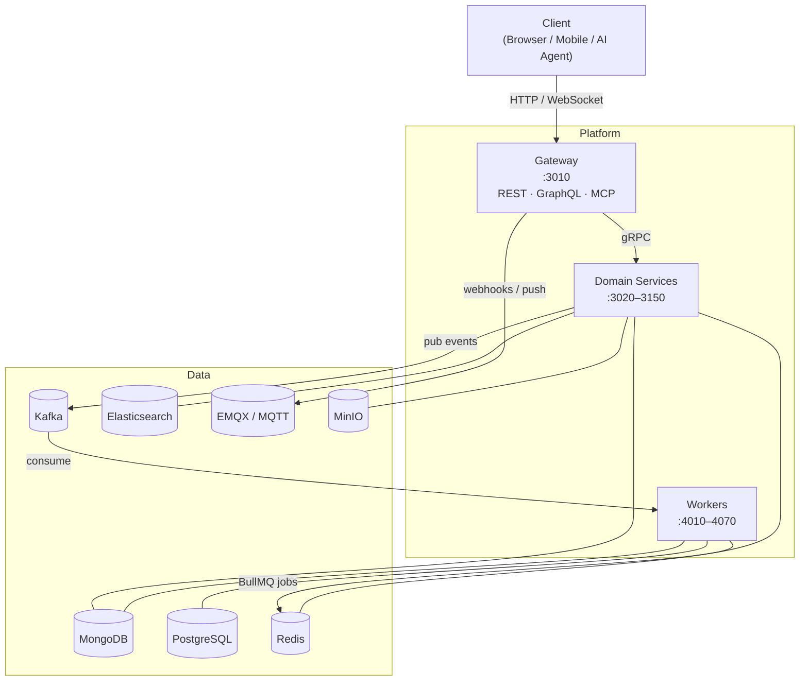
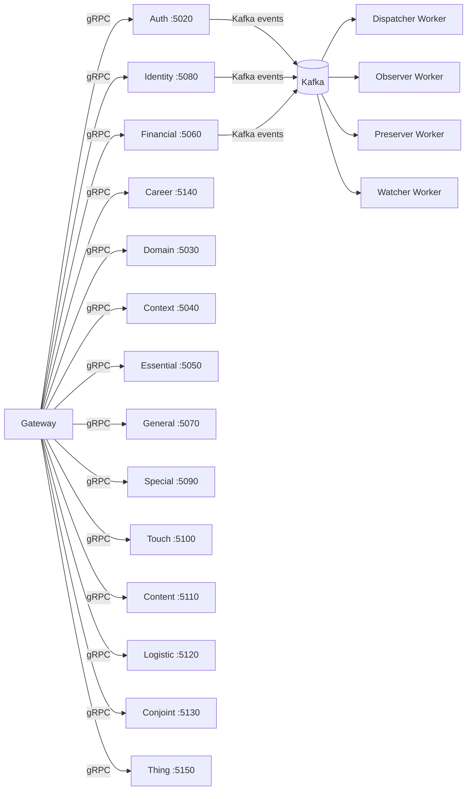

---
prev:
  text: 'Ecosystem'
  link: '/getting-started/overview/ecosystem'
next:
  text: 'Client App'
  link: '/getting-started/overview/ecosystem/client-app'
---

# Platform

The Wenex Platform is the shared backend infrastructure that every client application in the ecosystem writes to, reads from, and receives events from. It owns data shape, access control, document lifecycle, and event delivery — nothing more. All domain business logic lives in client applications.

## The Big Picture

Multiple independent client applications, organized into **Coworkers spaces**, share a single Platform instance. Clients never call each other; all data exchange flows through the Platform.

A **Coworkers space** is not a Platform entity — it is the organizational concept that groups clients who collaborate. See [Coworkers Space](../key-concepts/coworkers-space) for the full model.

## Design Principles

1. **Observable-first.** All service methods return `Observable<T>` (RxJS), never Promises. Controllers and resolvers subscribe; gRPC streams are bridged automatically.

2. **Metadata is pervasive.** Every gRPC call carries a `Metadata` object (user, client, domain, token). Ownership checks, soft-delete filtering, and audit logging derive from it automatically — services never receive raw HTTP context.

3. **Consistent CRUD surface.** All 15 services expose the same 14 operations (`count`, `create`, `createBulk`, `find`, `cursor`, `findOne`, `findById`, `updateOne`, `updateBulk`, `updateById`, `deleteOne`, `deleteById`, `restoreOne`, `destroyOne`). There are no service-specific exceptions. This uniformity means the SDK, the gateway pipeline, and the MCP tool server can be built once and applied uniformly.

4. **Three-layer authorization.** AuthGuard (token validity) → ScopeGuard (required scopes) → PolicyGuard (ABAC rules). A request must pass all three.

5. **Cache coherence.** Read operations use `@Cache(COLL_PATH, 'fill')` to populate Redis cache. Write operations use `@Cache(COLL_PATH, 'flush')` to invalidate it.

**Platform enforces shape and access, not domain logic.** The Platform validates DTO structure, enforces ABAC (`owner`, `shares`, `groups`, `clients`), manages document lifecycle (soft-delete, restore, destroy), and publishes events. Domain rules — "a user can only have one active wallet", "drivers must be verified before accepting cargo" — belong in client applications.

## Library & Command

All Platform apps share a common monorepo library layer:

| Library | Contents |
| --- | --- |
| `libs/common` | DTOs, guards (Auth, Scope, Policy), interceptors (Cache, RateLimit, Ownership, AuditLog, NamingConvention), Mongoose schemas, serializers — the shared language every app and service speaks |
| `libs/module` | Pre-configured NestJS modules (MongoDB, Redis, Kafka, Elasticsearch, MinIO) that apps import without re-wiring infrastructure |
| `libs/command` | CLI tooling for Platform management tasks |

`libs/common` is the single source of truth for all cross-cutting concerns. A change to a guard or interceptor in `common` propagates to all 15 services and the gateway at build time.

## Communication Topology

The Gateway communicates with every domain service over gRPC. Services publish Kafka events that workers consume.

## Metadata — The Auth Context Object

Every service method receives a `Metadata` object extracted from the request headers and JWT payload. It propagates through every gRPC call:

| Field | Source | Purpose |
| --- | --- | --- |
| `token` | JWT payload | Decoded token claims |
| `domain` | `x-domain` header or token | Tenant / domain scoping |
| `client` | `x-client-id` header or token | OAuth client context |
| `user` | token `sub` | Authenticated user ID |

## Special Wenex Client

The **Wenex Client** is the official first-party application maintained by the Wenex team. It operates under the same OAuth client model as every other client — no elevated API privileges, no bypass of ABAC rules — but it serves two distinct purposes:

**Back-office panel.** Wenex Client exposes the full Platform feature set through a ready-made admin UI. Other clients can use it as an internal back-office for business operations (user management, content moderation, financial records, logistics, etc.) without building their own admin panel. Access is granted simply by adding the Wenex Client's `client_id` to the client's Coworkers space.

**Root client host.** The Platform has a single **root client** — the privileged OAuth client that can create and manage other clients (via `/domain/clients`). The Wenex Client is the application through which the root client operates. The root client follows the same data-isolation rules as everyone else: it cannot read another client's documents unless it explicitly joins that client's Coworkers space.

| Concept | Detail |
| --- | --- |
| Wenex Client type | Normal OAuth client — no special API access |
| Back-office access | Join its Coworkers space; it mirrors your data via CQRS webhook |
| Root client | Creates/manages other clients; lives inside Wenex Client |
| Root client data isolation | Cannot access another client's data without joining their Coworkers space |
