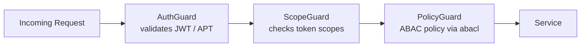
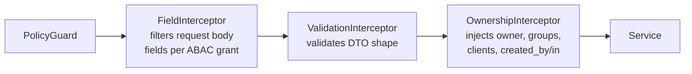

# Access Control

The Platform enforces access control through **Attribute-Based Access Control (ABAC)** — a model where read visibility is determined entirely by attributes on each document, not by roles or hardcoded rules.

## The Four Ownership Attributes

Every Platform document carries four fields that the ABAC model evaluates on every read:

| Field | Type | Controlled by | Meaning |
| --- | --- | --- | --- |
| `owner` | `string` (MongoId) | Platform (auto) | The user/app/client that created the document |
| `shares` | `string[]` (MongoIds) | Client | Other user IDs with explicit read access |
| `groups` | `string[]` (FQDN / app ID) | Platform (auto) + Client | Auto-populated from token `aid` and `domain`; all users whose email domain or app ID matches get access |
| `clients` | `string[]` (MongoIds) | Platform (auto) + Client | Auto-populated from token `cid` and coworker IDs; OAuth client applications with access |

## Zone Filtering

Clients activate ABAC filtering with the `x-zone` request header (or `?zone=` query parameter) on any read request. A zone maps to a filter condition applied against the authenticated token:

| Zone | Filter applied |
| --- | --- |
| `own` | `owner` = authenticated user/app/client (`uid ?? aid ?? cid`) |
| `share` | authenticated user is in `shares[]` |
| `group` | token's `aid` or email domain matches any entry in `groups[]` |
| `client` | token's `cid` is in `clients[]` |

### Zone Combination Logic

Zones are combinable — but the combination rules are not simple OR:

| Combination | Logic |
| --- | --- |
| `own` + `share` | **OR** — documents matching either condition are included |
| `group` + `client` | **AND** — documents must match both conditions |
| `(own/share)` + `(group/client)` | **AND** between the two sides |

Worked examples:

```
x-zone: own,share
```

Returns documents where the user is the owner **OR** is in `shares[]`.

```
x-zone: own,share,client
```

Returns documents where `(owner OR shares)` **AND** the document's `clients[]` contains the token's `cid`.

```
x-zone: group,client
```

Returns documents where the token's domain/app matches `groups[]` **AND** `clients[]` contains the token's `cid`.

The Platform default zone is `own,share`. Client applications should use `own,share,client` to include coworker-shared data.

## Automatic Injection at Write Time

The `OwnershipInterceptor` automatically injects ownership attributes when a document is created — the client does not need to supply them:

```
POST /content/notes
Authorization: Bearer <JWT>

{ "title": "My note" }
```

The Platform inserts:

- `owner` = `token.uid ?? token.aid ?? token.cid`
- `groups[]` += `token.aid` (if present) and `token.domain`
- `clients[]` += `token.cid` + all coworker client IDs from `token.coworker`
- `created_by` = `token.uid ?? token.aid ?? token.cid`
- `created_in` = `token.aid ?? token.cid`

A client may pass additional client IDs in `clients[]` at creation time; the interceptor merges them with the auto-injected values only when the caller's grant for that action is scoped `client` (`create:client`) or `any` (or it holds `any` on `all`) — otherwise the body's `clients[]` is replaced by the injected set. The same scope ladder gates the other ownership fields: a body `owner` needs `:group` or `:client`, merging `groups[]` needs `:group` or `:client`, and `shares[]` is kept only under `:share` or wider.

On **update** operations, the interceptor similarly sets `updated_by` and `updated_in` from the token.

## Guard Chain

Every request passes through three guards in order before reaching the service layer:



| Guard | Responsibility |
| --- | --- |
| `AuthGuard` | Validates token signature and expiry |
| `ScopeGuard` | Checks required OAuth scopes declared on the endpoint |
| `PolicyGuard` | Evaluates ABAC policy — action + resource against grants |

A request must pass all three guards. Failure at any stage returns `401` or `403` before any database query runs.

### Guard Details

**AuthGuard** (`/libs/common/src/core/guards/auth.guard.ts`)

- Extracts bearer token from `Authorization` header
- Validates JWT signature (HS256) or resolves APT from Redis
- Checks token expiration
- Validates token against blacklist (for logout invalidation)
- Stores validated token in `req.token` for downstream use
- On failure: `401 Unauthorized`

**ScopeGuard** (`/libs/common/src/core/guards/scope.guard.ts`)

- Retrieves required scope from endpoint `@SetScope()` decorator
- Validates `req.token.scope` contains the required scope or a higher-privilege scope
- Handles scope elevation: a `read:` scope is satisfied by a `write:` or `manage:` token scope (OAuth scope verbs — distinct from grant `Action`s)
- Supports prefix matching: `read:identity` matches `read:identity:users`
- On failure: `403 Forbidden` ("insufficient scope")

**PolicyGuard** (`/libs/common/src/core/guards/policy.guard.ts`)

- Evaluates ABAC policy from endpoint `@SetPolicy(action, object)` decorator
- Queries Redis-backed AccessControl library (ABACL) with token's subjects
- Checks if token's subjects grant the required action on the required object
- Stores permission details in `req.permission` and `req.perms`
- On failure: `403 Forbidden` ("action denied by policy")

### Read Request Flow

```
GET /identity/users (with scopes: read:identity:users)
    ↓
AuthGuard validates JWT, stores in req.token
    ↓
ScopeGuard checks token has read:identity:users ✅
    ↓
PolicyGuard checks ABACL grants for read on identity:users ✅
    ↓
AuthorityInterceptor refines query (see below)
    ↓
Service executes and returns data
```

## Authority Interceptor: Query Refinement

After all guards pass, the **AuthorityInterceptor** (`/libs/common/src/core/interceptors/mongo/authority.interceptor.ts`) runs on **read requests** to refine MongoDB queries based on ownership and grant restrictions.

### Interceptor Responsibilities

1. **Query-Field Checking**
   - Collects every field the `query` (and each `populate[].match`) uses
   - Checks each against the matching grants' `field` and `filter` lists
   - If a field is allowed by neither: returns `400 Bad Request`
   - Example: grants whose lists leave out `email` → a query on `email` is rejected

2. **Row Bounds from Zone and Action Scope**
   - Adds the requested zones' filters (`owner`, `shares`, `groups`, `clients`) to the MongoDB query
   - Caps them by the matching grant action's scope suffix — `read:own`, `read:share`, `read:group`, `read:client`; an unscoped action counts as `own` + `share`
   - Example: a `read:own` grant → `{ owner: uid }` is added to the query whatever zone is asked for
   - The grant's `filter` adds nothing here — it is an output-field list applied to responses ([Authorization → Row restrictions](../../../api/authorization.md#row-restrictions-scoped-actions-and-zones))

3. **Population Permission Checking**
   - If request includes population (relations/references), validates access to those relations
   - Example: reading user with `populate: [department]` → checks if token can read the department resource
   - Removes population if denied

4. **Soft-Delete Injection**
   - Adds a not-deleted condition (`deleted_at` unset, or `restored_at` later than it) to list queries
   - Skipped when `x-exclude-soft-delete-query` is truthy **or** the request targets one document by `:id` or `?ref=` — id/ref lookups reach soft-deleted documents too
   - A `deleted=true` query field returns only soft-deleted documents instead

5. **Group Membership Validation via Redis**
   - Checks if token's `aid` or `domain` is in the record's `groups[]` field
   - Validates group memberships via Redis cache
   - Prevents access if group membership is not confirmed

6. **Query Injection Prevention**
   - Sanitizes all filter parameters to prevent MongoDB injection attacks
   - Validates query structure before execution
   - Prevents exploitation of filter language

### Interceptor Output

The modified request continues to the service layer with:

- The Mongo query carrying the zone and action-scope bounds
- The soft-delete condition, unless skipped as above
- All validation complete ✅

Body fields outside a grant's `field` list are not this interceptor's job: `FieldInterceptor` drops them on writes (see *Write Interceptor Chain*). A failed check ends the request: `400` for a disallowed query field or a zone value naming none of the four zones, `403` when a scoped grant finds no authorized group.

## Grants

A grant says **who** (`subject`) may perform which `action` on which `object`, optionally narrowed
by `field`, `filter`, `location` and `time`. The grant model is specified once, in
[Authorization](../../../api/authorization.md): the [grant structure](../../../api/authorization.md#grant-structure)
and [subject format](../../../api/authorization.md#subject-format), the
[field lists](../../../api/authorization.md#field-lists-field-and-filter) (`field` bounds what a
request sends, `filter` what a response shows — neither selects rows), the
[scoped actions](../../../api/authorization.md#row-restrictions-scoped-actions-and-zones) that cap
which rows the zones above can reach, and
[how several matching grants combine](../../../api/authorization.md#how-matching-grants-combine).

## Scope vs Policies vs Grants

The three authorization layers work together but have distinct roles:

| Layer | What it checks | Where | Example |
|---|---|---|---|
| **Scope** | "Can this token use this action type at all?" | `ScopeGuard` | Token has `read:identity:*` → allowed to read identity resources |
| **Policy** | "Does a grant exist for this action on this resource?" | `PolicyGuard` | Grant exists: `user@example.com` can `read` `identity:users` → allowed |
| **Authority** | "What specific records can this token access?" | `AuthorityInterceptor` | Grant action is `read:own`: only records where `owner == uid` → refined query |

### Decision Flow

```
Request: POST /identity/users/64abc/profile
  ↓
ScopeGuard: "Does token have write:identity scope?" 
  ✅ YES (token.scope = "read:identity write:identity:users")
  ↓
PolicyGuard: "Does a grant allow update on identity:users?"
  ✅ YES (grant: user@example.com can update:own identity:users)
  ↓
AuthorityInterceptor: "Which records can this token write?"
  ✅ Scope :own → query bound "owner == token.uid" (can only write own records)
  ↓
Does `64abc` match the bounded query?
  ✅ YES → Operation allowed
  ❌ NO → no document matches (not owner)
```

All three layers must pass for the request to succeed.

### Write Interceptor Chain

For mutating requests (create, update, delete), an additional interceptor chain runs after the guards and before the service layer:



| Interceptor | Responsibility |
| --- | --- |
| `FieldInterceptor` | Removes request-body fields the ABAC grant does not permit the caller to set |
| `ValidationInterceptor` | Validates the remaining body against the DTO schema |
| `OwnershipInterceptor` | Injects `owner`, `groups`, `clients`, `created_by`, `created_in` (or `updated_by/in`) from the token |

## Platform Philosophy

The Platform enforces **data shape and ABAC only** — no domain-specific business rules. Rules like "a user can only have one active wallet" or "invoices can only be paid once" belong in the Client application.

See [Core Schema](./core-schema) for the document fields that ABAC operates on, and [Coworkers Space](./coworkers-space) for how the `clients[]` field enables cross-application data sharing.

## See Also

- [Authorization](/api/authorization.md) — Technical deep-dive on grants, field lists, scoped actions, and permission resolution
- [Authentication](/api/authentication.md) — Token types, issuance, and how tokens are used in requests
