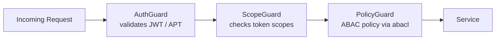
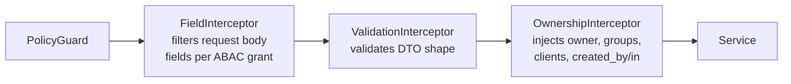

---
prev:
  text: 'Core Schema'
  link: '/getting-started/overview/key-concepts/core-schema'
next:
  text: 'Coworkers Space'
  link: '/getting-started/overview/key-concepts/coworkers-space'
---

# Access Control

The Platform enforces access control through **Attribute-Based Access Control (ABAC)** — a model where read visibility is determined entirely by attributes on each document, not by roles or hardcoded rules.

## The Four Ownership Attributes

Every Platform document carries four fields that the ABAC model evaluates on every read:

| Field | Type | Controlled by | Meaning |
| --- | --- | --- | --- |
| `owner` | `string` (MongoId) | Platform (auto) | The user/app/client that created the document |
| `shares` | `string[]` (MongoIds) | Client | Other user IDs with explicit read access |
| `groups` | `string[]` (FQDN / app ID) | Platform (auto) + Client | Auto-populated from token `aid` and `domain`; all users whose email domain or app ID matches get access |
| `clients` | `string[]` (MongoIds) | Platform (auto) + Client | Auto-populated from token `cid` and coworker IDs; OAuth client applications with access |

## Zone Filtering

Clients activate ABAC filtering with the `x-zone` request header (or `?zone=` query parameter) on any read request. A zone maps to a filter condition applied against the authenticated token:

| Zone | Filter applied |
| --- | --- |
| `own` | `owner` = authenticated user/app/client (`uid ?? aid ?? cid`) |
| `share` | authenticated user is in `shares[]` |
| `group` | token's `aid` or email domain matches any entry in `groups[]` |
| `client` | token's `cid` is in `clients[]` |

### Zone Combination Logic

Zones are combinable — but the combination rules are not simple OR:

| Combination | Logic |
| --- | --- |
| `own` + `share` | **OR** — documents matching either condition are included |
| `group` + `client` | **AND** — documents must match both conditions |
| `(own/share)` + `(group/client)` | **AND** between the two sides |

Worked examples:

```
x-zone: own,share
```

Returns documents where the user is the owner **OR** is in `shares[]`.

```
x-zone: own,share,client
```

Returns documents where `(owner OR shares)` **AND** the document's `clients[]` contains the token's `cid`.

```
x-zone: group,client
```

Returns documents where the token's domain/app matches `groups[]` **AND** `clients[]` contains the token's `cid`.

The Platform default zone is `own,share`. Client applications should use `own,share,client` to include coworker-shared data.

## Automatic Injection at Write Time

The `OwnershipInterceptor` automatically injects ownership attributes when a document is created — the client does not need to supply them:

```
POST /content/notes
Authorization: Bearer <JWT>

{ "title": "My note" }
```

The Platform inserts:

- `owner` = `token.uid ?? token.aid ?? token.cid`
- `groups[]` += `token.aid` (if present) and `token.domain`
- `clients[]` += `token.cid` + all coworker client IDs from `token.coworker`
- `created_by` = `token.uid ?? token.aid ?? token.cid`
- `created_in` = `token.aid ?? token.cid`

A client may pass additional client IDs in `clients[]` at creation time; the interceptor merges them with the auto-injected values.

On **update** operations, the interceptor similarly sets `updated_by` and `updated_in` from the token.

## Guard Chain

Every request passes through three guards in order before reaching the service layer:



| Guard | Responsibility |
| --- | --- |
| `AuthGuard` | Validates token signature and expiry |
| `ScopeGuard` | Checks required OAuth scopes declared on the endpoint |
| `PolicyGuard` | Evaluates ABAC policy — action + resource against grants |

A request must pass all three guards. Failure at any stage returns `401` or `403` before any database query runs.

## Write Interceptor Chain

For mutating requests (create, update, delete), an additional interceptor chain runs after the guards and before the service layer:



| Interceptor | Responsibility |
| --- | --- |
| `FieldInterceptor` | Removes request-body fields the ABAC grant does not permit the caller to set |
| `ValidationInterceptor` | Validates the remaining body against the DTO schema |
| `OwnershipInterceptor` | Injects `owner`, `groups`, `clients`, `created_by`, `created_in` (or `updated_by/in`) from the token |

## Scopes and Actions

OAuth scopes on a token determine which operations a token is allowed to perform. Scopes are structured as:

```plain
{action}:{service}:{collection}
```

For example: `read:identity:users`, `write:content:notes`, `manage:auth:clients`.

Standard scope requirements per operation:

| Scope | Allowed operations |
| --- | --- |
| `read` | `find`, `findOne`, `findById`, `count`, `cursor` |
| `write` | `create`, `createBulk`, `updateOne`, `updateById`, `deleteOne`, `deleteById`, `restoreOne`, `restoreById` |
| `manage` | `updateBulk`, `destroyOne`, `destroyById` + all `write` operations |

Higher-privilege scopes satisfy lower-privilege requirements — a token with `write` can also call `read` operations on the same resource.

The `PolicyGuard` evaluates ABAC grants separately from OAuth scopes — both must pass independently. A grant answers: who (`subject`) may perform what `action` on what `object`, with optional `field` and `filter` restrictions on the request/response body.

## Platform Philosophy

The Platform enforces **data shape and ABAC only** — no domain-specific business rules. Rules like "a user can only have one active wallet" or "invoices can only be paid once" belong in the Client application.

See [Core Schema](./core-schema) for the document fields that ABAC operates on, and [Coworkers Space](./coworkers-space) for how the `clients[]` field enables cross-application data sharing.
