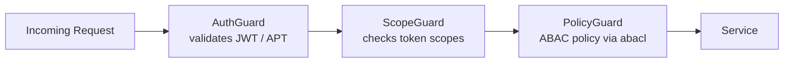
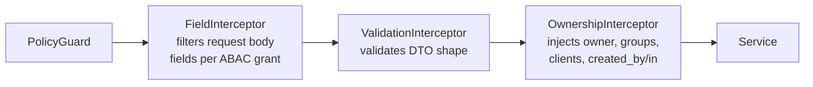

---
prev:
  text: 'Core Schema'
  link: '/getting-started/overview/key-concepts/core-schema'
next:
  text: 'Coworkers Space'
  link: '/getting-started/overview/key-concepts/coworkers-space'
---

# Access Control

The Platform enforces access control through **Attribute-Based Access Control (ABAC)** — a model where read visibility is determined entirely by attributes on each document, not by roles or hardcoded rules.

## The Four Ownership Attributes

Every Platform document carries four fields that the ABAC model evaluates on every read:

| Field | Type | Controlled by | Meaning |
| --- | --- | --- | --- |
| `owner` | `string` (MongoId) | Platform (auto) | The user/app/client that created the document |
| `shares` | `string[]` (MongoIds) | Client | Other user IDs with explicit read access |
| `groups` | `string[]` (FQDN / app ID) | Platform (auto) + Client | Auto-populated from token `aid` and `domain`; all users whose email domain or app ID matches get access |
| `clients` | `string[]` (MongoIds) | Platform (auto) + Client | Auto-populated from token `cid` and coworker IDs; OAuth client applications with access |

## Zone Filtering

Clients activate ABAC filtering with the `x-zone` request header (or `?zone=` query parameter) on any read request. A zone maps to a filter condition applied against the authenticated token:

| Zone | Filter applied |
| --- | --- |
| `own` | `owner` = authenticated user/app/client (`uid ?? aid ?? cid`) |
| `share` | authenticated user is in `shares[]` |
| `group` | token's `aid` or email domain matches any entry in `groups[]` |
| `client` | token's `cid` is in `clients[]` |

### Zone Combination Logic

Zones are combinable — but the combination rules are not simple OR:

| Combination | Logic |
| --- | --- |
| `own` + `share` | **OR** — documents matching either condition are included |
| `group` + `client` | **AND** — documents must match both conditions |
| `(own/share)` + `(group/client)` | **AND** between the two sides |

Worked examples:

```
x-zone: own,share
```

Returns documents where the user is the owner **OR** is in `shares[]`.

```
x-zone: own,share,client
```

Returns documents where `(owner OR shares)` **AND** the document's `clients[]` contains the token's `cid`.

```
x-zone: group,client
```

Returns documents where the token's domain/app matches `groups[]` **AND** `clients[]` contains the token's `cid`.

The Platform default zone is `own,share`. Client applications should use `own,share,client` to include coworker-shared data.

## Automatic Injection at Write Time

The `OwnershipInterceptor` automatically injects ownership attributes when a document is created — the client does not need to supply them:

```
POST /content/notes
Authorization: Bearer <JWT>

{ "title": "My note" }
```

The Platform inserts:

- `owner` = `token.uid ?? token.aid ?? token.cid`
- `groups[]` += `token.aid` (if present) and `token.domain`
- `clients[]` += `token.cid` + all coworker client IDs from `token.coworker`
- `created_by` = `token.uid ?? token.aid ?? token.cid`
- `created_in` = `token.aid ?? token.cid`

A client may pass additional client IDs in `clients[]` at creation time; the interceptor merges them with the auto-injected values.

On **update** operations, the interceptor similarly sets `updated_by` and `updated_in` from the token.

## Guard Chain

Every request passes through three guards in order before reaching the service layer:



| Guard | Responsibility |
| --- | --- |
| `AuthGuard` | Validates token signature and expiry |
| `ScopeGuard` | Checks required OAuth scopes declared on the endpoint |
| `PolicyGuard` | Evaluates ABAC policy — action + resource against grants |

A request must pass all three guards. Failure at any stage returns `401` or `403` before any database query runs.

### Guard Details

**AuthGuard** (`/libs/common/src/core/guards/auth.guard.ts`)

- Extracts bearer token from `Authorization` header
- Validates JWT signature (RS256) or resolves APT from Redis
- Checks token expiration
- Validates token against blacklist (for logout invalidation)
- Stores validated token in `req.token` for downstream use
- On failure: `401 Unauthorized`

**ScopeGuard** (`/libs/common/src/core/guards/scope.guard.ts`)

- Retrieves required scope from endpoint `@SetScope()` decorator
- Validates `req.token.scope` contains the required scope or a higher-privilege scope
- Handles scope elevation: `read` can be satisfied by `write` or `manage`
- Supports prefix matching: `read:identity` matches `read:identity:users`
- On failure: `403 Forbidden` ("insufficient scope")

**PolicyGuard** (`/libs/common/src/core/guards/policy.guard.ts`)

- Evaluates ABAC policy from endpoint `@SetPolicy(action, object)` decorator
- Queries Redis-backed AccessControl library (ABACL) with token's subjects
- Checks if token's subjects grant the required action on the required object
- Stores permission details in `req.permission` and `req.perms`
- On failure: `403 Forbidden` ("action denied by policy")

### Read Request Flow

```
GET /identity/users (with scopes: read:identity:users)
    ↓
AuthGuard validates JWT, stores in req.token
    ↓
ScopeGuard checks token has read:identity:users ✅
    ↓
PolicyGuard checks ABACL grants for read on identity:users ✅
    ↓
AuthorityInterceptor refines query (see below)
    ↓
Service executes and returns data
```

---

## Authority Interceptor: Query Refinement

After all guards pass, the **AuthorityInterceptor** (`/libs/common/src/core/interceptors/mongo/authority.interceptor.ts`) runs on **read requests** to refine MongoDB queries based on ownership and grant restrictions.

### Interceptor Responsibilities

1. **Field Permission Checking**
   - Extracts fields being requested (from query parameters or body)
   - Checks if the token's grants allow access to each field
   - If any field is denied: returns `403 Forbidden`
   - Example: token grants cannot access `email` field → request is rejected

2. **Filter Permission Injection**
   - Queries ABACL to get filter restrictions from grants
   - Injects these filters into the MongoDB query
   - Ensures only records matching the filter are returned
   - Example: token can only read records where `owner == uid` → `{ owner: uid }` is added to query

3. **Population Permission Checking**
   - If request includes population (relations/references), validates access to those relations
   - Example: reading user with `populate: [department]` → checks if token can read the department resource
   - Removes population if denied

4. **Soft-Delete Injection**
   - Automatically adds `{ deleted_at: null }` to queries
   - Hides soft-deleted records from all responses unless explicitly requested
   - Ensures users cannot retrieve deleted data

5. **Group Membership Validation via Redis**
   - Checks if token's `aid` or `domain` is in the record's `groups[]` field
   - Validates group memberships via Redis cache
   - Prevents access if group membership is not confirmed

6. **Query Injection Prevention**
   - Sanitizes all filter parameters to prevent MongoDB injection attacks
   - Validates query structure before execution
   - Prevents exploitation of filter language

### Interceptor Output

The modified request continues to the service layer with:

- `req.query` or `req.body.filter` updated with permission-based constraints
- Denied fields removed from `req.body`
- Soft-delete filter injected
- All validation complete ✅

If any check fails, `403 Forbidden` is returned immediately.

---

## Grant System

Grants are the foundation of ABAC authorization. A grant defines: **who** (`subject`) may perform what `action` on what `object`, with optional restrictions on `field`, `filter`, `location`, and `time`.

### Grant Structure

```typescript
interface Grant {
  subject: string;        // Role or identity (e.g., "admin", "user@domain.com", "app-id")
  action: Action;         // read, write, manage, or custom (e.g., "publish", "archive")
  object: Resource;       // Service and resource (e.g., "content:notes", "identity:users")
  
  field?: string[];       // Allowed fields — if omitted, all fields are allowed
  filter?: string[];      // Query filter constraints (MongoDB query language)
  location?: string[];    // IP whitelist (CIDR notation)
  time?: GrantTime[];     // Time-based restrictions (temporal access control)
}
```

### Subject Types

Subjects in grants can be:

| Type | Format | Example | Meaning |
|---|---|---|---|
| **Role** | `@role-name` | `@admin`, `@editor` | Anyone assigned this role |
| **User ID** | `uid@domain` | `user-123@example.com` | Specific user at domain |
| **App ID** | `aid@domain` | `my-app@example.com` | Specific app at domain |
| **Client ID** | `cid@domain` | `oauth-client@example.com` | Specific OAuth client |
| **Group** | `group-name` | `engineering`, `sales` | Named group (resolved from token) |

### Field Restrictions

When `field` is specified, the token can **only** access those fields:

```typescript
{
  subject: "@editor",
  action: "write",
  object: "content:articles",
  field: ["title", "body", "tags"]  // Can only modify these fields
}
```

Request to write `{ title: "...", author: "..." }` → `author` is rejected ❌

### Filter Restrictions

When `filter` is specified, the token **can only access records matching the filter**:

```typescript
{
  subject: "@user",
  action: "read",
  object: "content:articles",
  filter: ["{ published: true }", "{ owner: token.uid }"]  // Can read published OR owned articles
}
```

Request to list articles with `{ status: "draft" }` → filtered to only published/owned articles

### Location-Based Access

The `location` field enables IP-based restrictions:

```typescript
{
  subject: "@admin",
  action: "manage",
  object: "auth:clients",
  location: ["192.168.1.0/24", "10.0.0.5"]  // Only from these IPs
}
```

Request from outside these IPs → `403 Forbidden`

### Time-Based Restrictions

The `time` field enables temporal access control:

```typescript
{
  subject: "@contractor",
  action: "read",
  object: "identity:users",
  time: [
    {
      start: "2026-06-01T00:00:00Z",
      end: "2026-08-31T23:59:59Z"
    }
  ]  // Only accessible during summer
}
```

Request outside this window → `403 Forbidden`

---

## ABACL Permission Resolution

The **AccessControl Library** (Redis-backed) evaluates grants to determine if a token has permission. This is called **ABACL evaluation** (Attribute-Based Access Control List).

### Permission Resolution Steps

1. **Load All Grants Matching Subjects**
   - Extract all subjects from `req.token.subject` (space-separated)
   - Query grants where `subject` matches any of these subjects
   - Also query grants for roles assigned to the token (from Redis RBAC config)
   - Result: list of applicable grants

2. **Evaluate Field Restrictions**
   - For each requested field in `req.body` or query parameter:
     - Check if any grant's `field` array includes this field
     - If field is denied by all grants → reject request
   - Result: set of allowed fields

3. **Apply Filter Constraints**
   - For each grant's `filter` array:
     - Parse MongoDB query syntax
     - Inject into request's `{ ...filter }` query
   - If multiple grants exist:
     - Combine with OR logic (any matching grant allows access)
   - Result: refined query with ownership/group constraints

4. **Check Location Restrictions**
   - Extract caller IP from `X-Forwarded-For` or connection
   - Check if IP is in all applicable grants' `location` whitelists
   - If any grant denies by IP → reject request
   - Result: IP validated ✅ or ❌

5. **Check Time Restrictions**
   - Get current time
   - Check if current time is within all applicable grants' `time` windows
   - If any grant denies by time (outside window) → reject request
   - Result: time validated ✅ or ❌

6. **Return Permission Object**
   - Permission object contains callable predicates:
     - `.denied` — boolean indicating if access is denied
     - `.policies` — array of applicable grants
     - `.filter` — combined filter constraints
     - `.fields` — set of allowed fields

### Example: Manager Reading Team Users

**Token subject:** `user-123@example.com`

**Applicable grants:**

1. Role `@user` → can read own profile (filter: `owner == token.uid`)
2. Role `@manager` → can read team members (filter: `department == token.department`)

**Request:** GET `/identity/users`

**Permission resolution:**

1. Load grants for `@user` and `@manager` subjects ✅
2. Field check: all fields allowed (no field restrictions) ✅
3. Apply filters: `{ $or: [{ owner: "user-123@example.com" }, { department: "engineering" }] }` ✅
4. Location check: no location restrictions ✅
5. Time check: no time restrictions ✅
6. Return: `{ granted: true, policies: [grant1, grant2], filter: {...} }` ✅

Database returns only users matching the OR filter.

---

## Scope vs Policies vs Grants

The three authorization layers work together but have distinct roles:

| Layer | What it checks | Where | Example |
|---|---|---|---|
| **Scope** | "Can this token use this action type at all?" | `ScopeGuard` | Token has `read:identity:*` → allowed to read identity resources |
| **Policy** | "Does a grant exist for this action on this resource?" | `PolicyGuard` | Grant exists: `@user` can `read` `identity:users` → allowed |
| **Authority** | "What specific records can this token access?" | `AuthorityInterceptor` | Grant has filter: only records where `owner == uid` → refined query |

### Decision Flow

```
Request: POST /identity/users/64abc/profile
  ↓
ScopeGuard: "Does token have write:identity scope?" 
  ✅ YES (token.scope = "read:identity write:identity:users")
  ↓
PolicyGuard: "Does a grant allow write on identity:users?"
  ✅ YES (grant: @user can write identity:users)
  ↓
AuthorityInterceptor: "Which records can this token write?"
  ✅ Filter: "owner == token.uid" (can only write own records)
  ↓
Check filter: is `64abc` owned by token.uid?
  ✅ YES → Operation allowed, query refined
  ❌ NO → 403 Forbidden (not owner)
```

All three layers must pass for the request to succeed.

### Write Interceptor Chain

For mutating requests (create, update, delete), an additional interceptor chain runs after the guards and before the service layer:



| Interceptor | Responsibility |
| --- | --- |
| `FieldInterceptor` | Removes request-body fields the ABAC grant does not permit the caller to set |
| `ValidationInterceptor` | Validates the remaining body against the DTO schema |
| `OwnershipInterceptor` | Injects `owner`, `groups`, `clients`, `created_by`, `created_in` (or `updated_by/in`) from the token |

---

## Platform Philosophy

The Platform enforces **data shape and ABAC only** — no domain-specific business rules. Rules like "a user can only have one active wallet" or "invoices can only be paid once" belong in the Client application.

See [Core Schema](./core-schema) for the document fields that ABAC operates on, and [Coworkers Space](./coworkers-space) for how the `clients[]` field enables cross-application data sharing.

---

## See Also

- [Authorization](/api/authorization.md) — Technical deep-dive on grants, filters, and permission resolution
- [Authentication](/api/authentication.md) — Token types, issuance, and how tokens are used in requests
