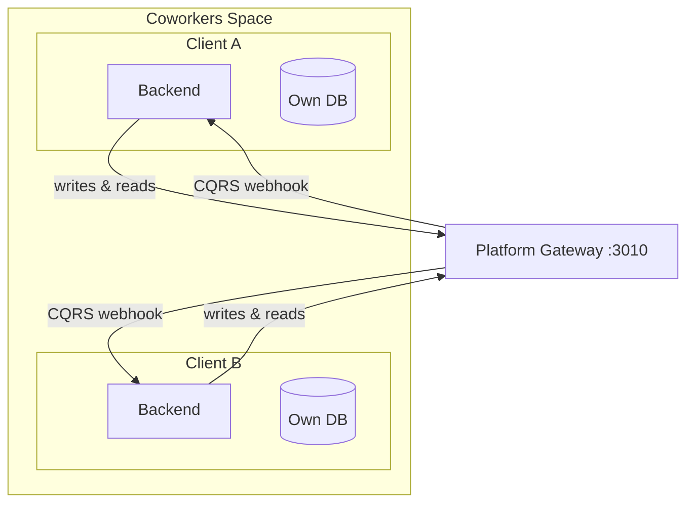
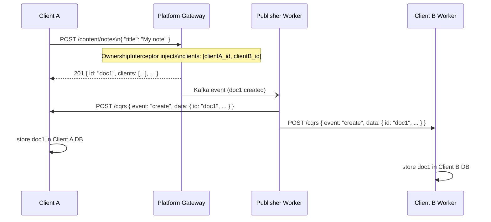

# Coworkers Space

A **Coworkers Space** is the organizational concept that groups multiple independent client applications so they can share data through the Platform. It is not a standalone Platform entity — it is expressed as a `coworkers[]` array on each OAuth client registration and injected as a claim into every JWT token issued to users of that client.

## What It Is

A Coworkers Space represents a company, team, or group of developers who collaborate and build multiple applications on top of the same Platform instance. Applications within the same space can read each other's documents without calling each other directly — all data exchange flows through the Platform.



## How It Is Represented

### On the Client Registration

Each OAuth client in `/domain/clients` carries a `coworkers` array listing the MongoIds of the other clients in its space:

```json
{
  "_id": "68fc7a456e8fa60ae29c3d02",
  "name": "Client A",
  "coworkers": ["68fc7a456e8fa60ae29c3d02", "71ab2b789f1ea71bf30d4e13"]
}
```

The client always includes its own ID in `coworkers[]`.

### In JWT Tokens

At token issuance time the Platform reads the client's `coworkers[]` and embeds them in the JWT as the `coworker` claim — a **space-separated string** of MongoIds (not an array):

```json
{
  "sub": "user_id",
  "cid": "68fc7a456e8fa60ae29c3d02",
  "client_id": "68fc7a456e8fa60ae29c3d02",
  "coworker": "68fc7a456e8fa60ae29c3d02 71ab2b789f1ea71bf30d4e13",
  "scope": "read:identity:users write:content:notes ...",
  "exp": 1748908800
}
```

> **Note:** The registration-level field (`domain/clients.coworkers[]`) is a MongoId array. The JWT claim (`coworker`) is a space-separated string. The `OwnershipInterceptor` splits this string at write time to derive the coworker ID list.

## How Data Sharing Works

When any document is **created**, the `OwnershipInterceptor` automatically injects all coworker client IDs from `token.coworker` into the document's `clients[]` field. The writing client does not need to manually list coworker IDs in the request body — sharing is automatic for all clients in the same Coworkers Space.

The Platform's `publisher` worker then delivers the document to every client listed in `clients[]` via their registered CQRS webhook.



**Rules:**

- Clients never call each other. All data exchange goes through the Platform.
- Coworker sharing is automatic — no explicit `clients[]` payload required when the `coworker` JWT claim is set.
- Both clients end up with an identical local copy of the document (same field names and structure as the Platform schema).

## Reading Coworker Data

To query documents that a coworker has shared with your client, use the `client` zone:

```
GET /content/notes?zone=client
```

This returns all documents where `token.cid` is listed in `clients[]` — which includes documents created by your own client and any documents other clients in your Coworkers Space have created.

Combine zones to broaden the query:

```
GET /content/notes?zone=own,client
```

## Wenex Client

The **Wenex Client** is the official first-party application built by the Wenex team. It operates as a normal OAuth client with no special Platform privileges — it participates in the same Coworkers model as any other client.

## Summary

| Concept | Representation |
| --- | --- |
| Coworkers Space | `coworkers[]` array on `/domain/clients` (MongoId array) |
| JWT claim | `coworker` — space-separated string of coworker client IDs |
| Joining a space | Add partner `client_id` to your own `domain/clients.coworkers[]` registration |
| Sharing a document | Automatic — `OwnershipInterceptor` injects all coworker IDs into `clients[]` on every create |
| Reading shared data | `?zone=client` — matches token's `cid` against document `clients[]` |
| Delivery mechanism | Platform `publisher` worker → CQRS webhook POST |

See [ABAC](./access-control) for how `clients[]` is evaluated during reads, and [Core Schema](./core-schema) for the full set of document ownership fields.
