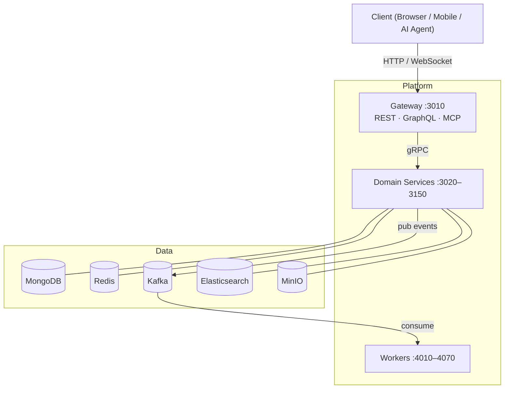

# Platform

The Wenex Platform is a distributed monorepo: one API gateway routes all external traffic to 15 domain microservices via gRPC. Workers consume Kafka events and coordinate via BullMQ. All components share a common library (`libs/common`) for DTOs, guards, interceptors, and schemas.

## Components

### Gateway

The sole public entry point. Exposes REST, GraphQL, and an MCP tool server simultaneously. Every inbound request passes through a 16-stage pipeline: identity verification (AuthGuard → ScopeGuard → PolicyGuard), caching, rate limiting, ownership injection, DTO validation, and naming-convention normalization.

### Domain Services

Fifteen domain microservices each expose the same 14 CRUD operations — `count`, `create`, `createBulk`, `find`, `cursor`, `findOne`, `findById`, `updateOne`, `updateBulk`, `updateById`, `deleteOne`, `deleteById`, `restoreOne`, `destroyOne` — with no service-specific exceptions.

| Group | Services |
| --- | --- |
| Core | auth, identity, financial |
| Organization | career, domain, context |
| Operations | essential, special, touch, content |
| Logistics | logistic, conjoint, general, thing |

### Workers

Event-driven processes that consume Kafka topics and run BullMQ jobs:

| Worker | Role |
| --- | --- |
| dispatcher | Routes events to downstream consumers |
| observer | Monitors state changes and triggers side-effects |
| preserver | Handles data retention and archival |
| watcher | Saga timeout compensation |
| publisher | Delivers CQRS webhooks to registered clients |
| logger | Elasticsearch log ingestion |
| cleaner | Scheduled data cleanup |

## Consistent CRUD Surface

Every service exposes the same operations, with soft-delete by default:

| Operation | HTTP | Effect |
| --- | --- | --- |
| `deleteOne` | `DELETE /:id` | Sets `deleted_at` — hidden from queries |
| `restoreOne` | `PUT /:id/restore` | Clears `deleted_at` — visible again |
| `destroyOne` | `DELETE /:id/destroy` | Permanent removal (requires `Manage` scope) |

For the full architecture — request pipeline stages, monorepo structure, data layer, and auth model — see the [Architecture](../../architecture) reference page.
