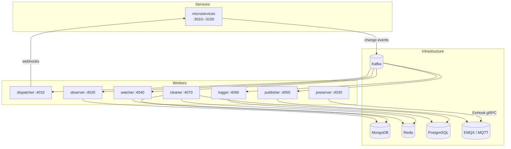
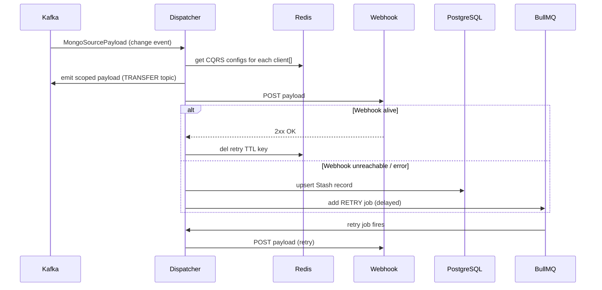
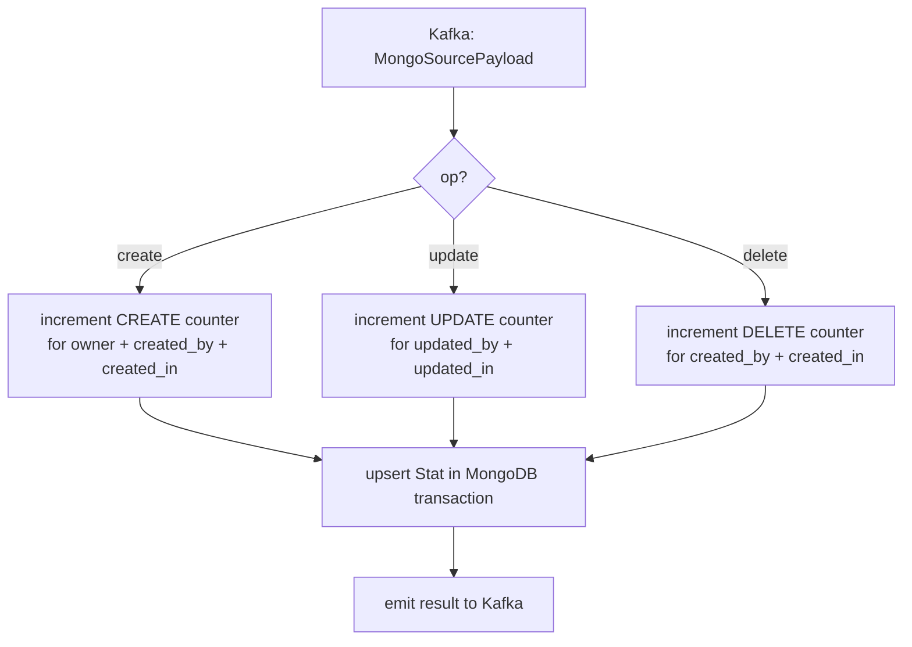
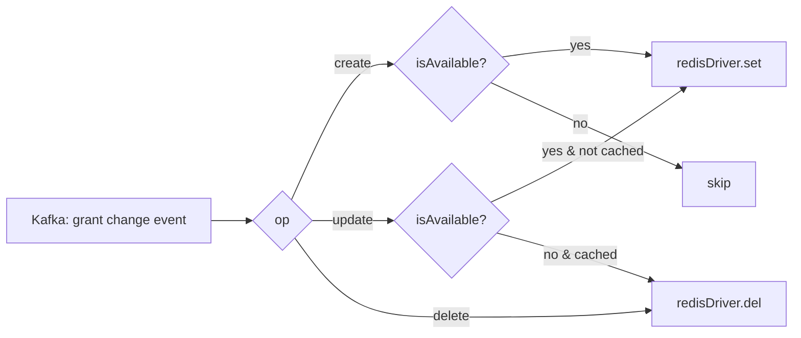
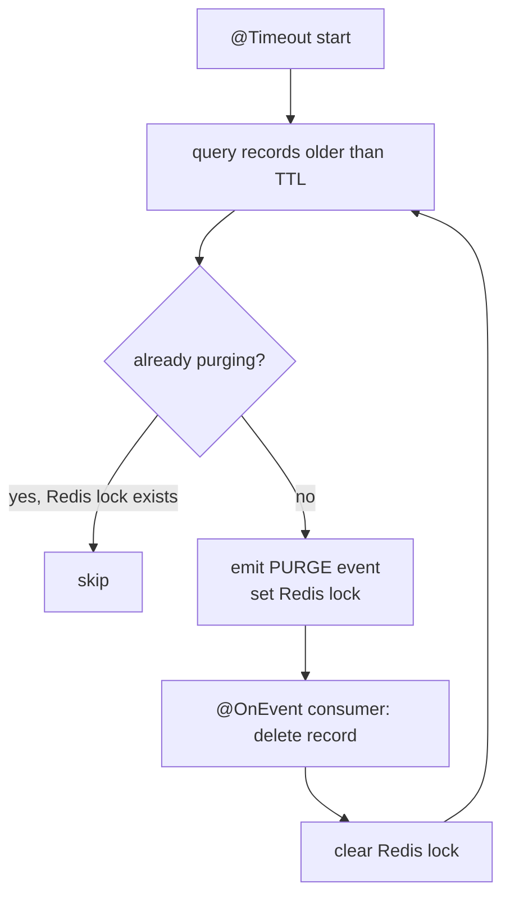

# Workers

Workers are internal background processes that consume Kafka events produced by the platform's microservices. They have no public REST API — each exposes only `GET /status` (health check) and `GET /metrics` (Prometheus).

## Overview



## Worker Summary

| Worker | Port | Role |
|---|---|---|
| [dispatcher](#dispatcher) | 4010 | Routes MongoDB change events to client webhooks via BullMQ retry queues |
| [observer](#observer) | 4020 | Aggregates create/update/delete statistics into `special/stats` |
| [preserver](#preserver) | 4030 | EMQX ExHook gRPC server — handles MQTT auth and session lifecycle |
| [watcher](#watcher) | 4040 | Syncs critical entities from MongoDB change events into Redis cache |
| [publisher](#publisher) | 4050 | Publishes MQTT messages to EMQX for entity owner/share/client topics |
| [logger](#logger) | 4060 | Persists audit log entries from Kafka to PostgreSQL |
| [cleaner](#cleaner) | 4070 | Purges expired records from MongoDB, PostgreSQL, and Redis |

## Internal Structure

Most workers share this layout:

```
apps/workers/<name>/src/
├── main.ts              # HTTP health server + Kafka consumer bootstrap
├── app.module.ts        # Root module — DB connections, BullMQ, Kafka clients
├── app.controller.ts    # HTTP: /status, /metrics
├── app.service.ts       # Core business logic invoked by processor/controller
├── app.processor.ts     # @Process() — BullMQ job handler (dispatcher only)
├── app.task.ts          # @Timeout()/@Cron() — scheduled tasks
└── modules/
    └── <domain>/
        └── <entity>/    # Domain-scoped sub-modules
```

## Health Check

Every worker exposes `/status`:

```bash
curl http://localhost:4010/status    # dispatcher
curl http://localhost:4020/status    # observer
curl http://localhost:4030/status    # preserver
curl http://localhost:4040/status    # watcher
curl http://localhost:4050/status    # publisher
curl http://localhost:4060/status    # logger
curl http://localhost:4070/status    # cleaner
```

Possible dependencies reported: `redis`, `mongo`, `pgsql`, `kafka`.

## Dispatcher

**Port:** `:4010`  
**Source:** `apps/workers/dispatcher/`

The dispatcher is the CQRS webhook delivery worker. It listens to MongoDB change stream events from Kafka, resolves which clients are subscribed via CQRS configs stored in Redis, and delivers the payload to each client's registered webhook URL.

### Responsibilities

1. **Dispatch** — on every Kafka MongoDB change event, look up all `clients[]` on the document, fetch their `context/configs` CQRS entry from Redis, and emit a scoped payload to each configured webhook via Kafka (`DISPATCHER_TRANSFER_TOPIC`).
2. **Transfer** — consume the transfer topic and POST the payload to each client's webhook URL. If the webhook is unreachable or returns an error, stash the payload in PostgreSQL for retry.
3. **Retry** — a BullMQ queue (backed by Redis) holds delayed retry jobs. A background task (`AppTask.promoter`) periodically checks stash entries and re-promotes delayed jobs when the webhook is alive again.
4. **Disable** — after `DISPATCHER_RETRY_TTL` without a successful delivery, the CQRS config in `context/configs` is automatically set to `INACTIVE`.

### Architecture



### CQRS Config Registration

Clients register a webhook by creating a `context/configs` entry:

```typescript
await platform.context.configs.create({
  key: 'CQRS',                             // ConfigKey.CQRS
  eid: '<client_id>',                      // the OAuth client's MongoDB _id
  value: { webhook: 'https://your-app/cqrs' },
});
```

The dispatcher resolves these configs from Redis (populated by the [watcher](#watcher) worker).

### BullMQ Dashboard

The dispatcher exposes a BullMQ Board UI at `/bullmq` for inspecting queue state, delayed/failed jobs, and retry counts.

### Infrastructure Dependencies

| Dependency | Usage |
|---|---|
| Kafka | Consumes change events; produces transfer topic messages |
| Redis | CQRS config cache lookups; retry TTL state; BullMQ backend |
| MongoDB | Reads `context/configs` at startup via MongoHelper |
| PostgreSQL | Stores `Stash` records for failed webhook deliveries |

### Key Files

| File | Purpose |
|---|---|
| `app.service.ts` | `dispatch()`, `transfer()`, `disable()`, `stash()` |
| `app.processor.ts` | BullMQ `@Process()` handler — invokes `transfer()` or `disable()` |
| `app.task.ts` | `@Timeout` `promoter()` — re-queues stashed jobs when webhook is alive |
| `app.controller.ts` | `/status`, `/metrics`, `/bullmq` |
| `entities/app.entity.ts` | `Stash` TypeORM entity (PostgreSQL) |

## Observer

**Port:** `:4020`  
**Source:** `apps/workers/observer/`

The observer aggregates entity-level statistics in real time. It consumes MongoDB change stream events from Kafka and maintains create/update/delete counters per owner in the `special/stats` MongoDB collection.

### Responsibilities

- Consume Kafka events carrying `MongoSourcePayload` for every service collection.
- Determine whether the operation is `create`, `update`, or `delete`.
- Derive the appropriate `StatKey` for the source collection.
- Upsert a `Stat` document in `special/stats` using a MongoDB transaction, scoped to the document's `owner`, `groups`, and `clients`.
- Skip self-referential stat events (changes to `special/stats` with aggregate stat keys) to avoid feedback loops.

### Stat Aggregation Logic



Each upsert is wrapped in a MongoDB session transaction. If the transaction fails, it is aborted and the error is re-thrown (causing Kafka to retry delivery).

### Stat Keys

Stats are keyed per collection using `StatKey` enum values following the pattern:

```
SPECIAL_COUNT__CREATE_STATS   → create operations
SPECIAL_COUNT__UPDATE_STATS   → update operations
SPECIAL_COUNT__DELETE_STATS   → delete operations
```

The collection name is resolved by `findKey()` in `stats.util.ts`.

### Infrastructure Dependencies

| Dependency | Usage |
|---|---|
| Kafka | Consumes change events; produces stat result events |
| MongoDB | Reads source collections; writes to `special/stats` |

### Key Files

| File | Purpose |
|---|---|
| `modules/stats/stats.service.ts` | `observe()` — main aggregation logic, `create/update/delete` handlers |
| `modules/stats/stats.util.ts` | `findKey()` — maps collection name to `StatKey`; `getOperation()` |
| `modules/stats/stats.type.ts` | Type definitions for stat payloads |
| `app.controller.ts` | `/status`, `/metrics` |

## Preserver

**Port:** `:4030`  
**Source:** `apps/workers/preserver/`

The preserver is the EMQX ExHook provider. It implements a gRPC server that EMQX calls for every MQTT lifecycle event — authentication, authorization, connection, disconnection, and message publishing. This lets the platform control which clients can connect to the MQTT broker and what topics they can access.

### Responsibilities

- **Authentication** (`onClientAuthenticate`) — validate MQTT client credentials against the Auth service. Rejects unknown or expired tokens.
- **Authorization** (`onClientAuthorize`) — enforce topic-level ACLs. Called before a client can publish or subscribe.
- **Connection tracking** (`onClientConnected` / `onClientDisconnected`) — log connect/disconnect events for presence tracking.
- **Message filtering** (`onMessagePublish`) — inspect outbound messages before delivery; can drop or modify them.
- **Provider lifecycle** (`onProviderLoaded` / `onProviderUnloaded`) — called by EMQX when the ExHook plugin starts or stops.

### ExHook gRPC Protocol

EMQX calls the preserver over gRPC using the ExHook spec. The proto definition lives at:

```
apps/workers/preserver/src/app.proto
apps/workers/preserver/src/protobuf/auth.proto
```

The `EmqxController` maps each ExHook method to a `@GrpcMethod`:

```
onProviderLoaded       → provider registration
onProviderUnloaded     → provider teardown
onClientAuthenticate   → MQTT CONNECT packet validation
onClientAuthorize      → publish/subscribe ACL check
onClientConnected      → post-connect hook
onClientDisconnected   → post-disconnect hook
onMessagePublish       → pre-deliver message hook
```

### Auth Integration

The preserver uses `AuthProviderModule` to verify tokens and check ABAC policies. Credentials are cached in Redis to reduce round-trips to the auth service on every MQTT packet.

### Infrastructure Dependencies

| Dependency | Usage |
|---|---|
| Redis | Token/session cache for auth lookups |
| Auth service | Token verification and ABAC policy evaluation |
| EMQX | Calls this worker via gRPC ExHook on every MQTT event |

### Key Files

| File | Purpose |
|---|---|
| `modules/emqx/emqx.controller.ts` | `@GrpcService` — all ExHook gRPC method handlers |
| `modules/emqx/emqx.service.ts` | Business logic for each hook event |
| `modules/emqx/interfaces/` | TypeScript interfaces for all ExHook request/response types |
| `modules/emqx/enums/` | `AuthorizeReqType`, `ResponseType` enums |
| `app.proto` | ExHook gRPC service definition |

## Watcher

**Port:** `:4040`  
**Source:** `apps/workers/watcher/`

The watcher keeps the Redis cache in sync with MongoDB. It consumes change stream events from Kafka and writes or removes the relevant entities in Redis so that other workers and services can perform fast in-memory lookups without hitting the database on every request.

### Responsibilities

For each Kafka change event the watcher:

1. Determines the operation type (`create`, `update`, `delete`).
2. Writes the updated entity to Redis (for `create`/`update`) or removes it (for `delete`).
3. Applies availability checks — only active/available entities are cached.

### Watched Entities

| Module | Entity | Redis Usage |
|---|---|---|
| `auth` | **Grants** | ABAC permission grants stored via `abacl-redis` `RedisDriver` |
| `auth` | **APTs** | Auth Personal Tokens cached for fast API key validation |
| `domain` | **Clients** | OAuth client records cached for token validation |
| `identity` | **Users** | User records cached for identity resolution |
| `context` | **Configs** | CQRS webhook configs read by the [dispatcher](#dispatcher) |
| `career` | **Products** | Product records cached for business logic lookups |
| `conjoint` | **Messages** | Message records cached for real-time delivery |
| `content` | **Posts** | Post records cached for content delivery |

### Grant Caching (ABAC)

Grants are handled specially through `abacl-redis`:



The `isAvailable()` check ensures only active, non-expired grants are stored. Inactive or expired grants are removed immediately.

### Infrastructure Dependencies

| Dependency | Usage |
|---|---|
| Kafka | Consumes MongoDB change stream events |
| Redis | Write target — all watched entities land here |
| MongoDB | Source of truth (via Kafka change events) |

### Key Files

| File | Purpose |
|---|---|
| `modules/auth/grants/grants.service.ts` | ABAC grant cache sync via `abacl-redis` |
| `modules/auth/apts/apts.service.ts` | APT (API key) cache sync |
| `modules/domain/clients/clients.service.ts` | OAuth client cache sync |
| `modules/identity/users/users.service.ts` | User record cache sync |
| `modules/context/configs/configs.service.ts` | CQRS config cache sync |
| `modules/career/products/products.service.ts` | Product cache sync |
| `modules/conjoint/messages/messages.service.ts` | Message cache sync |
| `modules/content/posts/posts.service.ts` | Post cache sync |

## Publisher

**Port:** `:4050`  
**Source:** `apps/workers/publisher/`

The publisher delivers real-time MQTT notifications to connected clients. On every MongoDB change event it resolves the set of MQTT topics that should be notified based on the document's `owner`, `shares`, and `clients` fields, then publishes a message to each topic via EMQX's HTTP API.

### Responsibilities

- Consume Kafka MongoDB change stream events (`MongoSourcePayload`).
- Derive MQTT topic paths from the document's access metadata.
- Bulk-publish QoS-2 messages to EMQX for each resolved topic.

### Topic Resolution

For a document with `owner`, `shares[]`, and `clients[]` in database `db` with `id` and `collection`:

```
{owner}/{db}/{id}/{collection}
{share}/{db}/{id}/{collection}           (for each share)
{client}/{db}/{id}/{collection}          (for each client)
{client}/{owner}/{db}/{id}/{collection}  (cross-scoped: client + owner)
{client}/{share}/{db}/{id}/{collection}  (cross-scoped: client + share, for each share)
```

Duplicate topics are deduplicated before publishing.

### Message Format

Each message is published with:

```json
{
  "topic": "<resolved-topic>",
  "qos": 2,
  "retain": false,
  "payload_encoding": "plain",
  "payload": "{\"id\":\"<entity_id>\",\"op\":\"c|u|d\",\"src\":\"<collection-type>\"}"
}
```

The `payload` contains only the entity ID, operation type, and source collection — subscribers fetch the full entity from the API if needed.

### Bulk Publishing

All resolved messages for a single change event are sent in one `publishMessageBulk` call to EMQX, minimizing HTTP round-trips.

### Infrastructure Dependencies

| Dependency | Usage |
|---|---|
| Kafka | Consumes MongoDB change stream events |
| EMQX | Receives bulk MQTT publish requests via HTTP API |

### Key Files

| File | Purpose |
|---|---|
| `app.service.ts` | `publish()` — topic resolution and bulk EMQX publish |
| `app.controller.ts` | `/status`, `/metrics` |

## Logger

**Port:** `:4060`  
**Source:** `apps/workers/logger/`

The logger persists audit records to PostgreSQL. It consumes audit log events emitted by all platform services via Kafka and writes them to a durable relational store for compliance, debugging, and traceability.

### Responsibilities

- Consume `LoggerInterface` payloads from Kafka.
- Persist each payload as an `Audit` record in PostgreSQL via `AuditsService`.

### Audit Record

The `Audit` entity (defined in `modules/audits/entities/audit.entity.ts`) stores the structured log emitted by services when handling requests. Fields typically include the requesting user, client, action performed, target resource, and timestamps.

### Infrastructure Dependencies

| Dependency | Usage |
|---|---|
| Kafka | Consumes audit log events from all services |
| PostgreSQL | Stores `Audit` records for durable retention |

### Retention

Expired audit records are purged by the [cleaner](#cleaner) worker based on the `CLEANER_AUDIT_LOGS_TTL` environment variable (defaults to 100 days).

### Key Files

| File | Purpose |
|---|---|
| `app.service.ts` | `audit()` — delegates to `AuditsService.create()` |
| `app.controller.ts` | `/status`, `/metrics` |
| `modules/audits/audits.service.ts` | Persists `LoggerInterface` payload to PostgreSQL |
| `modules/audits/entities/audit.entity.ts` | TypeORM `Audit` entity definition |

## Cleaner

**Port:** `:4070`  
**Source:** `apps/workers/cleaner/`

The cleaner is the data retention worker. It runs continuous background loops to find and purge expired records across MongoDB, PostgreSQL, and Redis. Each sub-module handles one category of data with its own TTL and concurrency guard.

### Responsibilities

| Module | Data Cleaned | Store | TTL Env Var |
|---|---|---|---|
| `AuditsModule` | Audit log records | PostgreSQL | `CLEANER_AUDIT_LOGS_TTL` |
| `StatsModule` | Aggregated stat entries | MongoDB | `CLEANER_STATS_TTL` |
| `SagasModule` | Completed saga stage records | PostgreSQL | `CLEANER_SAGAS_TTL` |
| `MetricsModule` | IoT metric time-series | MongoDB | `CLEANER_METRICS_TTL` |
| `StashesModule` | Dispatcher stash records | PostgreSQL | `CLEANER_STASH_LOGS_TTL` |

All TTL values default to `100 days` if not set.

### Purge Loop Pattern

Every sub-module follows the same producer/consumer pattern:



A Redis key is set per record being purged to prevent duplicate deletions if the loop runs faster than the delete operation. The lock is always cleared in a `finally` block.

### Infrastructure Dependencies

| Dependency | Usage |
|---|---|
| MongoDB | Purges expired `Stats` and `Metrics` records |
| PostgreSQL | Purges expired `Audits`, `Sagas`, and `Stashes` |
| Redis | Tracks in-progress purge state to prevent duplicate deletions |

### Key Files

| File | Purpose |
|---|---|
| `modules/logger/audits/audits.service.ts` | Purge loop for audit logs |
| `modules/special/stats/stats.service.ts` | Purge loop for stat entries |
| `modules/essential/sagas/sagas.service.ts` | Purge loop for saga stage records |
| `modules/thing/metrics/metrics.service.ts` | Purge loop for IoT metric readings |
| `modules/dispatcher/stashes/stashes.service.ts` | Purge loop for dispatcher stash records |
| `app.service.ts` | Worker health and initialization |
