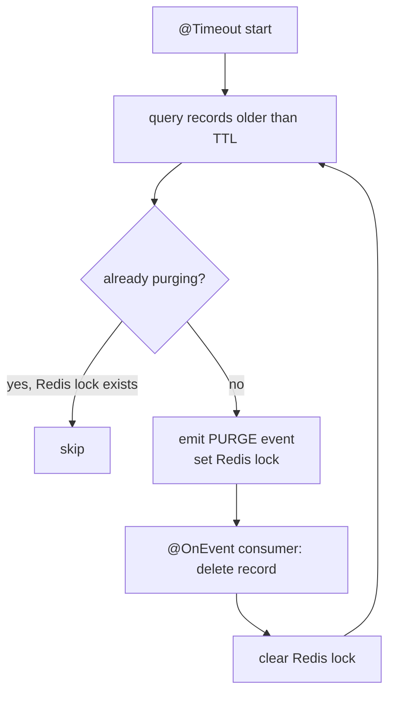

# Cleaner

**Port:** `:4070`  
**Source:** `apps/workers/cleaner/`

The cleaner is the data retention worker. It runs continuous background loops to find and purge expired records across MongoDB, PostgreSQL, and Redis. Each sub-module handles one category of data with its own TTL and concurrency guard.

## Responsibilities

| Module | Data Cleaned | Store | TTL Env Var |
|---|---|---|---|
| `AuditsModule` | Audit log records | PostgreSQL | `CLEANER_AUDIT_LOGS_TTL` |
| `StatsModule` | Aggregated stat entries | MongoDB | `CLEANER_STATS_TTL` |
| `SagasModule` | Completed saga stage records | PostgreSQL | `CLEANER_SAGAS_TTL` |
| `MetricsModule` | IoT metric time-series | MongoDB | `CLEANER_METRICS_TTL` |
| `StashesModule` | Dispatcher stash records | PostgreSQL | `CLEANER_STASH_LOGS_TTL` |

All TTL values default to `100 days` if not set.

## Purge Loop Pattern

Every sub-module follows the same producer/consumer pattern:

A Redis key is set per record being purged to prevent duplicate deletions if the loop runs faster than the delete operation. The lock is always cleared in a `finally` block.

## Infrastructure Dependencies

| Dependency | Usage |
|---|---|
| MongoDB | Purges expired `Stats` and `Metrics` records |
| PostgreSQL | Purges expired `Audits`, `Sagas`, and `Stashes` |
| Redis | Tracks in-progress purge state to prevent duplicate deletions |

## Key Files

| File | Purpose |
|---|---|
| `modules/logger/audits/audits.service.ts` | Purge loop for audit logs |
| `modules/special/stats/stats.service.ts` | Purge loop for stat entries |
| `modules/essential/sagas/sagas.service.ts` | Purge loop for saga stage records |
| `modules/thing/metrics/metrics.service.ts` | Purge loop for IoT metric readings |
| `modules/dispatcher/stashes/stashes.service.ts` | Purge loop for dispatcher stash records |
| `app.service.ts` | Worker health and initialization |
