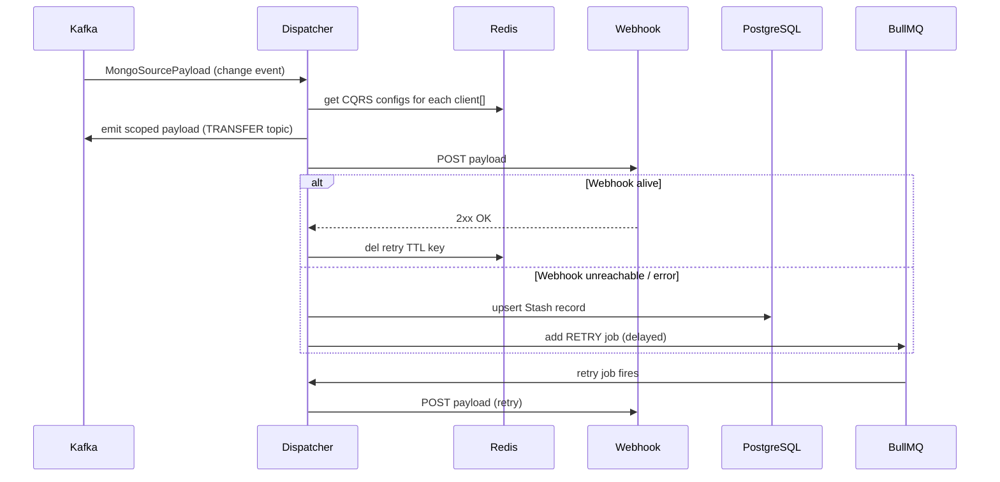

# Dispatcher

**Port:** `:4010`  
**Source:** `apps/workers/dispatcher/`

The dispatcher is the CQRS webhook delivery worker. It listens to MongoDB change stream events from Kafka, resolves which clients are subscribed via CQRS configs stored in Redis, and delivers the payload to each client's registered webhook URL.

## Responsibilities

1. **Dispatch** — on every Kafka MongoDB change event, look up all `clients[]` on the document, fetch their `context/configs` CQRS entry from Redis, and emit a scoped payload to each configured webhook via Kafka (`DISPATCHER_TRANSFER_TOPIC`).
2. **Transfer** — consume the transfer topic and POST the payload to each client's webhook URL. If the webhook is unreachable or returns an error, stash the payload in PostgreSQL for retry.
3. **Retry** — a BullMQ queue (backed by Redis) holds delayed retry jobs. A background task (`AppTask.promoter`) periodically checks stash entries and re-promotes delayed jobs when the webhook is alive again.
4. **Disable** — after `DISPATCHER_RETRY_TTL` without a successful delivery, the CQRS config in `context/configs` is automatically set to `INACTIVE`.

## Architecture



## CQRS Config Registration

Clients register a webhook by creating a `context/configs` entry:

```typescript
await platform.context.configs.create({
  key: 'CQRS',                             // ConfigKey.CQRS
  eid: '<client_id>',                      // the OAuth client's MongoDB _id
  value: { webhook: 'https://your-app/cqrs' },
});
```

The dispatcher resolves these configs from Redis (populated by the [watcher](./watcher) worker).

## BullMQ Dashboard

The dispatcher exposes a BullMQ Board UI at `/bullmq` for inspecting queue state, delayed/failed jobs, and retry counts.

## Infrastructure Dependencies

| Dependency | Usage |
|---|---|
| Kafka | Consumes change events; produces transfer topic messages |
| Redis | CQRS config cache lookups; retry TTL state; BullMQ backend |
| MongoDB | Reads `context/configs` at startup via MongoHelper |
| PostgreSQL | Stores `Stash` records for failed webhook deliveries |

## Key Files

| File | Purpose |
|---|---|
| `app.service.ts` | `dispatch()`, `transfer()`, `disable()`, `stash()` |
| `app.processor.ts` | BullMQ `@Process()` handler — invokes `transfer()` or `disable()` |
| `app.task.ts` | `@Timeout` `promoter()` — re-queues stashed jobs when webhook is alive |
| `app.controller.ts` | `/status`, `/metrics`, `/bullmq` |
| `entities/app.entity.ts` | `Stash` TypeORM entity (PostgreSQL) |
