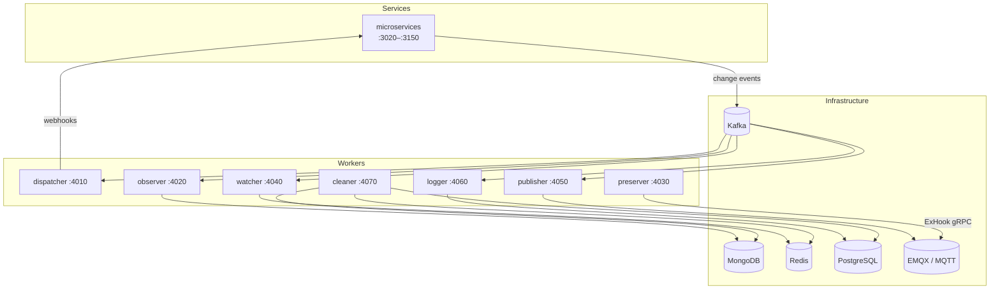

# Workers

Workers are internal background processes that consume Kafka events produced by the platform's microservices. They have no public REST API — each exposes only `GET /status` (health check) and `GET /metrics` (Prometheus).

## Overview



## Worker Summary

| Worker | Port | Role |
|---|---|---|
| [Dispatcher](./dispatcher) | 4010 | Routes MongoDB change events to client webhooks via BullMQ retry queues |
| [Observer](./observer) | 4020 | Aggregates create/update/delete statistics into `special/stats` |
| [Preserver](./preserver) | 4030 | EMQX ExHook gRPC server — handles MQTT auth and session lifecycle |
| [Watcher](./watcher) | 4040 | Syncs critical entities from MongoDB change events into Redis cache |
| [Publisher](./publisher) | 4050 | Publishes MQTT messages to EMQX for entity owner/share/client topics |
| [Logger](./logger) | 4060 | Persists audit log entries from Kafka to PostgreSQL |
| [Cleaner](./cleaner) | 4070 | Purges expired records from MongoDB, PostgreSQL, and Redis |

## Internal Structure

Most workers share this layout:

```
apps/workers/<name>/src/
├── main.ts              # HTTP health server + Kafka consumer bootstrap
├── app.module.ts        # Root module — DB connections, BullMQ, Kafka clients
├── app.controller.ts    # HTTP: /status, /metrics
├── app.service.ts       # Core business logic invoked by processor/controller
├── app.processor.ts     # @Process() — BullMQ job handler (dispatcher only)
├── app.task.ts          # @Timeout()/@Cron() — scheduled tasks
└── modules/
    └── <domain>/
        └── <entity>/    # Domain-scoped sub-modules
```

## Health Check

Every worker exposes `/status`:

```bash
curl http://localhost:4010/status    # dispatcher
curl http://localhost:4020/status    # observer
curl http://localhost:4030/status    # preserver
curl http://localhost:4040/status    # watcher
curl http://localhost:4050/status    # publisher
curl http://localhost:4060/status    # logger
curl http://localhost:4070/status    # cleaner
```

Possible dependencies reported: `redis`, `mongo`, `pgsql`, `kafka`.
