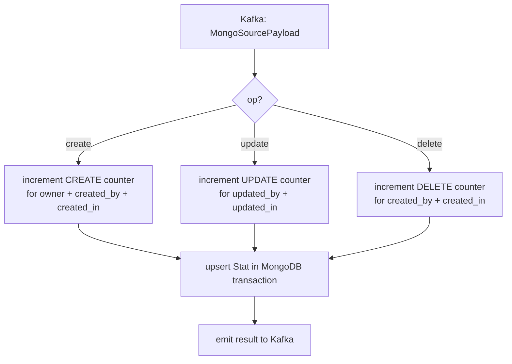

# Observer

**Port:** `:4020`  
**Source:** `apps/workers/observer/`

The observer aggregates entity-level statistics in real time. It consumes MongoDB change stream events from Kafka and maintains create/update/delete counters per owner in the `special/stats` MongoDB collection.

## Responsibilities

- Consume Kafka events carrying `MongoSourcePayload` for every service collection.
- Determine whether the operation is `create`, `update`, or `delete`.
- Derive the appropriate `StatKey` for the source collection.
- Upsert a `Stat` document in `special/stats` using a MongoDB transaction, scoped to the document's `owner`, `groups`, and `clients`.
- Skip self-referential stat events (changes to `special/stats` with aggregate stat keys) to avoid feedback loops.

## Stat Aggregation Logic



Each upsert is wrapped in a MongoDB session transaction. If the transaction fails, it is aborted and the error is re-thrown (causing Kafka to retry delivery).

## Stat Keys

Stats are keyed per collection using `StatKey` enum values following the pattern:

```
SPECIAL_COUNT__CREATE_STATS   → create operations
SPECIAL_COUNT__UPDATE_STATS   → update operations
SPECIAL_COUNT__DELETE_STATS   → delete operations
```

The collection name is resolved by `findKey()` in `stats.util.ts`.

## Infrastructure Dependencies

| Dependency | Usage |
|---|---|
| Kafka | Consumes change events; produces stat result events |
| MongoDB | Reads source collections; writes to `special/stats` |

## Key Files

| File | Purpose |
|---|---|
| `modules/stats/stats.service.ts` | `observe()` — main aggregation logic, `create/update/delete` handlers |
| `modules/stats/stats.util.ts` | `findKey()` — maps collection name to `StatKey`; `getOperation()` |
| `modules/stats/stats.type.ts` | Type definitions for stat payloads |
| `app.controller.ts` | `/status`, `/metrics` |
