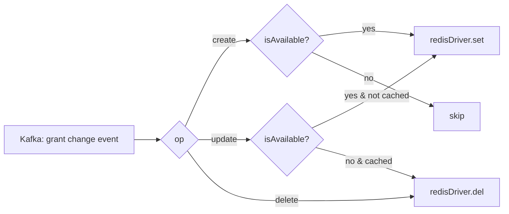

# Watcher

**Port:** `:4040`  
**Source:** `apps/workers/watcher/`

The watcher keeps two read-side stores in sync with MongoDB. It consumes change stream events from Kafka and writes or removes the relevant entities — grants, APTs, OAuth clients, users and CQRS configs in Redis, so other workers and services can look them up without hitting the database on every request; products, messages and posts in Elasticsearch, where the `search` endpoints query them.

## Responsibilities

For each Kafka change event the watcher:

1. Determines the operation type (`create`, `update`, `delete`).
2. Writes the updated entity to its store — Redis or an Elasticsearch index — (for `create`/`update`) or removes it (for `delete`).
3. Applies availability checks to the Redis entities — only active/available ones are cached.

## Watched Entities

| Module | Entity | Store and usage |
|---|---|---|
| `auth` | **Grants** | Redis — ABAC permission grants stored via `abacl-redis` `RedisDriver` |
| `auth` | **APTs** | Redis — Auth Personal Tokens cached for fast API key validation |
| `domain` | **Clients** | Redis — OAuth client records cached for token validation |
| `identity` | **Users** | Redis — user records cached for identity resolution |
| `context` | **Configs** | Redis — CQRS webhook configs read by the [dispatcher](./dispatcher) |
| `career` | **Products** | Elasticsearch — `career` `products` index, queried by `career/products` search |
| `conjoint` | **Messages** | Elasticsearch — `conjoint` `messages` index, queried by `conjoint/messages` search |
| `content` | **Posts** | Elasticsearch — `content` `posts` index, queried by `content/posts` search |

## Grant Caching (ABAC)

Grants are handled specially through `abacl-redis`:

The `isAvailable()` check ensures only active, non-expired grants are stored. Inactive or expired grants are removed immediately.

## Infrastructure Dependencies

| Dependency | Usage |
|---|---|
| Kafka | Consumes MongoDB change stream events |
| Redis | Write target for grants, APTs, clients, users and configs |
| Elasticsearch | Write target for products, messages and posts (index names carry `ELASTIC_PREFIX`) |
| MongoDB | Source of truth (via Kafka change events) |

## Key Files

| File | Purpose |
|---|---|
| `modules/auth/grants/grants.service.ts` | ABAC grant cache sync via `abacl-redis` |
| `modules/auth/apts/apts.service.ts` | APT (API key) cache sync |
| `modules/domain/clients/clients.service.ts` | OAuth client cache sync |
| `modules/identity/users/users.service.ts` | User record cache sync |
| `modules/context/configs/configs.service.ts` | CQRS config cache sync |
| `modules/career/products/products.service.ts` | Product search-index sync |
| `modules/conjoint/messages/messages.service.ts` | Message search-index sync |
| `modules/content/posts/posts.service.ts` | Post search-index sync |
