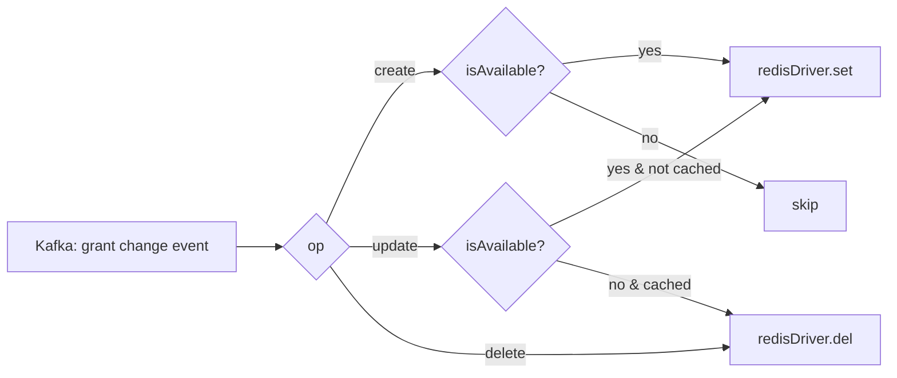

# Watcher

**Port:** `:4040`  
**Source:** `apps/workers/watcher/`

The watcher keeps the Redis cache in sync with MongoDB. It consumes change stream events from Kafka and writes or removes the relevant entities in Redis so that other workers and services can perform fast in-memory lookups without hitting the database on every request.

## Responsibilities

For each Kafka change event the watcher:

1. Determines the operation type (`create`, `update`, `delete`).
2. Writes the updated entity to Redis (for `create`/`update`) or removes it (for `delete`).
3. Applies availability checks — only active/available entities are cached.

## Watched Entities

| Module | Entity | Redis Usage |
|---|---|---|
| `auth` | **Grants** | ABAC permission grants stored via `abacl-redis` `RedisDriver` |
| `auth` | **APTs** | Auth Personal Tokens cached for fast API key validation |
| `domain` | **Clients** | OAuth client records cached for token validation |
| `identity` | **Users** | User records cached for identity resolution |
| `context` | **Configs** | CQRS webhook configs read by the [dispatcher](./dispatcher) |
| `career` | **Products** | Product records cached for business logic lookups |
| `conjoint` | **Messages** | Message records cached for real-time delivery |
| `content` | **Posts** | Post records cached for content delivery |

## Grant Caching (ABAC)

Grants are handled specially through `abacl-redis`:

The `isAvailable()` check ensures only active, non-expired grants are stored. Inactive or expired grants are removed immediately.

## Infrastructure Dependencies

| Dependency | Usage |
|---|---|
| Kafka | Consumes MongoDB change stream events |
| Redis | Write target — all watched entities land here |
| MongoDB | Source of truth (via Kafka change events) |

## Key Files

| File | Purpose |
|---|---|
| `modules/auth/grants/grants.service.ts` | ABAC grant cache sync via `abacl-redis` |
| `modules/auth/apts/apts.service.ts` | APT (API key) cache sync |
| `modules/domain/clients/clients.service.ts` | OAuth client cache sync |
| `modules/identity/users/users.service.ts` | User record cache sync |
| `modules/context/configs/configs.service.ts` | CQRS config cache sync |
| `modules/career/products/products.service.ts` | Product cache sync |
| `modules/conjoint/messages/messages.service.ts` | Message cache sync |
| `modules/content/posts/posts.service.ts` | Post cache sync |
