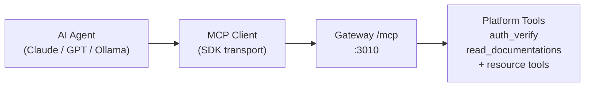
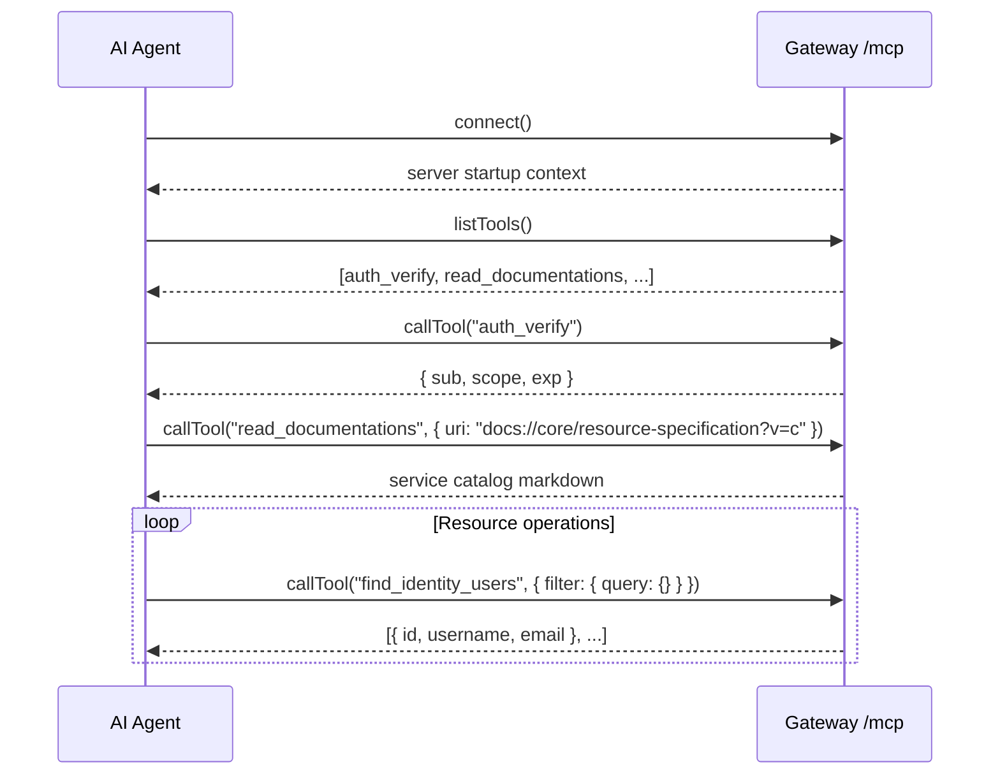

# MCP Integration — Model Context Protocol

The Wenex Platform gateway exposes an MCP (Model Context Protocol) server at `GET /mcp`. This allows AI agents (Claude, GPT, Ollama-backed agents) to interact with the platform programmatically using the standardized tool-use protocol.

**Endpoint:** `http://localhost:3010/mcp`
**Transport:** Streamable HTTP (HTTP/1.1 chunked)
**Protocol:** MCP v1 (JSON-RPC over HTTP)

---

## What is MCP?

MCP is an open protocol that lets AI models communicate with external tools using a structured JSON-RPC interface. The platform acts as an MCP server, exposing tools that agents can call to query and manipulate data.



---

## Built-in MCP Tools

The gateway registers two core tools available to all agents:

### `auth_verify`

Verifies the agent's current APT (Auth Personal Token) and returns the decoded claims.

**Call this tool first** before any resource operation to confirm identity and understand what scopes are available.

**Input schema:**

```json
{
  "type": "object",
  "properties": {
    "headers": {
      "type": "object",
      "description": "Optional request headers to inspect"
    }
  }
}
```

**Example output:**

```json
{
  "sub": "64a1b2c3d4e5f6a7b8c9d0e1",
  "scope": "read:identity:users read:financial:transactions",
  "zone": "own",
  "exp": 1748908800,
  "client_id": "64a1b2c3d4e5f6a7b8c9d0e2"
}
```

---

### `read_documentations`

Loads MCP specification documentation by URI. This allows agents to self-serve context about the platform's capabilities, resources, and operations.

**Input schema:**

```json
{
  "type": "object",
  "required": ["uri"],
  "properties": {
    "uri": {
      "type": "string",
      "description": "Documentation URI, e.g. docs://core/specification?v=c"
    }
  }
}
```

**URI patterns:**

| URI | Content |
|---|---|
| `docs://core/specification?v=c` | Compact canonical MCP specification |
| `docs://core/specification?v=e` | Extended canonical MCP specification |
| `docs://core/resource-specification?v=c` | Service and collection catalog (compact) |
| `docs://core/auth-specification?v=c` | Authentication mechanics (compact) |
| `docs://core/agent-guidance?v=c` | Agent guidance and MongoDB patterns |
| `docs://core/cross-service-pattern?v=c` | Multi-service workflow patterns |
| `docs://service/identity?v=c` | Identity service documentation |
| `docs://service/financial?v=c` | Financial service documentation |
| `docs://service/career?v=c` | Career service documentation |

Version parameter: `v=c` (compact — fewer tokens) or `v=e` (extended — more detail).

---

## Connecting an Agent

### Using the MCP TypeScript SDK

```typescript
import { StreamableHTTPClientTransport } from '@modelcontextprotocol/sdk/client/streamableHttp.js';
import { Client } from '@modelcontextprotocol/sdk/client/index.js';

const transport = new StreamableHTTPClientTransport(
  new URL('http://localhost:3010/mcp'),
  {
    requestInit: {
      headers: {
        'Content-Type': 'application/json',
        Authorization: `Bearer ${process.env.WENEX_APT_TOKEN}`,
      },
    },
  },
);

const mcp = new Client({ name: 'my-agent', version: '1.0.0' });
await mcp.connect(transport);

// List available tools
const { tools } = await mcp.listTools();
console.log(tools.map((t) => t.name));

// Call a tool
const result = await mcp.callTool({
  name: 'auth_verify',
  arguments: {},
});
console.log(result);
```

---

## Using `mcp-client.ts`

The platform ships a ready-to-use interactive MCP client at [`mcp-client.ts`](../../mcp-client.ts) that connects to the gateway and uses Ollama as the LLM backend.

### Prerequisites

```bash
# Start a local Ollama instance
ollama run qwen3:30b

# Or tunnel from a remote GPU
ssh -L 11434:localhost:11434 user@gpu-host
```

### Running the Client

```bash
# Set your auth token
export MCP_CLIENT_APT_TOKEN="apt_..."

# Run the interactive client
npx ts-node mcp-client.ts
```

The client:
1. Connects to `http://127.0.0.1:3010/mcp`
2. Loads all available tools
3. Captures the server's startup context prompt
4. Enters an interactive chat loop where the LLM can call platform tools

### Client Configuration

```typescript
const DEFAULT_CONFIG = {
  maxToolRounds: 10,            // Max tool calls per user turn
  maxHistoryMessages: 50,       // Sliding context window
  defaultModel: 'qwen3.6:35b', // Ollama model
  ollamaHost: 'http://localhost:11434',
  mcpServerUrl: 'http://127.0.0.1:3010/mcp',
};
```

Override via constructor:

```typescript
const client = new ClientMCP({
  mcpServerUrl: 'https://api.yourdomain.com/mcp',
  defaultModel: 'llama3.1:70b',
  maxToolRounds: 20,
});
```

---

## Service-Specific MCP Tools

Each gateway module can register additional MCP tools in its `*.router.ts` file. These tools expose the service's CRUD operations as named MCP tools.

Router files are located at:

```
apps/gateway/src/modules/{service}/crafts/{collection}/{collection}.router.ts
apps/gateway/src/app.router.ts  (core tools: auth_verify, read_documentations)
```

---

## Agent Workflow

A typical agent interaction with the platform:



---

## Authentication for MCP

MCP connections require an APT (Auth Personal Token) passed as a Bearer token in the HTTP headers:

```typescript
headers: {
  Authorization: `Bearer ${aptToken}`,
}
```

Create an APT with the minimum scopes required for your agent:

```bash
curl -X POST http://localhost:3010/auth/apts \
  -H "Authorization: Bearer $ADMIN_TOKEN" \
  -H "Content-Type: application/json" \
  -d '{
    "name": "my-ai-agent",
    "scope": "read:identity:users read:financial:transactions",
    "description": "Read-only agent for analytics"
  }'
```

Store the returned `token` — it is shown only once.

---

## MCP Documentation Spec Files

The `mcp/` directory contains the specification files served by `read_documentations`:

```
mcp/
├── readme.md                              # MCP routing guide (not a tool)
├── core/
│   ├── -specification.compact.md          # Canonical MCP rules (compact)
│   ├── -specification.extended.md         # Canonical MCP rules (extended)
│   ├── resource-specification.compact.md  # Service/collection catalog
│   ├── resource-specification.extended.md
│   ├── auth-specification.compact.md      # Auth mechanics
│   ├── auth-specification.extended.md
│   ├── agent-guidance.compact.md          # MongoDB query patterns for agents
│   ├── agent-guidance.extended.md
│   └── cross-service-pattern.compact.md   # Multi-service workflow patterns
└── service/
    ├── identity.compact.md
    ├── identity.extended.md
    ├── financial.compact.md
    ├── financial.extended.md
    └── ... (one pair per service)
```

**Compact vs Extended:**

| Variant | Use when |
|---|---|
| `?v=c` (compact) | Agent context is limited; decision-first, minimal prose |
| `?v=e` (extended) | Agent needs full rationale, richer examples, edge cases |

---

## Observability

MCP requests flow through the same middleware pipeline as REST requests:

- Prometheus metrics at `/metrics` include MCP tool call counts
- OpenTelemetry traces capture tool execution spans
- `X-Request-ID` header propagates through MCP calls for correlation
- Rate limiting applies to MCP connections per-token

---

## Security Considerations

- Always use an APT with minimal required scopes — not an admin JWT
- APTs can be revoked at any time via `DELETE /auth/apts/:id`
- `auth_verify` lets agents self-check their token before making calls
- All MCP tool calls are subject to the same `AuthGuard`, `ScopeGuard`, and `PolicyGuard` as REST requests
- MCP connections do not bypass rate limits
