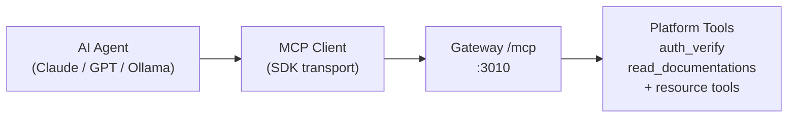
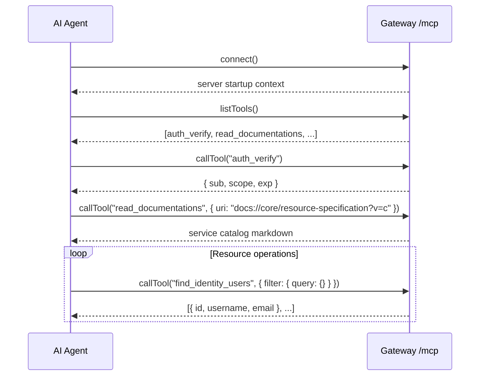

# MCP Integration — Model Context Protocol

The Wenex Platform gateway exposes an MCP (Model Context Protocol) server at `GET /mcp`. This allows AI agents (Claude, GPT, Ollama-backed agents) to interact with the platform programmatically using the standardized tool-use protocol.

**Endpoint:** `http://localhost:3010/mcp`
**Transport:** Streamable HTTP (HTTP/1.1 chunked)
**Protocol:** MCP v1 (JSON-RPC over HTTP)

---

## What is MCP?

MCP is an open protocol that lets AI models communicate with external tools using a structured JSON-RPC interface. The platform acts as an MCP server, exposing tools that agents can call to query and manipulate data.

---

## Agent Workflow

A typical agent interaction with the platform:

---

- See [Tools Reference](./tools) for available built-in and service-specific tools.
- See [Integration Guide](./integration) for SDK setup, authentication, and security.
