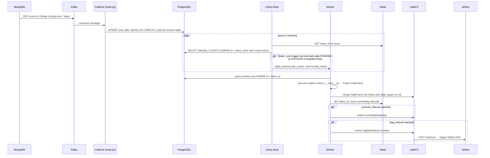
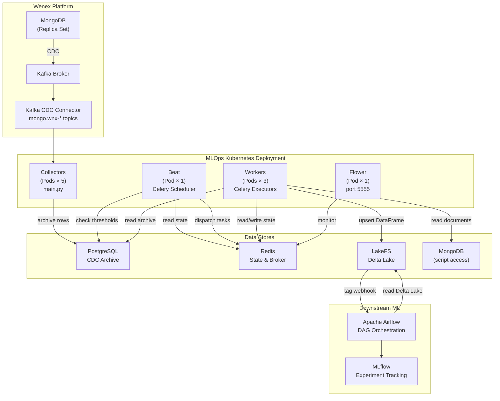

# MLOps Architecture

The MLOps system connects the Wenex platform's operational data to a versioned ML-ready data lake. It captures MongoDB document changes through Kafka CDC, keeps each changed document's latest state in a PostgreSQL archive, and periodically transforms it into Delta Lake tables in LakeFS via configurable Python scripts.

## Components

| Component | Entry Point | Role |
| --- | --- | --- |
| **Collector** | `main.py` | Kafka consumer — subscribes to `mongo.wnx-*` CDC topics and upserts each document's `before`/`after` JSON into a PostgreSQL archive table, one row per document |
| **Beat** | `tasks.db_check` | Celery scheduler — runs every 5 minutes to check whether any script's [`batch_size` trigger](./scripts#config-yaml-field-reference) is met, then queues a `script_runner` task |
| **Beat** | `tasks.db_clean` | Celery scheduler — runs every 4 hours to drop orphaned PG tables, remove stale Redis keys, and delete already-processed archive rows |
| **Workers** | `tasks.script_runner` | Celery workers — dynamically load and execute `scripts/<name>/__main__.py`, upsert the returned Polars DataFrame into LakeFS Delta Lake, and manage commit/tag intervals |
| **Flower** | `celery flower` | Web UI at port `5555` for monitoring Celery task queues, worker status, and task history |

## Storage Layers

| Store | Purpose | Schema / Key Pattern |
| --- | --- | --- |
| **PostgreSQL** | CDC archive — one row per document holding its latest change, kept until `db_clean` purges the rows every consuming script has passed | Table per collection: `id BIGSERIAL PRIMARY KEY, oid VARCHAR(24) UNIQUE, after JSONB, before JSONB` |
| **Redis** | Script execution state — tracks the last processed row ID and the next scheduled commit/tag timestamps | `script:{md5(name)}` → JSON: `{latest_id, tag_interval, commit_interval}` |
| **LakeFS** | Versioned Delta Lake storage — the destination for transformed DataFrames; supports branching, committing, and tagging | S3-compatible: `s3://{repository_id}/{branch}/{delta_table}` |
| **MongoDB** | Source of truth — the platform's operational collections; also accessible to scripts via the `client` parameter | Native Atlas/PSMDB replica set |

## Data Flow

### Step-by-step

1. **CDC capture** — MongoDB emits a change event; the Kafka CDC connector publishes it to a topic named `mongo.wnx-<db>.<collection>`.
2. **Archive** — The Collector (`main.py`) consumes the event and upserts it into a PostgreSQL table named after the collection (e.g. `auth.grants`), keyed on the document's `oid`: a document's first change inserts a row, and every later change overwrites that row's `after` and `before` document JSON in place, keeping its original `id`. The table therefore holds one row per document — its latest state — not one row per change event. One consequence: a change that lands after a script has passed the row (`id ≤` its `latest_id`) but before `db_clean` purges it rewrites a row that script never reads again, so the script misses that change; the document's next change after the purge inserts a fresh row.
3. **Threshold check** — Beat's `db_check` task reads each script's `latest_id` from Redis and queries its archive table for `MAX(id)` and `COUNT(*)` past it. When the script's [`batch_size` trigger](./scripts#config-yaml-field-reference) is met and its last task's state allows it (see [Concurrency Model](#concurrency-model)), it dispatches a `script_runner` task using the script's MD5 hash as the Celery task ID.
4. **Script execution** — A Worker dynamically imports `scripts/<name>/__main__.py` and calls its `main()` function, which queries the archive table and returns a Polars DataFrame.
5. **Delta Lake upsert** — The Worker merges the DataFrame into `s3://{repository_id}/{branch}/{delta_table}` using Delta Lake's `merge` with `source.id = target.id` as the predicate (insert-or-update semantics). On first run it creates the table.
6. **Versioning** — After every successful write, the Worker checks Redis for scheduled commit and tag timestamps. When the intervals expire, it commits and/or tags the LakeFS branch.
7. **DAG trigger** — A LakeFS action (registered in the repository) fires an HTTP POST to Airflow when a new tag is created, triggering downstream ML workflows.

## Concurrency Model

- **Beat is a singleton** — see [Deployment → Scaling Workers](./deployment#scaling-workers).
- **Workers are stateless** — they can be scaled horizontally.
- **Runs of one script can overlap** — each `script_runner` task uses the script's MD5 hash as its Celery task ID. Before dispatching, Beat reads `AsyncResult(script_hash).state`: a `SUCCESS` result is forgotten first (it then reads `PENDING`), Beat dispatches on `PENDING`, and it skips every other state (`STARTED`, `RETRY`, `FAILURE`) — so a script whose last run ended in `FAILURE` is not dispatched again while that result stays in the result backend. The Celery app does not enable `task_track_started`, though, so a task that is queued or already running also reads `PENDING`, and reusing a task ID does not deduplicate. A run still going at the next 5-minute check is dispatched again and can execute on a second Worker at the same time: nothing guarantees one run per script at a time.

## Full Architecture Diagram

