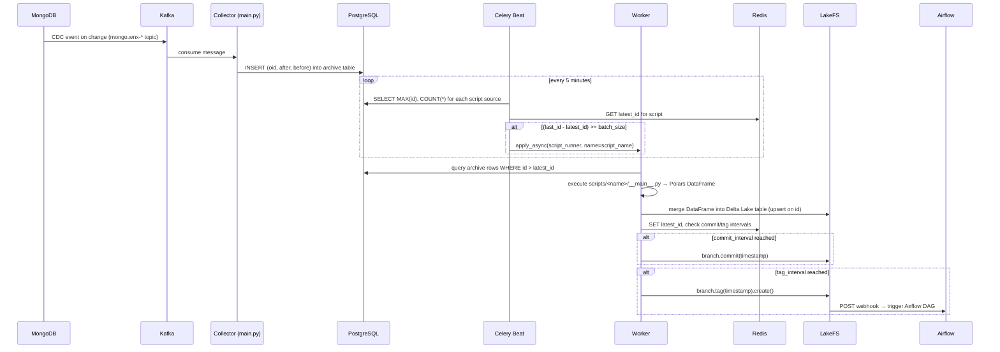
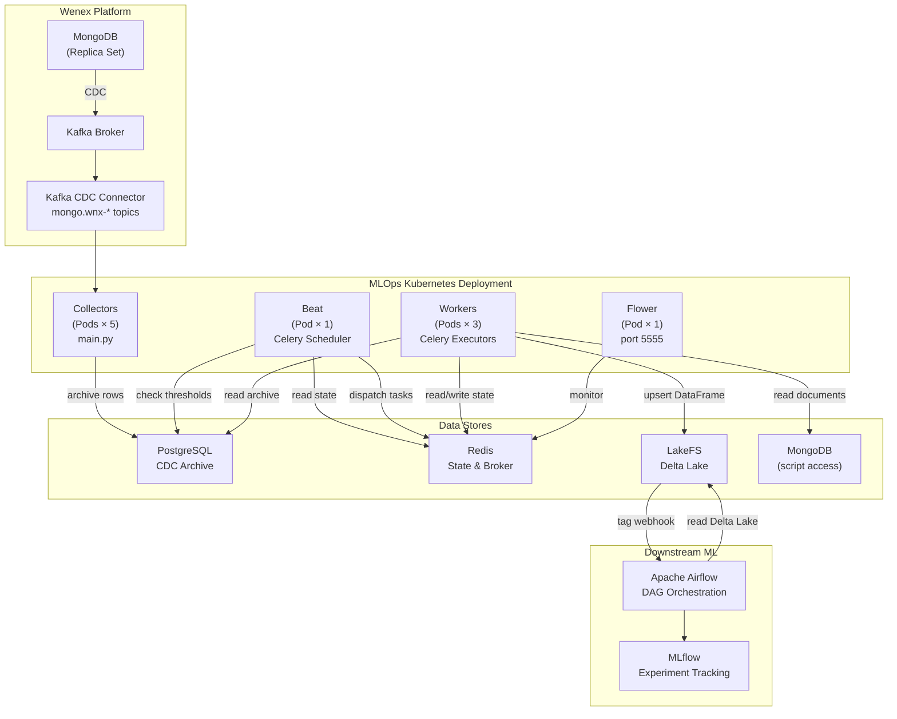

# MLOps Architecture

The MLOps system connects the Wenex platform's operational data to a versioned ML-ready data lake. It captures every MongoDB document change through Kafka CDC, archives it in PostgreSQL, and periodically transforms it into Delta Lake tables in LakeFS via configurable Python scripts.

## Components

| Component | Entry Point | Role |
| --- | --- | --- |
| **Collector** | `main.py` | Kafka consumer — subscribes to `mongo.wnx-*` CDC topics and writes `before`/`after` JSON payloads to PostgreSQL archive tables |
| **Beat** | `tasks.db_check` | Celery scheduler — runs every 5 minutes to check if any script's row count has reached its `batch_size` threshold, then queues a `script_runner` task |
| **Beat** | `tasks.db_clean` | Celery scheduler — runs every 4 hours to drop orphaned PG tables, remove stale Redis keys, and delete already-processed archive rows |
| **Workers** | `tasks.script_runner` | Celery workers — dynamically load and execute `scripts/<name>/__main__.py`, upsert the returned Polars DataFrame into LakeFS Delta Lake, and manage commit/tag intervals |
| **Flower** | `celery flower` | Web UI at port `5555` for monitoring Celery task queues, worker status, and task history |

## Storage Layers

| Store | Purpose | Schema / Key Pattern |
| --- | --- | --- |
| **PostgreSQL** | CDC archive — rows written by the Collector wait here until a Worker processes them | Table per collection: `id SERIAL, oid VARCHAR, after JSONB, before JSONB` |
| **Redis** | Script execution state — tracks the last processed row ID and the next scheduled commit/tag timestamps | `script:{md5(name)}` → JSON: `{latest_id, tag_interval, commit_interval}` |
| **LakeFS** | Versioned Delta Lake storage — the destination for transformed DataFrames; supports branching, committing, and tagging | S3-compatible: `s3://{repository_id}/{branch}/{delta_table}` |
| **MongoDB** | Source of truth — the platform's operational collections; also accessible to scripts via the `client` parameter | Native Atlas/PSMDB replica set |

## Data Flow

### Step-by-step

1. **CDC capture** — MongoDB emits a change event; the Kafka CDC connector publishes it to a topic named `mongo.wnx-<db>.<collection>`.
2. **Archive** — The Collector (`main.py`) consumes the event and inserts a row into a PostgreSQL table named after the collection (e.g. `auth.grants`), storing the full `after` and `before` document JSON.
3. **Threshold check** — Beat's `db_check` task queries each archive table. It compares `last_id - latest_id` against the script's `batch_size`. If the threshold is met and no task is already running for that script, it dispatches a `script_runner` task using the script's MD5 hash as the Celery task ID (ensuring uniqueness).
4. **Script execution** — A Worker dynamically imports `scripts/<name>/__main__.py` and calls its `main()` function, which queries the archive table and returns a Polars DataFrame.
5. **Delta Lake upsert** — The Worker merges the DataFrame into `s3://{repository_id}/{branch}/{delta_table}` using Delta Lake's `merge` with `source.id = target.id` as the predicate (insert-or-update semantics). On first run it creates the table.
6. **Versioning** — After every successful write, the Worker checks Redis for scheduled commit and tag timestamps. When the intervals expire, it commits and/or tags the LakeFS branch.
7. **DAG trigger** — A LakeFS action (registered in the repository) fires an HTTP POST to Airflow when a new tag is created, triggering downstream ML workflows.

## Concurrency Model

- **Beat is a singleton** — only one Beat pod must run at a time. Running multiple Beat instances will cause duplicate task dispatches.
- **Workers are stateless** — they can be scaled horizontally. Each `script_runner` task uses the script's MD5 hash as its Celery task ID, so Beat will not queue a second run for the same script while one is already `PENDING` or running.
- **No concurrent script execution** — Before dispatching, Beat checks `AsyncResult(script_hash).state`. If the state is not `SUCCESS` (or forgotten), it skips dispatch. This prevents overlapping runs of the same script even with multiple Workers.

## Full Architecture Diagram

