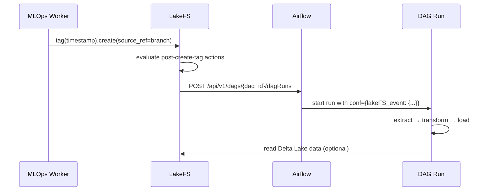

# Airflow DAGs

Apache Airflow provides the orchestration layer for ML workflows triggered by LakeFS data events. When a script's tag interval expires and the Worker creates a new LakeFS tag, a webhook fires and Airflow starts a DAG run automatically.

## Integration Overview



Every LakeFS tag creation fires a `post-create-tag` hook defined in the repository's action file. The hook sends an authenticated POST request to the Airflow REST API, passing the full LakeFS event payload as DAG run configuration.

## LakeFS Action Configuration

The action file lives at `scripts/_lakefs_actions/trigger_airflow_on_tag.yaml`:

```yaml
name: trigger_airflow_on_tag
on:
  post-create-tag:    # fires on every tag creation in the repository
hooks:
  - id: trigger_my_airflow_dag
    type: airflow
    description: Trigger an Airflow DAG after a tag is created
    properties:
      url: "https://airflow.wenex.tech"   # Airflow webserver base URL
      dag_id: "simple_etl_dag"            # DAG to trigger
      username: "admin"                   # Basic Auth credentials
      password: "your-airflow-password"
      wait_for_dag: false                 # async: don't wait for completion
```

### Registering the action with a LakeFS repository

Upload the action file to your LakeFS repository's `_lakefs_actions/` path on the branch you want to monitor. LakeFS evaluates all YAML files in that directory when the matching event fires.

Using the LakeFS CLI:

```bash
lakectl fs upload \
  lakefs://<repository-id>/main/_lakefs_actions/trigger_airflow_on_tag.yaml \
  --source scripts/_lakefs_actions/trigger_airflow_on_tag.yaml
```

Or upload via the LakeFS web UI under the repository's file browser.

**Branch filtering** — To restrict the action to a specific branch, add a `branches` filter:

```yaml
on:
  post-create-tag:
    branches:
      - "main"
```

## Event Payload

LakeFS passes the tag event as DAG run configuration. Inside a DAG task, access it via `context["dag_run"].conf`:

```python
def my_task(**context):
    conf = context["dag_run"].conf or {}
    lakefs_event = conf.get("lakeFS_event", {})

    tag_id       = lakefs_event.get("tag_id")        # e.g. "20260115-143022"
    commit_id    = lakefs_event.get("commit_id")     # LakeFS commit SHA
    repository_id = lakefs_event.get("repository_id") # e.g. "quickstart"
    branch       = lakefs_event.get("branch", "main")
```

## Example DAG Walkthrough

The `dags/example.py` file provides a minimal ETL DAG that demonstrates the LakeFS integration pattern:

```python
from datetime import datetime
from airflow import DAG
from airflow.decorators import task


@task
def print_lakefs_event(**context):
    """Log the LakeFS tag event that triggered this run."""
    dag_run = context["dag_run"]
    conf = dag_run.conf or {}
    lakefs_event = conf.get("lakeFS_event")

    if lakefs_event:
        tag_id        = lakefs_event.get("tag_id")
        commit_id     = lakefs_event.get("commit_id")
        repository_id = lakefs_event.get("repository_id")
        branch        = lakefs_event.get("branch", "unknown")
        print(f"Repository: {repository_id}")
        print(f"Tag:        {tag_id}")
        print(f"Commit:     {commit_id}")
        print(f"Branch:     {branch}")
    else:
        print("No lakeFS_event in conf — triggered manually or via schedule.")


@task
def extract():
    return "raw_data"


@task
def transform(raw_data: str):
    return raw_data.upper()


@task
def load(transformed_data: str):
    print(f"Loading: {transformed_data}")


with DAG(
    dag_id='simple_etl_dag',
    description='A simple ETL DAG triggered by LakeFS tag events',
    start_date=datetime(2026, 1, 1),
    schedule='@daily',
    catchup=False,
    tags=['example', 'etl'],
) as dag:
    lakefs_info    = print_lakefs_event()
    extract_output = extract()
    transform_output = transform(extract_output)
    load(transform_output)

    # Print the event first, then run ETL
    lakefs_info >> extract_output
```

**Key points:**
- The DAG has both a `@daily` schedule and can be triggered via webhook — `dag_run.conf` is empty for scheduled runs and populated for webhook-triggered runs.
- `print_lakefs_event` runs first (`lakefs_info >> extract_output`), giving you the repository/tag context before your ETL begins.
- For real workflows, replace the stub `extract` task with Delta Lake reads using `deltalake` + PyArrow (see [Model Training](./model-training) for the connection pattern).

## Writing a New DAG

### 1. Create the DAG file

Place your DAG file in the `dags/` directory. Airflow auto-discovers all Python files in that directory.

```python
# dags/my_pipeline.py
from datetime import datetime
from airflow import DAG
from airflow.decorators import task
from deltalake import DeltaTable
import pyarrow as pa


@task
def process_delta_data(**context):
    conf = context["dag_run"].conf or {}
    event = conf.get("lakeFS_event", {})

    repo   = event.get("repository_id", "my-repo")
    branch = event.get("branch", "main")
    table  = "grants"   # your delta_table name

    storage_options = {
        "allow_http": "true",
        "endpoint": "https://lakefs.example.com",
        "access_key_id": "your-access-key",
        "secret_access_key": "your-secret",
    }

    dt = DeltaTable(
        f"s3://{repo}/{branch}/{table}",
        storage_options=storage_options,
    )
    dataset = dt.to_pyarrow_dataset()

    for batch in dataset.scanner(batch_size=1000).to_batches():
        df = batch.to_pandas()
        # ... your processing logic


with DAG(
    dag_id='my_pipeline',
    start_date=datetime(2026, 1, 1),
    schedule=None,     # webhook-only — no automatic schedule
    catchup=False,
    tags=['production'],
) as dag:
    process_delta_data()
```

### 2. Update the LakeFS action

Edit `trigger_airflow_on_tag.yaml` to point to your new `dag_id`:

```yaml
properties:
  dag_id: "my_pipeline"
```

Or create a second action file for a different repository to trigger multiple DAGs independently.

### 3. Deploy the DAG

Copy the DAG file into the Airflow DAGs folder. In the Wenex Kubernetes environment, the `dags/` directory is typically mounted via a `ConfigMap` or a shared `PersistentVolume` connected to the Airflow scheduler and worker pods.

## Airflow UI Access

In a Kubernetes cluster, port-forward the Airflow webserver:

```bash
kubectl port-forward svc/airflow-webserver 8080:8080 -n airflow
```

Then open `http://localhost:8080`. Default credentials for development deployments are set in the Airflow `values.yaml` (set them explicitly; never ship a default pair).

From the UI you can:
- **Trigger a DAG manually** with custom `conf` JSON to simulate a LakeFS event.
- **View task logs** for debugging failed runs.
- **Inspect DAG run history** and correlate runs with LakeFS tag timestamps.
