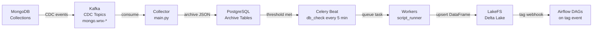

# MLOps

The Wenex MLOps system is a production-grade data pipeline that continuously captures change events from MongoDB via Kafka (CDC), archives them in PostgreSQL, and transforms them into versioned Delta Lake tables in LakeFS using configurable Python scripts. Once data is tagged in LakeFS, Airflow DAGs can be triggered automatically to run downstream ML workflows — including batch model training directly from the Delta Lake store.

## Key Technologies

| Component | Technology | Version |
| --- | --- | --- |
| Task queue | Celery | 5.6.2 |
| Data lake | LakeFS | 0.14.1 |
| Table format | Delta Lake | 1.3.0 |
| DAG orchestration | Apache Airflow | 3.1.6 |
| Columnar processing | PyArrow | 18.1.0 |
| DataFrame library | Polars | 1.36.1 |
| Runtime | Python | 3.12 |

## Pages

→ [Quickstart](./quickstart) — Add a data source and start collecting in minutes

→ [Architecture](./architecture) — Component roles, storage layers, data flow detail, and concurrency model

→ [Scripts](./scripts) — `config.yaml` reference and how to write custom data transformation scripts

→ [Airflow DAGs](./dags) — DAG structure, LakeFS webhook trigger, and writing new DAGs

→ [Model Training](./model-training) — Streaming Delta Lake data batch-by-batch for PyTorch + MLflow training

→ [Deployment](./deployment) — Helm chart configuration for Beat, Workers, and Flower
