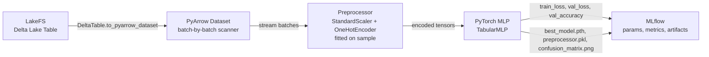

# Model Training

The MLOps system stores data as Delta Lake tables in LakeFS, which can be streamed directly for model training without loading the full dataset into memory. The `example/train.py` script demonstrates an end-to-end workflow: stream data from LakeFS → preprocess on a sample → train a PyTorch MLP → track everything with MLflow.

## Overview



The full example is at `example/train.py` in the MLOps repository. The training loop never loads the entire dataset into RAM — it opens a PyArrow scanner over the Delta Lake table and yields batches one at a time.

## Prerequisites

Install the required Python packages:

```bash
pip install deltalake pyarrow torch torchvision mlflow \
            scikit-learn polars joblib matplotlib python-dotenv
```

Set the following environment variables (or create a `.env` file):

```bash
# LakeFS connection
LAKEFS_SERVER_ENDPOINT_URL=https://lakefs.example.com
LAKEFS_CREDENTIALS_ACCESS_KEY_ID=your-access-key
LAKEFS_CREDENTIALS_SECRET_ACCESS_KEY=your-secret-key

# LakeFS table location
LAKEFS_STORAGE_REPO=my-repo        # repository_id from config.yaml
LAKEFS_STORAGE_BRANCH=main         # branch from config.yaml
LAKEFS_STORAGE_TABLE=ingest        # delta_table from config.yaml

# MLflow tracking server
MLFLOW_SERVER_ENDPOINT_URL=http://mlflow.example.com
```

## Connecting to LakeFS

The `DeltaTable` library connects to LakeFS via S3-compatible storage options. LakeFS exposes an S3 gateway, so the Delta Lake URI is in `s3://{repository}/{branch}/{table}` form:

```python
from deltalake import DeltaTable

STORAGE_OPTIONS = {
    "allow_http": "true",
    "endpoint": "https://lakefs.example.com",
    "access_key_id": "your-access-key",
    "secret_access_key": "your-secret-key",
}

dt = DeltaTable(
    "s3://my-repo/main/ingest",
    storage_options=STORAGE_OPTIONS,
)

print(f"Table version: {dt.version()}")

# Convert to a PyArrow dataset for streaming
dataset = dt.to_pyarrow_dataset()
```

## Streaming Data Batch-by-Batch

Once you have a PyArrow `Dataset`, open a scanner to iterate over it in fixed-size batches. The full dataset is never loaded into memory:

```python
def stream_batches(dataset, batch_size: int = 256):
    scanner = dataset.scanner(batch_size=batch_size)
    for record_batch in scanner.to_batches():
        yield record_batch.to_pandas()
```

This is particularly important for large tables that grow continuously as the Wenex platform generates data.

## Fitting Preprocessors on a Sample

The `StandardScaler` and `OneHotEncoder` must be fitted before the training loop, but loading the full dataset for fitting defeats the purpose of streaming. Instead, fit on a small representative sample:

```python
import pandas as pd
from sklearn.compose import ColumnTransformer
from sklearn.preprocessing import StandardScaler, OneHotEncoder, LabelEncoder

TARGET_COLUMN = "label"

# Collect a small sample (e.g. 1,000 rows)
sample_dfs = []
rows_collected = 0
for batch in stream_batches(dataset, batch_size=10):
    sample_dfs.append(batch)
    rows_collected += len(batch)
    if rows_collected >= 1000:
        break

sample_df = pd.concat(sample_dfs, ignore_index=True)

# Split feature columns
feature_columns = [c for c in sample_df.columns if c != TARGET_COLUMN]
numerical_cols  = [c for c in feature_columns if pd.api.types.is_numeric_dtype(sample_df[c])]
categorical_cols = [c for c in feature_columns if c not in numerical_cols]

# Fit preprocessor
preprocessor = ColumnTransformer(
    transformers=[
        ("num", StandardScaler(), numerical_cols),
        ("cat", OneHotEncoder(handle_unknown="ignore", sparse_output=False), categorical_cols),
    ],
    remainder="drop",
    verbose_feature_names_out=False,
)
preprocessor.fit(sample_df[feature_columns])
input_size = preprocessor.transform(sample_df[feature_columns]).shape[1]

# Fit label encoder
label_enc = LabelEncoder()
label_enc.fit(sample_df[TARGET_COLUMN])
num_classes = len(label_enc.classes_)
```

## PyTorch MLP Architecture

`TabularMLP` is a two-hidden-layer feedforward network with ReLU activations and dropout:

```python
import torch.nn as nn

class TabularMLP(nn.Module):
    def __init__(self, input_size: int, hidden_size: int, num_classes: int, dropout: float = 0.2):
        super().__init__()
        self.net = nn.Sequential(
            nn.Linear(input_size, hidden_size),
            nn.ReLU(),
            nn.Dropout(dropout),
            nn.Linear(hidden_size, hidden_size),
            nn.ReLU(),
            nn.Dropout(dropout),
            nn.Linear(hidden_size, num_classes),
        )

    def forward(self, x):
        return self.net(x)

model = TabularMLP(input_size, HIDDEN_SIZE, num_classes)
```

## Train/Validation Split

Rather than shuffling the dataset (which would require loading it all), the split is deterministic by batch index. Every `VAL_SPLIT_MOD`-th batch goes to validation (~20%); the rest go to training (~80%):

```python
for batch_idx, batch in enumerate(scanner.to_batches()):
    is_val_batch = (batch_idx % VAL_SPLIT_MOD) == 0

    if is_train and not is_val_batch:
        # training batch
    elif not is_train and is_val_batch:
        # validation batch
```

This is implemented as a PyTorch `IterableDataset` (`DeltaStreamingDataset`) so it integrates cleanly with `DataLoader`.

## Training Loop with MLflow

```python
import mlflow
import torch
import torch.optim as optim
import torch.nn as nn

mlflow.set_tracking_uri("http://mlflow.example.com")
mlflow.set_experiment("delta_lake_mlp_training")

with mlflow.start_run(run_name="lakefs_delta_mlp"):
    mlflow.log_params({
        "batch_size": BATCH_SIZE,
        "epochs": NUM_EPOCHS,
        "learning_rate": LEARNING_RATE,
        "hidden_size": HIDDEN_SIZE,
        "patience": PATIENCE,
        "val_split_mod": VAL_SPLIT_MOD,
    })

    optimizer = optim.Adam(model.parameters(), lr=LEARNING_RATE)
    criterion = nn.CrossEntropyLoss()
    best_val_loss = float("inf")
    patience_counter = 0

    for epoch in range(NUM_EPOCHS):
        # --- training pass ---
        model.train()
        for X_batch, y_batch in train_loader:
            optimizer.zero_grad()
            loss = criterion(model(X_batch), y_batch)
            loss.backward()
            optimizer.step()

        # --- validation pass ---
        model.eval()
        with torch.no_grad():
            for X_batch, y_batch in val_loader:
                outputs = model(X_batch)
                # compute val_loss and val_accuracy ...

        mlflow.log_metrics({"train_loss": ..., "val_loss": ..., "val_accuracy": ...}, step=epoch)

        # early stopping
        if avg_val_loss < best_val_loss:
            best_val_loss = avg_val_loss
            patience_counter = 0
            torch.save(model.state_dict(), "best_model.pth")
        else:
            patience_counter += 1
            if patience_counter >= PATIENCE:
                break

    # log best model and artifacts
    mlflow.pytorch.log_model(model, name="model", registered_model_name="MLPClassifier")
    mlflow.log_artifact("confusion_matrix.png")
    mlflow.log_artifact("preprocessor.pkl")
```

## Hyperparameter Reference

| Constant | Default | Description |
| --- | --- | --- |
| `NUM_EPOCHS` | 20 | Maximum training epochs before stopping |
| `BATCH_SIZE` | 256 | Rows per PyArrow batch during training |
| `HIDDEN_SIZE` | 128 | Number of neurons in each hidden layer |
| `LEARNING_RATE` | 0.001 | Adam optimizer learning rate |
| `PATIENCE` | 5 | Consecutive epochs without val_loss improvement before early stopping |
| `VAL_SPLIT_MOD` | 5 | Every Nth batch assigned to validation (~20% val, ~80% train) |
| `TARGET_COLUMN` | `"label"` | Column name used as the classification target |

## Artifacts Logged to MLflow

| Artifact | Description |
| --- | --- |
| `model` | Registered PyTorch model with input signature and example |
| `confusion_matrix.png` | Confusion matrix on the best validation pass |
| `preprocessor.pkl` | Fitted `ColumnTransformer` (joblib pickle) for inference reuse |

## Generating Synthetic Data for Testing

The `example/datagen.py` script generates a synthetic dataset that matches the expected schema (numeric + categorical columns with a `label` column). Use it to test the training pipeline locally before connecting to a real LakeFS table:

```bash
cd example/
python datagen.py          # writes synthetic data to a local Delta Lake table
python train.py            # trains on it with MLflow tracking
```

See the `example/docker-compose.yml` for a local LakeFS + MLflow stack to run the full example without Kubernetes.
