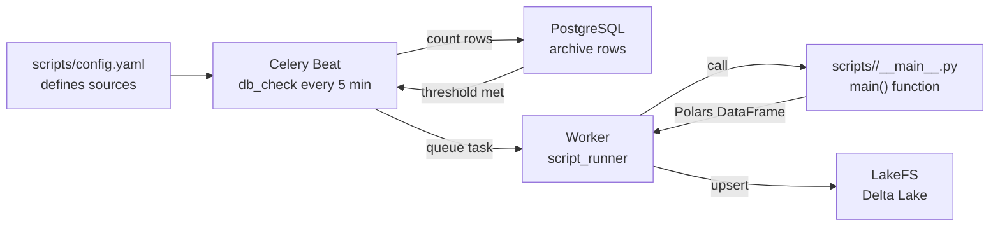

# Scripts

Scripts are the core extensibility point of the MLOps pipeline. Each script defines a data source to collect from and a Python function that transforms raw CDC archive rows into a clean Polars DataFrame for storage in LakeFS Delta Lake.

## How Scripts Work



1. **Beat** reads `config.yaml` and queries each script's PostgreSQL archive table every 5 minutes.
2. When `(last_id − latest_id) ≥ batch_size` and no task is already running, Beat queues a `script_runner` Celery task.
3. A **Worker** loads `scripts/<name>/__main__.py` and calls its `main(**kwargs)` function.
4. The function returns a Polars DataFrame which the Worker merges into the LakeFS Delta Lake table.
5. After writing, the Worker checks the Redis-tracked commit/tag timestamps and performs LakeFS versioning operations as needed.

## `config.yaml` Field Reference

The file lives at `scripts/config.yaml` relative to the project root.

```yaml
scripts:
  - name: example
    branch: main
    delta_table: ingest
    repository_id: quickstart
    storage_namespace: local://example
    source: auth.grants
    batch_size: 1
    tag_interval: 30 days
    commit_interval: 10 days
    condition: 'after IS NOT NULL'
```

| Field | Type | Required | Default | Description |
| --- | --- | --- | --- | --- |
| `name` | string | yes | — | Unique identifier for the script. Its MD5 hash is the **whole** Celery task ID (`task_id=script_hash`) and the Redis key suffix (`script:<md5>`). |
| `source` | string | yes | — | The PostgreSQL archive table to read from, in `<db>.<collection>` format (e.g. `auth.grants`). This matches the Kafka CDC topic source. |
| `repository_id` | string | yes | — | LakeFS repository name. Created automatically with `storage_namespace` if it does not exist. |
| `storage_namespace` | string | yes | — | LakeFS storage backend for the repository. Use `s3://bucket/path` for S3-compatible stores or `local://name` for local development. |
| `batch_size` | integer | yes | — | Minimum number of unprocessed rows required to trigger a `script_runner` task. Beat checks `(last_id − latest_id) ≥ batch_size`. |
| `branch` | string | no | `main` | LakeFS branch to write Delta Lake data to. |
| `delta_table` | string | no | `ingest` | Delta Lake table name within the repository branch. The table path becomes `s3://{repository_id}/{branch}/{delta_table}`. |
| `tag_interval` | string | no | `30 days` | How often to create a LakeFS tag (e.g. `7 days`, `30 days`). Tags trigger Airflow DAGs via webhook. |
| `commit_interval` | string | no | `10 days` | How often to commit the LakeFS branch (e.g. `1 day`, `10 days`). Commits create a durable checkpoint in LakeFS history. |
| `condition` | string | no | — | Optional SQL `WHERE` clause appended to the archive query (e.g. `after IS NOT NULL` to skip delete events). |

### Validation

The config loader enforces:
- All `name` values must be unique within the file.
- `scripts/<name>/__main__.py` must exist for every entry.
- Interval strings must match `INTERVAL_PATTERN` — `^(\d+)\s*(d|day|days|w|week|weeks|m|month|months)$` — so `30 days`, `2 weeks` and `1 month` validate and `4 hours` is rejected.

## The `main()` Function

Every script must define a `main(**kwargs)` function that receives context as keyword arguments and returns a Polars DataFrame.

### Signature

```python
import polars as pl

def main(**kwargs) -> pl.DataFrame:
    conn    = kwargs['conn']     # psycopg2 connection to PostgreSQL
    redis   = kwargs['redis']   # PrefixedRedis — a redis.Redis subclass that prefixes every key with REDIS_PREFIX
    config  = kwargs['config']  # full parsed config.yaml dict
    script  = kwargs['script']  # this script's config block dict
    lakefs  = kwargs['lakefs']  # LakeFS context dict (see below)
    client  = kwargs['client']  # pymongo MongoClient
    setting = kwargs['setting'] # mutable state dict persisted in Redis
    name    = kwargs['name']    # script name string
    ...
```

### Parameter Reference

| Parameter | Type | Description |
| --- | --- | --- |
| `conn` | `psycopg2.connection` | Open PostgreSQL connection. Use it to query the archive table `script['source']`. |
| `redis` | `PrefixedRedis` (`redis.Redis` subclass) | Redis client; every key is transparently prefixed with `REDIS_PREFIX`. Use it for custom per-script state beyond what `setting` provides. |
| `config` | `dict` | The full `config.yaml` parsed into a Python dict. Useful if a script needs to reference other scripts' config. |
| `script` | `dict` | This script's config block. Key fields: `name`, `source`, `batch_size`, `condition`, `branch`, `delta_table`, `repository_id`. |
| `lakefs` | `dict` | LakeFS context: `{'client': Client, 'repository': Repository, 'storage_options': dict}`. The `Repository` object provides branch and tag operations; `storage_options` is passed to `DeltaTable` for direct Delta Lake access. |
| `client` | `pymongo.MongoClient` | MongoDB client connected to the Wenex replica set. Use for lookups not available in the CDC archive. |
| `setting` | `dict` | Mutable dict loaded from Redis for this script. Pre-populated with `latest_id`, `tag_interval`, `commit_interval` after the first run. Write state here — the Worker persists it back to Redis after `main()` returns. |
| `name` | `str` | The script name string from `config.yaml`. |

### Return Value

`main()` must return a `pl.DataFrame`. The Worker merges it into Delta Lake using `source.id = target.id` as the upsert predicate — so the DataFrame **must include an `id` column** (typically the MongoDB `_id` stored as `oid` in the archive).

Return an empty DataFrame (`pl.DataFrame()`) if there is nothing to process. The Worker skips the LakeFS write in that case.

## Annotated Example Script

This is the canonical pattern from `scripts/example/__main__.py`, annotated for clarity:

```python
import polars as pl


def batch(rows: list) -> pl.DataFrame:
    """Convert a fetchmany() result into a Polars DataFrame."""
    columns = ['id', 'oid', 'after', 'before']
    column_data = dict(zip(columns, zip(*rows)))

    column_data.pop('id')                      # drop the PG serial id
    column_data['id'] = column_data.pop('oid') # promote MongoDB _id as 'id'

    return pl.DataFrame(column_data)


def main(**kwargs):
    conn    = kwargs['conn']
    script  = kwargs['script']
    setting = kwargs['setting']

    # Read the last processed row ID from Redis-backed state.
    # On the first run this defaults to 0.
    latest_id = setting.get('latest_id', 0)

    with conn.cursor() as cur:
        # Build the WHERE clause, respecting both the optional config condition
        # and the incremental cursor (id > latest_id).
        condition = f"WHERE id > {latest_id}"
        if 'condition' in script:
            condition = f"WHERE {script['condition']} AND id > {latest_id}"

        # Find the high-water mark and total eligible row count.
        cur.execute(f"""
            SELECT MAX(id), COUNT(*)
            FROM "{script['source']}" {condition};
        """)
        last_id, total_count = cur.fetchone()

        if total_count == 0:
            return pl.DataFrame()  # nothing to do

        # Extend the condition to the high-water mark so we don't race with
        # the Collector writing new rows during this task execution.
        condition += f" AND id <= {last_id}"
        cur.execute(f"""
            SELECT * FROM "{script['source']}" {condition}
            ORDER BY id ASC LIMIT 10000;
        """)

        df = pl.DataFrame()
        while True:
            rows = cur.fetchmany(script['batch_size'])
            if not rows:
                break
            df = pl.concat([df, batch(rows)])
            print(f"Processed batch of {len(rows)} rows")

    # Advance the cursor so the next run doesn't reprocess these rows.
    setting['latest_id'] = last_id
    return df
```

## LakeFS Versioning Lifecycle

After `main()` returns, the Worker handles LakeFS versioning automatically based on the intervals stored in Redis:

```
[after each successful script_runner run]

 time() >= setting['commit_interval']?
   → YES: branch.commit(timestamp_string)
          setting['commit_interval'] = now + commit_interval_seconds

 time() >= setting['tag_interval']?
   → YES: branch.tag(timestamp_string).create(source_ref=branch)
          setting['tag_interval'] = now + tag_interval_seconds

 redis.set('script:{md5(name)}', json.dumps(setting))
```

- **Commits** create a durable, addressable checkpoint in LakeFS history.
- **Tags** are immutable named pointers. Creating a tag fires the LakeFS action webhook, which can trigger Airflow DAGs.
- Both intervals are tracked in the `setting` dict (persisted in Redis). The first commit/tag interval starts from the first successful run, not from deployment time.

## Directory Structure

```
scripts/
├── config.yaml                           # all script definitions
├── <name>/
│   └── __main__.py                       # required: defines main()
└── _lakefs_actions/
    └── trigger_airflow_on_tag.yaml       # LakeFS webhook action
```

Each script must live in its own subdirectory named exactly after `name` in `config.yaml`. Additional helper modules can be placed in the same directory — `sys.path` includes the script directory **only while `__main__.py` is imported** (it is popped in a `finally` before `main()` runs), so import helpers at module top level, not lazily inside `main()`.
