# Wenex MCP Refactor — Implementation Plan

> **For agentic workers:** REQUIRED SUB-SKILL: Use superpowers:subagent-driven-development (recommended) or superpowers:executing-plans to implement this plan task-by-task. Steps use checkbox (`- [ ]`) syntax for tracking.

**Goal:** Move client-side tools and the system prompt from `mcp-client.ts` onto the MCP server, add agent-skill documentation (MongoDB queries + Mermaid diagrams), and refactor the client to a clean, minimal Ollama-based MCP client that works like any standard MCP client.

**Architecture:** The server becomes self-describing — it registers `auth_verify` and `read_documentations` as real MCP tools and exposes a `wenex-startup` MCP Prompt encoding the DISCOVER → VERIFY → EXECUTE workflow. The client drops all client-side tool implementations, AJV validation, lazy loading, and the inline system prompt, replacing them with standard MCP SDK calls. All 400+ tools are exposed upfront; the server prompt guides agents to load only what they need.

**Tech Stack:** NestJS 10, MCP SDK `@modelcontextprotocol/sdk`, Ollama SDK, Zod, TypeScript 5

---

## Sources of Truth (precedence order)

1. `apps/gateway/src` — controllers, routers, resolvers (external surface)
2. `@wenex-org/platform-libs` — enum files + `common/src/schemas/map.ts`
3. Existing MCP spec prose — `mcp/readme.md`, `mcp/core/...`, `mcp/service/...`

---

## File Structure

### New Files

| File | Responsibility |
|------|---------------|
| `mcp/core/agent-guidance.compact.md` | Compact agent skill guide: MongoDB query patterns + Mermaid diagram syntax |
| `mcp/core/agent-guidance.extended.md` | Extended version: richer MongoDB examples, full Mermaid examples per type |
| `apps/gateway/src/modules/core/core.router.ts` | Server MCP tools: `auth_verify`, `read_documentations` |
| `apps/gateway/src/modules/core/core.module.ts` | NestJS module: side-effect imports router, owns `registerDocumentations()` call |

### Modified Files

| File | Change |
|------|--------|
| `mcp/readme.md` | Add `docs://core/agent-guidance` entry; update AI Agent Rules and routing table |
| `libs/common/src/core/mcp/loader.mcp.ts` | Register `agent-guidance` resource (compact+extended); register `wenex-startup` MCP Prompt |
| `apps/gateway/src/modules/index.ts` | Add `CoreModule` import + add to `MODULES` array |
| `apps/gateway/src/app.module.ts` | Remove `OnModuleInit`; remove inline `read_docs` tool; remove now-unused imports |
| `mcp-client.ts` | Full refactor: drop client-side tools, AJV, lazy-loading, inline system prompt |

---

## Task 1 — Create `mcp/core/agent-guidance.compact.md`

**Files:**
- Create: `mcp/core/agent-guidance.compact.md`

- [ ] **Step 1: Write the compact agent-guidance document**

```markdown
---
mcp-resource-id: "core/agent-guidance"
mcp-version: "1.20.1"
mcp-priority: 80
mcp-category: "core"
mcp-module: "agent-guidance"

title: "Wenex Agent Skill Guide"
description: "Compact reference teaching agents how to write MongoDB queries against Wenex collections and how to produce Mermaid diagrams in responses."
tags: ["core", "agent-guidance", "mongodb", "mermaid", "visualization", "query"]

last-updated: "2026-05-06"
---

This document is the **compact** version. If you are unfamiliar with documentation versions, read `docs://readme` first.

## Purpose

This document teaches agents two skills:

1. **MongoDB Query Patterns** — how to write correct, safe `filter.query` objects for Wenex MCP operations
2. **Mermaid Diagrams** — when and how to produce Mermaid diagrams in markdown responses

## When to Load

Load this document when:

- the user asks for a chart, diagram, graph, flowchart, sequence, or visualization
- the task requires complex MongoDB filtering beyond a flat `{field: value}` query
- the agent is unsure which query operators to use
- the agent wants to show relationships, processes, or state transitions visually

## MongoDB Query Training

### Query Shape

`filter.query` accepts MongoDB-style query objects. Two top-level forms:

| Form | Logic | Shape |
| --- | --- | --- |
| plain object | AND of all key-value pairs | `{"field": value, "other": value}` |
| array of objects | OR of each object | `[{"field": value}, {"field2": value}]` |

### Operator Quick Reference

| Category | Operators |
| --- | --- |
| Equality | `$eq`, `$ne` |
| Comparison | `$gt`, `$gte`, `$lt`, `$lte` |
| Array membership | `$in`, `$nin` |
| Logical | `$and`, `$or`, `$not` |
| Existence | `$exists` |
| Text search | `$text` + `$search` |
| Regex | `$regex` (optionally + `$options`) |
| Expression | `$expr` |
| Geo-spatial | `$near`, `$nearSphere`, `$geoWithin`, `$geoIntersects`, `$geometry`, `$centerSphere`, `$maxDistance`, `$minDistance` |

> **AI Agent Rule:** `$search` is valid only inside `$text`. Never use `$search` at the top level.

### Common Query Patterns

**Exact field match:**
```json
{"status": "ACTIVE"}
```

**Multiple AND conditions (flat object):**
```json
{"status": "ACTIVE", "type": "ADMIN"}
```

**Logical OR (array form):**
```json
[{"email": "user@example.com"}, {"username": "user"}]
```

**Explicit $or inside a filter:**
```json
{"$or": [{"state": "PENDING"}, {"state": "PROCESSING"}]}
```

**$in — match any of a set:**
```json
{"status": {"$in": ["ACTIVE", "SUSPENDED"]}}
```

**$nin — exclude a set:**
```json
{"type": {"$nin": ["SYSTEM", "BOT"]}}
```

**Comparison — date range:**
```json
{"created_at": {"$gte": "2026-01-01T00:00:00.000Z", "$lt": "2026-04-01T00:00:00.000Z"}}
```

**Comparison — numeric range:**
```json
{"amount": {"$gte": 100, "$lte": 5000}}
```

**Text search (requires text index):**
```json
{"$text": {"$search": "invoice payment"}}
```

**Regex pattern match:**
```json
{"username": {"$regex": "^admin", "$options": "i"}}
```

**Existence check:**
```json
{"deleted_at": {"$exists": false}}
```

**Nested field:**
```json
{"address.city": "Tehran"}
```

### Query Safety Rules

> **AI Agent Rule:** Keep queries narrow. Always include at least one scoping field (owner, business, wallet, channel, sensor, device, date range) when available.
>
> **AI Agent Rule:** For high-volume or append-heavy collections (`thing/metrics`, `financial/transactions`, `general/activities`, `general/events`), call `count_*` first, then paginate with `find_*`.
>
> **AI Agent Rule:** Do not send unbounded list requests. Always set `filter.pagination.limit`.
>
> ⚠️ **AI Agent — Never do this:** Never invent field names not confirmed by the service specification.
>
> ⚠️ **AI Agent — Never do this:** Never use `$search` outside `$text`.

---

## Mermaid Diagram Guide

### When to Draw

Draw a Mermaid diagram when the response benefits from visual structure:

| User intent | Diagram type |
| --- | --- |
| Show a process, workflow, or system flow | `flowchart` |
| Show communication between services or actors | `sequenceDiagram` |
| Show object relationships or class hierarchy | `classDiagram` |
| Show database entity relationships | `erDiagram` |
| Show state transitions (e.g., saga states, transaction states) | `stateDiagram-v2` |
| Show a project schedule or timeline | `gantt` |
| Show proportion of a total | `pie` |

> **AI Agent Rule:** Always wrap Mermaid diagrams in a fenced code block with the `mermaid` language tag.
>
> **AI Agent Rule:** Keep node labels short (under 30 characters). Avoid special characters in labels.
>
> ⚠️ **AI Agent — Never do this:** Never embed HTML inside Mermaid diagrams.

### Format

````
```mermaid
<diagram type>
  <content>
```
````

### Compact Examples

**Flowchart — MCP agent workflow:**
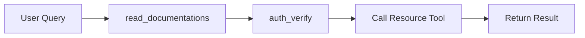

**Sequence — token verification:**
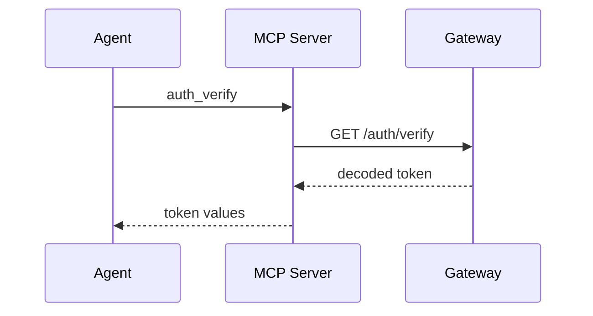

**State — financial transaction:**
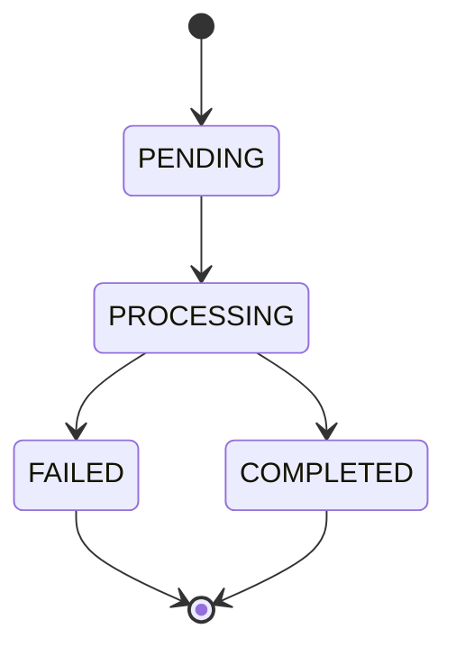

**Pie — zone distribution:**
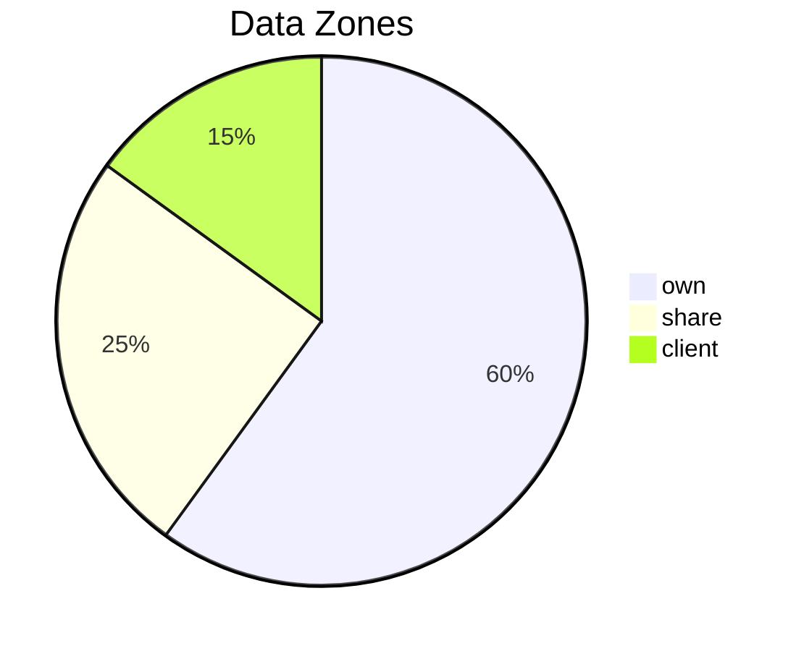

## Cross References

- `docs://core/specification` — query, populate, pagination, and zone rules
- `docs://core/resource-specification` — service and collection catalog
- `docs://core/auth-specification` — APT and grant rules

## Change Sensitivity Note

Re-read this document after any `last-updated` change.

**End of Compact Agent Skill Guide.**
```

- [ ] **Step 2: Verify the file was created**

```bash
ls -la mcp/core/agent-guidance.compact.md
```
Expected: file exists, non-zero size

- [ ] **Step 3: Commit**

```bash
git add mcp/core/agent-guidance.compact.md
git commit -m "docs(mcp): add agent-guidance compact — MongoDB queries + Mermaid guide"
```

---

## Task 2 — Create `mcp/core/agent-guidance.extended.md`

**Files:**
- Create: `mcp/core/agent-guidance.extended.md`

- [ ] **Step 1: Write the extended agent-guidance document**

```markdown
---
mcp-resource-id: "core/agent-guidance"
mcp-version: "1.20.1"
mcp-priority: 80
mcp-category: "core"
mcp-module: "agent-guidance"

title: "Wenex Agent Skill Guide"
description: "Extended reference teaching agents how to write MongoDB queries against Wenex collections and how to produce Mermaid diagrams in responses. Richer examples, full diagram type coverage."
tags: ["core", "agent-guidance", "mongodb", "mermaid", "visualization", "query"]

last-updated: "2026-05-06"
---

This document is the **extended** version. If you are unfamiliar with documentation versions, read `docs://readme` first.

This document contains the same underlying knowledge as the compact version, with added rationale, full examples, edge cases, and worked scenarios.

## Purpose

This document teaches agents two skills:

1. **MongoDB Query Patterns** — how to write correct, safe, and efficient `filter.query` objects for Wenex MCP operations, including complex filters, text search, geo-spatial queries, and nested field access
2. **Mermaid Diagrams** — when and how to produce Mermaid diagrams in markdown responses, with full examples for all supported diagram types

## When to Load

Load this document (extended) when:

- the user asks for a diagram, chart, graph, flowchart, or any visualization
- the task requires complex MongoDB filtering: multiple operators, nested logic, geo-spatial, text search, or `$expr`
- the compact version leaves ambiguity about the correct operator or pattern
- the agent is writing a query for a high-volume or safety-critical collection

## MongoDB Query Training

### Query Shape

`filter.query` is passed as the `query` field inside `filter`. It follows MongoDB query language.

Two top-level forms:

| Form | Logic | Shape |
| --- | --- | --- |
| plain object | AND of all key-value pairs | `{"field": value, "other": value}` |
| array of objects | OR of each element | `[{"field": "a"}, {"field2": "b"}]` |

### Full Operator Reference

| Category | Operators | Notes |
| --- | --- | --- |
| Equality | `$eq`, `$ne` | `$eq` is implicit: `{"f": v}` ≡ `{"f": {"$eq": v}}` |
| Comparison | `$gt`, `$gte`, `$lt`, `$lte` | ISO 8601 strings for dates |
| Array membership | `$in`, `$nin` | value must be an array |
| Logical | `$and`, `$or`, `$not` | `$and`/`$or` take an array of conditions |
| Existence | `$exists` | `true` or `false` |
| Text search | `$text` + `$search` | only on indexed collections; `$search` is a string |
| Regex | `$regex` + optional `$options` | `i` = case-insensitive, `m` = multiline |
| Expression | `$expr` | allows aggregation expressions in queries |
| Geo-spatial | `$near`, `$nearSphere`, `$geoWithin`, `$geoIntersects` | GeoJSON coordinates are `[longitude, latitude]` |
| Geometry | `$geometry`, `$centerSphere`, `$maxDistance`, `$minDistance` | used inside geo operators |

> **AI Agent Rule:** `$search` is valid only inside `$text`. Never use it at the top level.
>
> **AI Agent Rule:** GeoJSON coordinates are `[longitude, latitude]` — not `[latitude, longitude]`.

### Query Pattern Catalog

#### 1. Exact Field Match
```json
{"status": "ACTIVE"}
```

#### 2. Multiple AND Conditions (flat object)
```json
{"status": "ACTIVE", "type": "ADMIN", "lang": "en"}
```

#### 3. Logical OR — array form
Use the array form when the OR is across different fields at the top level:
```json
[{"email": "user@example.com"}, {"username": "user"}, {"phone": "+989123456789"}]
```

#### 4. Explicit `$or` inside object
Use `$or` when mixing AND and OR:
```json
{"owner": "64f1a2b3c4d5e6f7a8b9c0d1", "$or": [{"state": "PENDING"}, {"state": "PROCESSING"}]}
```

#### 5. `$in` — match any of a set
```json
{"status": {"$in": ["ACTIVE", "PENDING", "SUSPENDED"]}}
```

#### 6. `$nin` — exclude a set
```json
{"type": {"$nin": ["SYSTEM", "BOT", "SERVICE"]}}
```

#### 7. Date range
```json
{"created_at": {"$gte": "2026-01-01T00:00:00.000Z", "$lt": "2026-04-01T00:00:00.000Z"}}
```

#### 8. Numeric range
```json
{"amount": {"$gte": 100, "$lte": 5000}}
```

#### 9. Text search (requires text index on the collection)
```json
{"$text": {"$search": "invoice overdue payment"}}
```
> **Note:** Text search only works on fields that have a MongoDB text index. Confirm with the service spec before using.

#### 10. Regex — starts-with, case-insensitive
```json
{"username": {"$regex": "^admin", "$options": "i"}}
```

#### 11. Regex — contains
```json
{"description": {"$regex": "urgent", "$options": "i"}}
```

#### 12. Existence check — field must exist
```json
{"verified_at": {"$exists": true}}
```

#### 13. Existence check — field must not exist (unset / null)
```json
{"deleted_at": {"$exists": false}}
```

#### 14. Nested field path
```json
{"address.city": "Tehran", "address.country": "IR"}
```

#### 15. Array element match
```json
{"tags": "urgent"}
```
For arrays, a flat value matches any element.

#### 16. `$and` — explicit AND array
```json
{"$and": [{"amount": {"$gte": 100}}, {"amount": {"$lt": 1000}}, {"state": "COMPLETED"}]}
```

#### 17. `$expr` — compare two document fields
```json
{"$expr": {"$gt": ["$amount", "$blocked"]}}
```

#### 18. Geo-spatial — find near a point
```json
{
  "location": {
    "$near": {
      "$geometry": {"type": "Point", "coordinates": [51.388, 35.6892]},
      "$maxDistance": 5000
    }
  }
}
```
> GeoJSON coordinates: `[longitude, latitude]` — Tehran is `[51.388, 35.6892]`.

#### 19. Geo-spatial — within a polygon
```json
{
  "location": {
    "$geoWithin": {
      "$geometry": {
        "type": "Polygon",
        "coordinates": [[[51.0, 35.5], [52.0, 35.5], [52.0, 36.0], [51.0, 36.0], [51.0, 35.5]]]
      }
    }
  }
}
```

### Pagination Best Practice

Always pair queries with pagination:

```json
{
  "query": {"status": "ACTIVE"},
  "projection": "id owner status created_at",
  "pagination": {"skip": 0, "limit": 20, "sort": {"created_at": "desc"}}
}
```

For high-volume collections, count first:

```json
// Step 1 — count
count_financial_transactions with filter.query = {"state": "COMPLETED"}

// Step 2 — paginate if count > 0
find_financial_transactions with the same query + pagination
```

### Query Safety Rules

> **AI Agent Rule:** Always include at least one scoping field (owner, business, wallet, channel, sensor, device, date range) on high-volume collections.
>
> **AI Agent Rule:** Count before paginating `thing/metrics`, `financial/transactions`, `general/activities`, `general/events`, and `logistic/locations`.
>
> **AI Agent Rule:** Never send unbounded requests. Always set `pagination.limit`.
>
> ⚠️ **AI Agent — Never do this:** Never invent field names not confirmed by the service specification.
>
> ⚠️ **AI Agent — Never do this:** Never use `$search` outside of `$text`.
>
> ⚠️ **AI Agent — Never do this:** Never use geo operators without confirming the field stores a GeoJSON Point.

---

## Mermaid Diagram Guide

### When to Draw

Draw a Mermaid diagram in responses when:

- the response describes a process, workflow, or data flow
- the response compares two or more states or paths
- the response explains a sequence of API calls or service interactions
- the response describes entity relationships or schema links
- the response shows state transitions (e.g., financial transaction states, saga stages)
- the response covers a time-based plan or schedule
- the user explicitly asks for a diagram, chart, or visualization

> **AI Agent Rule:** Always wrap Mermaid diagrams in a fenced code block with the `mermaid` tag.
>
> **AI Agent Rule:** Keep node and actor labels under 30 characters. Use underscores or CamelCase for multi-word labels.
>
> **AI Agent Rule:** Every diagram must be renderable — test labels for unmatched brackets or special characters before outputting.
>
> ⚠️ **AI Agent — Never do this:** Never embed HTML (`<br>`, `<b>`, etc.) inside Mermaid node labels.
>
> ⚠️ **AI Agent — Never do this:** Never use unsupported diagram types. The list below is exhaustive for this platform.

### Diagram Types and When to Use Each

#### `flowchart` — Process and System Flows

Use for: processes, decision trees, data flows, architecture overviews.
Direction options: `LR` (left-right), `TD` (top-down), `RL`, `BT`.

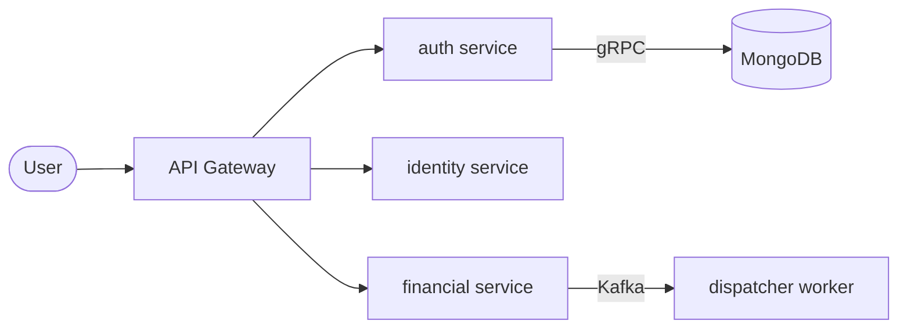

#### `sequenceDiagram` — API Call Sequences

Use for: MCP tool call chains, service-to-service communication, auth flows.

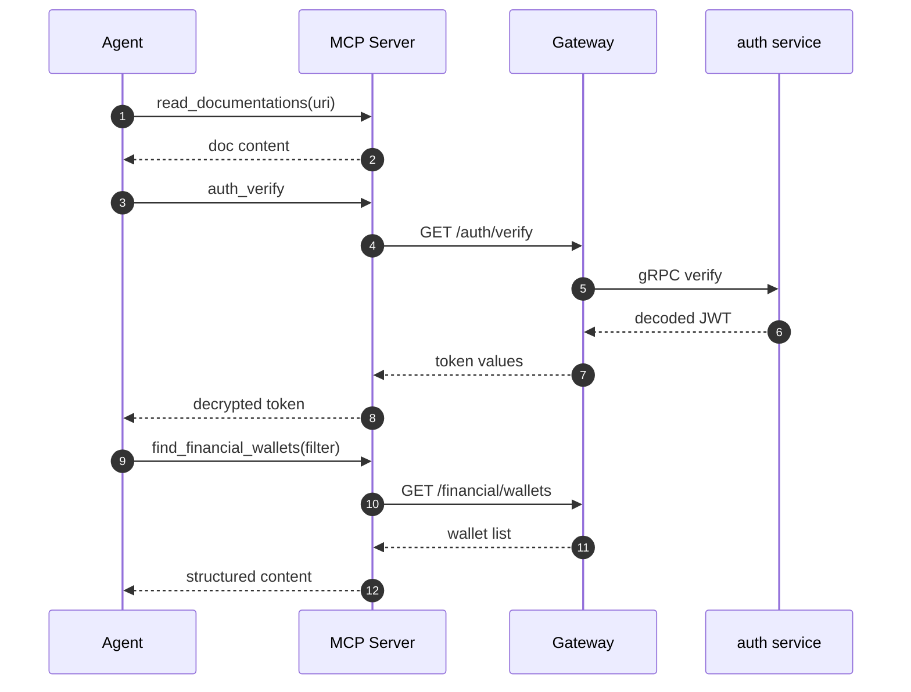

#### `classDiagram` — Object Relationships

Use for: schema relationships, inheritance, data model overviews.

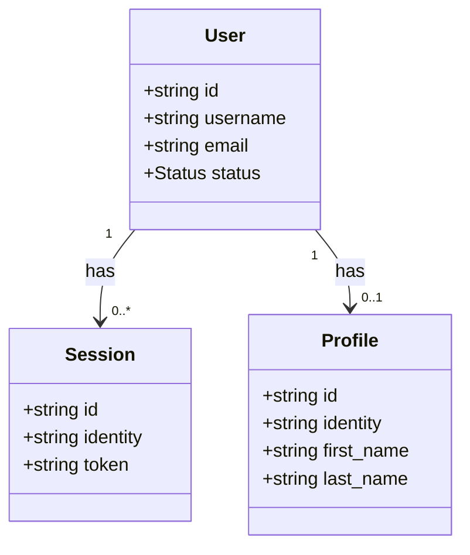

#### `erDiagram` — Database Entity Relationships

Use for: explaining how collections relate to each other.

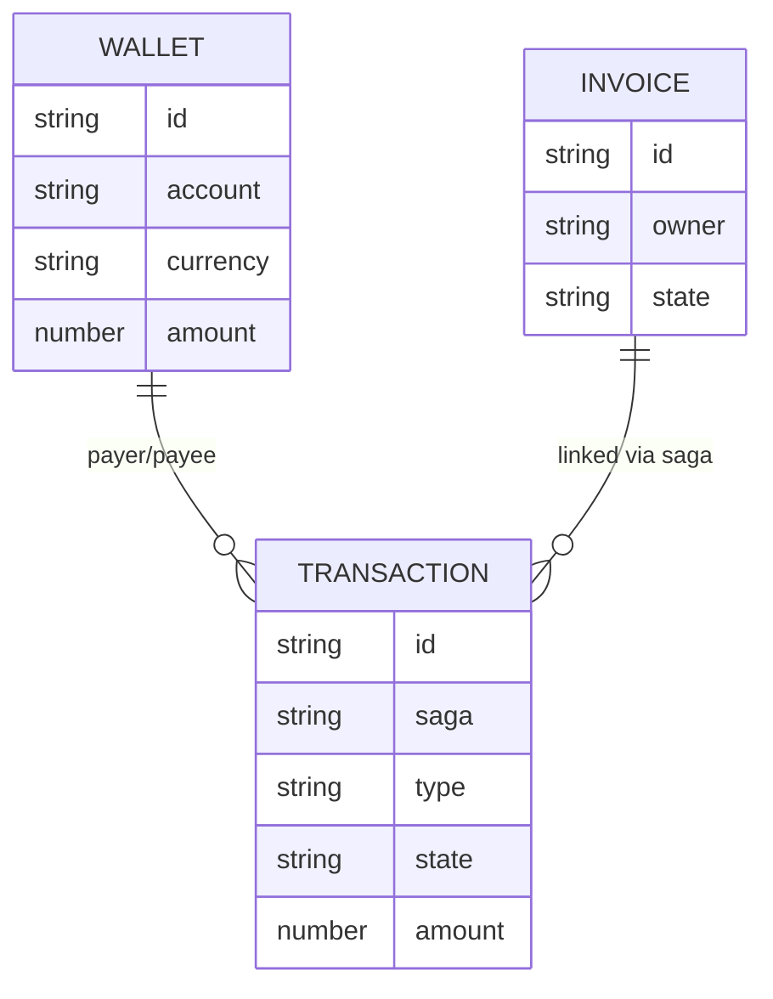

#### `stateDiagram-v2` — State Machines

Use for: transaction states, saga stage states, ticket states, workflow step states.

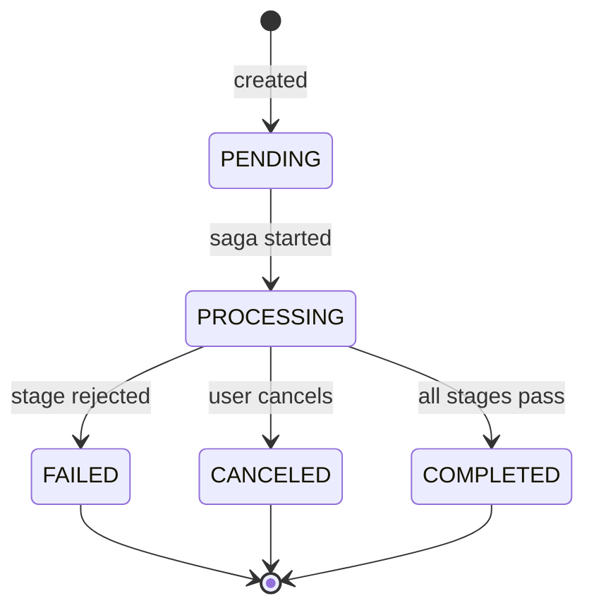

#### `gantt` — Timelines and Schedules

Use for: project timelines, release schedules, saga TTL windows.

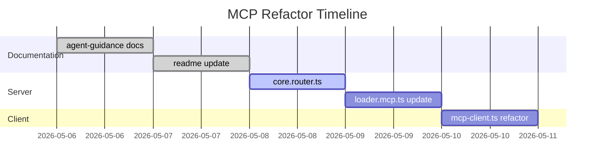

#### `pie` — Proportions

Use for: zone distribution, request type breakdown, status summaries.

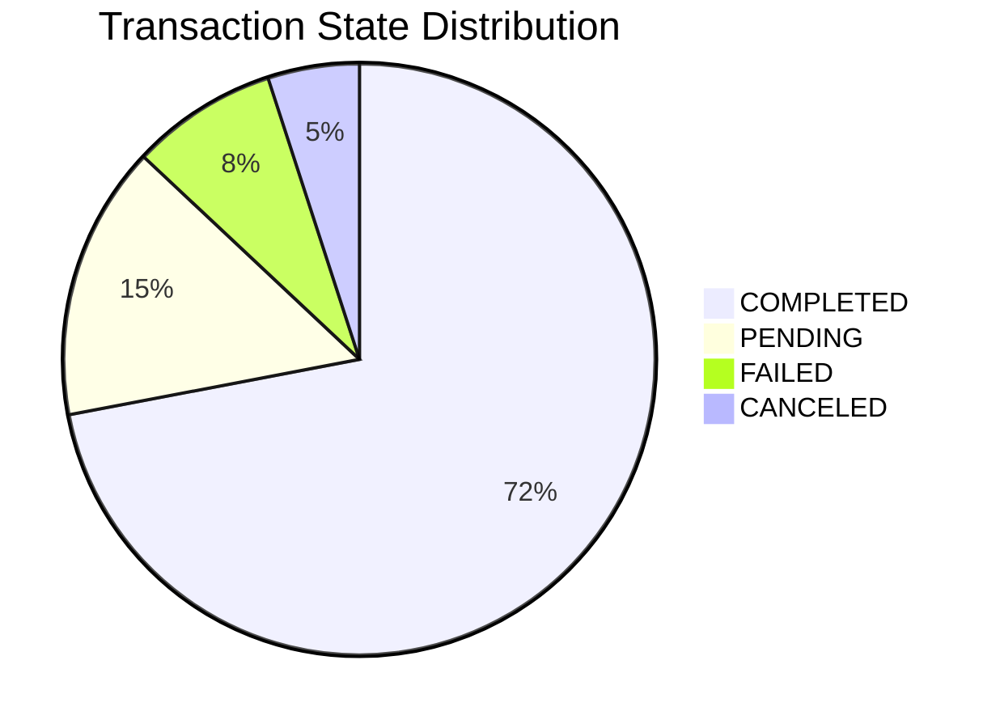

### Diagram Anti-Patterns

| Anti-pattern | Fix |
| --- | --- |
| Labels with unmatched `[]`, `()`, `{}` | Escape or shorten the label |
| HTML in labels (`<br>`, `<b>`) | Use plain text or line breaks via `\n` in multi-line nodes |
| Too many nodes (> 20) in one diagram | Split into multiple focused diagrams |
| Using an unsupported type | Use one of the seven types listed above |
| Mixing concerns (schema + sequence in one diagram) | Separate into two diagrams |

## Cross References

- `docs://core/specification` — query, populate, pagination, and zone rules
- `docs://core/resource-specification` — service and collection catalog
- `docs://core/auth-specification` — APT and grant rules

## Change Sensitivity Note

Re-read this document after any `last-updated` change.

**End of Extended Agent Skill Guide.**
```

- [ ] **Step 2: Verify the file was created**

```bash
ls -la mcp/core/agent-guidance.extended.md
```
Expected: file exists, non-zero size

- [ ] **Step 3: Commit**

```bash
git add mcp/core/agent-guidance.extended.md
git commit -m "docs(mcp): add agent-guidance extended — full MongoDB + Mermaid examples"
```

---

## Task 3 — Update `mcp/readme.md`

**Files:**
- Modify: `mcp/readme.md`

- [ ] **Step 1: Add `agent-guidance` to the Core Documents table**

Find this block in `mcp/readme.md` (around line 100):

```markdown
| Core Specification | `docs://core/specification` | Canonical source for MCP rules, operations, metadata headers, filters, population, projection, pagination, zones, and source-of-truth precedence |
| Resource Specification | `docs://core/resource-specification` | Canonical router/catalog for services and collections |
| Auth Specification | `docs://core/auth-specification` | Canonical source for APTs, scopes, grants, subjects, domain resolution, zone-sensitive auth behavior, and `401` / `403` handling |
```

Replace with:

```markdown
| Core Specification | `docs://core/specification` | Canonical source for MCP rules, operations, metadata headers, filters, population, projection, pagination, zones, and source-of-truth precedence |
| Resource Specification | `docs://core/resource-specification` | Canonical router/catalog for services and collections |
| Auth Specification | `docs://core/auth-specification` | Canonical source for APTs, scopes, grants, subjects, domain resolution, zone-sensitive auth behavior, and `401` / `403` handling |
| Agent Skill Guide | `docs://core/agent-guidance` | MongoDB query pattern training and Mermaid diagram guide for agents producing structured responses |
```

- [ ] **Step 2: Update the 30-Second Loading Summary**

Find:

```markdown
1. Read `docs://core/specification?v=c`
2. Read `docs://core/resource-specification?v=c`
3. Read `docs://core/auth-specification?v=c` **only when** auth, permissions, scopes, grants, subjects, domains, zones, or `401` / `403` matter
4. Load the relevant service doc in compact form
5. Escalate only the needed document(s) to extended when ambiguity, troubleshooting, onboarding, complex auth, complex filters, schema authoring, metadata-header behavior, or side-effect complexity appears
```

Replace with:

```markdown
1. Read `docs://core/specification?v=c`
2. Read `docs://core/resource-specification?v=c`
3. Read `docs://core/auth-specification?v=c` **only when** auth, permissions, scopes, grants, subjects, domains, zones, or `401` / `403` matter
4. Read `docs://core/agent-guidance?v=c` **only when** the user requests a diagram/chart, or the task requires complex MongoDB filtering
5. Load the relevant service doc in compact form
6. Escalate only the needed document(s) to extended when ambiguity, troubleshooting, onboarding, complex auth, complex filters, schema authoring, metadata-header behavior, or side-effect complexity appears
```

- [ ] **Step 3: Add agent-guidance to the "If the User Asks X, Load Y" table**

Find the table under `### If the User Asks X, Load Y`. Add this row after the existing `"How do queries/populate/pagination/zones work?"` row:

```markdown
| "Draw a diagram / chart / flowchart / sequence / visualization" | `docs://core/agent-guidance` | relevant service spec if data comes from a specific service |
| "Write a complex query / filter / search / geo query" | `docs://core/agent-guidance` | `docs://core/specification` for operator rules |
```

- [ ] **Step 4: Add agent-guidance to the Service Router section header note**

After the `## Service Router` section (before the table), add:

```markdown
> **Note:** `docs://core/agent-guidance` is a core skill document, not a service spec. Load it for query or visualization tasks, not for collection routing.
```

- [ ] **Step 5: Verify the changes**

```bash
grep -n "agent-guidance" mcp/readme.md
```
Expected: at least 4 matches (table entry, loading summary, routing table rows)

- [ ] **Step 6: Commit**

```bash
git add mcp/readme.md
git commit -m "docs(mcp): add agent-guidance to readme routing — MongoDB + Mermaid guidance"
```

---

## Task 4 — Update `libs/common/src/core/mcp/loader.mcp.ts`

**Files:**
- Modify: `libs/common/src/core/mcp/loader.mcp.ts`

- [ ] **Step 1: Register the `agent-guidance` resource and `wenex-startup` prompt**

Read the current file at `libs/common/src/core/mcp/loader.mcp.ts`. It ends with the services loop and `return mcp`. Add the following **before** the `return mcp` statement:

```typescript
  // -----------------------------------------
  // Resource ID: core/agent-guidance
  // -----------------------------------------

  const agentGuidance: { name: string; config: ResourceMetadata } = {
    name: 'core-agent-guidance',
    config: {
      title: 'Wenex Agent Skill Guide',
      description: 'MongoDB query pattern training and Mermaid diagram guide for agents',
    },
  };

  mcp.server.registerResource(agentGuidance.name, 'docs://core/agent-guidance', agentGuidance.config, async (uri) =>
    throwableResourceCall(uri.href, () => {
      const content = mcpDocLoader(`docs://core/agent-guidance?v=compact`);
      return { contents: [{ type: 'text', uri: uri.href, mimeType: 'text/markdown', text: content }] };
    }),
  );

  mcp.server.registerResource(
    agentGuidance.name,
    new ResourceTemplate('docs://core/agent-guidance{?v}', { list: undefined }),
    agentGuidance.config,
    async (uri, variables) =>
      throwableResourceCall(uri.href, () => {
        const content = mcpDocLoader(`docs://core/agent-guidance?v=${getParam(variables, 'v')}`);
        return { contents: [{ type: 'text', uri: uri.href, mimeType: 'text/markdown', text: content }] };
      }),
  );

  // -----------------------------------------
  // MCP Prompt: wenex-startup
  // -----------------------------------------

  mcp.server.registerPrompt(
    'wenex-startup',
    {
      title: 'Wenex MCP Startup Workflow',
      description: 'Required agent workflow for Wenex platform sessions: DISCOVER → VERIFY → EXECUTE',
    },
    async () => ({
      messages: [
        {
          role: 'user',
          content: {
            type: 'text',
            text: `WENEX MCP AGENT WORKFLOW — FOLLOW EXACTLY:

1. DISCOVER
   - Call read_documentations with uri="docs://readme"
   - Then load docs://core/specification and docs://core/resource-specification
   - Load docs://core/auth-specification when the task involves APTs, scopes, grants, subjects, domains, zones, 401, or 403
   - Load docs://core/agent-guidance when the user asks for a diagram/chart or the task requires complex MongoDB queries
   - Load service specs on-demand after mapping user intent to a service

2. VERIFY
   - Call auth_verify before using any Wenex resource tools
   - If auth_verify returns an invalid or expired token, stop and tell the user

3. EXECUTE
   - Always set x-zone: own,share,client unless the user explicitly requests another zone
   - Never guess enum values, field names, population paths, or protocol behavior
   - Always set filter.pagination.limit; count before paginating high-volume collections
   - Use Mermaid diagrams (docs://core/agent-guidance) when visualizing data relationships, flows, or states

⚠️ NEVER treat auth endpoints (/auth/token, /auth/refresh) as MCP-callable operations.
⚠️ NEVER invent values not confirmed by documentation or runtime source of truth.`,
          },
        },
      ],
    }),
  );
```

- [ ] **Step 2: Verify the file compiles**

```bash
npm run build gateway 2>&1 | tail -20
```
Expected: build succeeds with no TypeScript errors

- [ ] **Step 3: Commit**

```bash
git add libs/common/src/core/mcp/loader.mcp.ts
git commit -m "feat(mcp): register agent-guidance resource and wenex-startup prompt in loader"
```

---

## Task 5 — Create `apps/gateway/src/modules/core/core.router.ts`

**Files:**
- Create: `apps/gateway/src/modules/core/core.router.ts`

This file registers the `auth_verify` and `read_documentations` server-side MCP tools. It replaces the client-side implementations and the broken inline `read_docs` in `app.module.ts`.

- [ ] **Step 1: Write the router**

```typescript
import { ServerMCP, throwableToolCall, mcpOutputSchema } from '@app/common/core/mcp';
import { mcpDocLoader } from '@app/common/core/mcp/loader.mcp';
import { toString } from '@app/common/core/utils';
import { APP } from '@app/common/core/app';
import axios from 'axios';
import { z } from 'zod';

const { API_PORT } = APP.GATEWAY;
const HOST = process.env['GATEWAY_HOST'] || 'localhost';
const api = axios.create({ baseURL: `http://${HOST}:${API_PORT}` });

const mcp = ServerMCP.create();

// ------------------------------------------------------------
// auth_verify
// Reads the APT from the MCP request's Authorization header,
// calls GET /auth/verify on the gateway, and returns decoded
// token values. Must be called before any resource operations.
// ------------------------------------------------------------

mcp.server.registerTool(
  'auth_verify',
  {
    title: 'Verify APT',
    description:
      'Verify the current Auth Personal Token (APT) and return its decoded values. ' +
      'Call this before using any Wenex resource tools. ' +
      'Read docs://core/auth-specification if you need help interpreting the decoded values.',
    inputSchema: {},
    outputSchema: mcpOutputSchema({ result: { token: z.any() } }),
    annotations: { readOnlyHint: true, destructiveHint: false, idempotentHint: true },
  },
  async (_args, { requestInfo }) =>
    throwableToolCall(async () => {
      const [logger, headers] = mcp.utils('auth_verify', requestInfo);
      logger('verifying APT token via GET /auth/verify');

      const { data } = await api.get('/auth/verify', { headers });
      logger('token verified successfully: %o', data);

      return {
        structuredContent: { result: { token: data } },
        content: [
          {
            type: 'text',
            text:
              `TOKEN DECRYPTED VALUES:\n${toString(data)}\n\n` +
              `NOTE: If you need help interpreting these values, read docs://core/auth-specification using read_documentations.`,
          },
        ],
      };
    }),
);

// ------------------------------------------------------------
// read_documentations
// Reads any Wenex MCP documentation resource by URI.
// Supports docs://readme, docs://core/*, and docs://service/*.
// Use ?v=c for compact (default) or ?v=e for extended.
// ------------------------------------------------------------

mcp.server.registerTool(
  'read_documentations',
  {
    title: 'Read MCP Documentation',
    description:
      'Read a Wenex MCP documentation resource by URI. ' +
      'Supported URIs: docs://readme, docs://core/specification, docs://core/resource-specification, ' +
      'docs://core/auth-specification, docs://core/agent-guidance, ' +
      'docs://service/<service>-specification. ' +
      'Append ?v=c for compact (default) or ?v=e for extended.',
    inputSchema: {
      uri: z.string().describe(
        'MCP documentation URI. Examples: "docs://readme", "docs://core/specification?v=c", ' +
          '"docs://service/identity-specification?v=e", "docs://core/agent-guidance"',
      ),
    },
    outputSchema: mcpOutputSchema({ result: { content: z.string() } }),
    annotations: { readOnlyHint: true, destructiveHint: false, idempotentHint: true },
  },
  (args) =>
    throwableToolCall(() => {
      const [logger] = mcp.utils('read_documentations', undefined);
      logger('loading documentation for uri: %s', args.uri);

      // docs://core/specification maps to docs://core/-specification on disk
      let uri = args.uri;
      if (uri === 'docs://core/specification' || uri.startsWith('docs://core/specification?')) {
        uri = uri.replace('docs://core/specification', 'docs://core/-specification');
      }

      // docs://readme has no compact/extended variant — pass null to skip suffix
      const isReadme = uri.startsWith('docs://readme');
      const content = mcpDocLoader(uri, isReadme ? null : undefined);

      return {
        structuredContent: { result: { content } },
        content: [{ type: 'text', text: 'Look at structured data.' }],
      };
    }),
);
```

- [ ] **Step 2: Verify it compiles**

```bash
npm run build gateway 2>&1 | tail -20
```
Expected: no TypeScript errors

- [ ] **Step 3: Commit**

```bash
git add apps/gateway/src/modules/core/core.router.ts
git commit -m "feat(mcp): add auth_verify and read_documentations as server-side MCP tools"
```

---

## Task 6 — Create `apps/gateway/src/modules/core/core.module.ts`

**Files:**
- Create: `apps/gateway/src/modules/core/core.module.ts`

This module owns the MCP documentation registration (moved from `app.module.ts`) and side-effect imports the core router.

- [ ] **Step 1: Write the module**

```typescript
import { registerDocumentations } from '@app/common/core/mcp/loader.mcp';
import { Module, OnModuleInit } from '@nestjs/common';

import './core.router';

@Module({})
export class CoreModule implements OnModuleInit {
  onModuleInit() {
    registerDocumentations();
  }
}
```

- [ ] **Step 2: Verify it compiles**

```bash
npm run build gateway 2>&1 | tail -20
```
Expected: no TypeScript errors

- [ ] **Step 3: Commit**

```bash
git add apps/gateway/src/modules/core/core.module.ts
git commit -m "feat(mcp): add CoreModule — owns MCP doc registration and core tools"
```

---

## Task 7 — Update `apps/gateway/src/modules/index.ts`

**Files:**
- Modify: `apps/gateway/src/modules/index.ts`

- [ ] **Step 1: Add `CoreModule` import**

At the top of the file, after the existing module imports (e.g., after `import { ThingModule } from './thing';`), add:

```typescript
import { CoreModule } from './core';
```

- [ ] **Step 2: Add `CoreModule` to `MODULES` array**

In the `MODULES` array, add `CoreModule` as the **first** entry so its `onModuleInit()` runs before service modules initialize their tools:

```typescript
export const MODULES = [
  CoreModule,
  AuthModule,
  ContextModule,
  DomainModule,
  EssentialModule,
  FinancialModule,
  GeneralModule,
  IdentityModule,
  SpecialModule,
  TouchModule,
  ContentModule,
  LogisticModule,
  ConjointModule,
  CareerModule,
  ThingModule,
] as const;
```

- [ ] **Step 3: Verify it compiles**

```bash
npm run build gateway 2>&1 | tail -20
```
Expected: no TypeScript errors

- [ ] **Step 4: Commit**

```bash
git add apps/gateway/src/modules/index.ts
git commit -m "feat(mcp): register CoreModule first in gateway MODULES"
```

---

## Task 8 — Update `apps/gateway/src/app.module.ts`

**Files:**
- Modify: `apps/gateway/src/app.module.ts`

Remove the `onModuleInit()` lifecycle method (moved to `CoreModule`) and the now-dead imports it pulled in.

- [ ] **Step 1: Remove `OnModuleInit` and its imports**

Remove these imports from the top of the file:
```typescript
import { mcpInputSchema, mcpOutputSchema, throwableToolCall } from '@app/common/core/mcp';
import { mcpDocLoader, registerDocumentations } from '@app/common/core/mcp/loader.mcp';
import { z } from 'zod';
```

Change:
```typescript
import { DynamicModule, Module, OnModuleInit } from '@nestjs/common';
```
To:
```typescript
import { DynamicModule, Module } from '@nestjs/common';
```

- [ ] **Step 2: Remove the `onModuleInit()` method**

Change:
```typescript
export class AppModule implements OnModuleInit {
  onModuleInit() {
    const mcp = registerDocumentations();

    mcp.server.registerTool(
      'read_docs',
      {
        title: 'read documentations',
        description: 'documentations read using uri',
        inputSchema: mcpInputSchema({ body: { uri: z.string() } }),
        outputSchema: mcpOutputSchema({ result: { content: z.string() } }),
        annotations: { readOnlyHint: true, destructiveHint: false, idempotentHint: true },
      },
      (args) =>
        throwableToolCall(() => {
          let content = '';
          if (args.uri === 'docs://readme') content = mcpDocLoader(`docs://readme`, null);
          else if (args.uri === 'docs://core/specification') {
            content = mcpDocLoader(args.uri.replace('core/specification', 'core/-specification'));
          } else content = mcpDocLoader(args.uri);
          return {
            structuredContent: { result: { content } },
            content: [{ type: 'text', text: `Look at structured data.` }],
          };
        }),
    );
  }
}
```
To:
```typescript
export class AppModule {}
```

- [ ] **Step 3: Verify it compiles and no orphan imports remain**

```bash
npm run build gateway 2>&1 | tail -20
```
Expected: no TypeScript errors or unused-import warnings

- [ ] **Step 4: Run linter to catch any leftover issues**

```bash
rtk lint 2>&1 | tail -20
```
Expected: no errors (warnings about other files are acceptable)

- [ ] **Step 5: Commit**

```bash
git add apps/gateway/src/app.module.ts
git commit -m "refactor(gateway): remove inline read_docs registration — moved to CoreModule"
```

---

## Task 9 — Refactor `mcp-client.ts`

**Files:**
- Modify: `mcp-client.ts`

This is a full rewrite. The refactored client:
- Drops all client-side tool implementations (`auth_verify`, `current_datetime`, `read_documentations`, `load_collection_tools`)
- Drops AJV validation (server validates; client trusts the LLM and server)
- Drops the inline system prompt (uses server `wenex-startup` prompt instead)
- Drops the `activeTools` / `availableTools` split (all server tools used immediately)
- Fetches all tools + startup prompt during `connect()`
- Routes every tool call to `mcp.callTool()` with no special-casing
- Remains Ollama-only, CLI-ready

- [ ] **Step 1: Write the refactored client**

```typescript
/* eslint-disable @typescript-eslint/no-require-imports */
require('dotenv').config();

/**
 * Wenex MCP Client v3.0
 *
 * Standard MCP client using Ollama as the LLM backend.
 * Connects to the Wenex MCP server, loads all tools and the startup prompt,
 * then enters an interactive chat loop.
 *
 * Prerequisites:
 *   - Run Ollama locally: ollama run qwen2.5:32b
 *   - Remote tunnel:      ssh -L 11434:localhost:11434 wenex@gpu.wenex.org
 *   - Set env:            MCP_CLIENT_APT_TOKEN=<your-apt-token>
 */
import { StreamableHTTPClientTransport } from '@modelcontextprotocol/sdk/client/streamableHttp.js';
import { Ollama, type Tool as OllamaTool, type Message } from 'ollama';
import { Client } from '@modelcontextprotocol/sdk/client/index.js';
import { toString } from '@app/common/core/utils';
import * as readline from 'node:readline';

interface ClientMCPConfig {
  mcpServerUrl: string;
  ollamaHost?: string;
  defaultModel?: string;
  maxToolRounds?: number;
  maxHistoryMessages?: number;
}

const DEFAULT_CONFIG: Required<ClientMCPConfig> = {
  maxToolRounds: 10,
  maxHistoryMessages: 50,
  defaultModel: 'qwen2.5:32b',
  ollamaHost: 'http://localhost:11434',
  mcpServerUrl: 'http://127.0.0.1:3010/mcp',
};

export class ClientMCP {
  private mcp: Client;
  private ollama: Ollama;
  private messages: Message[] = [];
  private tools: OllamaTool[] = [];
  private startupMessages: Message[] = [];

  private config: Required<ClientMCPConfig>;
  private transport?: StreamableHTTPClientTransport;

  constructor(config: Partial<ClientMCPConfig> = {}) {
    this.config = { ...DEFAULT_CONFIG, ...config };

    this.mcp = new Client({ name: 'wenex-mcp-client', version: '3.0.0' });
    this.ollama = new Ollama({ host: this.config.ollamaHost });
  }

  private getAuthorizationHeader(): string {
    const token = process.env.MCP_CLIENT_APT_TOKEN;
    if (!token) throw new Error('MCP_CLIENT_APT_TOKEN environment variable is required');
    return token.startsWith('Bearer ') ? token : `Bearer ${token}`;
  }

  async connect(serverUrl: string = this.config.mcpServerUrl): Promise<void> {
    if (this.transport) await this.transport.close();

    this.transport = new StreamableHTTPClientTransport(new URL(serverUrl), {
      requestInit: {
        headers: {
          Authorization: this.getAuthorizationHeader(),
          'Content-Type': 'application/json',
        },
        keepalive: true,
      },
    });

    this.transport.onerror = (err) => console.error('❌ Transport error:', err);
    this.transport.onclose = () => console.log('🔌 Transport closed');

    await this.mcp.connect(this.transport);

    // Load all available tools from the server
    const toolsResult = await this.mcp.listTools();
    this.tools = toolsResult.tools.map((tool) => ({
      type: 'function',
      function: {
        name: tool.name,
        description: tool.description,
        parameters: tool.inputSchema as OllamaTool['function']['parameters'],
      },
    }));

    // Fetch the startup workflow prompt from the server
    try {
      const promptResult = await this.mcp.getPrompt({ name: 'wenex-startup', arguments: {} });
      this.startupMessages = promptResult.messages.map((msg) => ({
        role: msg.role === 'assistant' ? 'assistant' : 'user',
        content: typeof msg.content === 'string' ? msg.content : ((msg.content as any).text ?? ''),
      }));
    } catch {
      console.warn('⚠️  Startup prompt not available — proceeding without it');
    }

    console.log('✅ Connected to MCP server');
    console.log('   Tools  :', this.tools.length, 'loaded');
    console.log('   Prompt :', this.startupMessages.length > 0 ? 'wenex-startup loaded' : 'none');
  }

  private trimHistory(): void {
    if (this.messages.length > this.config.maxHistoryMessages) {
      this.messages = this.messages.slice(-this.config.maxHistoryMessages);
    }
  }

  async processQuery(query: string, modelName = this.config.defaultModel): Promise<string> {
    this.messages.push({ role: 'user', content: query });
    this.trimHistory();

    console.log('🤖 Processing...');

    let response = await this.ollama.chat({
      model: modelName,
      tools: this.tools,
      messages: [...this.startupMessages, ...this.messages],
    });

    this.messages.push(response.message);

    let round = 0;
    while (response.message.tool_calls?.length && round < this.config.maxToolRounds) {
      round++;

      const toolNames = response.message.tool_calls.map((t) => t.function.name).join(', ');
      console.log(`🛠  Round ${round}: ${toolNames}`);

      for (const toolCall of response.message.tool_calls) {
        const toolName = toolCall.function.name;
        const toolArgs = toolCall.function.arguments as Record<string, any>;

        console.log(`   → ${toolName}`, toolArgs);

        let content: string;
        try {
          const result = await this.mcp.callTool({ name: toolName, arguments: toolArgs });
          const textParts = (result.content as any[]).filter((c) => c.type === 'text').map((c) => c.text);
          content = textParts.join('\n');
          if ((result as any).structuredContent) {
            content += `\n\nStructured Content:\n${toString((result as any).structuredContent)}`;
          }
        } catch (err: any) {
          console.error(`❌ ${toolName} failed:`, err.message);
          content = `ERROR executing ${toolName}: ${err.message}`;
        }

        // Preview first 14 lines of tool output
        const lines = content.split(/\r?\n/).filter((line) => line.trim());
        lines.slice(0, 14).forEach((line, i) => console.log(`${(i + 1).toString().padStart(2, '0')}: ${line}`));
        if (lines.length > 14) console.log(`   ... (${lines.length - 14} more lines)`);

        this.messages.push({ role: 'tool', content, tool_name: toolName });
      }

      response = await this.ollama.chat({
        model: modelName,
        tools: this.tools,
        messages: [...this.startupMessages, ...this.messages],
      });

      this.messages.push(response.message);
    }

    if (round >= this.config.maxToolRounds) {
      console.warn('⚠️  Reached maximum tool rounds');
    }

    return response.message.content || '';
  }

  async disconnect(): Promise<void> {
    if (this.transport) {
      await this.transport.close();
      this.transport = undefined;
    }
    console.log('👋 Disconnected');
  }

  async chatLoop(modelName = this.config.defaultModel): Promise<void> {
    const rl = readline.createInterface({ input: process.stdin, output: process.stdout });

    console.log('\n🚀 Wenex MCP Client v3.0 started!');
    console.log("   Type your query or 'quit' to exit.\n");

    const ask = () => new Promise<string>((resolve) => rl.question('\nQuery > ', resolve));

    try {
      while (true) {
        const input = await ask();
        if (!input.trim() || input.toLowerCase() === 'quit') break;

        const response = await this.processQuery(input, modelName);

        console.log('\n  ─────────────────────────────────────────');
        console.log('  AI RESPONSE');
        console.log('  ─────────────────────────────────────────\n');
        console.log(response);
      }
    } finally {
      rl.close();
      await this.disconnect();
    }
  }
}

(async () => {
  const token = process.env.MCP_CLIENT_APT_TOKEN;
  if (!token) {
    console.error('❌ MCP_CLIENT_APT_TOKEN environment variable is required');
    process.exit(1);
  }

  const client = new ClientMCP({
    // defaultModel: 'llama3.1:8b',
  });

  try {
    await client.connect();
    await client.chatLoop();
  } catch (err) {
    console.error('💥 Fatal error:', err);
    await client.disconnect();
    process.exit(1);
  }
})().catch(console.error);
```

- [ ] **Step 2: Verify it compiles**

```bash
rtk tsc --noEmit 2>&1 | head -30
```
Expected: no errors. If `toString` import path fails, check `@app/common/core/utils` resolves correctly (it's used in all existing router files).

- [ ] **Step 3: Run the linter**

```bash
rtk lint 2>&1 | tail -20
```
Expected: no errors on `mcp-client.ts`

- [ ] **Step 4: Commit**

```bash
git add mcp-client.ts
git commit -m "refactor(mcp-client): clean Ollama MCP client — drop client-side tools, AJV, lazy loading"
```

---

## Task 10 — Integration Smoke Test

**Goal:** Verify the full refactored system works end-to-end.

- [ ] **Step 1: Build the gateway**

```bash
npm run build gateway 2>&1 | tail -10
```
Expected: build succeeds

- [ ] **Step 2: Start the gateway**

```bash
npm run start:dev gateway
```
Wait for `[Nest] Application is running on port 3010` in logs.

- [ ] **Step 3: Verify MCP tools include `auth_verify` and `read_documentations`**

```bash
curl -s -X POST http://127.0.0.1:3010/mcp \
  -H "Content-Type: application/json" \
  -H "Authorization: Bearer $MCP_CLIENT_APT_TOKEN" \
  -d '{"jsonrpc":"2.0","id":1,"method":"tools/list","params":{}}' | \
  python3 -m json.tool | grep '"name"' | grep -E "auth_verify|read_documentations"
```
Expected output contains:
```
"name": "auth_verify",
"name": "read_documentations",
```

- [ ] **Step 4: Verify MCP prompts include `wenex-startup`**

```bash
curl -s -X POST http://127.0.0.1:3010/mcp \
  -H "Content-Type: application/json" \
  -H "Authorization: Bearer $MCP_CLIENT_APT_TOKEN" \
  -d '{"jsonrpc":"2.0","id":2,"method":"prompts/list","params":{}}' | \
  python3 -m json.tool | grep '"name"'
```
Expected output contains:
```
"name": "wenex-startup",
```

- [ ] **Step 5: Verify MCP resources include `agent-guidance`**

```bash
curl -s -X POST http://127.0.0.1:3010/mcp \
  -H "Content-Type: application/json" \
  -H "Authorization: Bearer $MCP_CLIENT_APT_TOKEN" \
  -d '{"jsonrpc":"2.0","id":3,"method":"resources/list","params":{}}' | \
  python3 -m json.tool | grep "agent-guidance"
```
Expected: `docs://core/agent-guidance` appears in resources list

- [ ] **Step 6: Smoke-test the `read_documentations` tool**

```bash
curl -s -X POST http://127.0.0.1:3010/mcp \
  -H "Content-Type: application/json" \
  -H "Authorization: Bearer $MCP_CLIENT_APT_TOKEN" \
  -d '{"jsonrpc":"2.0","id":4,"method":"tools/call","params":{"name":"read_documentations","arguments":{"uri":"docs://readme"}}}' | \
  python3 -m json.tool | grep '"text"' | head -3
```
Expected: returns the readme content (non-empty text)

- [ ] **Step 7: Run the refactored MCP client**

```bash
MCP_CLIENT_APT_TOKEN=$MCP_CLIENT_APT_TOKEN npx ts-node mcp-client.ts
```
Expected output:
```
✅ Connected to MCP server
   Tools  : <N> loaded
   Prompt : wenex-startup loaded

🚀 Wenex MCP Client v3.0 started!
   Type your query or 'quit' to exit.

Query >
```

- [ ] **Step 8: Test a basic query**

At the `Query >` prompt, type:
```
What documentation is available?
```
Expected: agent calls `read_documentations` with `docs://readme`, then summarizes the available docs.

- [ ] **Step 9: Final commit**

```bash
git add -A
git commit -m "test(mcp): integration smoke test passed — server tools, prompt, client all verified"
```

---

## Self-Review Checklist

- [x] All four client-side tools (`auth_verify`, `current_datetime`, `read_documentations`, `load_collection_tools`) are accounted for: `auth_verify` and `read_documentations` moved to server; `current_datetime` and `load_collection_tools` dropped (not needed)
- [x] System prompt moved to `wenex-startup` MCP Prompt registered in `loader.mcp.ts`
- [x] `app.module.ts` `onModuleInit()` removed; moved to `CoreModule.onModuleInit()`
- [x] The broken `read_docs` tool (used `args.uri` instead of `args.body.uri`) is replaced by correct `read_documentations`
- [x] Lazy loading removed: all tools passed to Ollama upfront
- [x] AJV validation removed: server validates via Zod schemas
- [x] `agent-guidance.compact.md` and `agent-guidance.extended.md` cover MongoDB query patterns and Mermaid diagram guide
- [x] `mcp/readme.md` updated with new routing entries
- [x] `loader.mcp.ts` registers `agent-guidance` resource with compact/extended URIs
- [x] `CoreModule` added first to `MODULES` so documentation and core tools register before service modules
- [x] No placeholder text — all code is complete and runnable
- [x] Content Rules followed: no invented enums, no removed safety warnings, no merging of compact/extended files

---

**Plan complete and saved to `docs/superpowers/plans/2026-05-06-mcp-refactor.md`.**
