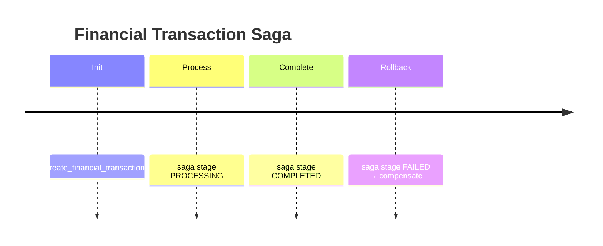
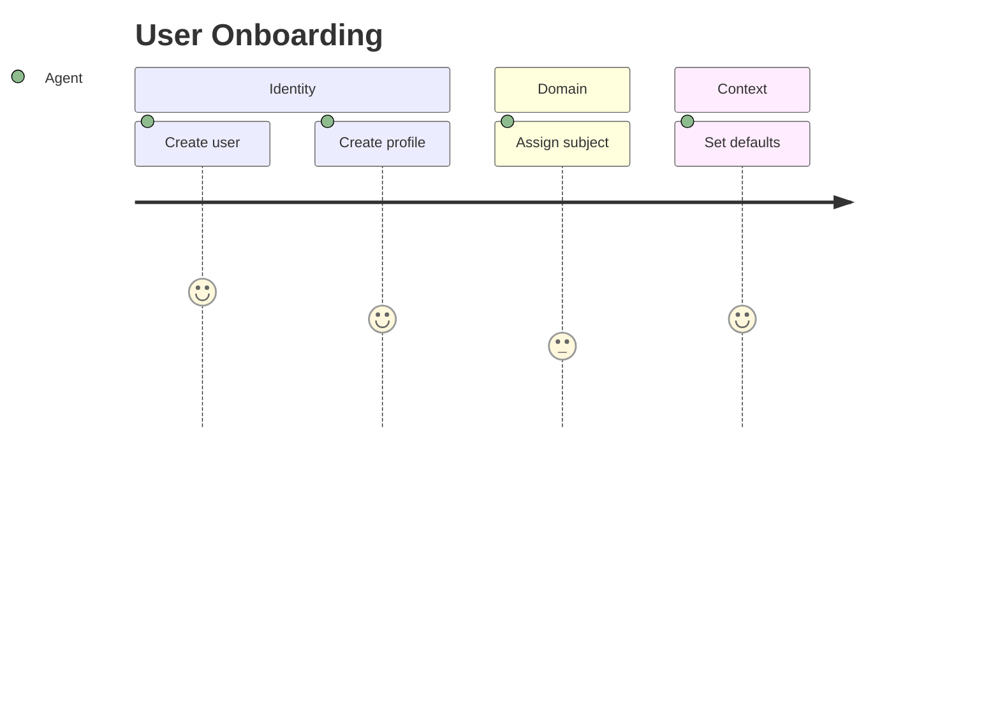
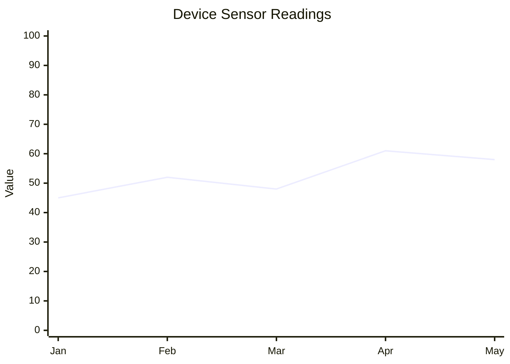
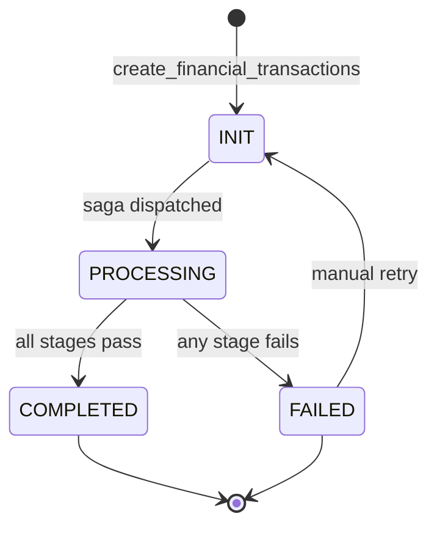
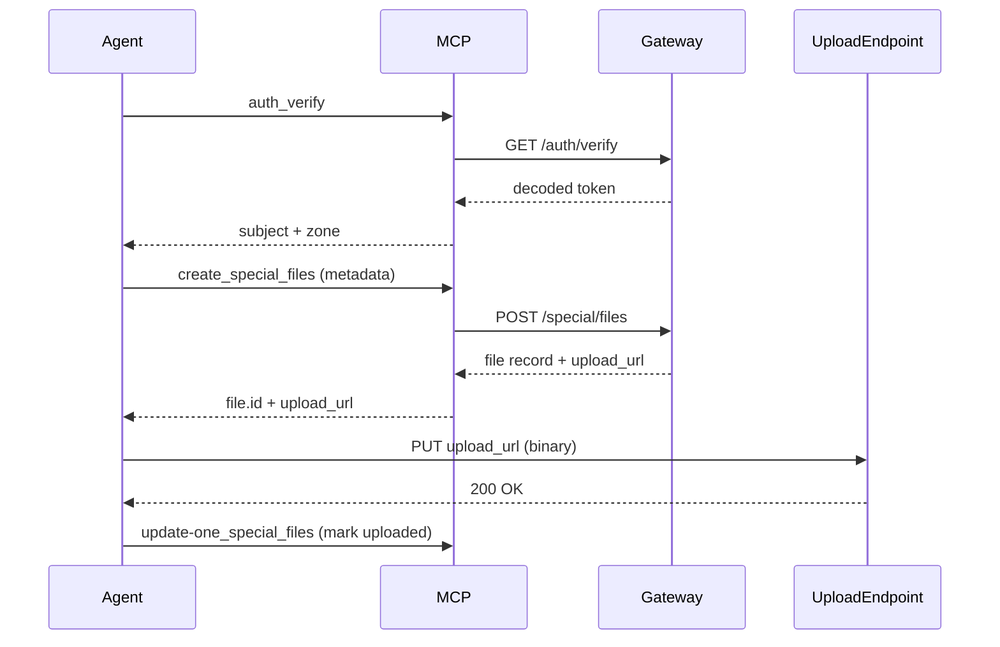
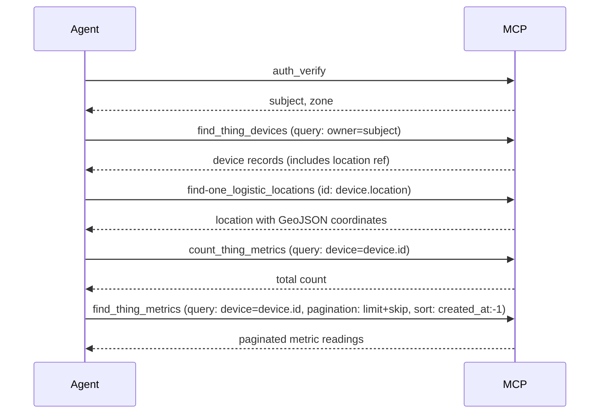
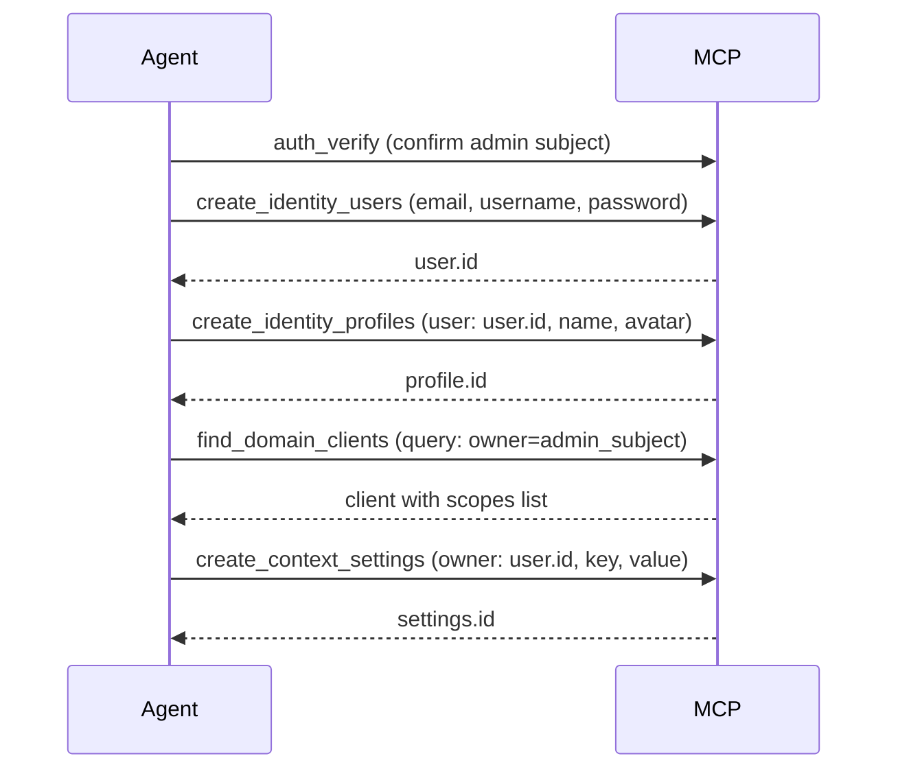
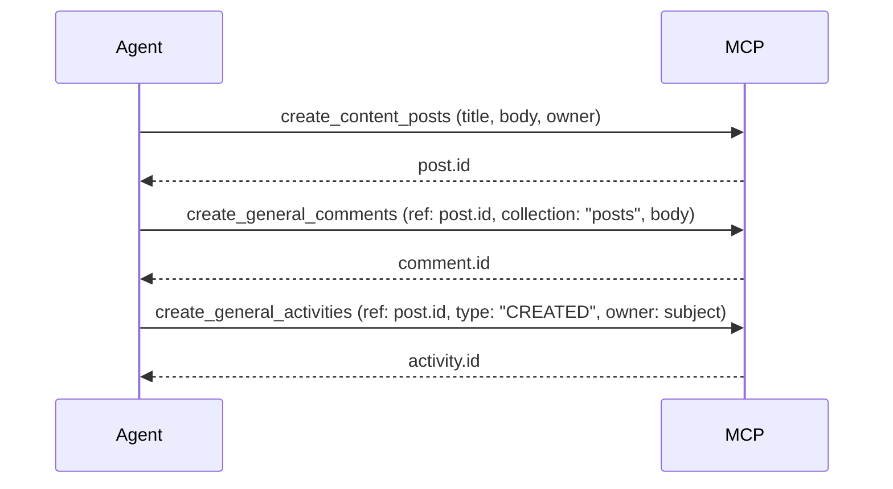
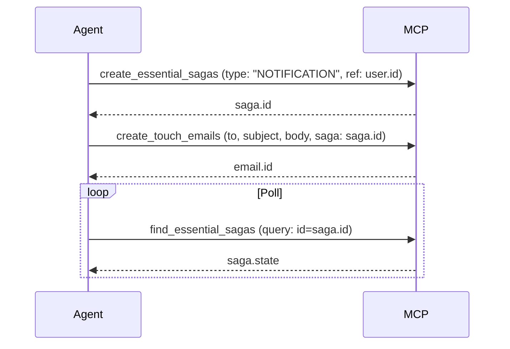
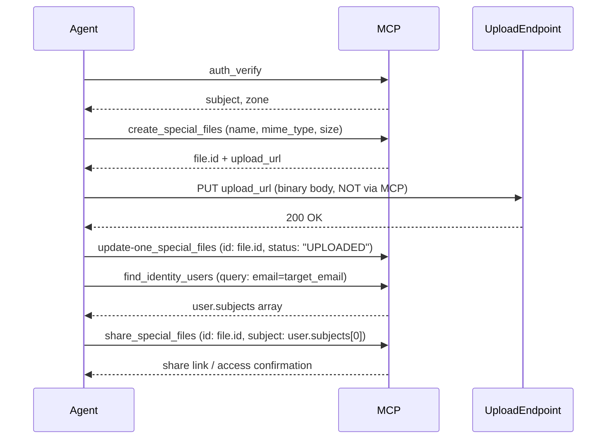

# MCP Refactor Implementation Plan

> **For agentic workers:** REQUIRED SUB-SKILL: Use superpowers:subagent-driven-development (recommended) or superpowers:executing-plans to implement this plan task-by-task. Steps use checkbox (`- [ ]`) syntax for tracking.

**Goal:** Refactor the Wenex MCP server and client into a production-ready system where all platform context lives server-side, the client is a generic Ollama-based MCP client, and all spec documentation is correct and comprehensive.

**Architecture:** The gateway pushes a startup context notification on session init via `McpServer.server.oninitialized` + `sendLoggingMessage`; the generic client captures it and uses it as a system message without knowing any Wenex internals. All 13 service specs are updated against runtime sources of truth (router files → enum files → `map.ts`), and new cross-service workflow documentation is added.

**Tech Stack:** NestJS, `@modelcontextprotocol/sdk` (server + client), Ollama TypeScript SDK, TypeScript, Markdown.

**Spec:** `docs/superpowers/specs/2026-05-07-mcp-refactor-design.md`

> **NOTE:** Per spec, no git or test commands are needed.

---

## File Map

| File | Action | Responsibility |
| --- | --- | --- |
| `libs/common/src/core/mcp/loader.mcp.ts` | Modify | Export `WENEX_STARTUP_PROMPT_TEXT` constant; add cross-service-patterns resource registration |
| `libs/common/src/core/mcp/server.mcp.ts` | Modify | Add `sessionIdGenerator: randomUUID` to enable session management for SSE push |
| `apps/gateway/src/modules/core/core.router.ts` | Modify | Session-init push via `oninitialized`; rich descriptions for `auth_verify` and `read_documentations` |
| `mcp-client.ts` | Modify | Generic client: remove Wenex refs, add sampling capability, add notification handler, add `listPrompts()` fallback |
| `mcp/core/agent-guidance.compact.md` | Modify | Add MongoDB operators, pagination patterns, anti-patterns table, new Mermaid types, decision table |
| `mcp/core/agent-guidance.extended.md` | Modify | Same additions with full rationale and worked examples |
| `mcp/core/cross-service-patterns.compact.md` | Create | 6 cross-service workflow patterns, compact form |
| `mcp/core/cross-service-patterns.extended.md` | Create | Same patterns with full call sequences, data dependencies, failure guidance |
| `mcp/readme.md` | Modify | Add cross-service-patterns to routing table + loading flow |
| `mcp/service/identity-specification.compact.md` | Modify | Systematic update per template |
| `mcp/service/identity-specification.extended.md` | Modify | Same update, extended form |
| `mcp/service/financial-specification.compact.md` | Modify | Systematic update per template |
| `mcp/service/financial-specification.extended.md` | Modify | Same update, extended form |
| *(repeat for essential, general, special, domain, content, context, touch, conjoint, career, logistic, thing)* | Modify | Same pattern |

---

## Phase 1 — Core Infrastructure

---

### Task 1: Export startup prompt text from `loader.mcp.ts`

**Files:**
- Modify: `libs/common/src/core/mcp/loader.mcp.ts`

The `wenex-startup` prompt text is currently inlined inside `registerDocumentations()`. Extract it to a named exported constant so `core.router.ts` can import it for the session-init push without duplicating the string.

- [ ] **Step 1: Extract the prompt text into a named constant**

In `libs/common/src/core/mcp/loader.mcp.ts`, add this constant immediately before `registerDocumentations()`:

```typescript
export const WENEX_STARTUP_PROMPT_TEXT = `WENEX MCP AGENT WORKFLOW — FOLLOW EXACTLY:

1. DISCOVER
   - Call read_documentations with uri="docs://readme"
   - Then load docs://core/specification and docs://core/resource-specification
   - Load docs://core/auth-specification when the task involves APTs, scopes, grants, subjects, domains, zones, 401, or 403
   - Load docs://core/agent-guidance when the user asks for a diagram/chart or the task requires complex MongoDB queries
   - Load service specs on-demand after mapping user intent to a service

2. VERIFY
   - Call auth_verify before using any Wenex resource tools
   - If auth_verify returns an invalid or expired token, stop and tell the user

3. EXECUTE
   - Always set x-zone: own,share,client unless the user explicitly requests another zone
   - Never guess enum values, field names, population paths, or protocol behavior
   - Always set filter.pagination.limit; count before paginating high-volume collections
   - Use Mermaid diagrams (docs://core/agent-guidance) when visualizing data relationships, flows, or states

⚠️ NEVER treat auth endpoints (/auth/token, /auth/refresh) as MCP-callable operations.
⚠️ NEVER invent values not confirmed by documentation or runtime source of truth.`;
```

- [ ] **Step 2: Replace the inlined string in `registerDocumentations()`**

Find the `mcp.server.registerPrompt('wenex-startup', ...)` block. Replace the `text:` value with `WENEX_STARTUP_PROMPT_TEXT`:

```typescript
mcp.server.registerPrompt(
  'wenex-startup',
  {
    title: 'Wenex MCP Startup Workflow',
    description: 'Required agent workflow for Wenex platform sessions: DISCOVER → VERIFY → EXECUTE',
  },
  () => ({
    messages: [
      {
        role: 'user',
        content: {
          type: 'text',
          text: WENEX_STARTUP_PROMPT_TEXT,
        },
      },
    ],
  }),
);
```

- [ ] **Step 3: Register the new cross-service-patterns resource**

Add this block to `registerDocumentations()` after the `agent-guidance` resource block (the new doc files will be created in Task 9/10):

```typescript
// -----------------------------------------
// Resource ID: core/cross-service-patterns
// -----------------------------------------

const crossServicePatterns: { name: string; config: ResourceMetadata } = {
  name: 'core-cross-service-patterns',
  config: {
    title: 'Wenex Cross-Service Workflow Patterns',
    description: 'Multi-service workflow patterns for common Wenex use cases',
  },
};

mcp.server.registerResource(
  crossServicePatterns.name,
  'docs://core/cross-service-patterns',
  crossServicePatterns.config,
  async (uri) =>
    throwableResourceCall(uri.href, () => {
      const content = mcpDocLoader(`docs://core/cross-service-patterns?v=compact`);
      return { contents: [{ type: 'text', uri: uri.href, mimeType: 'text/markdown', text: content }] };
    }),
);

mcp.server.registerResource(
  crossServicePatterns.name,
  new ResourceTemplate('docs://core/cross-service-patterns{?v}', { list: undefined }),
  crossServicePatterns.config,
  async (uri, variables) =>
    throwableResourceCall(uri.href, () => {
      const content = mcpDocLoader(`docs://core/cross-service-patterns?v=${getParam(variables, 'v')}`);
      return { contents: [{ type: 'text', uri: uri.href, mimeType: 'text/markdown', text: content }] };
    }),
);
```

---

### Task 2: Enable session management in `server.mcp.ts`

**Files:**
- Modify: `libs/common/src/core/mcp/server.mcp.ts`

Session management (`sessionIdGenerator`) must be enabled so the server can maintain a persistent SSE stream per client — required for `sendLoggingMessage` to reach the correct client after `oninitialized` fires.

- [ ] **Step 1: Add `randomUUID` import**

At the top of `libs/common/src/core/mcp/server.mcp.ts`, add:

```typescript
import { randomUUID } from 'node:crypto';
```

- [ ] **Step 2: Add `sessionIdGenerator` to the transport**

In the `setup()` method, update the `StreamableHTTPServerTransport` constructor:

```typescript
const transport = new StreamableHTTPServerTransport({
  sessionIdGenerator: randomUUID,
  enableJsonResponse: true,
});
```

---

### Task 3: Add session-init push to `core.router.ts`

**Files:**
- Modify: `apps/gateway/src/modules/core/core.router.ts`

After the MCP `initialize` handshake completes, the server pushes the startup system context as a logging notification. Any generic client that handles `notifications/message` receives it automatically.

- [ ] **Step 1: Add imports at the top of `core.router.ts`**

```typescript
import { WENEX_STARTUP_PROMPT_TEXT } from '@app/common/core/mcp/loader.mcp';
```

- [ ] **Step 2: Register the `oninitialized` hook after the existing tool registrations**

Add this block at the end of `core.router.ts`, after all `mcp.server.registerTool(...)` calls:

```typescript
// ------------------------------------------------------------
// Session-init push
// After the MCP initialize handshake completes, push the
// startup workflow context to the connecting agent via
// notifications/message. Generic clients capture level:'info'
// messages and prepend them as system context automatically.
// Named prompt 'wenex-startup' also remains registered for
// clients that use explicit prompt discovery.
// ------------------------------------------------------------

mcp.server.server.oninitialized = async () => {
  try {
    await mcp.server.server.sendLoggingMessage({
      level: 'info',
      data: WENEX_STARTUP_PROMPT_TEXT,
    });
  } catch {
    // Client may not support logging notifications — non-fatal
  }
};
```

---

### Task 4: Enrich `auth_verify` description

**Files:**
- Modify: `apps/gateway/src/modules/core/core.router.ts`

The `auth_verify` tool description must be self-explanatory from the tool list alone — agents encounter it before loading any documentation.

- [ ] **Step 1: Replace the `auth_verify` tool description**

Find the `mcp.server.registerTool('auth_verify', { ... })` block. Replace the `description:` field with:

```typescript
description:
  'Verify the current Auth Personal Token (APT) and return its decoded values. ' +
  'CALL THIS FIRST — before any resource tool. Call once per session.\n\n' +
  'Decoded token fields:\n' +
  '  subject   — the authenticated identity (format: domain::type::ref)\n' +
  '  scope     — space-separated list of granted scopes\n' +
  '  zone      — data visibility zone (own | share | client | broad)\n' +
  '  exp       — Unix expiry timestamp\n' +
  '  client_id — the issuing OAuth client\n\n' +
  'On success: use the returned subject and zone in subsequent tool calls.\n' +
  'On 401: the token is missing, expired, or malformed — ask the user for a valid APT.\n' +
  'On 403: valid token but insufficient scope/grant — ' +
  'call read_documentations with uri="docs://core/auth-specification?v=e" to diagnose.',
```

---

### Task 5: Enrich `read_documentations` description

**Files:**
- Modify: `apps/gateway/src/modules/core/core.router.ts`

The `read_documentations` tool must expose the full URI catalog inline so agents can navigate the documentation system without any prior context.

- [ ] **Step 1: Replace the `read_documentations` tool description**

Find the `mcp.server.registerTool('read_documentations', { ... })` block. Replace the `description:` field with:

```typescript
description:
  'Read a Wenex MCP documentation resource by URI. Use this to learn the platform before calling any resource tool.\n\n' +
  'MINIMUM STARTUP SEQUENCE:\n' +
  '  1. docs://core/specification        — operations, headers, filters, pagination, zones\n' +
  '  2. docs://core/resource-specification — service and collection catalog\n' +
  '  3. docs://core/auth-specification    — APTs, scopes, grants, 401/403 (load when auth matters)\n\n' +
  'CORE DOCUMENTS:\n' +
  '  docs://readme                        — routing entrypoint, load order rules\n' +
  '  docs://core/specification            — canonical MCP rules and metadata headers\n' +
  '  docs://core/resource-specification   — all services and collections\n' +
  '  docs://core/auth-specification       — APTs, scopes, grants, subjects, zones\n' +
  '  docs://core/agent-guidance           — MongoDB query patterns and Mermaid diagram guide\n' +
  '  docs://core/cross-service-patterns   — multi-service workflow patterns\n\n' +
  'SERVICE DOCUMENTS (load on-demand after mapping user intent):\n' +
  '  docs://service/identity-specification  — users, profiles, sessions\n' +
  '  docs://service/financial-specification — accounts, wallets, invoices, transactions\n' +
  '  docs://service/essential-specification — sagas, saga stages, orchestration\n' +
  '  docs://service/general-specification   — activities, artifacts, comments, events, workflows\n' +
  '  docs://service/special-specification   — files, uploads, share links, stats\n' +
  '  docs://service/domain-specification    — clients, apps, scopes\n' +
  '  docs://service/content-specification   — notes, posts, tickets\n' +
  '  docs://service/context-specification   — configs, settings, RBAC\n' +
  '  docs://service/touch-specification     — emails, notices, pushes, SMS\n' +
  '  docs://service/conjoint-specification  — messaging, channels, contacts\n' +
  '  docs://service/career-specification    — businesses, branches, employees, products\n' +
  '  docs://service/logistic-specification  — locations, drivers, vehicles, travels\n' +
  '  docs://service/thing-specification     — devices, sensors, metrics, telemetry\n\n' +
  'VERSION: append ?v=c (compact, default) or ?v=e (extended — for troubleshooting, onboarding, complex filters).\n' +
  'ESCALATE to extended when: 401/403 diagnosis, complex MongoDB queries, schema authoring, saga reasoning, or any ambiguity.',
```

---

### Task 6: Refactor `mcp-client.ts` — remove Wenex-specific references

**Files:**
- Modify: `mcp-client.ts`

- [ ] **Step 1: Replace the file header comment**

Replace lines 1–20 (the header block) with:

```typescript
/* eslint-disable @typescript-eslint/no-require-imports */
require('dotenv').config();

/**
 * Generic MCP Client — Ollama backend
 *
 * Standard MCP client connecting to any MCP server via Streamable HTTP.
 * On connect, listens for server-pushed context (notifications/message level:info)
 * and applies it as a system message. Falls back to listPrompts() discovery
 * if no notification arrives within 2 seconds.
 *
 * Prerequisites:
 *   - Ollama running locally (default: http://localhost:11434)
 *   - Set env: MCP_CLIENT_APT_TOKEN=<token>  MCP_SERVER_URL=<url>
 */
```

- [ ] **Step 2: Add `LoggingMessageNotificationSchema` import**

Add to the existing imports block:

```typescript
import { LoggingMessageNotificationSchema } from '@modelcontextprotocol/sdk/types.js';
```

- [ ] **Step 3: Replace the `ClientMCP` class declaration — add `systemContext` field and update constructor**

Replace the class private fields and constructor:

```typescript
export class ClientMCP {
  private mcp: Client;
  private ollama: Ollama;
  private messages: Message[] = [];
  private tools: OllamaTool[] = [];
  private systemContext: string = '';

  private config: Required<ClientMCPConfig>;
  private transport?: StreamableHTTPClientTransport;

  constructor(config: Partial<ClientMCPConfig> = {}) {
    this.config = { ...DEFAULT_CONFIG, ...config };

    this.mcp = new Client(
      { name: 'mcp-client', version: '1.0.0' },
      { capabilities: { sampling: {} } },
    );
    this.ollama = new Ollama({ host: this.config.ollamaHost });
  }
```

Note the changes:
- `startupMessages` → `systemContext: string`
- Client name changed from `wenex-mcp-client` to `mcp-client`
- `sampling: {}` capability added to `Client` constructor

- [ ] **Step 4: Replace `getAuthorizationHeader()` — keep as-is but rename for clarity**

The method is fine as-is. Only its usage in `connect()` changes (token comes from parameter, not always from env). Leave the method body unchanged.

- [ ] **Step 5: Replace the `connect()` method**

```typescript
async connect(serverUrl: string = this.config.mcpServerUrl, authToken?: string): Promise<void> {
  if (this.transport) await this.transport.close();

  const token = authToken ?? process.env.MCP_CLIENT_APT_TOKEN;
  if (!token) throw new Error('Auth token is required (pass as argument or set MCP_CLIENT_APT_TOKEN)');
  const authorization = token.startsWith('Bearer ') ? token : `Bearer ${token}`;

  this.transport = new StreamableHTTPClientTransport(new URL(serverUrl), {
    requestInit: {
      headers: { Authorization: authorization, 'Content-Type': 'application/json' },
      keepalive: true,
    },
  });

  this.transport.onerror = (err) => console.error('Transport error:', err);
  this.transport.onclose = () => console.log('Transport closed');

  // Listen for server-pushed context before connecting
  let notificationReceived = false;
  let resolveNotification: (() => void) | undefined;

  this.mcp.setNotificationHandler(LoggingMessageNotificationSchema, (notification) => {
    if (notification.params.level === 'info' && !this.systemContext) {
      this.systemContext = String(notification.params.data ?? '');
      notificationReceived = true;
      resolveNotification?.();
    }
  });

  await this.mcp.connect(this.transport);

  // Wait up to 2 seconds for server-pushed context; fall back to listPrompts()
  await new Promise<void>((resolve) => {
    resolveNotification = resolve;
    setTimeout(resolve, 2000);
  });

  if (!notificationReceived) {
    try {
      const { prompts } = await this.mcp.listPrompts();
      for (const p of prompts) {
        const result = await this.mcp.getPrompt({ name: p.name, arguments: {} });
        const text = result.messages
          .map((m) => (typeof m.content === 'string' ? m.content : ((m.content as any).text ?? '')))
          .join('\n');
        this.systemContext += (this.systemContext ? '\n' : '') + text;
      }
    } catch {
      // Server may not expose prompts — proceed without system context
    }
  }

  // Load all available tools
  const toolsResult = await this.mcp.listTools();
  this.tools = toolsResult.tools.map((tool) => ({
    type: 'function',
    function: {
      name: tool.name,
      description: tool.description,
      parameters: tool.inputSchema as OllamaTool['function']['parameters'],
    },
  }));

  console.log('Connected to MCP server');
  console.log('  Tools  :', this.tools.length, 'loaded');
  console.log('  Context:', this.systemContext ? 'server-provided' : 'none');
}
```

- [ ] **Step 6: Update `processQuery()` to use `systemContext`**

Replace the `response = await this.ollama.chat({...})` call (and the identical one inside the while loop) to use `systemContext` as a system message instead of `startupMessages`:

```typescript
// First call
let response = await this.ollama.chat({
  model: modelName,
  tools: this.tools,
  messages: [
    ...(this.systemContext ? [{ role: 'system' as const, content: this.systemContext }] : []),
    ...this.messages,
  ],
});

// ... (inside the while loop, same change)
response = await this.ollama.chat({
  model: modelName,
  tools: this.tools,
  messages: [
    ...(this.systemContext ? [{ role: 'system' as const, content: this.systemContext }] : []),
    ...this.messages,
  ],
});
```

- [ ] **Step 7: Update `chatLoop()` — remove Wenex branding from console output**

```typescript
async chatLoop(modelName = this.config.defaultModel): Promise<void> {
  const rl = readline.createInterface({ input: process.stdin, output: process.stdout });

  console.log('\nMCP Client started. Model:', modelName);
  console.log("Type your query or 'quit' to exit.\n");

  const ask = () => new Promise<string>((resolve) => rl.question('\nQuery > ', resolve));

  try {
    while (true) {
      const input = await ask();
      if (!input.trim() || input.toLowerCase() === 'quit') break;

      const response = await this.processQuery(input, modelName);

      console.log('\n  ─────────────────────────────────────────');
      console.log('  RESPONSE');
      console.log('  ─────────────────────────────────────────\n');
      console.log(response);
    }
  } finally {
    rl.close();
    await this.disconnect();
  }
}
```

- [ ] **Step 8: Update the entry-point IIFE at the bottom of the file**

```typescript
(async () => {
  const token = process.env.MCP_CLIENT_APT_TOKEN;
  const serverUrl = process.env.MCP_SERVER_URL;

  if (!token) {
    console.error('MCP_CLIENT_APT_TOKEN environment variable is required');
    process.exit(1);
  }

  const client = new ClientMCP();

  try {
    await client.connect(serverUrl, token);
    await client.chatLoop();
  } catch (err) {
    console.error('Fatal error:', err);
    await client.disconnect();
    process.exit(1);
  }
})().catch(console.error);
```

---

## Phase 2 — Core Documentation

---

### Task 7: Expand `agent-guidance.compact.md` — MongoDB additions

**Files:**
- Modify: `mcp/core/agent-guidance.compact.md`

- [ ] **Step 1: Update the `last-updated` frontmatter field to `2026-05-07`**

- [ ] **Step 2: Add new operators to the "Operator Quick Reference" table**

Find the operator table and add these rows:

```markdown
| Array element match | `$elemMatch` |
| Array length | `$size` |
| Cross-field comparison | `$expr` |
```

- [ ] **Step 3: Add new query pattern examples after the existing "Common Query Patterns" section**

Add these five new examples:

````markdown
**$elemMatch — match an element in an array of objects:**
```json
{"items": {"$elemMatch": {"product": "abc123", "qty": {"$gte": 2}}}}
```

**$size — array length check:**
```json
{"tags": {"$size": 0}}
```

**$expr — compare two fields:**
```json
{"$expr": {"$gt": ["$amount", "$fee"]}}
```

**Pagination — deterministic page (always include sort):**
```json
filter.query: {"status": "ACTIVE"}
filter.pagination: {"limit": 20, "skip": 40}
filter.sort: {"created_at": -1}
```

**Geospatial — points within a radius (use $near for sorted by distance):**
```json
{"location": {"$near": {"$geometry": {"type": "Point", "coordinates": [51.38, 35.68]}, "$maxDistance": 5000}}}
```
> **AI Agent Rule:** GeoJSON coordinates are always `[longitude, latitude]` — not `[latitude, longitude]`.
````

- [ ] **Step 4: Add an "Anti-Patterns" section after "Query Safety Rules"**

```markdown
### Query Anti-Patterns

> ⚠️ **Never do this:** Do not query `deleted_at` directly to filter soft-deleted records. Use the `x-exclude-soft-delete-query` metadata header in `headers` instead.
>
> ⚠️ **Never do this:** Do not send requests to `find_*` tools without `filter.pagination.limit`. Always set a limit.
>
> ⚠️ **Never do this:** Do not call `find_*` on high-volume append-only collections (`thing/metrics`, `financial/transactions`, `general/activities`, `general/events`) without first calling the matching `count_*` tool.
>
> ⚠️ **Never do this:** Do not use `$search` outside a `$text` expression.
>
> ⚠️ **Never do this:** Do not omit `filter.sort` when using `filter.pagination.skip` — unsorted pagination produces non-deterministic pages.
```

- [ ] **Step 5: Replace the "When to Draw" table with a decision table and add three new diagram types**

Replace the existing Mermaid "When to Draw" table with:

```markdown
### Choose Your Diagram

| User intent | Diagram type |
| --- | --- |
| Show a process, workflow, system flow, or decision tree | `flowchart` |
| Show communication between services, actors, or components | `sequenceDiagram` |
| Show object relationships or class hierarchy | `classDiagram` |
| Show database entity relationships | `erDiagram` |
| Show state transitions (saga states, transaction states, device states) | `stateDiagram-v2` |
| Show a project schedule, event sequence, or saga stage timeline | `timeline` |
| Show a user journey across multiple services or touchpoints | `journey` |
| Show proportions or distribution of a total | `pie` |
| Show numeric trends, comparisons, or metrics over time | `xychart-beta` |
| Show milestones and task durations on a calendar scale | `gantt` |
```

- [ ] **Step 6: Add three new Mermaid examples after the existing compact examples**

````markdown
**Timeline — saga stage sequence:**


**Journey — user onboarding flow:**


**XYChart — metric trend:**

````

---

### Task 8: Expand `agent-guidance.extended.md` — matching additions

**Files:**
- Modify: `mcp/core/agent-guidance.extended.md`

The extended version covers the same knowledge as compact with fuller rationale and worked examples. Apply all changes from Task 7 with these additions:

- [ ] **Step 1: Apply all changes from Task 7** (same sections, same operator table additions, same pattern examples, same decision table, same diagram examples)

- [ ] **Step 2: After each new query pattern example, add a "Why" rationale paragraph**

For example, after the `$elemMatch` example:
```markdown
**Why `$elemMatch`:** MongoDB's default array query (`{"items.product": "abc123"}`) matches if ANY element has that field, regardless of whether the same element also satisfies the second condition. `$elemMatch` constrains all conditions to the same array element.
```

- [ ] **Step 3: After the geospatial example, add the $geoWithin alternative and explain the difference**

```markdown
**Geospatial — points within a polygon (use $geoWithin when distance sorting is not needed):**
```json
{"location": {"$geoWithin": {"$geometry": {"type": "Polygon", "coordinates": [[[51.0, 35.5], [51.8, 35.5], [51.8, 36.0], [51.0, 36.0], [51.0, 35.5]]]}}}}
```
**$near vs $geoWithin:** Use `$near` when you need results sorted by distance. Use `$geoWithin` when you only need membership (faster, no sort overhead, works without a 2dsphere index on some query paths).
```

- [ ] **Step 4: Add full worked examples for each new diagram type using Wenex domain data**

After the compact examples, add:

````markdown
**Extended: stateDiagram for financial transaction lifecycle:**


**Extended: sequenceDiagram for multi-service file upload:**

````

---

### Task 9: Create `cross-service-patterns.compact.md`

**Files:**
- Create: `mcp/core/cross-service-patterns.compact.md`

- [ ] **Step 1: Create the file with this complete content**

```markdown
---
mcp-resource-id: "core/cross-service-patterns"
mcp-version: "1.20.1"
mcp-priority: 75
mcp-category: "core"
mcp-module: "cross-service-patterns"

title: "Wenex Cross-Service Workflow Patterns"
description: "Compact reference for multi-service workflows. Load when user intent spans 2+ services."
tags: ["core", "cross-service", "workflows", "patterns", "saga", "financial", "identity"]

last-updated: "2026-05-07"
---

This document is the **compact** version. If you are unfamiliar with documentation versions, read `docs://readme` first.

## Purpose

This document teaches agents how to coordinate across multiple Wenex services for common real-world workflows. Each pattern documents the call sequence, data dependencies, and failure handling.

## When to Load

Load this document when:

- the user's request requires two or more services (e.g., "upload a file and share it")
- you are unsure which service to call first in a multi-step workflow
- a workflow involves sagas, compensation, or rollback

---

## Pattern 1 — Financial Transaction Saga

**Services:** `financial` + `essential`

**When:** User initiates a payment, transfer, or wallet operation.

**Rule:** Always use `init_financial_transactions` for transaction flows. Do not call `create_financial_transactions` directly for normal payment flows.

**Call sequence:**

1. Call `auth_verify` — confirm subject and zone
2. Call `find_financial_wallets` — confirm wallet exists and has sufficient balance
3. Call `init_financial_transactions` — initiates the saga-coordinated transaction flow
4. Call `find_essential_sagas` with `filter.query: {"ref": "<transaction_id>"}` — poll saga state
5. Saga state `COMPLETED` = success; `FAILED` = transaction rolled back automatically

**Data dependency:** `init_financial_transactions` returns a `transaction.id`; use it as the `ref` to query the saga.

**Safety:** Never call `create_financial_transactions` for user-initiated payments — it bypasses saga coordination.

> ⚠️ Load `docs://service/financial-specification` and `docs://service/essential-specification` before executing this pattern.

---

## Pattern 2 — IoT Device with Physical Location

**Services:** `thing` + `logistic`

**When:** User queries device metrics with location context, or links devices to physical routes/vehicles.

**Call sequence:**

1. Call `find_thing_devices` — get device record (contains `location` field ref)
2. Call `find_logistic_locations` with device location ID — get physical coordinates
3. Call `find_thing_metrics` with `filter.query: {"device": "<device_id>"}` + pagination — get readings

**Rules:**

- `thing/metrics` is append-only — never update or delete metric records
- GeoJSON coordinates are `[longitude, latitude]` — never reverse the order
- Always paginate metrics with `count_thing_metrics` first; metrics collections are high-volume

> ⚠️ Load `docs://service/thing-specification` and `docs://service/logistic-specification` before executing this pattern.

---

## Pattern 3 — User Onboarding Flow

**Services:** `identity` + `domain` + `context`

**When:** Creating a new user with access to platform resources.

**Call sequence:**

1. Call `create_identity_users` — creates the user record
2. Call `create_identity_profiles` with `user: <user_id>` — creates the user profile
3. Call `find_domain_clients` — get the client that will issue tokens for this user
4. Use the client's `scopes` to determine what the user can access
5. Call `create_context_settings` with `owner: <user_id>` — initialize user-specific settings

**Data dependencies:**
- Profile requires `user` ID from step 1
- Settings `owner` is the `user.id` from step 1

**Rules:**
- `password` on the user record is write-only — never read it back or include it in responses
- Client `secret` is platform-managed — never attempt to set or expose it

> ⚠️ Load `docs://service/identity-specification` and `docs://service/domain-specification` before executing this pattern.

---

## Pattern 4 — Content with Reactions and Comments

**Services:** `content` + `general`

**When:** User creates posts/notes and wants to attach comments or track activity.

**Call sequence:**

1. Call `create_content_posts` or `create_content_notes` — creates the content record
2. Call `create_general_comments` with `ref: <post_id>`, `collection: "posts"` — attaches a comment
3. Call `create_general_activities` with `ref: <post_id>` — logs a user activity against the content

**Rules:**
- Comments live in `general`, not `content` — do not look for a `create_content_comments` tool
- Activities are append-only — never update or delete activity records

> ⚠️ Load `docs://service/content-specification` and `docs://service/general-specification` before executing this pattern.

---

## Pattern 5 — Notification Dispatch with Reliability

**Services:** `touch` + `essential`

**When:** Sending email, SMS, or push notification that must be reliably delivered or retried.

**Call sequence:**

1. Call `create_touch_emails` / `create_touch_smss` / `create_touch_pushes` — creates the notification record
2. For reliability: wrap in a saga via `create_essential_sagas` before sending, referencing the touch record
3. Monitor saga state via `find_essential_sagas`

**Rules:**
- Creating a touch record triggers real-world communication immediately unless status is set to `DRAFT`
- If delivery reliability matters, wrap in a saga before creation so failures can be compensated

> ⚠️ `touch` create/send operations trigger real-world communication. Double-check recipient fields before calling.
>
> ⚠️ Load `docs://service/touch-specification` and `docs://service/essential-specification` before executing this pattern.

---

## Pattern 6 — File Upload and Share Link

**Services:** `special` + `identity`

**When:** User uploads a file and wants to share it with another user or generate a public share link.

**Call sequence:**

1. Call `create_special_files` — creates the file metadata record; response contains `upload_url`
2. PUT the binary content to `upload_url` directly (this is NOT an MCP tool call — it is a direct HTTP upload)
3. Call `update-one_special_files` with `{status: "UPLOADED"}` — marks the file as uploaded
4. Call `find_identity_users` — resolve the target user's subject for share permissions
5. Call `create_special_files` share endpoint with `subject: <target_subject>` — grants access

**Rules:**
- `files` stores metadata only — binary content is never in the MCP response
- The `upload_url` from step 1 is used directly, outside MCP
- Share requires a resolved `subject` string from `identity` — not a raw user ID

> ⚠️ Load `docs://service/special-specification` and `docs://service/identity-specification` before executing this pattern.

---

## Cross References

- `docs://core/specification` — metadata headers, zones, pagination
- `docs://core/auth-specification` — subjects, grants, scopes
- `docs://service/financial-specification` — `init_financial_transactions` details
- `docs://service/essential-specification` — saga state machine

**End of Compact Cross-Service Patterns.**
```

---

### Task 10: Create `cross-service-patterns.extended.md`

**Files:**
- Create: `mcp/core/cross-service-patterns.extended.md`

- [ ] **Step 1: Create the file with this complete content**

```markdown
---
mcp-resource-id: "core/cross-service-patterns"
mcp-version: "1.20.1"
mcp-priority: 75
mcp-category: "core"
mcp-module: "cross-service-patterns"

title: "Wenex Cross-Service Workflow Patterns — Extended"
description: "Extended reference for multi-service workflows with full rationale, call sequences, data dependency diagrams, and failure handling."
tags: ["core", "cross-service", "workflows", "patterns", "saga", "financial", "identity", "extended"]

last-updated: "2026-05-07"
---

This document is the **extended** version. If you need a quick reference, use `docs://core/cross-service-patterns?v=c` instead.

## Purpose

This document provides the same 6 cross-service workflow patterns as the compact version, with:

- Full rationale for call ordering
- Mermaid sequence diagrams for each pattern
- Detailed data dependency tables
- Failure and rollback guidance

## When to Load

Load this document when:

- the compact version left ambiguity about call order or data dependencies
- a workflow is failing and you need to diagnose which step broke
- onboarding to a new Wenex integration that spans services
- the user asks for detailed explanation of a multi-service workflow

---

## Pattern 1 — Financial Transaction Saga

**Services:** `financial` + `essential`

**Rationale:** Financial transactions on Wenex are saga-coordinated. The `init_financial_transactions` endpoint creates the transaction AND dispatches a saga that tracks stage-by-stage progress. Bypassing it with `create_financial_transactions` skips saga enrollment, meaning failures cannot be automatically compensated.

**Call Sequence:**

```mermaid
sequenceDiagram
  Agent->>MCP: auth_verify
  MCP-->>Agent: subject, zone
  Agent->>MCP: find_financial_wallets (query: owner=subject)
  MCP-->>Agent: wallet records with balance
  Agent->>MCP: init_financial_transactions (from, to, amount, currency)
  MCP-->>Agent: transaction.id + initial state INIT
  loop Poll until terminal state
    Agent->>MCP: find_essential_sagas (query: ref=transaction.id)
    MCP-->>Agent: saga.state
  end
  Note over Agent: COMPLETED = success; FAILED = auto-rolled back
```

**Data Dependencies:**

| Field | Source | Used in |
| --- | --- | --- |
| `subject` | `auth_verify` | wallet `owner` query |
| `wallet.id` | `find_financial_wallets` | `init_financial_transactions.from` |
| `transaction.id` | `init_financial_transactions` | saga `ref` query |

**Failure Handling:**

- If saga reaches `FAILED`: the transaction has been automatically rolled back. Do not retry manually without user confirmation.
- If `init_financial_transactions` returns `400`: validate currency code, wallet ownership, and balance first.
- If `find_essential_sagas` returns empty: the saga may not have been created yet — retry after 500ms.

**Safety:**

> ⚠️ Never call `create_financial_transactions` directly for user-initiated payments. It bypasses saga coordination and compensation.

---

## Pattern 2 — IoT Device with Physical Location

**Services:** `thing` + `logistic`

**Rationale:** Device records in `thing` carry a `location` reference (a raw ID pointing to `logistic/locations`). To resolve the physical coordinates, you must query `logistic` separately. Metrics are appended by the device in real time — always paginate and count first.

**Call Sequence:**



**Data Dependencies:**

| Field | Source | Used in |
| --- | --- | --- |
| `device.id` | `find_thing_devices` | metrics `device` query |
| `device.location` | `find_thing_devices` | `find-one_logistic_locations` ID |

**GeoJSON Coordinate Order:**

Coordinates in GeoJSON and in MongoDB geo queries are always `[longitude, latitude]`. Tehran, for example, is `[51.388, 35.689]` — NOT `[35.689, 51.388]`.

**Failure Handling:**

- If `find-one_logistic_locations` returns 404: the device has no location assigned yet. Return the device data without coordinates.
- If metric count is 0: the device exists but has not reported readings yet.

---

## Pattern 3 — User Onboarding Flow

**Services:** `identity` + `domain` + `context`

**Rationale:** A fully onboarded user needs an identity record, a profile for display data, and initial settings for personalization. The domain client determines which scopes the user will be authorized for.

**Call Sequence:**



**Data Dependencies:**

| Field | Source | Used in |
| --- | --- | --- |
| `user.id` | `create_identity_users` | profile `user`, settings `owner` |
| `client.scopes` | `find_domain_clients` | inform user about available access |

**Fields to Never Expose:**

- `password` — write-only; never read back or include in responses
- `secret` on domain clients — platform-managed; never attempt to set or expose

---

## Pattern 4 — Content with Reactions and Comments

**Services:** `content` + `general`

**Rationale:** The `content` service manages the documents (posts, notes, tickets). The `general` service manages the social/interaction layer (comments, activities, reactions). They are separate by design so the interaction layer can attach to any content type.

**Call Sequence:**



**Common Mistake:** There is no `create_content_comments` tool. Comments always live in `general`, keyed by `ref` (the content ID) and `collection` (the content type string).

---

## Pattern 5 — Notification Dispatch with Reliability

**Services:** `touch` + `essential`

**Rationale:** Touch operations trigger real-world side effects immediately on creation. Wrapping them in a saga allows the platform to retry on delivery failure and compensate if downstream steps fail.

**Call Sequence:**



**When to Skip the Saga:**

For non-critical notifications (e.g., marketing emails), creating the touch record directly without a saga is acceptable. Use the saga only when delivery confirmation matters for the business flow.

> ⚠️ Creating a touch record triggers real-world communication immediately unless `status: "DRAFT"` is set.

---

## Pattern 6 — File Upload and Share Link

**Services:** `special` + `identity`

**Rationale:** The `special/files` collection stores file metadata only — binary content is never stored in MongoDB. The upload happens via a pre-signed URL returned by the create step. Sharing requires resolving the target user's `subject` from `identity` (not just their user ID).

**Call Sequence:**



**Data Dependencies:**

| Field | Source | Used in |
| --- | --- | --- |
| `file.id` | `create_special_files` | update status, share |
| `upload_url` | `create_special_files` | direct PUT (outside MCP) |
| `user.subjects[0]` | `find_identity_users` | share target subject |

**Failure Handling:**

- If the PUT to `upload_url` fails: the file record exists in `PENDING` state. Delete it with `destroy-one_special_files` and retry the full flow.
- If `user.subjects` is empty: the target user has no subject assigned. They cannot receive a share link until a subject is provisioned.

---

## Cross References

- `docs://core/specification` — metadata headers, zones, pagination
- `docs://core/auth-specification` — subjects, grants, scopes
- `docs://service/financial-specification` — `init_financial_transactions` input/output
- `docs://service/essential-specification` — saga state machine and stages
- `docs://service/identity-specification` — subject format and user fields
- `docs://service/special-specification` — file upload workflow and share mechanics

**End of Extended Cross-Service Patterns.**
```

---

### Task 11: Update `mcp/readme.md`

**Files:**
- Modify: `mcp/readme.md`

- [ ] **Step 1: Update the `last-updated` frontmatter field to `2026-05-07`**

- [ ] **Step 2: Add `cross-service-patterns` to the Core Documents table**

Find the "Core Documents" table and add a row:

```markdown
| Cross-Service Patterns | `docs://core/cross-service-patterns` | Multi-service workflow patterns and call sequences |
```

- [ ] **Step 3: Add a new routing row to the "If the User Asks X, Load Y" table**

```markdown
| "How do I combine two services?" / multi-service workflow | `docs://core/cross-service-patterns` | relevant service specs |
```

- [ ] **Step 4: Update the "30-Second Loading Summary" to mention cross-service patterns**

Add item 6 to the numbered list (renumber the existing item 4 if needed):

```markdown
6. Read `docs://core/cross-service-patterns` **only when** the task spans 2+ services
```

- [ ] **Step 5: Update the deterministic loading flow text**

After "Load only the required service docs" add:

```markdown
  ↓
Does the task span 2 or more services?
  ├─ Yes → Load docs://core/cross-service-patterns
  └─ No  → Continue
```

- [ ] **Step 6: Add `cross-service-patterns` to the "Multi-Document Loading Patterns" table**

```markdown
| Multi-service workflow (financial saga, IoT+location, onboarding, etc.) | `docs://core/cross-service-patterns` + relevant service specs |
```

- [ ] **Step 7: Add `docs://core/cross-service-patterns` to the Cross References section**

---

## Phase 3 — Service Spec Overhaul

**Template for every service task:** Read the source files listed, then update both compact and extended spec files using the structure below. The compact file must be decision-first and low-token. The extended file covers the same knowledge with added rationale, edge case notes, and worked examples.

**Per-spec update structure:**

```
## Safety / Cautions          ← top of file, before anything else
## Collections                ← one subsection per collection
  ### <CollectionName>
  #### Fields                 ← only confirmed fields; mark write-only/hidden
  #### Enums                  ← only confirmed enum values
  #### Population Paths       ← only from map.ts; label unconfirmed as "raw ID"
  #### Special Operations     ← non-CRUD endpoints with input/output
  #### Query Examples         ← 2-3 realistic examples per collection
## Cross References
```

---

### Task 12: Update `identity` service specs

**Source files to read before writing:**
- `apps/gateway/src/modules/identity/crafts/users/users.router.ts`
- `apps/gateway/src/modules/identity/crafts/profiles/profiles.router.ts`
- `apps/gateway/src/modules/identity/crafts/sessions/sessions.router.ts`
- `libs/common/src/enums/identity/` (all files)
- `libs/common/src/schemas/map.ts` (search for `identity`)

**Files to update:**
- `mcp/service/identity-specification.compact.md`
- `mcp/service/identity-specification.extended.md`

- [ ] **Step 1: Read all source files listed above**
- [ ] **Step 2: Identify confirmed fields, enum values, and population paths for each collection**
- [ ] **Step 3: Update `identity-specification.compact.md`** applying the per-spec template; confirm `password` and `secret` are marked write-only; confirm `subjects` array format
- [ ] **Step 4: Update `identity-specification.extended.md`** with same content plus rationale, edge cases, and at least 2 worked query examples per collection

---

### Task 13: Update `financial` service specs

**Source files to read before writing:**
- `apps/gateway/src/modules/financial/crafts/accounts/accounts.router.ts`
- `apps/gateway/src/modules/financial/crafts/currencies/currencies.router.ts`
- `apps/gateway/src/modules/financial/crafts/invoices/invoices.router.ts`
- `apps/gateway/src/modules/financial/crafts/transactions/transactions.router.ts`
- `apps/gateway/src/modules/financial/crafts/wallets/wallets.router.ts`
- `libs/common/src/enums/financial/` (all files)
- `libs/common/src/schemas/map.ts` (search for `financial`)

**Files to update:**
- `mcp/service/financial-specification.compact.md`
- `mcp/service/financial-specification.extended.md`

- [ ] **Step 1: Read all source files listed above**
- [ ] **Step 2: Identify confirmed fields, enum values, and population paths**
- [ ] **Step 3: Update compact spec** — confirm `init_financial_transactions` is documented as the preferred transaction entry point; confirm transaction `state` enum values; mark any write-only fields
- [ ] **Step 4: Update extended spec** with full rationale, worked examples, and transaction state diagram

---

### Task 14: Update `essential` service specs

**Source files to read before writing:**
- `apps/gateway/src/modules/essential/crafts/sagas/sagas.router.ts`
- `libs/common/src/enums/essential/` (all files)
- `libs/common/src/schemas/map.ts` (search for `essential`)

**Files to update:**
- `mcp/service/essential-specification.compact.md`
- `mcp/service/essential-specification.extended.md`

- [ ] **Step 1: Read all source files listed above**
- [ ] **Step 2: Identify saga state values and stage action values from enum files**
- [ ] **Step 3: Update compact spec** — confirm saga state machine transitions; note that saga stages are backend-driven
- [ ] **Step 4: Update extended spec** with state transition diagram using `stateDiagram-v2`

---

### Task 15: Update `general` service specs

**Source files to read before writing:**
- `apps/gateway/src/modules/general/crafts/activities/activities.router.ts`
- `apps/gateway/src/modules/general/crafts/artifacts/artifacts.router.ts`
- `apps/gateway/src/modules/general/crafts/comments/comments.router.ts`
- `apps/gateway/src/modules/general/crafts/events/events.router.ts`
- `apps/gateway/src/modules/general/crafts/workflows/workflows.router.ts`
- `libs/common/src/enums/general/` (all files)
- `libs/common/src/schemas/map.ts` (search for `general`)

**Files to update:**
- `mcp/service/general-specification.compact.md`
- `mcp/service/general-specification.extended.md`

- [ ] **Step 1: Read all source files listed above**
- [ ] **Step 2: Identify `ref` + `collection` pattern for comments and activities**
- [ ] **Step 3: Update compact spec** — confirm activities are append-only; confirm comments `ref`/`collection` fields
- [ ] **Step 4: Update extended spec** with worked examples for cross-content commenting

---

### Task 16: Update `special` service specs

**Source files to read before writing:**
- `apps/gateway/src/modules/special/crafts/files/files.router.ts`
- `apps/gateway/src/modules/special/crafts/stats/stats.router.ts`
- `libs/common/src/enums/special/` (if present) or check router for inline enums
- `libs/common/src/schemas/map.ts` (search for `special`)

**Files to update:**
- `mcp/service/special-specification.compact.md`
- `mcp/service/special-specification.extended.md`

- [ ] **Step 1: Read all source files listed above**
- [ ] **Step 2: Identify upload flow, share link mechanics, and file status enum values**
- [ ] **Step 3: Update compact spec** — confirm upload URL workflow; confirm binary is not stored in MCP; confirm share mechanics
- [ ] **Step 4: Update extended spec** with upload sequence diagram

---

### Task 17: Update `domain` service specs

**Source files to read before writing:**
- `apps/gateway/src/modules/domain/crafts/apps/apps.router.ts`
- `apps/gateway/src/modules/domain/crafts/clients/clients.router.ts`
- `libs/common/src/enums/domain/` (all files)
- `libs/common/src/schemas/map.ts` (search for `domain`)

**Files to update:**
- `mcp/service/domain-specification.compact.md`
- `mcp/service/domain-specification.extended.md`

- [ ] **Step 1: Read all source files listed above**
- [ ] **Step 2: Identify `secret`, `scopes`, `plan`, and `service.type` fields; mark platform-managed fields**
- [ ] **Step 3: Update compact spec** — confirm client `secret` is platform-managed; confirm scope format
- [ ] **Step 4: Update extended spec** with scope resolution rationale

---

### Task 18: Update `content` service specs

**Source files to read before writing:**
- `apps/gateway/src/modules/content/crafts/notes/notes.router.ts`
- `apps/gateway/src/modules/content/crafts/posts/posts.router.ts`
- `apps/gateway/src/modules/content/crafts/tickets/tickets.router.ts`
- `libs/common/src/enums/content/` (all files)
- `libs/common/src/schemas/map.ts` (search for `content`)

**Files to update:**
- `mcp/service/content-specification.compact.md`
- `mcp/service/content-specification.extended.md`

- [ ] **Step 1: Read all source files listed above**
- [ ] **Step 2: Identify post status, ticket priority/status enum values**
- [ ] **Step 3: Update compact spec** — confirm no `comments` tool exists in content (they are in `general`)
- [ ] **Step 4: Update extended spec** with worked examples for post + comment workflow

---

### Task 19: Update `context` service specs

**Source files to read before writing:**
- `apps/gateway/src/modules/context/crafts/configs/configs.router.ts`
- `apps/gateway/src/modules/context/crafts/settings/settings.router.ts`
- `libs/common/src/enums/context/` (all files)
- `libs/common/src/schemas/map.ts` (search for `context`)

**Files to update:**
- `mcp/service/context-specification.compact.md`
- `mcp/service/context-specification.extended.md`

- [ ] **Step 1: Read all source files listed above**
- [ ] **Step 2: Identify `key` enum values for configs; confirm settings `owner` field**
- [ ] **Step 3: Update compact spec** — confirm config key enum values; confirm settings inheritance rules
- [ ] **Step 4: Update extended spec** with RBAC configuration examples

---

### Task 20: Update `touch` service specs

**Source files to read before writing:**
- `apps/gateway/src/modules/touch/crafts/emails/emails.router.ts`
- `apps/gateway/src/modules/touch/crafts/notices/notices.router.ts`
- `apps/gateway/src/modules/touch/crafts/pushes/pushes.router.ts`
- `apps/gateway/src/modules/touch/crafts/smss/smss.router.ts`
- `libs/common/src/enums/touch/` (if present) or check router for inline enums
- `libs/common/src/schemas/map.ts` (search for `touch`)

**Files to update:**
- `mcp/service/touch-specification.compact.md`
- `mcp/service/touch-specification.extended.md`

- [ ] **Step 1: Read all source files listed above**
- [ ] **Step 2: Confirm that create/send operations trigger real-world delivery immediately**
- [ ] **Step 3: Update compact spec** — safety warning at top: real-world side effects on creation; confirm DRAFT status option
- [ ] **Step 4: Update extended spec** with delivery status tracking examples

---

### Task 21: Update `conjoint` service specs

**Source files to read before writing:**
- `apps/gateway/src/modules/conjoint/crafts/accounts/accounts.router.ts`
- `apps/gateway/src/modules/conjoint/crafts/channels/channels.router.ts`
- `apps/gateway/src/modules/conjoint/crafts/contacts/contacts.router.ts`
- `apps/gateway/src/modules/conjoint/crafts/members/members.router.ts`
- `apps/gateway/src/modules/conjoint/crafts/messages/messages.router.ts`
- `libs/common/src/enums/conjoint/` (all files)
- `libs/common/src/schemas/map.ts` (search for `conjoint`)

**Files to update:**
- `mcp/service/conjoint-specification.compact.md`
- `mcp/service/conjoint-specification.extended.md`

- [ ] **Step 1: Read all source files listed above**
- [ ] **Step 2: Identify channel type/scope enum values; confirm member/contact relationship**
- [ ] **Step 3: Update compact spec** — confirm channel hierarchy (account → channel → members)
- [ ] **Step 4: Update extended spec** with channel messaging sequence diagram

---

### Task 22: Update `career` service specs

**Source files to read before writing:**
- `apps/gateway/src/modules/career/crafts/branches/branches.router.ts`
- `apps/gateway/src/modules/career/crafts/businesses/businesses.router.ts`
- `apps/gateway/src/modules/career/crafts/customers/customers.router.ts`
- `apps/gateway/src/modules/career/crafts/employees/employees.router.ts`
- `apps/gateway/src/modules/career/crafts/products/products.router.ts`
- `apps/gateway/src/modules/career/crafts/services/services.router.ts`
- `apps/gateway/src/modules/career/crafts/stocks/stocks.router.ts`
- `apps/gateway/src/modules/career/crafts/stores/stores.router.ts`
- `libs/common/src/enums/career/` (all files)
- `libs/common/src/schemas/map.ts` (search for `career`)

**Files to update:**
- `mcp/service/career-specification.compact.md`
- `mcp/service/career-specification.extended.md`

- [ ] **Step 1: Read all source files listed above**
- [ ] **Step 2: Map the business → branch → store → product/service/stock hierarchy**
- [ ] **Step 3: Update compact spec** — confirm hierarchy; confirm employee and customer relationship to business
- [ ] **Step 4: Update extended spec** with entity relationship diagram using `erDiagram`

---

### Task 23: Update `logistic` service specs

**Source files to read before writing:**
- `apps/gateway/src/modules/logistic/crafts/cargoes/cargoes.router.ts`
- `apps/gateway/src/modules/logistic/crafts/drivers/drivers.router.ts`
- `apps/gateway/src/modules/logistic/crafts/locations/locations.router.ts`
- `apps/gateway/src/modules/logistic/crafts/travels/travels.router.ts`
- `apps/gateway/src/modules/logistic/crafts/vehicles/vehicles.router.ts`
- `libs/common/src/enums/logistic/` (if present)
- `libs/common/src/schemas/map.ts` (search for `logistic`)

**Files to update:**
- `mcp/service/logistic-specification.compact.md`
- `mcp/service/logistic-specification.extended.md`

- [ ] **Step 1: Read all source files listed above**
- [ ] **Step 2: Confirm GeoJSON coordinate order warning is prominent; confirm geocode special operation if present**
- [ ] **Step 3: Update compact spec** — `[longitude, latitude]` warning at top of locations section; confirm travel/cargo lifecycle
- [ ] **Step 4: Update extended spec** with geo query examples and route flow diagram

---

### Task 24: Update `thing` service specs

**Source files to read before writing:**
- `apps/gateway/src/modules/thing/crafts/devices/devices.router.ts`
- `apps/gateway/src/modules/thing/crafts/metrics/metrics.router.ts`
- `apps/gateway/src/modules/thing/crafts/sensors/sensors.router.ts`
- `libs/common/src/enums/thing/` (if present)
- `libs/common/src/schemas/map.ts` (search for `thing`)

**Files to update:**
- `mcp/service/thing-specification.compact.md`
- `mcp/service/thing-specification.extended.md`

- [ ] **Step 1: Read all source files listed above**
- [ ] **Step 2: Confirm metrics are append-only; confirm `device` field on metrics is write-only**
- [ ] **Step 3: Update compact spec** — append-only warning for metrics at top; confirm `device` is write-only; count-before-list rule
- [ ] **Step 4: Update extended spec** with metric time-series query examples and `xychart-beta` diagram

---

## Self-Review Checklist

After completing all tasks, verify:

- [ ] `WENEX_STARTUP_PROMPT_TEXT` is exported from `loader.mcp.ts` and matches the prompt registered in `registerDocumentations()`
- [ ] `sessionIdGenerator: randomUUID` is set in `server.mcp.ts`
- [ ] `mcp.server.server.oninitialized` is set in `core.router.ts` and sends `level: 'info'`
- [ ] `mcp-client.ts` has no string containing `wenex` (case-insensitive) except in the entry-point IIFE comment
- [ ] `mcp-client.ts` `Client` constructor includes `{ capabilities: { sampling: {} } }`
- [ ] Both `cross-service-patterns.compact.md` and `cross-service-patterns.extended.md` exist
- [ ] Both files are registered as MCP resources in `loader.mcp.ts`
- [ ] `readme.md` routing table includes `cross-service-patterns`
- [ ] All 13 service specs (compact + extended = 26 files) have been updated
- [ ] No spec file invents enum values, population paths, or tool names not confirmed by source files
